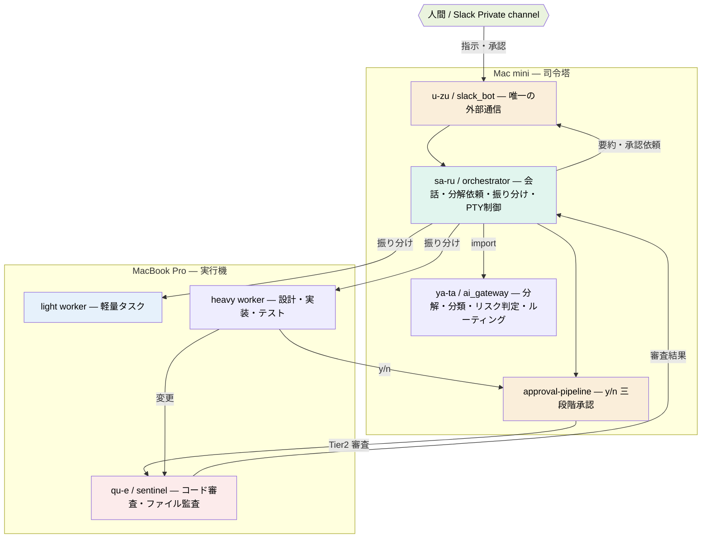

# taka-ma

**人間と複数の AI が協調(AI Gateway)して開発を進める、自律型並行開発基盤。**

人がチャットなどから（初期は、Slackを使用）で指示・承認を行い、ローカル/外部の AI 群がタスクの分解・実行・相互レビュー・安全審査を分担します。外部 SaaS に丸投げせず、判断と制御を手元の Mac で完結させることを狙った構成です。

> [!IMPORTANT]
> **これは個人による実験的プロジェクトです。** 特定のハードウェア構成（Mac 2 台）を前提とし、無保証・無サポートで公開しています。本番運用を保証するものではありません。利用は自己責任でお願いします（[LICENSE](LICENSE) の AS-IS 条項に従います）。

## これは何か / 何でないか

| | |
|---|---|
| ✅ **である** | ローカル LLM とコーディングエージェントを SSH で束ね、人間の承認を挟みながらタスクを分担実行する **オーケストレーション基盤** |
| ✅ **である** | 人と AI の協調・役割分担・安全審査の **設計思想と構築手順を公開する参照実装** |
| ❌ **でない** | 任意の環境でそのまま動く汎用ツール（特定ハード前提） |
| ❌ **でない** | 商用サポート付き製品 |

## 特徴

- **人間が承認ゲートに立つ**: AI が要約・提案し、人が「着手」を押して初めて実行へ進む。リスクに応じた三段階（自動 / AI 審査 / 人間承認）。
- **役割でモデルを選ぶ**: 「軽量（light）／重量（heavy）」の 2 区分でルーティング。各役割のモデルは差し替え可能。
- **通信は SSH のみ**: マシン間はポート開放・REST API を使わず SSH。外部通信は Slack Private channel に限定。
- **AI による相互レビュー**: 実行結果やコード変更を別の AI（守護プロセス）が審査。

## アーキテクチャ

> 命名規約: デプロイ先（pyinfraにより）は **コンポーネント名を使い**、ソース（`src/`）は **役割名**を使用する。

## マシン構成

| 役割 | マシン | 主な担当 |
|------|--------|---------|
| 司令塔 (Command Center) | Mac mini M4 Pro / 64GB | sa-ru / ya-ta / u-zu |
| 実行機 (Execution Hub) | MacBook Pro M4 Max / 128GB | worker LLM 群 / qu-e |
| 人間インターフェース | Private Slack App (Socket Mode) | 指示・承認 |
| マシン間接続 | Tailscale SSH（+ 任意で 10GbE 直結） | 双方向 SSH |

## コンポーネントと役割

| コンポーネント | 役割名 (src) | 配置 | 役割概要 |
|--------------|------------|------|---------|
| **u-zu** | slack_bot | Mac mini | 唯一の外部通信。指示受付・承認通知（Socket Mode） |
| **sa-ru** | orchestrator | Mac mini | 司令塔。タスク受領 → 分解依頼 → worker 振り分け・PTY 制御 |
| **ya-ta** | ai_gateway | Mac mini | sa-ru が import するライブラリ。分解・分類・リスク判定・ルーティング |
| **qu-e** | sentinel | MBP | 守護プロセス。Tier2 コード審査・ヘルスチェック・ファイル監査 |

## 初期 LLM の配置（差し替え可能）

| LLM | 区分 | 担当 | 用途 |
|-----|------|------|------|
| Gemma 4 12B | ローカル常駐（マルチモーダル） | sa-ru | オーケストレーション・人間との会話 |
| DeepSeek-R1 32B | ローカル | ya-ta | 難易度判定・モデル選択 |
| Gemma 4 31B | ローカル | light worker | 軽量タスク |
| Claude（Claude Code） | API | heavy worker | 要件定義・設計・実装・テスト |
| Gemini Pro | API | heavy worker | マルチモーダル・フォールバック・cross-review |
| Qwen3.6-35B-A3B | ローカル | qu-e | コード検証・Tier2 審査 |

> 上記は初期構成です。各役割のモデルは差し替え可能です。

## クイックスタート

特定ハードウェア前提のため、構築は手順書に沿って行います。まず全体像を [システムの俯瞰](docs/procedures/00-overview.md) で把握してください。

| # | 手順書 | 対象 |
|---|--------|------|
| 00 | [システムの俯瞰](docs/procedures/00-overview.md) | 全体像・アンインストール |
| 01 | [共通基盤](docs/procedures/01-common-base.md) | 両マシン（Homebrew / Python / Pyinfra） |
| 02 | [SSH トンネル](docs/procedures/02-ssh-tunnel.md) | マシン間接続 |
| 03 | [Slack Bot](docs/procedures/03-slack-bot.md) | 人間インターフェース |
| 04 | [ya-ta](docs/procedures/04-ai-gateway.md) | タスク判定・ルーティング |
| 05 | [sa-ru](docs/procedures/05-orchestrator.md) | 司令塔 |
| 06 | [タスク実行モデル](docs/procedures/06-task-models.md) | worker LLM 群 |
| 07 | [qu-e](docs/procedures/07-sentinel.md) | 守護プロセス |
| 08 | [承認パイプライン](docs/procedures/08-approval-pipeline.md) | y/n 三段階審査 |

## ドキュメント

- [設計書](docs/design/design-development-system.md) — 詳細仕様・設計判断
- [設計思想と命名](docs/design/design-philosophy-and-naming.md) — 役割・命名規約
- [運用 Runbook](docs/operations/) — 停止・再起動・日常運用

## ライセンス

本リポジトリのコード・ドキュメントは [MIT License](LICENSE) で公開しています。AS-IS（現状のまま）提供であり、作者は一切の責任を負いません。

### サードパーティ / モデルライセンス

- **本リポジトリはモデルの重み（weights）を同梱していません。** ローカル LLM は構築時に ollama 経由で各自取得します。
- 参照している初期モデルのライセンス（**利用者が取得時に各自で確認・同意してください**。MIT の対象外です）:
  - Gemma 4 — [Apache-2.0](https://ai.google.dev/gemma/terms)
  - Qwen3 系 — [Apache-2.0](https://huggingface.co/Qwen/Qwen3-32B/blob/main/LICENSE)
  - DeepSeek-R1（Distill-Qwen 32B）— [MIT](https://huggingface.co/deepseek-ai/DeepSeek-R1-Distill-Qwen-32B)
  - Claude / Gemini — 各プロバイダの API 利用規約に従います（非配布）
- Python 依存はすべて許容的ライセンス（MIT / BSD / ISC / Apache-2.0）です。

## 謝辞

本プロジェクトの構築・ドキュメント整備は、AI コーディングエージェントとの協調作業によって進められました。
