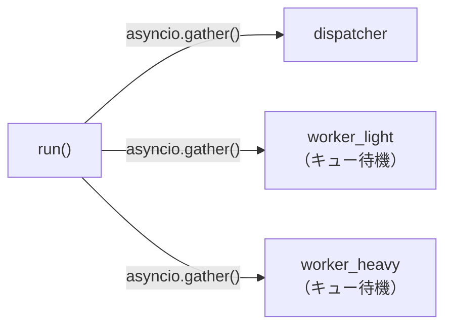
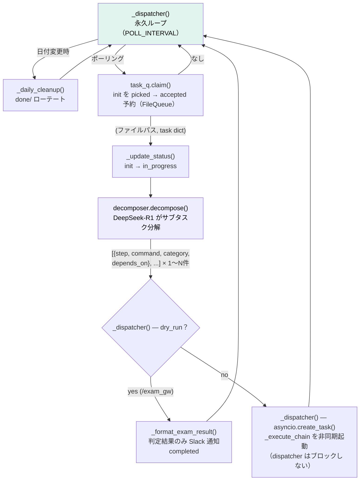
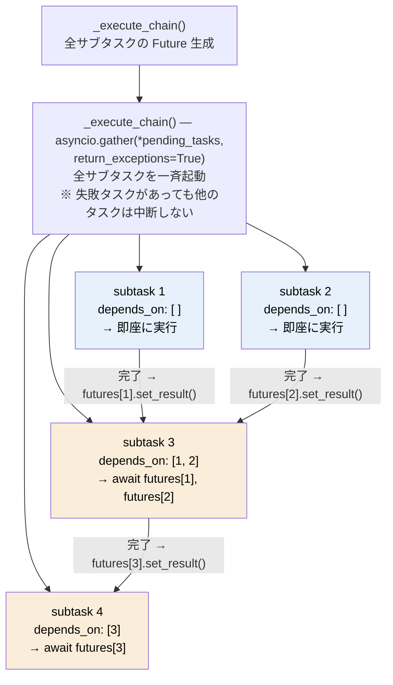
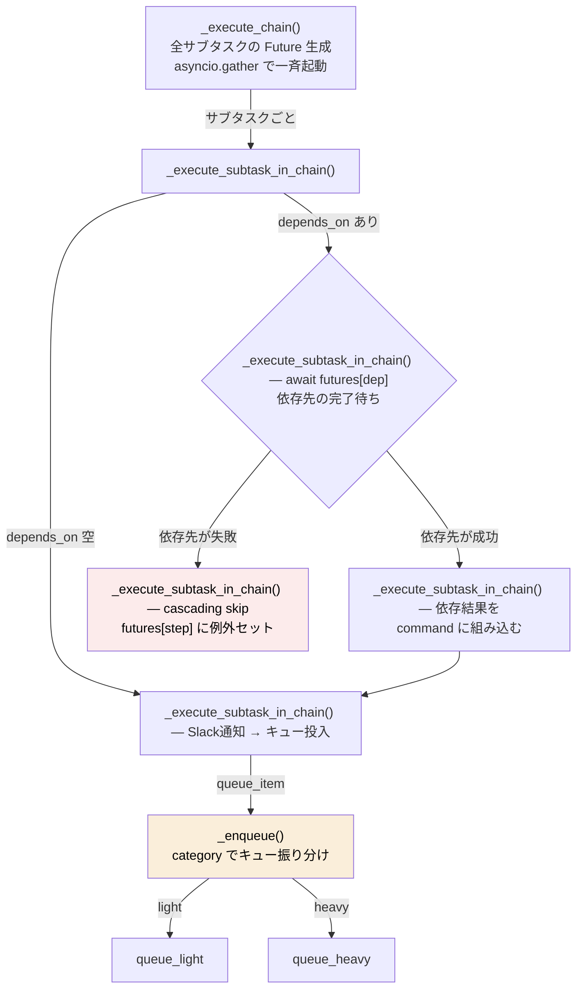
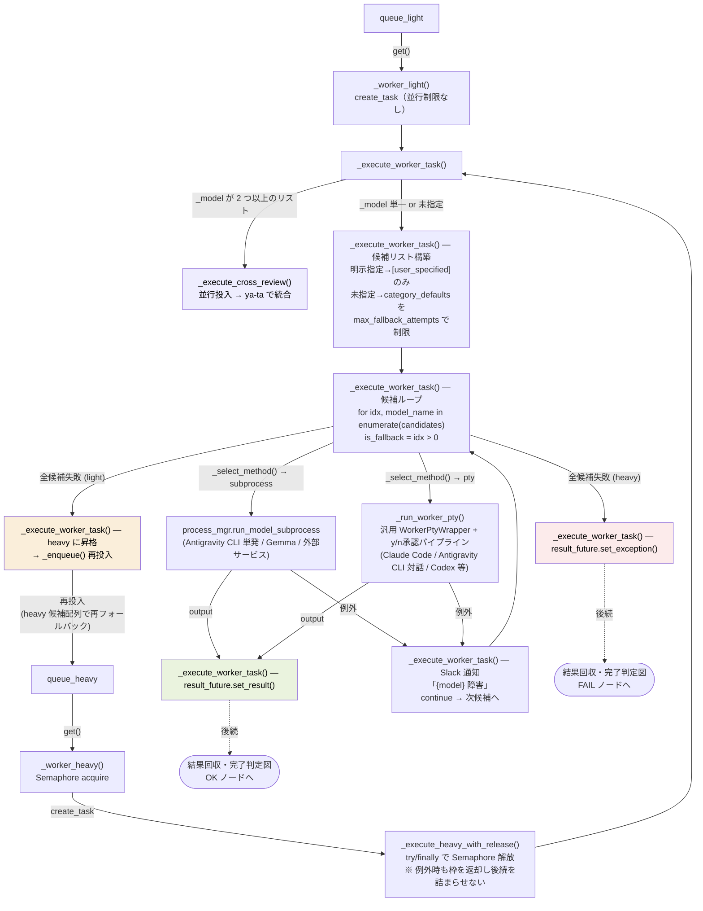
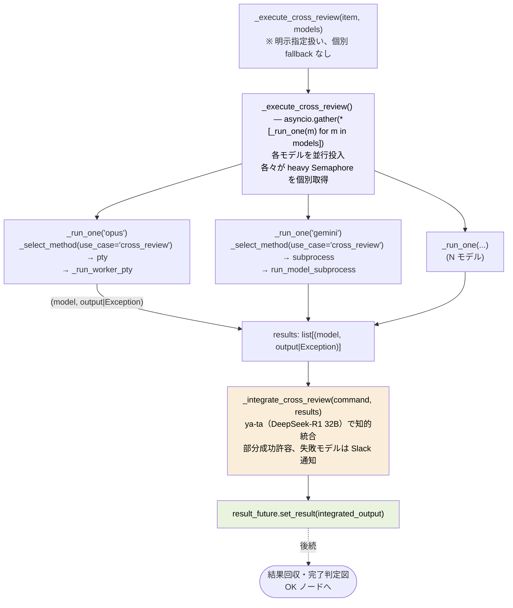
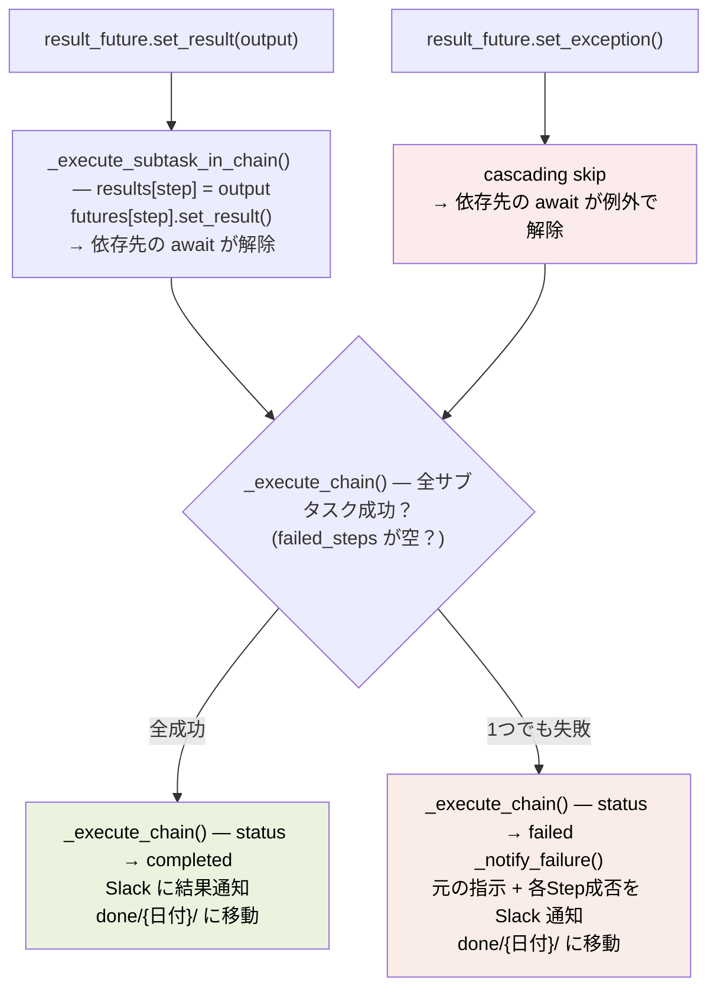

# sa-ru オーケストレーション処理フロー

構築手順書04 Step 8 の [`src/orchestrator/__init__.py`](../../src/orchestrator/__init__.py) 骨格に対応するフロー図。
ノードには関数名（必要に応じて関数内の処理概要を `関数名() — 処理概要` 形式で）、アローに値を記載。
関数名は構築手順書 04 内で grep して該当箇所へ移動可能。

## 起動

3つの非同期関数を同時起動。ワーカーはキューにアイテムが入るまで待機。

## データフロー(メイン処理)

## データフロー(サブタスク並行起動)

`_execute_chain()` が全サブタスクを `asyncio.gather` で一斉起動する。
依存のないサブタスクは即座に実行され、依存のあるサブタスクは `await futures[dep]` で待機する。

## データフロー(連鎖実行 — 各サブタスクの処理経路)

## データフロー(ワーカー実行 — 配列フォールバック / cross-review)

## データフロー(cross-review — 並行投入と統合)

## データフロー(結果回収・完了判定)

