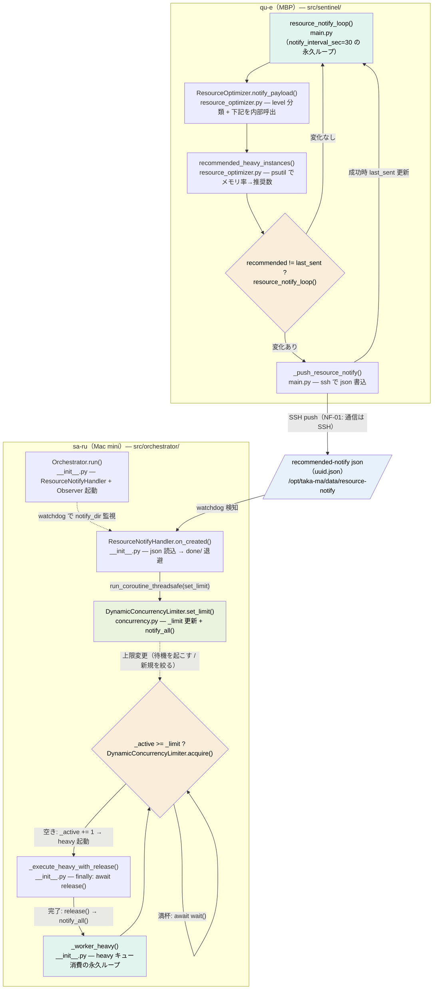

# リソース最適化通知 処理フロー（設計書 §8.14）

設計書 [§8.14 qu-e → sa-ru（リソース最適化通知）](design-development-system.md) に対応する処理フロー図。
qu-e（MBP）が推奨 heavy 並行数を算出して sa-ru（Mac mini）へ SSH push し、sa-ru が heavy 並行数上限を動的更新する経路を示す。

ノードには関数名（必要に応じて `関数名() — 処理概要` 形式）を記載。関数名は構築手順書 05（sa-ru）/ 07（qu-e）およびソースで grep して該当箇所へ移動できる。

- qu-e 側実装: [`src/sentinel/main.py`](../../src/sentinel/main.py) / [`resource_optimizer.py`](../../src/sentinel/resource_optimizer.py)
- sa-ru 側実装: [`src/orchestrator/__init__.py`](../../src/orchestrator/__init__.py) / [`concurrency.py`](../../src/orchestrator/concurrency.py)

## ノード → 実体の対応

| ノード | ファイル | 関数 |
|--------|---------|------|
| A / D | `src/sentinel/main.py` | `resource_notify_loop()` / `_push_resource_notify()` |
| B / B2 | `src/sentinel/resource_optimizer.py` | `notify_payload()` / `recommended_heavy_instances()` |
| J | （SSH 転送される JSON） | `resource_optimization.notify_dir`（sa-ru）= `o_moi_notify_dir`（qu-e） |
| E / F / H / K | `src/orchestrator/__init__.py` | `Orchestrator.run()` / `ResourceNotifyHandler.on_created()` / `_worker_heavy()` / `_execute_heavy_with_release()` |
| G / I | `src/orchestrator/concurrency.py` | `DynamicConcurrencyLimiter.set_limit()` / `acquire()`（`release()` も） |

配色は CLAUDE.md 作図ルール準拠（永久ループ=薄緑、分岐=薄オレンジ、独立データ=薄青、上限反映=成功緑、いずれも文字色 #000）。
