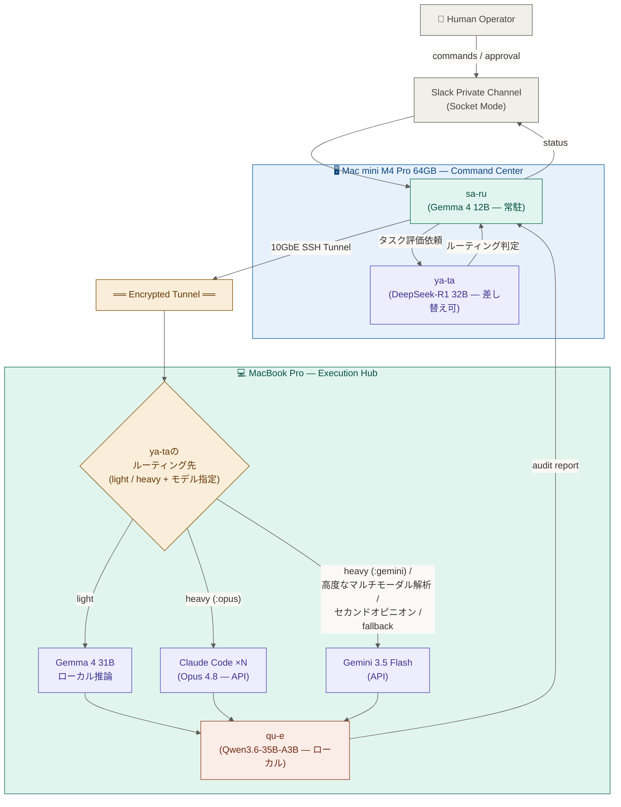
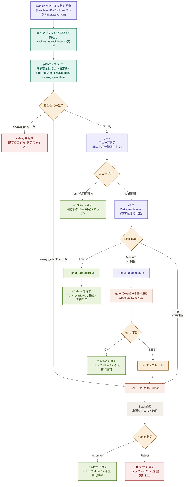
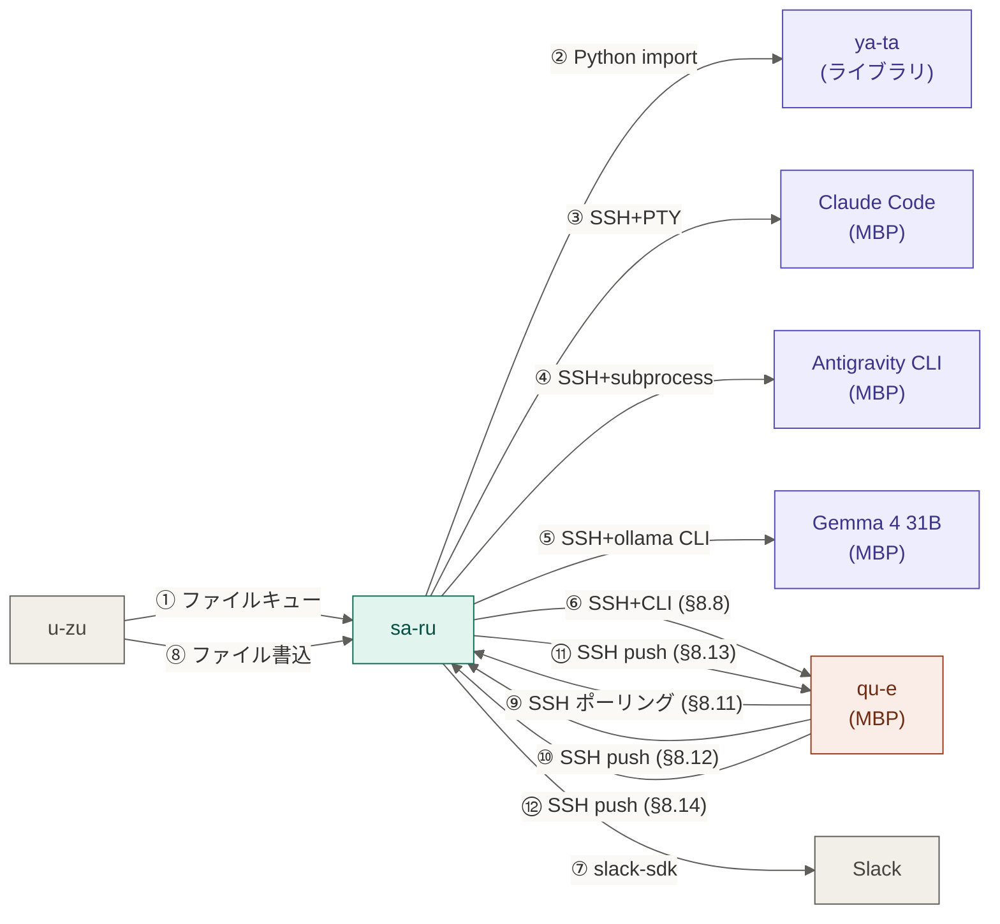
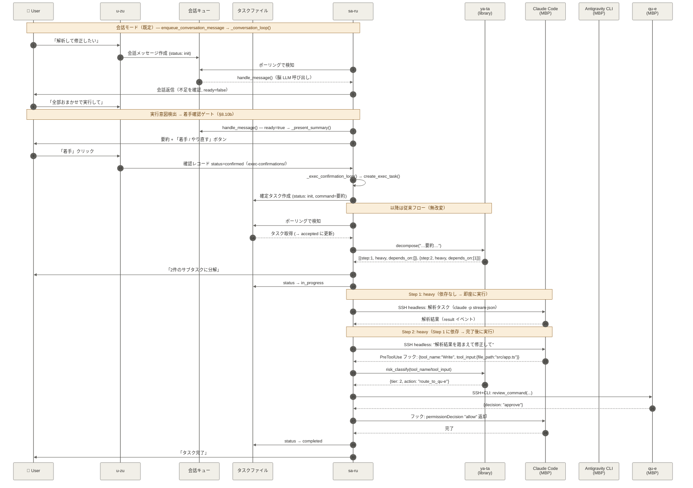

# M4 Pro Mac mini ↔ MBP 自律型並行開発環境 設計書

---

## 目次

- [1. システム・アーキテクチャ（全体像）](#1-システムアーキテクチャ全体像)
  - [1.1 コア・インフラ](#11-コアインフラ)
  - [1.2 通信制約](#12-通信制約)
  - [1.3 モデル配置一覧](#13-モデル配置一覧)
  - [1.4 全体アーキテクチャ構成図](#14-全体アーキテクチャ構成図)
- [2. 役割分担と知能の配置](#2-役割分担と知能の配置)
  - [2.1 sa-ru（Gemma 4 12B — Mac mini 常駐）](#21-sa-rugemma-4-12b--mac-mini-常駐)
  - [2.2 ya-ta（DeepSeek-R1 32B — Mac mini、差し替え可）](#22-ya-tadeepseek-r1-32b--mac-mini差し替え可)
  - [2.3 Claude Code ×N（Opus 4.8 — MBP 並行実行）](#23-claude-code-nopus-48--mbp-並行実行)
  - [2.4 Gemini 3.5 Flash（API — MBP）](#24-gemini-35-flashapi--mbp)
  - [2.5 Gemma 4 31B（MBP ローカル）](#25-gemma-4-31bmbp-ローカル)
  - [2.6 qu-e（Qwen3.6-35B-A3B — MBP ローカル）](#26-qu-eqwen36-35b-a3b--mbp-ローカル)
- [3. 承認パイプライン設計](#3-承認パイプライン設計)
  - [3.1 基本方針](#31-基本方針)
  - [3.2 技術スタック](#32-技術スタック)
  - [3.3 リスク判定（スコープ判定 → 三段階リスク分類）](#33-リスク判定スコープ判定--三段階リスク分類)
  - [3.4 承認フロー図](#34-承認フロー図)
  - [3.5 監査ログ](#35-監査ログ)
- [4. 守護プロセス（qu-e）](#4-守護プロセスqu-e)
  - [4.1 使用モデル](#41-使用モデル)
  - [4.2 主たる役割](#42-主たる役割)
- [5. 実装コンポーネント一覧](#5-実装コンポーネント一覧)
- [6. IaC（Infrastructure as Code）方針](#6-iacinfrastructure-as-code方針)
  - [6.1 採用技術](#61-採用技術)
  - [6.2 リポジトリ構造](#62-リポジトリ構造)
  - [6.3 運用コマンド](#63-運用コマンド)
  - [6.4 構築順序](#64-構築順序)
  - [6.5 インストール来歴の記録とアンインストール](#65-インストール来歴の記録とアンインストール)
- [7. 軽量タスク処理モデル セットアップ](#7-軽量タスク処理モデル-セットアップ)
  - [7.1 MBPリソース配分計画（128GB unified memory）](#71-mbpリソース配分計画128gb-unified-memory)
  - [7.1.1 将来拡張: マシン追加によるスケールアウト](#711-将来拡張-マシン追加によるスケールアウト)
  - [7.2 モデル選定](#72-モデル選定)
  - [7.3 Mac mini側（sa-ru用）](#73-mac-mini側sa-ru用)
  - [7.4 モデル自動監視・半自動入替](#74-モデル自動監視半自動入替)
- [8. コンポーネント間通信仕様（IPC）](#8-コンポーネント間通信仕様ipc)
  - [8.1 通信原則](#81-通信原則)
  - [8.2 通信パス一覧](#82-通信パス一覧)
  - [8.3 ① u-zu → sa-ru（会話投入 → 確定要約 → タスク投入）](#83-①-u-zu--sa-ru会話投入--確定要約--タスク投入)
  - [8.4 ② sa-ru → ya-ta（タスク分解・分類・リスク判定）](#84-②-sa-ru--ya-taタスク分解分類リスク判定)
  - [8.5 ③ sa-ru → worker CLI（重量タスク実行、実行アダプタ抽象）](#85-③-sa-ru--worker-cli重量タスク実行実行アダプタ抽象)
  - [8.6 ④ sa-ru → Antigravity CLI（subprocess 経路）](#86-④-sa-ru--antigravity-clisubprocess-経路)
  - [8.7 ⑤ sa-ru → Gemma 4 31B（軽量タスク実行）](#87-⑤-sa-ru--gemma-4-31b軽量タスク実行)
  - [8.8 ⑥ sa-ru → qu-e（Tier 2 コードレビュー）](#88-⑥-sa-ru--qu-etier-2-コードレビュー)
  - [8.9 ⑦ sa-ru → Slack（通知・承認リクエスト）](#89-⑦-sa-ru--slack通知承認リクエスト)
  - [8.10 ⑧ u-zu → sa-ru（承認結果通知）](#810-⑧-u-zu--sa-ru承認結果通知)
  - [8.10b 着手確認ゲート（会話 → 実行の移譲トリガー）](#810b-着手確認ゲート会話--実行の移譲トリガー)
  - [8.10c u-zu → sa-ru（制御コマンド：手動 ollama 停止）](#810c-u-zu--sa-ru制御コマンド手動-ollama-停止)
  - [8.11 qu-e → sa-ru（監査アラート）](#811-qu-e--sa-ru監査アラート)
  - [8.12 qu-e file_audit → sa-ru（ファイル変更アラート）](#812-qu-e-file_audit--sa-ruファイル変更アラート)
  - [8.13 sa-ru → qu-e（タスクコンテキスト共有）](#813-sa-ru--qu-eタスクコンテキスト共有)
  - [8.14 qu-e → sa-ru（リソース最適化通知）](#814-qu-e--sa-ruリソース最適化通知)
- [9. タスクライフサイクル](#9-タスクライフサイクル)
  - [9.1 タスク実行の全体フロー](#91-タスク実行の全体フロー)
  - [9.2 承認パイプライン判定フロー](#92-承認パイプライン判定フロー)
- [10. オーケストレーション設計](#10-オーケストレーション設計)
  - [10.1 設計思想](#101-設計思想)
  - [10.2 タスク分解](#102-タスク分解)
  - [10.3 DAG 実行ロジック](#103-dag-実行ロジック)
  - [10.4 ワーカーの並行制御](#104-ワーカーの並行制御)
  - [10.5 結果の受け渡し](#105-結果の受け渡し)
  - [10.6 light の分類範囲](#106-light-の分類範囲)
  - [10.7 常駐ループの堅牢性](#107-常駐ループの堅牢性)
- [11. 検証仕様](#11-検証仕様)
  - [11.1 連携パス別の検証項目](#111-連携パス別の検証項目)
  - [11.2 エンドツーエンド検証シナリオ](#112-エンドツーエンド検証シナリオ)

---

## 1. システム・アーキテクチャ（全体像）

### 1.1 コア・インフラ

| 役割 | マシン | スペック |
|------|--------|---------|
| 司令塔 (Command Center) | Mac mini M4 Pro | 64GB / 2TB |
| 実行機 (Execution Hub) | MacBook Pro M4 Max | 128GB / 8TB (16CPU, 40GPU, 16NPU) |
| 人間インターフェース | Private Slack App | Socket Mode |
| 接続プロトコル | 10GbE 直結 + Tailscale SSH | 在宅: 10GbE直結 (172.16.0.0/30)、外出: Tailscale VPN (100.x.x.x)。自動切替 |

### 1.2 通信制約

- **sa-ruが外部と通信できるのは Slack Private channel のみ**（人間とのインターフェース）
- 各モデルへのAPI通信（Claude Code → Anthropic、Antigravity CLI → Google）は各プロセスが自身で行う
- Mac mini ↔ MBP 間は 10GbE 直結 (在宅) / Tailscale VPN (外出) のデュアルモード SSH 接続

> **アクセス制御（実行者認可）**
> Slack 経由で sa-ru に命令を出せるのは、`users.yaml`（`/opt/taka-ma/config/users.yaml`）に登録された user ID のみ。未登録ユーザーの命令（スラッシュコマンド／メンション／DM／ボタン）は u-zu のハンドラ先頭で一律拒否される。ロールは Owner ⊃ Admin ⊃ User の 3 段階で、コマンドごとに必要ロールを設ける（タスク投入は User、承認・ログ等は Admin、停止・復旧・ユーザー管理は Owner 系）。実装は `src/slack_bot/services/role_check.py`（`check_role` / `authorize`）と各ハンドラのゲート。ユーザーの登録・昇格は `/taka-ma-user`（Owner/Admin）で行う。ロール要件表は [運用書](docs/operations/u-zu/slack-bot.md) の「アクセス制御」を正本とする。
>
> **Owner 不変条件**: システムを Owner 権限からロックアウトさせないため、Owner は常に最低 1 人を残す。最後の 1 人となった Owner の削除・降格（`/taka-ma-user remove` / `update`）は拒否する。この不変条件は書込の単一正本（`user_store`）で担保し、コマンド経路・ボタン経路の双方に効く。

### 1.3 モデル配置一覧

| コンポーネント | モデル | 推論方式 | 配置場所 | 役割 |
|--------------|--------|---------|---------|------|
| sa-ru | Gemma 4 12B | ローカル常駐（マルチモーダル） | Mac mini | stdout文脈抽出、オーケストレーション、stdin制御、人間との音声/画像/テキスト会話 |
| ya-ta | DeepSeek-R1 32B | ローカル（差し替え可） | Mac mini | タスク難易度判定、最適モデル選択・ルーティング |
| 軽量タスク処理 | Gemma 4 31B | ローカル | MBP | 単純な質問応答、フォーマット変換等 |
| 重量タスク処理 | Claude Opus 4.8 | API (ProMax契約済) | MBP (Claude Code ×N) | 要件定義、設計、実装、テスト（最難関は Fable 5） |
| 重量タスク処理、 | Gemini 3.5 Flash | API (契約済) | MBP | heavy 対話、cross-review、Opus 障害時フォールバック（テキスト・コード）、高度なマルチモーダル解析（最上位は 3.1 Pro） |
| qu-e | Qwen3.6-35B-A3B | ローカル | MBP | コード検証、監視、y/n Tier2審査 |

### 1.4 全体アーキテクチャ構成図



---

## 2. 役割分担と知能の配置

### 2.1 sa-ru（Gemma 4 12B — Mac mini 常駐）

- Slackからの指示受信（唯一の人間インターフェース）。**マルチモーダル**（音声・画像・テキスト）で人間の生入力を受ける。テキスト専用モデルでは人間 IF として役割不足のため Gemma 4 12B（ネイティブ音声/画像/動画対応）を採用。クラウド Gemini を使わずローカル維持するのは、人間の生入力の外部流出回避と常駐核のオフライン可用性（主権）を保つため
- **会話フロントエンド（既定）**: 脳モデルで人間と会話し、本当にやりたいこと（開発意図）を引き出して整理する。曖昧なら質問を返し、意図が固まったら構造化要約にまとめる。Slack の 1 通を即タスク化はしない（§8.3）
- **会話モード / 実行モードの分離**: 通常の発話は会話モードで処理し、実行（ya-ta への移譲）は「sa-ru が要約提示 → 人間の着手確認」を経た後にのみ行う
- **実行意図の判定**: 各発話を「会話継続 / 今すぐ実行」に脳モデルで分類する。締めワードは文字列マッチで列挙しない（言い回し非依存）。`/taka-ma-go` は LLM 判定を待たない明示エスケープ
- MBP上の全プロセスの起動・停止・管理
- **実行アダプタ抽象**による worker CLI の制御（特定 CLI にロックインしない。§8.5）。Claude Code は headless アダプタ、agy 等は subprocess/interactive アダプタと、CLI 固有部分をアダプタに隔離して同一 IF で扱う
- worker の承認要求を構造化データ（tool_name/tool_input）として取得し、ya-ta / 承認パイプラインに判定を委譲
- 各コンポーネントは自分の判定・監査ログを構造化（日付別 jsonl）で個別に出力し、プロセス標準出力は launchd が `*.log` へ記録する。直近ログは Slack `/taka-ma-logs` で参照する（中央集約デーモンは持たない。各ログの後段処理は ya-ta-decisions=Phase2、approval-audit/file-audit=ローテーション等、生成元ごとに定義）
- ya-taへのタスク評価依頼と結果に基づく実行

### 2.2 ya-ta（DeepSeek-R1 32B — Mac mini、差し替え可）

- **実装方式**: sa-ru プロセス内で Python import するライブラリ方式（launchd サービス廃止。クラッシュ問題（exit -15）の構造的解消）
- **タスク分解**: ユーザーの 1 指示をサブタスクの DAG に分解（推論特化モデル DeepSeek-R1 32B が担当）
- **コンテキスト長 (num_ctx)**: 32768（32K）。Mac mini 64GB に sa-ru と同居するため、既定 128K だと KV キャッシュが膨らみ OOM する（実測: 128K=常駐 47GB → 32K=常駐 26GB）。分解・分類・リスク判定の用途には 32K で十分。コードは `ollama run` 経由で num_ctx を渡さないため、**初期投入時に PyInfra（ai_gateway deploy）がモデルに `PARAMETER num_ctx 32768` を焼き込む**（同タグ上書き・冪等）。設定源は `ya-ta.yaml` の `num_ctx`（構築手順書 04 §1-2）
- **タスク分類**: `light` / `heavy` の 2 値で判定（ルールベース不採用）
  - **light** → ローカル軽量モデル（1 回のプロンプト応答で完結する単位。簡単なコード生成も含む）
  - **heavy** → 対話型エージェント（要件定義、設計、実装、テスト、コードベース解析、アーキテクチャ判断）
- **モデル登録制**: `ya-ta.yaml` の `models` セクションに capabilities ベースで登録（Opus / Gemini / 外部サービス（SUNO / Runway 等）も登録可能）。プロンプト内ではモデル名を抽象化（具体名は yaml で一元管理）
- **ユーザーモデル指定**: Slack メッセージ末尾に `:opus` / `:gemini` / `:sonnet` 等の短縮名で指定（完全一致のみ受理。不正指定はエラー通知 + 利用可能一覧返却）
- **cross-review**: `:opus :gemini` のように 2 つ以上指定すれば cross-review として処理（専用キーワードなし）。**並行投入・結果収集は orchestrator が担当**（`asyncio.gather` で各モデルへ並行投入、各 heavy Semaphore を個別取得、部分成功許容、失敗モデルは Slack 通知）、**結果統合は ya-ta（DeepSeek-R1）が知的に実施**。全モデル失敗、または成功結果はあるが統合実行自体が失敗（統合モデルの異常終了・タイムアウト）した場合は当該ステップを failed とする（§10.3 の Future 解決の不変条件に従い、Future を例外で解決する）
- **フォールバック（light → heavy）**: confidence 閾値（< 0.8）で light 判定を heavy へ強制ルーティング。LLM の自己申告は信頼できないため、入口で弾く
- **モデル障害時のフォールバック**: `routing.category_defaults[category]` をモデル名の **配列**（優先度順）で定義。`[0]` 障害時は `[1]`、それも障害なら次へ（配列順）。最終的に全候補失敗で User へ failed 通知。`fallback.max_fallback_attempts` で「fallback の試行回数（先頭は含まない）」を制限（例: `0` = fallback なし、`1` = 先頭 + 1 fallback）。**未指定の場合は配列内すべてのモデルが試行対象**（制限なし）。マルチモーダル等の強制ルーティングは行わず、ya-ta（LLM）の判断と運用ログから調整する
- **明示モデル指定時はフォールバックしない**: ユーザーが `:opus` 等で指定したモデルが障害になった場合、配列の次へは進まずそのまま failed を返す（指定モデル尊重）
- **Classifier 変数名**: `model`（旧 `user_tag` / `directive` は使用しない）
- **Phase 2: プロンプト自動改善**: 判定ログ蓄積から誤判定パターンを抽出し、分類プロンプトに few-shot 例として追加（判定ログの記録経路と Phase 2 の手順詳細は §8.4.1）
- **heavy 並行数 (`max_heavy_instances`)**: Phase 6 の実機検証で決定（**未定**）
- **検証コマンド `/exam_gw`**: タスク分解・分類・モデル選択・実行方式の判定結果のみ返すドライラン
- 将来のモデル差し替えに備え、独立した箱として設計

### 2.3 Claude Code ×N（Opus 4.8 — MBP 並行実行）

- ProMax契約のClaude Opus 4.8をCLIで複数インスタンス並行起動（最難関タスクは Fable 5 を明示指定）
- 各インスタンスが独立してAnthropic APIと通信
- 役割例: Frontend / Backend / QA・テスト

### 2.4 Gemini 3.5 Flash（API — MBP）

- Pro 契約による API 利用。CLI は **agy（Antigravity CLI）** — Gemini CLI の後継のコーディングエージェント。認証は macOS keychain 依存（§8.5 / §8.6）
- **モデル版**: 既定は **Gemini 3.5 Flash**（agy 既定）。最上位が要るタスクは 3.1 Pro を `:gemini-pro` で明示指定する（`agy -p --model <name>`）
- **役割（初期リリース）**: **heavy 対話 / cross-review / Opus 障害時フォールバック（テキスト・コード）**。heavy 対話タスクは Claude Code 同等（`:gemini` 指定で利用）
- **マルチモーダル解析の初期リリース方針**: 音声・画像・動画の基本的な解析（理解）は**ローカル gemma4**（sa-ru = 12B / worker = 31B、いずれもマルチモーダル）で賄い、**高度な解析のみ** Gemini API（agy）経由とする
- **生成は Phase 2（生成基盤）へ延期**: 動画・音楽等の生成は初期リリースの対象外。生成基盤（veo / lyria / Runway / Suno 等の外部サービス登録制）は Phase 2 として設計・実装する（前方参照）
- セカンドオピニオン / フォールバックは **ya-ta の汎用機能**（§8.4.x 相互扶助機能）であり、Gemini に限定されない。Gemini は当該機能に参加する 1 候補として扱われる
- **meta カテゴリ廃止（2026-04-19）**: Gemini のコンテキスト窓が 1M（Opus 4.6 と同じ）になり、「長文コンテキスト担当」という meta の技術的根拠が消失。Gemini の差別化要因はマルチモーダルに絞られた
- コードベース解析・アーキテクチャ判断は heavy（Opus）が主担当（メタ推論は heavy に統合）

### 2.5 Gemma 4 31B（MBP ローカル）

- MBP上でローカル推論（ollama、Q4_K_M量子化、~20GB）
- 256Kコンテキスト対応
- 軽量タスクを高速処理（外部通信不要）
- **マルチモーダル解析の基本担当（初期リリース）**: 音声・画像・動画の基本的な解析（理解）を worker 側で担う。高度な解析のみ Gemini API 経由（§2.4）

### 2.6 qu-e（Qwen3.6-35B-A3B — MBP ローカル）

- コードの最終検証・脆弱性検知
- MBPへの書き込み承認（y/n Tier 2審査）
- システム全体の健全性チェック（CPU/メモリ/ディスク/ネットワーク）
- ファイルシステム変更のリアルタイム監査
- 不正なファイル操作やリソース過負荷の常時検閲

---

## 3. 承認パイプライン設計

**本節は worker CLI に依存しない承認判定の中核**を定める。CLI 固有の「承認要求の取得」「決定の伝達」は実行アダプタ（§8.5）の責務で、本中核はそれを知らない。

### 3.1 基本方針

- `--dangerously-skip-permissions` は **使用しない**
- **承認判定は CLI 非依存の中核**で行う。中核の唯一の入口は `ApprovalPipeline.decide(pending) -> Decision`。
  - 入力 `PendingApproval{tool_name, tool_input, tool_use_id}`（アダプタが自 CLI 形式から変換して渡す構造化データ）
  - 出力 `Decision{allow: bool, reason: str}`（アダプタが自 CLI の伝達手段へ変換する）
  - 中核は決定を**どう物理的に伝えるか**（キー送信 / プロセス exit code 等）を知らない。これが特定 CLI にロックインしない担保
- **handler の返却契約**: Tier1/2/3 handler はキー送信を直接行わず `Decision` を戻り値で返す（旧 pty 直呼びを廃し、伝達はアダプタへ移す）
- 三段階リスク判定による自動/半自動/手動承認

### 3.2 技術スタック（実行アダプタ別）

承認の**判定中核**（Tier1/2/3・安全性・§8.10）は CLI 非依存で共通。**承認要求の取得と決定の伝達**のみアダプタごとに異なる。

- **headless アダプタ（Claude Code）**: `claude -p --output-format stream-json --verbose --include-hook-events`。**PreToolUse フック**が各ツール実行前に構造化 JSON（`tool_name`/`tool_input`）を stdin で受け、判定中核を呼び、`permissionDecision:"allow"`（許可）/ exit 2（拒否）を返す。判定中核は Mac mini 常駐の decide デーモンが実行し、フックは薄いクライアントとして SSH 経由で問い合わせる（§8.5）。完了は `result` イベント（実機検証で確定。詳細は Appendix §0）
- **interactive(pty) アダプタ（agy 対話・将来 Codex 等の汎用対話 CLI）**: `pexpect` で子プロセス起動、レガシー y/n（`[y/n]`/`(yes/no)`/`Allow?`）を stdout から検出、判定中核を呼び、`y`/`n` を stdin 送信
- **subprocess アダプタ（ollama / keychain 依存 agy）**: 単発実行。per-tool 承認は持たない（§8.7 / §8.6）

### 3.3 リスク判定（スコープ判定 → 三段階リスク分類）

> **実装**: [構築手順書 04-ai-gateway.md](../procedures/04-ai-gateway.md)（`RiskClassifier`）


ツール実行前（headless=フック、interactive=y/n 検出）の承認フローは 決定論の安全性（最優先）＋ 2 段階のリスク判定（2026-04-19 改訂、安全性を 2026-06-19 明文化）。判定入力は構造化データ（`tool_name`/`tool_input`）で、アダプタが変換して中核へ渡す。

**(0) 静的安全性（決定論・Tier 判定前・最優先）**

ya-ta（LLM）が判定する**前**に、承認パイプラインが静的安全性チェックと**決定論で**照合する。これは LLM の判定が誤った・乗っ取られた場合でも破壊的操作を通さない最終防壁であり、意図的に LLM を介さない（機械的・コード固定）。

- `always_deny`（例: `rm -rf /` / `mkfs` / fork bomb）に一致 → **Tier 判定をスキップして即時 deny（拒否）**。監査ログの `reason` に該当規則を記録。照合対象は操作文字列（Bash は `tool_input["command"]`、書き込み系は `Write to: <path>`。構造化しても照合対象は不変）。
- `always_escalate_to_human`（例: `sudo` / `deploy` / `production`）に一致 → スコープ・Tier 判定をスキップして **Tier 3（人間承認）** へ直行。
- どちらにも一致しなければ (1) スコープ判定へ進む。

**照合の正規化（自明なバイパスを塞ぐ）**: 素の command 文字列をそのまま照合すると、空白の水増し（`rm   -rf  /`）・絶対パス起動（`/bin/rm -rf /`）・フラグ順の入替（`rm -fr /`）・大小文字の違いで規則を素通りできる。照合前に操作文字列と規則の双方を同一手順で正規化してから語境界照合する: (a) 連続する空白（タブ・改行含む）を単一スペースに畳み前後を除去、(b) 先頭トークンの実行ファイル絶対パス接頭辞（`/bin/` `/usr/bin/` `/usr/local/bin/` `/sbin/` `/usr/sbin/`）を剥いで basename に落とす、(c) 連結ショートフラグ（`-rf` / `-fr` 等の 1 ダッシュ＋複数英字）を小文字化＋文字順ソートで正規化し `rm -fr /` を `rm -rf /` と同一視、(d) 照合は大小文字を無視（IGNORECASE）。なお (b) の絶対パス剥がしは「先頭トークン＝実行ファイル」を前提とするが、レガシー interactive 経路の scrape 文字列は先頭に指示語 `Run:` / `Execute:` / `Write to:` が付き先頭トークンが実行ファイルにならない。そこで (b) の前段で先頭の指示接頭辞を除去し、headless（`tool_input.command`）と interactive scrape の双方で絶対パス起動（`Run: /bin/rm -rf /`）を捕捉する。静的安全性チェックは**決定論の最終防壁**であって網羅的サンドボックスではない — 任意の難読化・変数展開・パイプ迂回まで潰す責務は負わない（grey zone は (1)(2) が、真に危険な不可逆操作は Tier 3 が受ける）。目的は「リストに載っている破滅的コマンドを自明な字面変化で回避させない」ことに絞る。

**チェックは無効化されない（ロード失敗時 fail-closed）**: 静的安全性チェックの規則は**コード固定のデフォルト**（`rm -rf /` / `mkfs` / `dd if=/dev/zero` / fork bomb を deny、`sudo` / `deploy` / `production` を escalate）を常時内蔵し、`pipeline.yaml` の `safety` はこれに**和集合で追加**する（yaml 側で内蔵規則を置換・削除・弱体化することはできない）。したがって yaml が欠落・空でも静的安全性チェックは決して無効化されない。加えて `pipeline.yaml` の**ロードに失敗**（ファイル不在・破損 YAML・権限エラー等）した場合は承認パイプラインを degraded 状態にし、静的安全性チェックにもスコープにも該当せず本来 (1)(2) の LLM 判定へ進むはずの操作を **Tier 3（人間承認）へ escalate** する。設定不備は「LLM 自動 allow へ倒す（fail-open）」のではなく「人間へ倒す（fail-closed）」。degraded は運用ログに error として残す。

> 静的安全性チェックは**コード固定デフォルト ＋ `pipeline.yaml`（SSOT・追加のみ）** の二重化。LLM 判定の grey zone（可逆/不可逆）のみ (1)(2) が担い、絶対防壁は本段で決定論的に守る二層構造。

**(1) タスク指示スコープ判定（安全性を通過した操作のみ）**

ya-ta が Tier 判定する前に、ユーザーの元の指示から「期待される操作」かを判定する。スコープ内であれば Tier に関係なく自動 allow し、ユーザーが指示した操作をユーザーに再確認しない。スコープ外の操作のみ Tier 判定（下記 (2)）へ進む。

- スコープ内の例: 「ログイン機能を実装して」→ Claude Code が `src/auth/login.py` を新規作成 → スコープ内 → 自動 y
- スコープ外の例: 上記タスク中で `git push --force origin main` が出る → 元の指示に含まれない不可逆操作 → Tier 判定へ

**(2) 三段階リスク分類（スコープ外操作のみ）**

#### Tier 1: Low risk → 自動承認

ya-taが即座に判定し、allow を返す（headless=フックが `permissionDecision:allow`、interactive=`y` を stdin 送信）。qu-eは不要。

対象操作:
- ファイル読み取り（read-only）
- ディレクトリ一覧取得
- 安全なnpm/pip install（ホワイトリスト内パッケージ）
- git status / git log 等の参照系コマンド

#### Tier 2: Medium risk → qu-e審査（可逆 — git で復元可能）

ya-taからqu-e（Qwen3.6-35B-A3B）にルーティング。qu-eがdiff内容・コマンドコンテキストを精査。

対象操作（やり直せる変更）:
- ファイル書き込み / 作成（git で復元可能）
- git commit / git push（--forceは除く）
- 設定ファイルの変更
- パッケージのインストール / 削除

qu-e判定基準:
- 悪意あるコード注入の検知
- 破壊的変更（既存機能への影響）の検知
- セキュリティ脆弱性パターンの検知
- 拒否時は自動的にTier 3（人間）にエスカレート

#### Tier 3: High risk → 人間承認（不可逆 or 復旧コストが高い）

Slackチャンネルへ通知を飛ばし、物理的な人間の承認を仰ぐ。判定基準は **不可逆性**（やり直せない / 復旧コストが極めて高い）。

対象操作:
- 不可逆な git 操作（`git push --force` / `git reset --hard` 等。履歴改変・作業消失）
- 広範囲の削除（`rm -rf` 等）
- システムレベルのコマンド（sudo, chmod, chown 等）
- ネットワーク操作（ポート開放、外部API接続設定）
- データベース操作
- 環境変数・シークレットの変更
- 本番環境へのデプロイ関連

#### (3) interactive(pty) の信頼境界（フェイルセーフ）

headless アダプタの判定入力（`tool_name`/`tool_input`）は worker ランタイムが構造化して渡す**権威的**なデータで、「審査した操作＝実際に実行される操作」が一致する。一方 interactive(pty) アダプタは、承認対象コマンドを worker の **stdout スクレイプ**（context バッファから `Run:`/`Execute:`/`Write to:` 行を復元）で推定するため、次の 2 つの構造的欠陥を持つ:

- **判定不能（unknown フォールスルー）**: 提示行が無いプロンプトでは復元に失敗する。これを無害な文字列（旧実装の `"unknown"`）として素通しすると、実際の危険操作が「文脈不明」の名の下に Tier1 自動承認され得る。
- **審査対象と承認操作の乖離（なりすまし）**: スクレイプ元の stdout は worker（agy 等）が制御でき、承認要求の直前に偽の `Run: <無害コマンド>` を出力すれば、審査されるのは無害文字列だが `y` が承認する実操作は別物になり得る。

このため interactive(pty) 由来の承認は「審査した文字列＝実際に承認される操作」を保証できない。安全側に倒すため次を規定する（決定論・LLM 判定の前段）:

- **操作が判定不能なら Tier 1/2 の自動判定に載せず、人間承認（Tier 3）へ直行**する。context 全体を承認リクエストに添えて人間が実操作を確認する。
- **単一スクレイプ行のみを根拠に Tier 1 自動承認しない**。interactive 由来は最低でも qu-e 審査（Tier 2）を経る。qu-e は 1 行でなく直近 stdout 全体（context）を読むため、承認要求直前に差し込まれた偽の提示行に依存しない再審査ができる。
- 残存リスク: stdout スクレイプに依存する限りなりすましを完全には排除できない（qu-e/人間が context 全体を見て判断する緩和に留まる）。構造化された承認要求を持つ CLI は headless アダプタへ寄せるのが本質的解決。

**検出精度（誤検出の是正）**: プロンプト検出は `[y/n]`/`(yes/no)`/`Allow?` のマーカー出現だけを根拠にしない。help/usage 出力（例: `Usage: foo [y/n]`）はマーカーを含んでも承認要求ではないため、マーカーが載る行が usage/options/example 等の説明行のときは承認プロンプトと見なさない（誤検出すると偽の承認フローが起き、無関係な文字列を審査してしまう）。

> headless アダプタ（Claude Code）はこの信頼境界の対象外（`tool_input` が権威的）。本規定は stdout スクレイプに依存する interactive(pty) 専用。

### 3.4 承認フロー図

> **実装**: [構築手順書 08-approval-pipeline.md](../procedures/08-approval-pipeline.md)（`ApprovalPipeline.process()`）




> **degraded（fail-closed）**: `pipeline.yaml` のロードに失敗した場合、静的安全性チェックはコード固定デフォルトで継続しつつ、チェックにもスコープにも該当せず本来「ya-ta Risk classification」へ進むはずの操作を Tier 3（人間承認）へ直行させる（LLM 自動 allow へは倒さない）。詳細は §3.3 (0)「チェックは無効化されない」。

### 3.5 監査ログ

全操作は以下の情報を含むJSONログとして記録:
- タイムスタンプ
- Claude Codeインスタンス ID
- 要求されたコマンド/操作
- リスク分類結果（Tier 1/2/3）
- 判定者（Gateway / qu-e / Human）
- 判定結果（approve / deny / escalate）
- 判定にかかった時間

---

## 4. 守護プロセス（qu-e）

### 4.1 使用モデル

Qwen3.6-35B-A3B（ローカル推論）

- 総35Bパラメータ（MoE、active 3B）、Q4_K_M で重み ~23GB・実常駐 27GB@262144（2026-06-25 実測）
- コーダー/agentic 特化の新世代モデル。MoE で常駐デーモンでも推論・コールドロードが軽量
- MBP 128GB で Gemma 4 31B（実常駐 ~36GB）と共存（同居 63GB ≤ 予算 116GB）
- ollama 対応済み（`ollama pull qwen3.6:35b-a3b-q4_K_M`）

### 4.2 主たる役割

1. **コードレビュー（Tier 2承認）**: y/n承認パイプラインの中間審査
2. **ヘルスチェック**: CPU/メモリ/ディスク/ネットワークの常時監視
3. **ファイル監査**: watchdog 等でファイルシステム変更をリアルタイム検知し、qu-e が最終判断者として危険性を判定。deny / escalate は sa-ru 経由で Slack に通知（§8.12 参照）
4. **リソース最適化**: worker LLM（heavy）並行実行数の動的調整（§8.14 参照）

**常駐ループの堅牢化（沈黙死の禁止）**: qu-e の常駐ループ（ヘルスチェック・リソース最適化通知・日次ローテーション）は、1 回の反復で発生した例外（設定キー欠落・psutil の一時失敗・SSH 失敗等）でループ自体を停止させてはならない。例外はログに記録して次の周期へ継続する。ループが例外で消滅するとプロセスは生存したまま監視だけが止まり、「異常なし」を偽装する（false healthy）——監視を担う qu-e にとってこれは監視対象の障害より重い欠陥として扱う。

**推論の直列化（単一モデルの競合排除）**: 上記のうち LLM 推論を伴う役割（1. コードレビュー＝Tier 2 審査、3. ファイル監査）は、いずれも単一の Qwen モデル（§4.1）を叩く。Tier 2 は別プロセス（承認パイプライン）からの SSH 1 ショット、ファイル監査は qu-e 常駐プロセス内からの呼び出しで**発生源が異なり同時に走り得る**。同一 ollama モデルへ並行リクエストを投げると相互に遅延し、双方が推論タイムアウトで escalate に倒れる（fail-closed だが不要なノイズ）。これを避けるため、**qu-e への推論要求は直列化する（同時に走るのは 1 件、後続はキューで待つ）**。タイムアウトは**実行開始（直列化ロック取得後）を起点に計測**し、キュー待ち時間を算入しない——競合を見込んでタイムアウト値を水増しするのではなく、直列化で競合そのものを排除し、各推論は単独実行と同じ時間条件で判定する。

> **worker（task_models）の並行実行とは別レイヤー**: ここで直列化するのは **qu-e という単一審査モデル（§4.1 の 1 インスタンス）への審査/監査の推論要求**のみである。タスク実行を担う worker LLM（heavy: §8.14 `max_heavy_instances` で動的調整）の**並行実行は従来どおり維持する**。worker は各タスクを別モデル・別プロセスで走らせるためスループット目的の並行が正しいが、qu-e は同一 ollama の同一モデル 1 本に相乗りするため、並行させても KV キャッシュ／メモリが 1 推論分でピークとなり**速くならず両方が遅延する**——ゆえに直列が最適。並行 worker 増加時に qu-e 審査がボトルネック化するトレードオフは、qu-e 負荷に応じた heavy 並行数の調整（§8.14）および将来の可観測性（Observability）で扱う。

---

## 5. 実装コンポーネント一覧

| # | コンポーネント | 概要 | 実行場所 |
|---|--------------|------|---------|
| 1 | sa-ru本体 | Gemma 4 12B常駐、実行アダプタ（headless/interactive/subprocess）+ プロセス管理（ログは各コンポーネント個別出力、中央集約器なし） | Mac mini |
| 2 | ya-ta | DeepSeek-R1 32Bローカル推論、タスク判定 + モデルルーティング（差し替え可） | Mac mini |
| 3 | y/n承認パイプライン | pexpect stdin制御 + 三段階リスク判定 + qu-e連携 | Mac mini → MBP |
| 4 | qu-e daemon | Qwen3.6-35B-A3B ローカル推論、コード検証 + ヘルスチェック + ファイル監査 | MBP |
| 5 | u-zu | Socket Mode接続 + コマンドIF + 人間承認通知（唯一の外部通信） | Mac mini |
| 6 | SSH/トンネル設定 | 10GbE接続 + リバーストンネル + セキュリティ | Mac mini ↔ MBP |
| 7 | Gemma 4 31B ローカル推論 | ollama によるMBPローカル推論 | MBP |
| 8 | Gemini 連携 | API経由の heavy 対話 + cross-review + フォールバック + 高度なマルチモーダル解析 | MBP |

---

## 6. IaC（Infrastructure as Code）方針

### 6.1 採用技術

| 項目 | 選定 | 理由 |
|------|------|------|
| IaCツール | **Pyinfra** | Python製agentless構成管理。Ansibleの10倍速。pexpect等とスタック統一 |
| パッケージ管理 | **Homebrew (Brewfile)** | macOS標準。Pyinfraから呼び出し |
| バージョン管理 | **GitHub** | IaCコード・設計書・構築手順書を一元管理 |

### 6.2 リポジトリ構造

```
taka-ma/
├── design-development-system.md          # 基本設計書
├── docs/procedures/                      # 各コンポーネント構築手順書
│   ├── 01-common-base.md
│   ├── 02-ssh-tunnel.md
│   ├── 03-slack-bot.md
│   ├── 04-ai-gateway.md
│   ├── 05-orchestrator.md
│   ├── 06-task-models.md
│   ├── 07-sentinel.md
│   └── 08-approval-pipeline.md
├── pyinfra/
│   ├── deploys/
│   │   ├── common.py                     # 共通基盤（Homebrew, Python, venv, ディレクトリ）
│   │   ├── ssh_tunnel.py                 # SSH/Tailscale 設定
│   │   ├── orchestrator.py               # sa-ru 本体
│   │   ├── ai_gateway.py                 # ya-ta
│   │   ├── slack_bot.py                  # u-zu
│   │   ├── sentinel.py                   # qu-e daemon
│   │   ├── approval_pipeline.py          # 承認パイプライン
│   │   ├── task_models.py                # task_models（MBP のローカル LLM 群）
│   │   └── _manifest.py                  # インストール来歴の記録ヘルパ
│   ├── lib/
│   │   ├── install_manifest.py           # マニフェスト読み書き
│   │   └── uninstall.py                  # 逆順（LIFO）アンインストール runner
│   ├── templates/                        # launchd plist / sshd conf テンプレート
│   └── keys/                             # SSH 鍵（taka-ma-cluster、git 管理外）
├── scripts/
│   ├── bootstrap.sh                      # 初回セットアップ（Homebrew→Python→uv→Pyinfra）
│   └── stub_audit.py                     # stub 検出の監査ヘルパ
├── Brewfile                              # Homebrew依存パッケージ
└── README.md
```

**デプロイ先構造（2 層）**

各コンポーネントは `/opt/taka-ma/<コンポーネント名>/<役割名パッケージ>/` の 2 層構造で配備する（コンポーネント名と役割名を明示的に分離）:

| コンポーネント | デプロイ先 |
|--------------|-----------|
| sa-ru | `/opt/taka-ma/sa-ru/orchestrator/`（承認パイプライン `approval-pipeline/` を同梱） |
| ya-ta | `/opt/taka-ma/ya-ta/ai_gateway/` |
| qu-e | `/opt/taka-ma/qu-e/sentinel/` |
| u-zu | `/opt/taka-ma/u-zu/slack_bot/` |

- 設定ファイルは各コンポーネント配下の `config/`（例: `/opt/taka-ma/sa-ru/config/sa-ru.yaml`、`/opt/taka-ma/qu-e/config/qu-e.yaml`）
- 共有データ・ログ・環境変数は横断で `/opt/taka-ma/{data,logs,config}/`

### 6.3 運用コマンド

```bash
# 初回: Pyinfra のインストール（各マシンで 1 回）
./scripts/bootstrap.sh

# 構築: 各コンポーネントを pyinfra で冪等デプロイ（順序・対象ホストは構築手順書 01〜08 を参照）
pyinfra <host> pyinfra/deploys/<component>.py
# 例) pyinfra mac-mini pyinfra/deploys/common.py

# 全環境撤去: インストール・マニフェストを逆順（LIFO）で再生
/opt/taka-ma-env/bin/python /opt/taka-ma/lib/uninstall.py            # dry-run
/opt/taka-ma-env/bin/python /opt/taka-ma/lib/uninstall.py --apply    # 実撤去
```

### 6.4 構築順序

依存関係に基づく構築順:

```
01. SSH/トンネル設定       ← 最初（マシン間接続の基盤）
02. 共通基盤               ← Homebrew, Python, Pyinfra
03. Gemma 4 31B ローカル推論  ← ローカルモデル基盤
04. sa-ru本体           ← オーケストレーター
05. ya-ta             ← ルーティング
06. u-zu              ← 人間インターフェース
07. qu-e daemon        ← 監視・検証
08. Gemini 連携     ← API連携
09. y/n承認パイプライン     ← 最後（全コンポーネント連携）
```

### 6.5 インストール来歴の記録とアンインストール

本システムは「正確に入れて、正確に消せる」ことを設計要件とする（OSS 配布前提）。構築の各ステップ（pyinfra の自動操作・ユーザーの手動操作の両方）を完了ごとに **インストール・マニフェスト** へ構造的に記録し、アンインストールはこのマニフェストを **逆順（LIFO）で再生** して撤去する。

**記録対象と記録元**

| 種別 | 記録元 | 方式 |
|------|--------|------|
| 自動ステップ | pyinfra 各オペレーションの `changed` 結果 | デプロイ時に構造化（JSON 等）でマニフェストへ追記 |
| 手動ステップ | ユーザーが会話で実施・完了報告する操作（Slack App 登録・API キー入力等） | 構築主体の AI が会話内で完了確認し、同じマニフェストへ追記 |

構築主体は基本 AI エージェントであり、手動部分も会話で完了確認が取れるため、自動・手動の双方を一つの来歴として残せる。

**マニフェストの保存先と形式**

- 各マシンの `/opt/taka-ma/data/install-manifest.jsonl`（追記式 JSONL、1 行 = 1 ステップ）。構築は host ごとに走るため、マニフェストもマシン単位で保持する。
- ローカル保管・外部送信しない。機微情報（SSH 鍵パス・トークン・API キー値）は記録せず、種別・宛先のみとする。

**レコード・スキーマ（1 ステップ）**

```json
{
  "seq": 12,
  "ts": "2026-06-03T10:21:33+09:00",
  "host": "mac-mini",
  "source": "pyinfra",
  "component": "sa-ru",
  "operation": "files.directory /opt/taka-ma/sa-ru",
  "target": "/opt/taka-ma/sa-ru",
  "teardown": { "op": "files.directory", "path": "/opt/taka-ma/sa-ru", "present": false },
  "status": "completed"
}
```

- `source`: `pyinfra`（自動）/ `manual`（ユーザー操作）。
- `seq`: 記録順。アンインストールはこの降順（LIFO）で `teardown` を実行する。
- `teardown`: 撤去に必要な対称オペレーション（`files.*(present=False)` / `launchctl bootout` / `ollama rm` 等）。

**記録タイミング**

| 種別 | 誰が | タイミング |
|------|------|-----------|
| 自動（pyinfra） | 構築する AI | 各 deploy の完了時、オペレーションの `changed` 結果を解析してマニフェストへ追記 |
| 手動（ユーザー操作） | 構築する AI | 会話で完了確認した時点で、同じマニフェストへ追記 |

**アンインストール（逆順撤去）**

- マニフェストを `seq` 降順（LIFO）で再生し、各レコードの `teardown` を実行する。
- 常駐サービスの停止を最優先（launchd `KeepAlive` の自動再起動を止める）。
- 共有資源（汎用 Homebrew パッケージ等）・外部資産（Slack App・API キー・Tailscale）は `teardown` に含めず、利用者の明示判断に委ねる。
- 俯瞰と手動手順は [構築手順書 00](../procedures/00-overview.md#アンインストール方法と仕組み) を参照。

---

## 7. 軽量タスク処理モデル セットアップ

### 7.1 MBPリソース配分計画（128GB unified memory）

#### 通常モード（開発時）

| コンポーネント | メモリ割当 | GPU cores | 備考 |
|--------------|-----------|-----------|------|
| Gemma 4 31B (軽量タスク) | ~20GB | 共有 | Q4_K_M量子化、256Kコンテキスト |
| qu-e (Qwen3.6-35B-A3B) | ~27GB | 共有 | Q4_K_M、MoE active 3B、実常駐27GB@262144（2026-06-25実測） |
| Claude Code ×3 | ~6GB | — | CLI軽量、推論はAPI側 |
| Gemini 連携プロセス | ~1GB | — | API呼び出しのみ |
| Docker / OS / バッファ | ~20GB | — | |
| **予備** | **~76GB** | | Blender / 将来拡張 |

#### レンダリングモード（Blender使用時）

sa-ruがBlenderプロセスを検知し、自動でモード切替:

| アクション | 内容 |
|-----------|------|
| LLM一時停止 | 稼働中の ollama モデルを停止、GPU+メモリ解放 |
| Claude Code | API通信のため継続可（GPUに依存しない） |
| Blender | GPU 40コア + 最大~101GB メモリを専有可能 |
| 復帰 | Blenderプロセス終了検知 → 次回推論リクエストで ollama が自動ロード（明示的な再起動は不要） |

> **設計方針**: 共倒れを防ぐため排他制御を採用。将来的にはマシン追加でレンダリングと開発を物理分離する

> **停止の実装（SSOT）**: LLM停止は「`ollama ps` で稼働モデルを列挙 → 各モデルを `ollama stop <model>` で停止」で行う。引数なしの `ollama stop` は MODEL 必須で何も止めない no-op になるため、必ず稼働モデル名を `ollama ps` から取得して個別に停止する。この停止ロジックは `RemoteProcessManager.stop_ollama()` を唯一の実体とし、Blender 検知による自動停止（`ResourceMonitor`）はこれへ委譲する。将来の手動停止・アイドルスリープも同一実体を共有し、停止挙動の二重実装を避ける。再起動は不要で、停止後に次の推論リクエストが来れば ollama が自動でモデルをロードする。

### 7.1.1 将来拡張: マシン追加によるスケールアウト

現在の2台構成は、Pyinfraのinventory追加で3台以上にスケール可能:

```
現在:  Mac mini (司令塔) ──── MBP (実行 + レンダリング兼用)

将来:  Mac mini (司令塔) ─┬── MBP (実行機: LLM + Claude Code)
                          └── Mac3 (レンダリング専用)
```

Pyinfra側の変更は inventory ファイルの追加と role の割り当てのみ。
sa-ruのオーケストレーション対象にマシンを追加するだけで、アーキテクチャの変更は不要。

### 7.2 モデル選定

| 項目 | 選定 | 理由 |
|------|------|------|
| モデル | **Gemma 4 31B** (Dense 31Bパラメータ) | AIME'25 89.2%、LiveCodeBench v5 80.0%。同サイズ帯で最高性能 |
| 量子化 | **Q4_K_M** (~20GB) | 軽量タスク用途に十分な品質。予備メモリ~76GB確保 |
| コンテキスト | **256K** | Qwen3 32B（128K）の2倍 |
| 推論エンジン | **ollama** | セットアップ容易、Apple Silicon最適化済み、API互換 |
| ollama タグ | `gemma4:31b` | Q4_K_Mがデフォルト |

> NOTE: 当初 Llama 4 Scout Q8_0 → Qwen3 32B Q4_K_M（2026-03-31）→ Gemma 4 31B Q4_K_M（2026-04-08）と変更。Gemma 4 31Bが同サイズ帯でQwen3 32Bを大幅に上回るベンチマークを記録したため（詳細: docs/claims/model-swap-qwen3-to-gemma4.md）

### 7.3 Mac mini側（sa-ru用）

| 項目 | 選定 | 理由 |
|------|------|------|
| モデル | **Gemma 4 12B** | sa-ruのオーケストレーション + 人間とのマルチモーダル会話用（音声/画像/動画ネイティブ） |
| 量子化 | **Q4_K_M**（実測 常駐 8.7GB＝重み 7.6 + KV 1.1、num_ctx 40960・q8_0・flash-attn、2026-06-20） | 64GBのためメモリ節約。Gateway(DeepSeek-R1 32B)との共存 |
| コンテキスト | **256K**（モデル上限。実効 num_ctx は ollama 既定 40960＝容量実測の前提） | Gemma 4（Qwen3 8B の 32K/128K より長い） |
| ライセンス | **Apache 2.0** | — |
| ollama タグ | `gemma4:12b` | Q4_K_Mがデフォルト |
| 推論エンジン | **ollama** | MBP側と統一 |

> NOTE: Mac miniではsa-ru(Gemma 4 12B) + ya-ta(DeepSeek-R1 32B) が共存するため、量子化でメモリを節約する
> NOTE: sa-ru のモデルは Qwen3 8B（テキスト専用）→ Gemma 4 12B（マルチモーダル）に変更（2026-06-06決定）。sa-ru は唯一の人間インターフェース（§2.1）であり、人間の生入力を音声・画像含めて受けるためマルチモーダルが必須。クラウド Gemini を使わずローカル維持するのは主権・オフライン可用性の確保のため
> NOTE: MBP側の軽量タスクモデルは Qwen3 32B → Gemma 4 31B に変更（2026-04-08決定）
> NOTE: `gemma4:12b` は新しめの ollama を要求し、旧 0.19.0(Mac mini)/0.20.3(MBP) では pull 不可だった。両稼働機を **ollama 0.30.10** へ更新済（2026-06-20）。常駐は実測（重み 7.6 + KV 1.1 = 8.7GB、num_ctx 40960・q8_0）。値の正本は §7.4 `model_capacity.yaml`（sa-ru 役割）

### 7.4 モデル自動監視・半自動入替

各役割（light / heavy / ya-ta 分解脳 / qu-e 審査）について、より新しい / 適したモデル候補と
稼働機メモリ容量への適合を洗い出し、**人間の承認を経て**モデルを入れ替える仕組み。完全自動化は
しない（モデルのスペックは一次ソースで検証し AI 出力を鵜呑みにしない方針のため）。

**対象枠とホスト容量制約**

| 枠 | 役割モデル例 | 稼働機 | 容量制約 | 入替の実体 |
|----|------------|--------|---------|----------|
| ローカル | ya-ta 分解脳（DeepSeek-R1）/ light（Gemma）/ qu-e（Qwen3.6） | Mac mini（ya-ta）/ MBP（light・qu-e） | あり（**実常駐=重み+KV** ＋同居モデル合計 ≤ ホスト RAM 予算） | config 更新 ＋ モデル pull ＋ サービス reload |
| API | heavy（Opus / Gemini） | MBP（API 呼出） | なし | config 更新のみ（full_name / version） |

空きメモリ量は §4.2 / `ResourceOptimizer` の値を流用する。

**フロー（半自動 = 人間ゲート）**

| 段階 | 内容 |
|------|------|
| 監視 | トリガ起点（Slack 手動コマンド or 定期）。**自動スクレイピングはしない**。候補はキュレートした一次ソース（HuggingFace 等）から取得 |
| 検証 | 候補の量子化サイズ・コンテキスト長・ライセンスを `docs/claims/` で検証（モデル更新の評価プロセスを再利用） |
| 適合判定 | ローカル枠: 候補の**実常駐（重み+KV、同 context で実測）**＋同居モデル合計が稼働機 RAM 予算に収まるか。API 枠: 容量不問（契約・可用性のみ） |
| 提示 | Slack へ「役割 / 現行 → 候補 / サイズ / 容量適合 / 根拠（ベンチ・claims リンク）」を **Approve / Reject ボタン**付きで提示（§8.9 / §8.10 の既存承認経路を再利用） |
| 入替 | 承認後、`ya-ta.yaml` の該当枠を更新 → モデル pull（pyinfra の yaml 駆動）→ サービス reload → `docs/claims/` と判定ログに記録 |

**判定主体**: 候補抽出・容量適合判定はシステム、最終採用判断は人間（半自動）。

**容量データの維持（deploy 時の実測記録・ランブック駆動）**

容量適合判定の入力 `model_capacity.yaml` の `size_gb` は **実常駐（重み＋KV キャッシュ）** であり、推測値を入れない（本リポジトリの開発方針）。値は実機測定で維持する。実測・記入・入替は「決定論だが進化する操作」のため**コード固定せずランブック化**（[`docs/sa-runbooks/model-capacity-and-swap.md`](../sa-runbooks/model-capacity-and-swap.md)）し、エージェントが deploy のたびに **Do→Check→Record** で更新する。コードに固定する不変条件は**容量不等式 `evaluate_swap` のみ**。

| 項目 | 内容 |
|------|------|
| トリガ | 各 deploy（`ollama pull` / `num_ctx` 焼込の後）。冪等 |
| 測定 | 当該 host で `ollama run <model>` でロード → `ollama ps` の SIZE 列（実常駐）と CONTEXT を取得 → `ollama stop` で解放 |
| 書込 | `model_capacity.yaml` の該当 role に `context` / `size_gb`（必要に応じ `kv_gb` = size − weights）を **upsert**（既存値を実測で上書き、無ければ追加） |
| 効果 | モデル変更・`num_ctx` 変更・再デプロイのたびに容量データが実機と同期。`evaluate_swap` が正しい実常駐で判定でき、Mac mini 等の OOM 見逃しを防ぐ |
| 実装方針 | **コード（不変条件のみ固定）**: `model_monitor.py` の `evaluate_swap`（同居実常駐合計 ≤ 予算 の検算）。**ランブック（可変・操作本体）**: 実測（host で `ollama ps`）→ `model_capacity.yaml` 記入 → `evaluate_swap` で検算（Check）→ 記録（Record）。スロップ対策は **Do→Check→Record ＋ verify-after-act**。`ollama ps` は当該 host のみのため MBP / Mac mini 各々で実施。将来「無人化が要る操作」だけ個別にコード昇格する（big-bang 改修はしない） |
| 注意 | プロダクション command center（Mac mini）でのロードは一時的にメモリを占有するため、測定は deploy の単発・直後 `ollama stop` で最小化する |

---

## 8. コンポーネント間通信仕様（IPC）

### 8.1 通信原則

| 原則 | 内容 |
|------|------|
| マシン間通信 | SSH のみ。ポート開放・REST API 禁止 |
| Mac mini 内（同一マシン） | Python ライブラリ import、またはファイルベースキュー |
| MBP 上のローカル API | ollama HTTP API（localhost:11434）は既存インフラとして利用可 |
| データ形式 | JSON（構造化データ）、プレーンテキスト（CLI 出力） |

> **マルチワークスペース対応について**: タスクの送信元ワークスペースは `team_id` で識別し、タスクファイル（§8.3）に記録する。これにより応答・通知を `(team_id, channel_id)` で宛先特定できる。
> 現行は Socket Mode（ポート開放不要）で運用するため、複数ワークスペースを運用する場合は、各ワークスペースの bot/app トークンを構築手順書 03（slack-bot）の手順で個別に登録する（OAuth installer は公開エンドポイント＝ポート開放が必要なため採らない）。

### 8.2 通信パス一覧



### 8.3 ① u-zu → sa-ru（会話投入 → 確定要約 → タスク投入）

会話フロントエンド化に伴い、本経路は 2 フェーズに分かれる。Slack の 1 通を即タスク化せず、**(A) 会話**で意図を引き出し、**(B) 人間の着手確認**を得てから確定タスクを生成する。タスク生成の責任は「u-zu の生文」から「sa-ru の確定要約」へ移る（`command` の中身が生文 → 構造化意図に変わる）。

#### (A) 会話投入（u-zu → sa-ru 会話キュー）

| 項目 | 仕様 |
|------|------|
| 方式 | ファイルベース会話キュー |
| ディレクトリ | `/opt/taka-ma/data/conversations/` |
| ファイル名 | `{timestamp}_{message_id}.json` |
| 監視方法 | sa-ru がポーリング（2秒間隔） |

**入力方式:**

| 入力方式 | @メンション | 説明 |
|---------|-----------|------|
| `@taka-ma ...` | 必要 | チャンネルでのメンション。会話キューへ |
| **Bot に DM** | **不要** | Bot との DM。会話キューへ |
| `/taka-ma-task "..."` | 不要 | スラッシュコマンド。会話キューへ 1 ターン投入（即実行はしない） |
| `/taka-ma-go "..."` | 不要 | **定型命令の明示エスケープ**。`force_ready=true` で投入し、LLM 判定を待たず直近会話を要約して着手確認へ進む |

`source` で区別する（`slack_mention` / `slack_dm` / `slack_command` / `slack_go`）。`conversation_id` = (team_id, channel_id, thread_ts または user_id) で会話セッションを分離する（DM は人単位、スレッドはスレッド単位）。

> **再送の冪等化**: Slack のイベント配信は at-least-once で、u-zu の応答が遅いと同一発話が `event_id` 付きで再送される。会話キューへの投入は `event_id` で重複排除し、同じイベントを二重に会話へ入れない（同一発話が 2 ターン分の会話として処理される事故を防ぐ）。スラッシュコマンド／ボタンは Slack が 3 秒以内の `ack` で再送を止めるため対象外。

**会話メッセージ形式:**

```json
{
  "message_id": "uuid",
  "conversation_id": "T12345:C12345:1234567890.123456",
  "status": "init",
  "source": "slack_dm",
  "text": "ログイン周りを直したい",
  "force_ready": false,
  "user_id": "U12345",
  "team_id": "T12345",
  "channel_id": "C12345",
  "thread_ts": "1234567890.123456",
  "created_at": "2026-06-11T10:00:00+00:00"
}
```

sa-ru は脳モデル（`sa-ru.model`）で各発話を処理し、`ready=false` なら会話返信（Slack 直送）、`ready=true` なら構造化要約 + 着手確認ボタンを提示する。`force_ready=true`（`/taka-ma-go`）は判定を待たず要約に進む。

#### (B) 確定要約 → タスク投入（着手確認後に sa-ru が生成）

着手確認ゲート（後述 §8.10b）で人間が「着手」を押すと、sa-ru が確定タスクを生成する。以降の処理（dispatcher → ya-ta 分解 → worker 実行）は従来どおり。

| 項目 | 仕様 |
|------|------|
| 方式 | ファイルベースタスクキュー |
| ディレクトリ | `/opt/taka-ma/data/tasks/` |
| ファイル名 | `{timestamp}_{task_id}.json` |
| 監視方法 | sa-ru がポーリング（5秒間隔） |

**タスクファイル形式:**

```json
{
  "task_id": "uuid",
  "status": "init",
  "source": "conversation",
  "command": "ログインフォームのバリデーションを実装し、テストを追加する",
  "user_id": "U12345",
  "team_id": "T12345",
  "channel_id": "C12345",
  "thread_ts": "1234567890.123456",
  "created_at": "2026-06-11T10:00:00+00:00",
  "updated_at": "2026-06-11T10:00:00+00:00"
}
```

`source` は会話由来の `conversation`。file_audit の **Reject** ボタン経由のタスク（`slack_action`）は会話を経ず従来どおり直接 §8.3 (B) のタスクとして投入される（A1 §3「すべての操作・作業は同じ経路（§8.3）を通る」、§8.12）。**Approve は判断が人により確定済みの定型処理（監査済みマーク記録）であり LLM 実行を伴わないため §8.3 のタスクを作らない**（§8.12「押下後経路」）。`command` は生文ではなく sa-ru が固めた構造化要約。

**ステータス遷移:**

```
init（作成直後） → accepted → in_progress → completed | failed
```

- sa-ru が着手確認後に `status: "init"` で作成（会話由来）／ u-zu が `slack_action` で作成（file_audit の **Reject** 由来。Approve は定型処理でタスク化しない）
- sa-ru（dispatcher）が取得時に `accepted` に更新
- タスク実行開始で `in_progress`、完了で `completed`、異常で `failed`

**エラーハンドリング:**

- JSON パースエラー → `failed` に更新、Slack にエラー通知
- sa-ru 停止中 → ファイルはディスクに残存、再起動後に処理再開（会話セッション履歴は in-memory・一定 TTL で破棄のため再起動や長時間放置で失われるが、確定タスク・確認レコードはディスクに残り実行は取りこぼさない）
- 壊れた/読めない会話・タスクファイル → 当該ファイルのみ `failed/` へ隔離して走査対象から除外（ループ全体は止めない）

**書込の原子性（torn-read / クラッシュ torn ファイルの防止）:**

タスク・会話・確認レコードのファイル書込は、u-zu（生成側）・sa-ru（状態遷移側）とも、一時ファイルへ全量書込してから `os.replace` で本ファイルへ差し替える**原子書込**に統一する（承認レコード store と同一規律）。書込先を直接 truncate して書く方式は、書込の途中で別プロセスや次のポーリングが中途半端な JSON を読む torn-read を生み、また書込中にクラッシュすると壊れたファイルが本パスに残り、次回起動の再開処理を誤らせる。原子書込ではリーダーは常に「旧版全体」か「新版全体」のいずれかだけを見る。

**予約の再起動回収（reserve-then-crash からの回復）:**

dispatcher は未処理タスク（`init`）を `accepted` に予約してから `in_progress` で実行する（二重取得の防止）。予約済み（`accepted` / `in_progress`）のまま sa-ru がクラッシュすると、取得は `init` のみを拾うため、当該タスクは恒久的に滞留し「再起動後に処理再開」が成立しない。これを防ぐため、**起動時に予約済みタスクを走査し `init` へ戻す**回収スキャンを行う。回収は at-least-once（`in_progress` 途中でクラッシュしたタスクの再実行は副作用が重複しうるが、恒久ロストより回復を優先する。孤児化したワーカー側プロセスの是正は worker I/O 堅牢化で別途扱う）。

### 8.4 ② sa-ru → ya-ta（タスク分解・分類・リスク判定）

| 項目 | 仕様 |
|------|------|
| 方式 | Python ライブラリ import（同一プロセス内） |
| 呼び出し元 | `src/sa-ru/orchestrator.py` |
| 呼び出し先 | `src/ya-ta/decomposer.py`, `src/ya-ta/classifier.py`, `src/ya-ta/risk_classifier.py` |
| LLM バックエンド | DeepSeek-R1 32B（ollama localhost） |

**ya-ta は launchd サービスとしては廃止。** sa-ru が直接 import して関数呼び出しする。これによりクラッシュ問題（exit -15）が構造的に解消される。モジュールとしての独立性は維持する（将来のモデル差し替え対応）。

**タスク分解の呼び出し:**

ユーザーの1つの指示をサブタスクに分解し、各サブタスクの分類と依存関係を判定する。
単純な指示（1つのモデルで完結する）はサブタスク1件として返す。

```python
from ya_ta.decomposer import TaskDecomposer

decomposer = TaskDecomposer(config)
subtasks = decomposer.decompose("プロジェクトを解析して、設計を見直して、コードを修正して")
# => [
#   {"step": 1, "command": "プロジェクト全体を解析", "category": "heavy", "depends_on": []},
#   {"step": 2, "command": "解析結果に基づき設計見直し", "category": "heavy", "depends_on": [1]},
#   {"step": 3, "command": "設計に従いコード修正", "category": "light", "depends_on": [2]}
# ]
```

**分解結果の JSON 構造:**

| フィールド | 型 | 説明 |
|-----------|---|------|
| `step` | int | サブタスク番号（1始まり） |
| `command` | str | サブタスクの内容 |
| `category` | str | `light` / `heavy` |
| `depends_on` | list[int] | 依存するステップ番号のリスト。空リスト = 依存なし（即座に実行可能） |

**タスク分類の呼び出し:**

分解時に DeepSeek-R1 がカテゴリも同時に判定するが、個別のサブタスクに対して再分類が必要な場合にも使用する。

```python
from ya_ta.classifier import TaskClassifier

classifier = TaskClassifier(config)
result = classifier.classify("ログインフォームを実装して")
# => {"category": "heavy", "reason": "...", "confidence": 0.92}
```

**リスク分類の呼び出し:**

```python
from ya_ta.risk_classifier import RiskClassifier

risk = RiskClassifier(config)
result = risk.classify("Write to: src/app.ts")
# => {"tier": 2, "reason": "ファイル書き込み", "action": "route_to_qu-e"}
```

**フォールバック（ya-ta 自体の判定エラー時の安全側挙動）:**

- タスク分解: パースエラー時 → 元の指示をサブタスク1件として扱う
- タスク分類: パースエラー時 → `{"category": "heavy"}` （安全側に倒す）
- リスク分類: パースエラー時 → `{"tier": 3}` （人間判断に倒す）
- confidence < 0.8 の light 判定 → heavy に強制ルーティング（閾値は設定ファイルで管理、運用改善で調整）

**LLM 呼び出し・出力の失敗検知（フォールバック発動条件の明確化）:**

上記フォールバックは「パースエラー時」を発動条件とするが、その手前で失敗が握りつぶされ、空・不正な出力が正常値として下流へ流れる経路があってはならない。次を失敗として検知し、各用途の安全側フォールバックへ合流させる。

- **ollama 実行失敗の検知**: ローカル ollama 呼び出しは、プロセスの終了コードが非ゼロの場合を失敗とみなし、stderr を添えて例外を送出する（ollama 未起動・モデル未 pull 等で空文字や部分出力が返っても、それを正常な生成結果として返さない）。呼び出し側はこの例外をパースエラーと同列に扱い、用途別フォールバック（分解＝元指示1件 heavy／分類＝heavy／リスク＝tier3）へ落とす。
- **分解結果の構造検証**: 分解出力は「サブタスクの配列」であり、各要素が少なくとも `command` と `category` を持つことを検証する。`step` を欠く要素は配列順の連番（1始まり）で補完する（下流の依存解決が `step` を前提とするため、欠落を放置すると無音でロストする）。配列でない・必須フィールドを欠く要素を含む等、構造が満たされない場合はフォールバック（元指示1件を heavy）へ落とす。
- **confidence 欠損値の正規化**: `confidence` が欠落または `null` の場合は既定値（現行同様 1.0）として扱い、閾値比較で例外を起こさない。値の欠損自体でフォールバック全体を落とさない。
- **JSON 抽出の対応括弧**: LLM 出力からの JSON 本体抽出は、開き括弧と同種の閉じ括弧（`{`↔`}` または `[`↔`]`）を対にして切り出す。開き `{` と別種の閉じ `]` を跨ぐ等、対応の取れない不整合な範囲を返さない。

#### 8.4.1 判定ログの記録と Phase 2（プロンプト自動改善）

ya-ta の分類精度を運用ログから継続改善するための土台。**記録（本節 live 経路）→ 蓄積 → 消費（Phase 2）** の 2 段で構成する。

**(1) 記録経路（live・本タスクで実装済み）**

live の正規分類経路は `TaskDecomposer.decompose()` である。各サブタスクの判定が確定した時点で `YaTaLogger.log_decision()` を呼び、判定ログを追記する。`TaskClassifier.classify()`（個別サブタスクの再分類用・呼ばれた場合のみ）も同様に記録する。

| 項目 | 仕様 |
|------|------|
| 記録箇所 | `src/ai_gateway/decomposer.py` `decompose()`（サブタスク単位）／ `classifier.py` `classify()`（再分類時） |
| 記録値 | モデルの**生判定**（`category` / `model` / `reason` / `confidence`）。`light → heavy` 強制ルーティングの**前**の値を残す（Phase 2 が「モデルがどう誤ったか」を学習対象にするため） |
| 出力先 | `/opt/taka-ma/logs/ya-ta-decisions-{YYYY-MM-DD}.jsonl`（日付別・1 行 1 判定の JSONL）。設定源は `ya-ta.yaml` の `decision_log_dir` |
| 耐障害 | ログ書き込み失敗は分解・分類の本体処理を壊さない（try/except で握る）。判定ログは運用改善の補助であり実行の必須経路ではない |

> 注意（来歴）: 旧実装は `classify()` のみに記録を入れたが、`classify()` は live で呼ばれず（live は `decompose()`）、production では判定ログが 1 件も残っていなかった。後続改修で `decompose()` に記録を移し、live で実際に蓄積されるようにした。

**(2) 消費 = Phase 2: プロンプト自動改善（後追いバッチ・現時点では未実装）**

蓄積した判定ログを入力に、分類プロンプトを改善する後追い処理。**記録経路が無ければ入力データが存在せず Phase 2 自体が成立しない**ため、(1) が前提となる。

1. **収集**: `ya-ta-decisions-*.jsonl` を期間指定で読み込む。
2. **実結果の突合**: 各判定に対し、実行成否・人手による再分類/やり直しの有無を `actual_result` として突合する（記録時点では `actual_result` は空。この突合機構は Phase 2 で新設する）。
3. **誤判定の特定**: 判定 `category` と実結果が食い違うエントリを誤判定として抽出する。
4. **パターン抽出**: 誤判定をクラスタリングし、「本来 heavy だが light と誤判定されやすい言い回し」等の傾向を得る。
5. **few-shot 反映**: 抽出パターンを分類プロンプト（`decompose_task.md` / `classify_task.md`）に few-shot 例として追記する（**モデル重みは変えず、プロンプトのみ改善**）。
6. **適用**: 更新プロンプトで以後の分解・分類を実行する。

#### 8.4.x 相互扶助機能（全モデル横断、ya-ta の中核価値）

ya-ta の本質的な価値は「**すべての worker LLM が任意の組み合わせで互いを補える**」点にある。特定モデル（例: Gemini）が固定的に「セカンドオピニオン担当 / フォールバック担当」になるわけではない。`ya-ta.yaml` の `models` に登録された全モデルが、状況に応じて以下の機能の参加候補になる。

**(a) API 障害フォールバック（順次代替）**

主モデルが API エラーで失敗 → `routing.category_defaults[category]` 配列の次候補へ自動切替。配列は管理者が自由に編成可能。

| 例（`heavy: [opus, gemini, sonnet]`） | 障害時の挙動 |
|---|---|
| opus が API エラー | gemini で再実行（fallback 通知） |
| opus → gemini も API エラー | sonnet で再実行 |
| `max_fallback_attempts: 0` | 次候補に進まず failed |

**(b) 能力不足フォールバック（light → heavy 昇格）**

ya-ta が light 判定したが confidence < 0.8、または light worker が失敗 → heavy へ昇格して再投入。これも特定モデルの専売ではなく、`category_defaults.heavy` 先頭が引き受ける。

**(c) cross-review（複数モデル並行投入によるクロスチェック）**

ユーザーが `:opus :gemini` / `:opus :sonnet` / `:gemma :haiku` 等で **任意の複数モデルを明示指定** → 各モデルへ並行投入し、ya-ta（DeepSeek-R1）が結果を統合して 1 メッセージで返す。

- モデル組み合わせは制限なし（Claude 系同士 / 軽量同士 / マルチモーダル混在 / 3 モデル以上 すべて可）
- 各モデルは「明示指定扱い」のため個別の fallback は行わない（指定モデル尊重）
- 部分成功許容: 1 つでも成功すれば成功分を統合

**(d) 実行途中の能力切替（将来拡張）**

主モデル実行中に「タスクの中身がそのモデルの能力範囲を超える」ことが判明した場合（例: Claude Code が動画の高度な解析の必要を検出 → マルチモーダル解析能力を持つ Gemini に引き渡し）、ya-ta が再判定して別モデルへ受け渡す機能。

- **現状: 未実装**。初動の ya-ta 判定で決まったモデルが最後まで実行する
- 将来、タスク中間で `capabilities` 不足を検出した際に再ルーティングする経路を追加する予定

**機能の対象モデル**

`ya-ta.yaml` の `models.<name>.capabilities` / `methods` で各モデルが対応可能な能力・経路を宣言。ya-ta はユーザー指定・ya-ta 判定・配列設定からこれらを引き合わせて選択する。**「Gemini = セカンドオピニオン担当」のような固定割り当ては存在しない。**

### 8.5 ③ sa-ru → worker CLI（重量タスク実行、実行アダプタ抽象）

heavy タスクで使用する worker 実行は **3 つの実行アダプタ**に分け、CLI 固有部分をアダプタに隔離する。**特定 worker CLI（Claude Code 等）にロックインしない**ことを最上位制約とする。承認判定は CLI 非依存の中核（`ApprovalPipeline.decide(tool_name/tool_input → allow/deny)`）で共通に行い、各アダプタは「承認要求の取得」と「決定の伝達」だけを自 CLI 形式へ変換する。

> **詳細**: [docs/design/Appendix_worker-execution-adapters.md](Appendix_worker-execution-adapters.md)（抽象化 seam A/B、実機検証結果、設計判断の根拠）。

**実行 dispatch（seam B・CLI 非依存）**: `_select_method(model_conf.methods)` が worker の `methods` 宣言で実行アダプタを選ぶ（`headless` / `pty`(interactive) / `subprocess`）。新 CLI 追加＝`methods` 宣言＋アダプタ実装のみ。

| アダプタ | 対象 | 承認要求の取得（→ 中核へ） | 決定の伝達 | 起動 |
|---|---|---|---|---|
| **headless** | Claude Code（`methods:[headless]`） | **PreToolUse フック** stdin の `{tool_name, tool_input, tool_use_id}` | フックが `permissionDecision:"allow"` / exit 2 | `claude -p --output-format stream-json --verbose --include-hook-events --settings <hook> --model <flag>`（argv 配列・SSH 経由 MBP） |
| **interactive(pty)** | 汎用対話 CLI（agy 対話・将来 Codex。`methods:[pty]`） | interceptor の**レガシー y/n** 検出（`[y/n]`/`(yes/no)`/`Allow?`）＋ context 抽出。承認要求の信頼境界とフェイルセーフは §3.3 (3) | `WorkerPtyWrapper` が `y`/`n` を stdin 送信 | SSH + pexpect + tmux |
| **subprocess** | ollama / keychain 依存 agy（§8.6/§8.7） | per-tool 承認なし（対象外） | — | 単発 stdin |

**headless アダプタ（Claude Code）の実行フロー:**

```
1. sa-ru: workspace(/opt/taka-ma/work/{task_id}) を mkdir → claude -p "<task>" を argv 配列で SSH 起動
2. sa-ru: stream-json を逐次パース（session_id を system/init から取得、tool_use/text を蓄積）
3. 各ツール実行前: PreToolUse フック（MBP）→ SSH（ControlMaster 多重化）→ Mac mini の decide デーモン
   （常駐の中核 decide()＝安全性/スコープ/Tier1/2/3）→ allow/deny
4. 完了: result イベント受信で自己終了 → 結果を取得 → Slack 通知
   （result 無しでプロセス終了 = ハング（v2.1.163+ の5秒 grace kill）→ retry/fallback。無応答スタック検知を本経路に統合）
```

**承認フックの判定実行系（decide デーモン — Mac mini 常駐）:**

フックは worker と同じ MBP で発火するが、判定中核 `decide()` が要する資源（ya-ta・承認ファイル・pipeline.yaml・監査ログ）は Mac mini 側にある。ツール呼び出しごとに SSH 接続と Python コールドスタート（依存 import・config ロード・SlackNotifier 構築）を払う方式は、承認レイテンシがツール数に比例して累積するため採らず、判定側を常駐プロセスに分離する。

- **decide デーモン（Mac mini・launchd 常駐）**: 起動時に config（ya-ta.yaml / sa-ru.yaml / pipeline.yaml）と `ApprovalPipeline`・`SlackNotifier` を一度だけ構築し、Unix ドメインソケットで判定リクエストを受ける（ポート開放なし＝通信方式 SSH の原則維持）。asyncio で並行処理し、Tier3 の人間待ち（最大 300 秒）が他 worker の判定をブロックしない。config 変更は yaml の mtime 検知で自動再ロード、crash は launchd KeepAlive で自動再起動。
- **フック＝薄いクライアント**: フックコマンドは SSH で Mac mini の decide クライアント（標準ライブラリのみ・venv / PYTHONPATH 非依存）を起動し、フック stdin（`tool_name`/`tool_input`）とタスク文脈（task_id / team_id / channel / thread_ts）をソケットへ渡して allow/deny を受ける。判定依存の import をクライアントから排し、依存解決の失敗でフック自体が壊れる事故を構造的に無くす。
- **fail-closed（全異常を exit 2 へ集約）**: クライアント・SSH・デーモンのどの段の異常（到達不可・タイムアウト・例外）も必ず exit 2（deny）で終える。exit 2 以外の非 0 終了は「フックのエラー」として Claude Code の既定権限評価に落ち、read 系ツールが承認パイプラインを素通りする（fail-open）ため、フックコマンド全体を exit 2 に集約する。

> 詳細（プロトコル・終了コード契約・タイムアウト設計・launchd・計測）は [Appendix §2.1](Appendix_worker-execution-adapters.md#21-判定実行系--decide-デーモンmac-mini-常駐とフックの薄いクライアント化)。

**モデルルーティング保持**: `model_flag`（`--model <name>`）・`command` を各アダプタで保持。headless は argv 配列で組み立て、シェル文字列連結を廃す。

**終了・タイムアウト時の資源回収（リモート孤児・セッションリークの防止）:**

worker は SSH 越しに MBP 上で動く。sa-ru 側でタイムアウトや完了により実行を打ち切るとき、**リモートで動くプロセスとローカルに紐づく資源を確実に破棄する**。取りこぼすと、MBP 上に孤児プロセスや使われないセッションが積み上がり、資源を食い潰す。

- **headless（SSH 越しの `claude -p`）**: タイムアウト時にローカルの SSH クライアントを kill するだけでは、リモートの `claude -p` は切断を知らされず孤児化して走り続ける。SSH に疑似端末を割り当てておき（`-tt`）、セッションが切れたときにリモート側へ SIGHUP が伝播してプロセスが終了するようにする。
- **interactive(pty)**: 切断耐性のため tmux の detached セッション内で CLI を起動する。タスク終了時にこのセッションを明示的に閉じないと（tmux は attach が切れても detached で生存し続ける設計ゆえ）セッションがリークする。終了処理でセッションを kill する。この後始末に伴う SSH もイベントループを凍結させないよう別スレッドで行う（§10.7）。

> **NOTE（agy の認証制約）**: agy の認証は macOS keychain 依存で、素の SSH セッションからは読めない（**SSH 直実行不可**）。**GUI セッション起源の tmux 経由でのみ実行可**（実測 2026-07-03）。agy は subprocess アダプタ（§8.6）で実行する。

**エラーハンドリング:**

- SSH 接続失敗 → 3回リトライ（10秒間隔）、失敗で `failed` + Slack 通知
- headless: `result` 無し終了＝ハング → retry → 既存 fallback 列（ハング fallback とモデル障害 fallback は別カウンタ）
- headless: decide デーモン到達不可・判定異常 → フックが exit 2（deny・fail-closed）。旧 1 ショット判定へのフォールバックは持たない（デーモン障害の隠蔽と遅延回帰を防ぐ）。デーモンは launchd が自動再起動
- interactive: tmux セッション消失 → reconnect() 再アタッチ、EOF 異常終了 → `failed` + Slack 通知

### 8.6 ④ sa-ru → Antigravity CLI（subprocess 経路）

Antigravity CLI（`agy` — Gemini CLI の後継のコーディングエージェント）固有の通信仕様。**高度なマルチモーダル解析**（動画・音声・画像の理解）の単発実行で使用する subprocess 経路を定義する。基本的な解析はローカル gemma4 が担い（§2.4）、生成は Phase 2（生成基盤・§2.4）へ延期。

> **NOTE**: agy は対話型 heavy タスクにも対応可能で、その経路は §8.5（worker CLI、実行アダプタ抽象）の interactive アダプタに統合済。Gemini 3.1 Pro などに関する用途別の参加（cross-review / fallback / 高度な解析 / 対話）の全体像は **§8.4.x 相互扶助機能** を参照。`ya-ta.yaml` の `gemini.methods: [pty, subprocess]` で両対応を宣言。

| 項目 | 仕様 |
|------|------|
| 方式 | SSH + subprocess（`RemoteProcessManager.run_model_subprocess`） |
| コマンド | **素の SSH 直実行は不可**: agy の認証は macOS keychain 依存で、SSH セキュリティセッションからは keychain を読めない（実測 2026-07-03。ローカル GUI では成功する対照実験で確定）。**GUI セッション起源の tmux 経由で実行可**（同実測）— GUI 起源 tmux サーバ内で `agy` を単発実行し、出力を回収する |
| 出力 | stdout（プレーンテキスト） |
| 主用途 | 高度なマルチモーダル解析の単発 / cross-review 参加時の並行投入 / API 障害 fallback（テキスト・コード）での順次代替 |

経路選択は orchestrator が用途に応じて動的に決める（`_select_method()`、構築手順書 05 主要 API 参照）。

**エラーハンドリング:**

- ClassifierStrategy 400 エラー → 明確なプロンプトにリライトしてリトライ（1回）
- タイムアウト → 5分で kill、`failed` + Slack 通知
- interactive アダプタのエラーハンドリングは §8.5 と共通

### 8.7 ⑤ sa-ru → Gemma 4 31B（軽量タスク実行）

| 項目 | 仕様 |
|------|------|
| 方式 | SSH + ollama CLI（`RemoteProcessManager.run_model_subprocess`） |
| コマンド | `ssh mbp "ollama run gemma4:31b"`。**プロンプトは stdin で渡す**（`risk_classifier.py` の既存 ollama 呼出と統一） |
| 出力 | stdout（プレーンテキスト） |

**エラーハンドリング:**

- ollama 未起動（Blender モード中） → Slack に通知「Blender モード中のため軽量タスクを実行できません」
- タイムアウト → 2分で kill、`failed` + Slack 通知

### 8.8 ⑥ sa-ru → qu-e（Tier 2 コードレビュー）

| 項目 | 仕様 |
|------|------|
| 方式 | SSH + CLI subprocess |
| コマンド | `ssh mbp "cd /opt/taka-ma/qu-e && PYTHONPATH=/opt/taka-ma/qu-e /opt/taka-ma-env/bin/python sentinel/review_cli.py --mode command --input '{command}' --context '{context_json}'"` |
| 出力 | stdout に JSON 1行 |

**review_cli.py** は qu-e に新規追加する CLI エントリポイント。既存の `reviewer.py` の `review_command()` / `review_diff()` をラップする。

**レスポンス形式:**

```json
{"decision": "approve", "reason": "安全な読み取り操作", "risk_score": 0.1}
```

```json
{"decision": "deny", "reason": "rm -rf を含む破壊的操作", "risk_score": 0.95}
```

```json
{"decision": "escalate", "reason": "判定困難、人間確認を推奨", "risk_score": 0.6}
```

**判定後のアクション:**

| qu-e 判定 | アクション |
|--------------|-----------|
| approve | PTY ラッパーに `y` を送信 |
| deny | Tier 3 にエスカレート（Slack で人間に確認） |
| escalate | Tier 3 にエスカレート |

**エラーハンドリング:**

- SSH 接続失敗 → Tier 3 にエスカレート（安全側に倒す）
- JSON パースエラー → Tier 3 にエスカレート
- タイムアウト（30秒） → Tier 3 にエスカレート

### 8.9 ⑦ sa-ru → Slack（通知・承認リクエスト）

| 項目 | 仕様 |
|------|------|
| 方式 | slack-sdk 直接利用 |
| トークン | `/opt/taka-ma/config/.env` の `SLACK_BOT_TOKEN` を共用 |
| 送信先 | **タスクファイルの `channel_id`**（送信元に返す） |
| フォールバック | `SLACK_CHANNEL_ID`（`#taka-ma`）※ `channel_id` がない場合のみ |

**送信先の決定ルール:**

- DM で送信 → 結果は DM に返る
- `#taka-ma` チャンネルで送信 → 結果は `#taka-ma` に返る
- システムアラート（ヘルスチェック異常等） → デフォルトチャンネル `#taka-ma`

**役割分担:**

| プロセス | Slack との関係 |
|---------|--------------|
| u-zu | Socket Mode でイベント受信（コマンド、ボタンクリック、DM） |
| sa-ru | slack-sdk でメッセージ送信のみ（タスク進捗、承認リクエスト） |

**通知タイミング:**

| イベント | 通知内容 | 送信先 |
|---------|---------|--------|
| タスク受付 | 「タスクを受け付けました: {command}」 | 送信元 |
| タスク分類完了 | 「{category} タスクとして {target} にルーティングします」 | 送信元 |
| Tier 3 承認リクエスト | Block Kit ボタン付き承認フォーム | 送信元 |
| タスク完了 | 「タスク完了: {summary}」 | 送信元 |
| タスク失敗 | 「タスク失敗: {error}」 | 送信元 |
| タイムアウト | 「承認タイムアウト（5分）: 自動 deny しました」 | 送信元 |
| システムアラート | ヘルスチェック異常等 | デフォルト（#taka-ma） |

### 8.10 ⑧ u-zu → sa-ru（承認結果通知）

| 項目 | 仕様 |
|------|------|
| 方式 | ファイルベース |
| ディレクトリ | `/opt/taka-ma/data/approvals/` |
| ファイル名 | `{request_id}.json` |
| 監視方法 | sa-ru がポーリング（1秒間隔、承認待ち中のみ） |

**承認ファイル形式:**

```json
{
  "request_id": "uuid",
  "task_id": "uuid",
  "instance_id": "claude-1",
  "command": "deploy.sh --production",
  "tool_name": "Bash",
  "tool_input": {"command": "deploy.sh --production"},
  "tier": 3,
  "risk_reason": "本番環境へのデプロイ",
  "status": "approved",
  "created_at": "2026-04-08T10:00:00+09:00",
  "decided_at": "2026-04-08T10:02:30+09:00",
  "decided_by": "U12345"
}
```

**フロー:**

```
1. 承認パイプライン: 承認ファイルを status=pending で作成
2. 承認パイプライン: Slack に Block Kit 承認リクエストを送信
3. ユーザー: Slack で Approve/Reject ボタンをクリック
4. u-zu: ボタンイベント受信 → 承認ファイルの status を更新
5. 承認パイプライン: ポーリングで status 変更を検知 → 実行アダプタが Decision を伝達
        （headless=フックが approved→permissionDecision:allow(exit0)/rejected→exit2、interactive=y/n 送信）

> 承認パイプラインの実行プロセスは、headless=decide デーモン（§8.5・Mac mini 常駐）、interactive=sa-ru 内（in-process）。
```

> Tier3 のポーリング（§8.10 のファイルベース cross-process、1秒間隔・最大300秒）は温存。headless アダプタではフックが同期 shell として承認結果を待ち allow/deny を返すため、フック timeout は 300 秒を超える値（例 310 秒）に設定する。

> **決定の一意性（排他制御）**: status の `pending` → `approved`/`rejected` 遷移は、承認ファイル単位の排他ロック下で read-modify-write する。同一ボタンの多重押下、Approve と Reject の同時押下、u-zu の決定と sa-ru の timeout 確定が競合しても、`pending` を終端へ移せるのは 1 回だけで、後続は「処理済み」を返す（双方が成功報告する事故を防ぐ）。sa-ru 側の timeout 確定も同じロックを取る（フロー 4 と 5 の相互排他）。
>
> **request_id の検証**: `/taka-ma-approve <request_id>` はユーザー入力の request_id をそのままファイル名に用いるため、受理する形式を uuid 相当（英数・ハイフンのみ）に限定し、パス区切り・`..` を含むものは拒否する（`{request_id}.json` を経由した承認ディレクトリ外へのパストラバーサルを防ぐ）。

**タイムアウト:**

- 5分間 `pending` のまま → sa-ru が自動 `deny`、status を `timeout` に更新
- Slack にタイムアウト通知を送信

### 8.10b 着手確認ゲート（会話 → 実行の移譲トリガー）

会話で意図が固まった後、**実行（ya-ta 移譲）に移すかどうかの人間確認**を取る。§8.10（PTY の y/n 承認）と同じファイル + Slack ボタン方式だが、用途は「会話 → 実行トリガー」であり別物。

| 項目 | 仕様 |
|------|------|
| 方式 | ファイルベース |
| ディレクトリ | `/opt/taka-ma/data/exec-confirmations/` |
| ファイル名 | `{exec_request_id}.json` |
| 監視方法 | sa-ru がポーリング（2秒間隔） |

**確認レコード形式:**

```json
{
  "exec_request_id": "uuid",
  "conversation_id": "T12345:C12345:1234567890.123456",
  "summary": "ログインフォームのバリデーションを実装し、テストを追加する",
  "status": "pending",
  "user_id": "U12345",
  "team_id": "T12345",
  "channel_id": "C12345",
  "thread_ts": "1234567890.123456",
  "created_at": "2026-06-11T10:00:00+00:00",
  "decided_at": null,
  "decided_by": null
}
```

**フロー:**

```
1. sa-ru: 意図が固まると要約を作り、確認レコードを status=pending で作成
2. sa-ru: Slack に「要約 + 着手 / やり直す」ボタンを送信
3. ユーザー: Slack で 着手 / やり直す をクリック
4. u-zu: ボタンイベント受信 → 確認レコードの status を confirmed / rejected に更新
5. sa-ru: ポーリングで status 変更を検知
   - confirmed → 確定タスク（status=init, source=conversation, command=要約）を生成 → 既存 dispatcher へ
   - rejected  → 実行せず会話継続を促す
```

**タイムアウト:**

- 5分間 `pending` のまま → sa-ru が自動 `timeout`、実行せず締め直しを促す（§8.10 と同方針）

### 8.10c u-zu → sa-ru（制御コマンド：手動 ollama 停止）

Slack から MBP の稼働 ollama モデルを手動 unload する経路。停止本体は sa-ru の
`RemoteProcessManager.stop_ollama()`SSOT：`ollama ps` で稼働モデル列挙 → 各々を
`ollama stop <model>`、§7.1）に在り、別プロセスの u-zu からは直接呼べない。そこで §8.10 承認ファイルと
同じ共有 FS ファイル方式で命令を渡す（向きは逆＝u-zu 起点で発行、sa-ru が実行）。危険操作（推論中
モデルの GPU/メモリ解放）のため RBAC の **Owner** ゲート（`/taka-ma-stop` と同格）に置く。
`/taka-ma-stop` の launchctl 停止とは別物で、ollama サービス自体は残し稼働モデルだけ落とす。
停止後の再起動は不要で、次の推論リクエストで ollama が自動再ロードする（§7.1 前提）。

| 項目 | 仕様 |
|------|------|
| 方式 | ファイルベース |
| ディレクトリ | `/opt/taka-ma/data/controls/` |
| ファイル名 | `{control_id}.json` |
| 監視方法 | sa-ru がポーリング（2秒間隔、`_control_loop`） |
| RBAC | Owner（`/taka-ma-ollama-stop`） |

**制御ファイル形式:**

```json
{
  "control_id": "uuid",
  "command": "stop_ollama",
  "status": "pending",
  "user_id": "U12345",
  "team_id": "T12345",
  "channel_id": "C12345",
  "thread_ts": null,
  "created_at": "2026-06-20T10:00:00+09:00"
}
```

**フロー:**

```
1. ユーザー: Slack で /taka-ma-ollama-stop を実行
2. u-zu: owner 認可 → 制御ファイルを status=pending で作成（control_store.enqueue_control）
3. sa-ru: 制御ループ（_control_loop）が pending をポーリング検知（status は書き換えない）
4. sa-ru: process_mgr.stop_ollama()（SSOT）へ委譲 → 稼働モデルを unload。返り値で成否判別
5. sa-ru: 結果を発行元 channel/thread へ通知（停止成功＝モデル名 / 該当なし / 失敗を区別）→ 制御ファイルを done/ へ退避
```

> **クラッシュ耐性**: status を processing に書き換えず pending のまま実行する。実行と done/ 退避の
> 間で sa-ru が落ちてもファイルは pending で残り、次回起動で再実行される（取りこぼし防止）。
> stop_ollama は冪等（既に停止済なら「稼働モデル無し」になるだけ）なので再実行は安全。

### 8.11 qu-e → sa-ru（監査アラート）

| 項目 | 仕様 |
|------|------|
| 方式 | sa-ru による定期ポーリング |
| 監視対象 | `/opt/taka-ma/logs/qu-e-health.json`（MBP 上） |
| ポーリング間隔 | 60秒 |
| 取得方法 | `ssh mbp "cat /opt/taka-ma/logs/qu-e-health.json"` |

- qu-e は既存の 30秒間隔ヘルスチェック結果をファイルに書き出す
- sa-ru が SSH 経由で定期取得し、`warning` / `critical` 時に Slack 通知

### 8.12 qu-e file_audit → sa-ru（ファイル変更アラート）

| 項目 | 仕様 |
|------|------|
| 検知トリガ | watchdog（FSEvents、event-driven）。作成・更新・削除に加え**リネーム（moved）も検知**し、移動先パスを新規変更として監査する（無視される名前で作成→目的パスへリネームする検知回避を防ぐ）。移動元パスは削除として扱う。ただし後述「原子的書き込みの集約」により、正当な atomic write（tmp 作成→本体へ rename／本体を消して書き直す）は削除アラートに化けさせない |
| 原子的書き込みの集約（削除誤検知の抑止） | エディタや `claude` worker は「一時ファイルへ書く→本体へ rename」「本体を一旦削除→再作成」で保存する。この途中経過を素朴に拾うと、正当な保存が**本体パスの削除**アラートに化ける。これを防ぐため、**同一パスに対する delete が debounce ウィンドウ内で create / moved（into=本体パス）と対になった場合は、両者を 1 件の modify（更新）に集約**して判定する。ウィンドウ超過まで再作成が来なければ**真の削除**として監査する。検知回避（無視名→監査名 rename）は移動先パスの監査で従来どおり担保されるため、本集約で緩まない |
| 判定対象 | 静的フィルタ通過分のみ（`ignore_patterns` ∪ `.gitignore` ∪ **システム制御プレーン**）。ただし `.gitignore` 自身の変更は静的フィルタの対象外＝**常に監査**する（除外ルールを書き換える変更こそ監査対象） |
| システム制御プレーンの除外 | sa-ru が worker 起動のたびに workspace へ配置する制御ファイル（例: PreToolUse フック設定 `.taka-hook-settings.json`）は、**外部からの改変ではなく sa-ru 自身が毎タスク生成・上書きする自己生成物**であり、監査対象にすると全タスクで同一パスの escalate/deny アラートを量産する。task_context ディレクトリ（§8.13）と同格の制御プレーンとして絶対パス prefix で除外する。ユーザ成果物と異なりパスが固定・既知のため、`.gitignore` 書き換え監査（上記）の思想とは競合しない |
| `.gitignore` 同期 | 判定実行時に mtime チェックで再読み込み |
| `.gitignore` の適用限界（fail-closed） | ワイルドカード等のみで構成される**過大パターン**（例: `*`、`**`）はリポジトリ丸ごとの監査バイパスになるため適用しない（警告ログを残して無視）。`!` 否定（再包含）は「否定パターンに一致するパスは除外しない＝監査する」と**安全側（監査を増やす方向）**で近似する |
| 判定者 | qu-e |
| 判定結果 | approve / deny / escalate |
| diff 要約 | LLM 判定と通知の根拠には**変更内容を含む diff**を用いる（件数のみの stat 要約では判定材料にならない）。肥大化防止のためサイズ上限で切り詰め、git 管理外・取得不能時は「種別: パス」の最小要約に縮退する |
| ノイズ抑制 | 同パス連続変更を debounce で集約。集約状態（タイマー台帳）の管理は**イベントループ上で直列化**し、watchdog ワーカースレッドとの競合による二重監査・取り消し漏れを防ぐ |
| 通知トリガ | **`approve` と明示されたときのみログ記録で完結。それ以外（`deny` / `escalate` / 未知・異常な判定・判定不能）はすべて人間へ通知する（fail-closed）** |
| 通知経路 | qu-e → sa-ru → Slack（SSH push） |
| 通知タイミング | 即時 |
| 通知宛先 | タスク実行中: `channel_id` + `thread_ts` で Thread。タスク非実行中: `channel_id`（`SLACK_CHANNEL_ID` フォールバック）で別投稿 |
| 通知ペイロード | 識別子（`audit_log_id`, `task_id`）/ 対象（`path`）/ 判定（`decision`）/ 根拠（判定理由・qu-e confidence・diff サマリ）/ コンテキスト（`command`, `status`） |
| ボタン | Approve / Reject（Block Kit） |
| 押下後経路 | **Approve と Reject で分岐する**。Approve は「監査済み」を確定する**定型処理**（下記）で、LLM 実行を伴わないため §8.3 のタスク経路に乗せない。Reject は revert（ファイル変更取り消し）の判断に LLM を要するため §8.3 のタスク投入経路を再利用する（専用経路は新設しない） |
| 保存形式 | jsonl |
| 保存先 | `/opt/taka-ma/logs/file-audit/` |
| ファイル名 | `file-audit-{YYYY-MM-DD}.jsonl`（日付別） |
| 保持期間 | `retention_days: 90`（`qu-e.yaml` で切替可） |
| ローテーション | 起動時 + 日次に削除（`retention_days` 超過ファイル） |
| レコード ID | `id` フィールド（jsonl 側）＝ アラート JSON の `audit_log_id` ＝ アラートファイル名 `{audit_log_id}.json`。Slack ボタン callback は `audit_log_id` を値に持ち、承認ハンドラは sa-ru ローカルのアラートファイルを名前で引き当てる（上記「承認レコードの参照元」参照） |

> **注記**: 監査ログ jsonl は現状「人間の事後追跡用」。SIEM 連携等の長期用途は将来再検討。

**監査判定の fail-closed 原則**:

監査は「危険な変更を無音で通す」ことを最悪の失敗とみなし、判定が確定的に安全（`approve`）と言えない限り必ず人間へ escalate する。

- **判定結果の正規化**: qu-e LLM の応答は `approve` / `deny` / `escalate` のいずれかに正規化する（前後空白除去・小文字化）。この 3 値以外（大文字 `DENY`、`block`、キー欠落、判定フィールド不在）はすべて `escalate` に倒す。「approve と明示された時だけ承認確定、それ以外は人間へ」を唯一の分岐基準とする。
- **異常出力の扱い**: LLM 応答が JSON オブジェクト（dict）でない（配列・文字列・スカラ）、または必須項目（判定・理由）を欠く場合も `escalate`。判定材料が壊れているのに承認へ倒さない。
- **例外の非握り潰し**: qu-e への到達不能・応答パース失敗・監査処理中の予期せぬ例外は、記録もアラートも出さずに握り潰してはならない。「監査できなかった変更」も人間へ escalate 通知する（監視が沈黙したまま危険変更が通る経路を塞ぐ）。
- **監査レコードの固定キー保全**: 監査レコードの識別・突合キー（`id` / `path` / `task_id` / `timestamp` / `event`）は、LLM 応答由来のフィールドで上書きされてはならない。上書きを許すと後段の承認突合（レコード参照）が不能になり、監査の改竄経路にもなる。

**承認レコードの参照元（クロスホスト）**:

qu-e が書く監査 jsonl（`保存先` 参照）は **MBP ローカルの監査証跡**であり、Slack 承認ハンドラ（u-zu、Mac mini 側）はこれを直接 `open` しない（別マシンのローカルディスクを読めないため、従来は承認押下時に常に「レコード無し」で停止していた）。

承認ボタン押下時のレコード参照は、qu-e が sa-ru へ push 済みの**アラート JSON を唯一の参照元**とする。アラートは sa-ru ローカルの `alert_dir` に `{audit_log_id}.json` として着信し、Slack 転送後は `{alert_dir}/done/{audit_log_id}.json` に退避されて履歴として残る。承認に必要な全フィールド（`path` / `channel_id` / `thread_ts` / `command` / `status` 等）を含むため、MBP への SSH 読み出しは不要。

**Approve / Reject 押下時の動作主体**:

| ボタン | 動作 | 主体 | LLM 実行 |
|--------|------|------|---------|
| Approve | 監査済みを確定（アラートレコードへ承認マーク／jsonl 追記） | u-zu → qu-e（定型処理） | なし |
| Reject | jsonl 追記 | qu-e | なし |
| Reject | プロセス停止 | sa-ru（process_manager） | なし |
| Reject | revert（ファイル変更取り消し） | ya-ta が振り分けた LLM | あり |

**Approve（定型処理・LLM 非経由）**: Approve は「この変更は問題ない」と人が確定する操作であり、判断は既に人が下している。したがって自然言語コマンドとして worker LLM に投げず（投げると LLM が指示文を再解釈し、思考ダンプを出力するなどの逸脱が起きる）、u-zu が `audit_log_id` でアラートレコードを引き当て、承認済みマークの記録（jsonl 追記）を機械的に行う。qu-e への反映が要る場合も定型 API（LLM 非経由）で行う。

**Reject（§8.3 経由・LLM あり）**: Reject は revert（どう取り消すか）の判断に LLM を要するため、§8.3 の経路で `/opt/taka-ma/data/tasks/` にタスクファイルを作成し、ya-ta が分解 → 振り分け先 LLM が実行する。プロセス停止（sa-ru）と jsonl 追記（qu-e）を伴う。

### 8.13 sa-ru → qu-e（タスクコンテキスト共有）

| 項目 | 仕様 |
|------|------|
| 方式 | sa-ru が SSH push でタスク情報を qu-e に通知 |
| 通知タイミング | `in_progress` 遷移時 / `completed`・`failed` 遷移時 |
| 内容 | `task_id`, `command`, `channel_id`, `team_id`, `thread_ts`, `status`, `workspace` |
| 用途 | qu-e が file_audit 判定時に「実行中タスクの指示範囲」判定材料 |
| パス→task_id 帰属 | 各タスクは専用作業ディレクトリ `workspace`（`{workspace_base}/{task_id}`）で実行される。qu-e は file_audit の変更パスを `workspace` 接頭辞で照合し、**並行実行中の複数タスクから正しい task_id を特定**する（最長一致優先）。一致なしかつ in_progress が複数のときは曖昧として帰属せず、フォールバック通知に委ねる |
| 起動時初期スキャン | qu-e は起動時に受信ディレクトリの**既存 task_context ファイルを読み込んでから**監視を開始する（読み込み規則はイベント受信時と同一: 終了系 status は保持しない）。qu-e 停止中・再起動中に push された文脈を取りこぼすと、実行中タスクの変更が匿名（`status=none`）と誤判定されアラートが濫発するため |

> **解消済み**: §8.12 通知宛先の「タスク実行中: `channel_id` + `thread_ts` で Thread 投稿」を実現するため、本セクション payload に `thread_ts` を追加（sa-ru `_push_task_context` → qu-e `task_context` → file_audit アラート）。これにより実行中タスクへの file_audit アラートが同一スレッドへ Thread 返信される。

### 8.14 qu-e → sa-ru（リソース最適化通知）

| 項目 | 仕様 |
|------|------|
| 目的 | MBP メモリ使用率に応じた worker LLM（heavy）並行実行数の動的調整。§4.2「リソース最適化」の正式通信経路 |
| 方式 | qu-e → sa-ru の SSH push（§8.12 と同方式） |
| データ源 | qu-e `HealthChecker.check_all()` の判定 + `ResourceOptimizer.recommended_heavy_instances()` の算出 |
| 送信トリガ | 推奨並行数が現行値から変化したとき（メモリ使用率しきい値の跨ぎ）。再算出間隔は `notify_interval_sec` |
| ペイロード | `recommended_heavy_instances`（推奨並行数）/ `memory_usage`（使用率）/ `level`（normal / warning / critical） |
| 送信先 | sa-ru の `resource_optimization.notify_dir`（Mac mini）。qu-e が `ssh` で json を書き込み、sa-ru が watchdog で即時検知 |
| sa-ru 側機構 | `max_heavy_instances` は実行時可変のため `DynamicConcurrencyLimiter`（`asyncio.Semaphore` 代替）で制御。受信値で `set_limit()` を呼ぶ。減少時は実行中タスクを強制終了せず、新規 heavy 起動を抑制（OOM 回避）。増加時は待機中タスクへ即時開放（throughput 最大化） |
| 並行数の権威値 | 上限は qu-e.yaml `resource_optimization.max_heavy_instances`。sa-ru は起動時 ya-ta.yaml `concurrency.max_heavy_instances` をブートストラップ値として用い、以後 qu-e の通知で駆動される（両者は揃える） |
| しきい値設定 | `qu-e.yaml`。`level` は `health_check.thresholds`（memory_warning / memory_critical）、並行数の増減境界は `resource_optimization`（scale_up / scale_down） |

> **補足**: 旧実装では `HealthChecker` / `ResourceOptimizer` は判定のみで sa-ru へ未通知（advisory only）だった。本パスで sa-ru へ反映し §4.2 の役割を実体化した。§8.11（ヘルスアラートのポーリング → Slack 警告）とはデータ源を共有するが、用途（人間への警告 vs 並行数の自動調整）が異なる独立経路。

**処理フロー図**: 関数名・ファイル名つきの全体フローは [docs/design/Appendix_resource-optimization-flow.md](Appendix_resource-optimization-flow.md) を参照。

### 8.15 待受方式の選択方針（poll / watchdog / タイマー / SSH）

§8 各経路の「監視方法」は、待つ対象の性質で選ぶ。**既定はポーリング**であり、watchdog はファイル内容の外部改変を検知する用途に限定する。一律 watchdog 化はしない。

#### 判断基準

| 何を待つか | 方式 | 該当経路 |
|-----------|------|---------|
| **自分が決めた場所に JSON が1個置かれる**（投入者・パス・形式が既知の受信キュー） | **ポーリング**（`glob` + `sleep`） | §8.3 会話／タスク、§8.10b 着手確認、§8.10c 制御、§8.10 承認（待ち中のみ） |
| **外部プロセスによるファイル内容の改変を検知**（誰が・いつ・何を上書きするか不定） | **watchdog（FSEvents）** | §8.12 file_audit |
| 上記 watchdog 経路への **SSH push 受信** | **watchdog（FSEvents）** | §8.14 リソース最適化通知 |
| **時間が経過したこと**（pending のまま N 秒）。ファイルイベントでは検知できない | **タイマー**（現状はポーリング周期内で経過判定） | §8.10／§8.10b のタイムアウト |
| **別マシン上のファイル**。ローカル watchdog の監視対象外 | **SSH 定期取得** | §8.11 ヘルス |

#### ポーリングを既定とする根拠

1. **負荷は無視できる**。監視ディレクトリは処理済みを `done/` へ退避して常にほぼ空に保つため、`glob` 1 回は数 µs（実測 2〜8 µs／darwin・arm）。2 秒間隔でも CPU 占有は概ね 0.0001%。夜間に会話が無く空振りを続けても実害は無い。
2. **大量到着に強い**。一度に多数のファイルが届いても、1 周期で `glob` がまとめて拾いバッチ処理できる（coalescing）。watchdog はファイル単位でイベントが発生するため、突発的な大量変更ではイベントが分散し不利になりうる。
3. **実装が単純で疎結合**。各ループは asyncio タスク 1 個で完結し、受信形式を共通化しやすい。watchdog は Observer スレッド常駐とスレッド↔イベントループ間連携（`run_coroutine_threadsafe` 等）を要し、待受ごとに複雑さが増す。

#### watchdog を限定採用する根拠

file_audit（§8.12）は「ファイルの**中身が外部から変わる**」ことの即時検知が本質で、変更主体・タイミング・パスが予測できない。これはポーリングの「自分が置いた既知ファイルを拾う」モデルと性質が異なり、FSEvents による常時監視が適する。リソース最適化通知（§8.14）はその file_audit と同じ SSH push 受信機構に相乗りするため watchdog を用いる。**この 2 経路以外で watchdog は使わない。**

> **補足**: 上記により、受信キュー（§8.3／§8.10／§8.10b／§8.10c）の常駐ポーリングは設計上の選択であって最適化漏れではない。負荷削減を目的とした watchdog 化は効果が無く（既に実質ゼロ）、むしろ実装複雑化を招くため採らない。

---

## 9. タスクライフサイクル

### 9.1 タスク実行の全体フロー



### 9.2 承認パイプライン判定フロー

```
ツール実行前の承認要求（headless=PreToolUse フック / interactive=y/n 検出）
  │  ※判定入力は構造化 tool_name/tool_input。決定は allow/deny を返す
  │   （headless=フック permissionDecision:allow/exit2、interactive=y/n 送信）
  ├─ Tier 1 (Low Risk) ──→ 自動 allow ──→ 実行
  │
  ├─ Tier 2 (Medium Risk) ──→ qu-e レビュー
  │     ├─ approve ──→ allow ──→ 実行
  │     └─ deny / escalate ──→ Tier 3 へ
  │
  └─ Tier 3 (High Risk) ──→ Slack 承認リクエスト（§8.10 ポーリング）
        ├─ Approve ──→ allow ──→ 実行
        ├─ Reject ──→ deny ──→ 中止
        └─ 5分タイムアウト ──→ 自動 deny ──→ 中止
```

---

## 10. オーケストレーション設計

### 10.1 設計思想

ユーザーの1つの指示は複数のサブタスクに分解される可能性がある。
sa-ru のオーケストレーターが DeepSeek-R1 32B（ya-ta）を用いて指示を分解し、
依存関係を判定し、前のサブタスクの結果を次のサブタスクの入力に組み込んで連鎖実行する。
依存のないサブタスクは並行実行する。

### 10.2 タスク分解

DeepSeek-R1 が `decompose_task.md` プロンプトに基づき、ユーザー指示をサブタスクの DAG（有向非巡回グラフ）として出力する。

**入力例:**
```
"プロジェクトを解析して、設計を見直して、コードを修正して、テストして"
```

**出力例:**
```json
[
  {"step": 1, "command": "プロジェクト全体を解析",       "category": "heavy", "depends_on": []},
  {"step": 2, "command": "設計レビュー",                 "category": "heavy", "depends_on": []},
  {"step": 3, "command": "解析・レビュー結果で設計見直し", "category": "heavy", "depends_on": [1, 2]},
  {"step": 4, "command": "コード修正A",                  "category": "light", "depends_on": [3]},
  {"step": 5, "command": "コード修正B",                  "category": "light", "depends_on": [3]},
  {"step": 6, "command": "テスト実行",                   "category": "heavy", "depends_on": [4, 5]}
]
```

**単純な指示の場合（分解不要）:**
```json
[
  {"step": 1, "command": "このJSONをYAMLに変換して", "category": "light", "depends_on": []}
]
```

**フォールバック:** DeepSeek-R1 の出力が JSON としてパースできない場合、元の指示をサブタスク1件（category: heavy）として扱う。

### 10.3 DAG 実行ロジック

**使用する配列:**

| 名称 | 型 | 役割 |
|------|---|------|
| `queue_light` | asyncio.Queue(100) | light サブタスクの実行待ち行列 |
| `queue_heavy` | asyncio.Queue(10) | heavy サブタスクの実行待ち行列 |
| `futures` | dict[int, Future] | 各ステップの完了通知。ステップ番号 → Future |
| `results` | dict[int, str] | 各ステップの実行結果。ステップ番号 → 出力文字列 |

**実行前検証（分解グラフの健全性）:**

分解出力は DAG（§10.2）である前提だが、ya-ta はモデル出力ゆえ前提を満たさない配列を返すことがある。以下は実行に入る前に検出し、タスクを failed として理由をユーザーへ通知する（不正なグラフのまま実行すると、ステップ同士が完了 Future を永久に待ち合ってタスクが恒久ハングし、in_progress のまま滞留するため）。

| 検出項目 | 問題 |
|----------|------|
| step 番号の重複 | `futures` / `results` はステップ番号をキーにするため、重複すると片方が静かに失われ、誤った完了判定や二重の完了通知を招く |
| 自己依存（step が自分自身に依存） | 自分の完了 Future を自分で待つデッドロック |
| 循環依存（step 群が相互に依存） | 互いの完了 Future を待ち合うデッドロック |

存在しないステップへの依存（dangling）は実行時に無視する（待ち対象がなく待機は発生しない）ため、失敗にはしない。

**実行フロー:**

```
1. 全ステップの Future を事前に生成
2. 全ステップを asyncio.Task として一斉に起動
3. 各 Task 内で:
   a. depends_on の全 Future を await（依存なしなら即座に進む）
   b. いずれかの依存が失敗していたら → 自分もスキップ（cascading skip）
   c. 依存ステップの結果を results から取得し、入力に組み込む
   d. category に応じたキューにサブタスクを投入
   e. ワーカーの実行完了を await
   f. 成功 → 結果を results に格納し、自分の Future をセット
   g. 失敗（light）→ heavy に昇格して再実行
   h. 失敗（heavy）→ 自分の Future に例外をセット（依存先に伝播）
4. 全 Task 完了を asyncio.gather(return_exceptions=True) で待機
   → 独立ブランチは失敗ブランチの影響を受けず続行
5. 全サブタスク成功 → completed / 一部でも失敗 → failed
```

**Future 解決の不変条件:**

各ステップの完了 Future は、成功・cascading skip・ワーカー例外・キュー投入失敗のいずれの経路でも必ず解決する（結果値または例外をセットする）。未解決のまま処理を抜けると、そのステップに依存する後続ステップの await が永久にブロックし、`asyncio.gather` も戻らずタスクが in_progress のままハングする。この不変条件は cross-review 経路にも等しく適用し、統合実行の失敗（統合モデルの異常終了・タイムアウト）や実行可能モデルが皆無だった場合も、当該ステップの Future を例外で解決して failed に倒す。

**障害時の挙動:**

```
Step 1 (heavy) ──→ Step 3 (heavy) ───→ Step 4 (light)
Step 2 (heavy) ──→ Step 3
Step 5 (light)   ← 独立ブランチ（depends_on: []）

Step 2 が失敗した場合:
  Step 2: 失敗 → Future に例外セット
  Step 3: await futures[2] で例外検知 → cascading skip → Future に例外セット
  Step 4: await futures[3] で例外検知 → cascading skip
  Step 1: 成功（Step 2 と無関係）
  Step 5: 成功（独立ブランチ、影響なし）
  結果: タスク全体は failed（Step 1, 5 の結果はログに記録）
```

| ケース | 挙動 |
|--------|------|
| 独立ブランチが健全 | 失敗ブランチと無関係なブランチは最後まで実行される |
| 依存先が失敗 | cascading skip（自分も実行せずスキップ） |
| light サブタスク失敗 | heavy に昇格してサブタスク単体で再実行 |
| heavy サブタスク失敗 | 失敗確定。依存先に伝播 |
| 全サブタスク成功 | タスク全体を completed |
| 1つでも失敗 | タスク全体を failed（成功分の結果はログに記録） |

**失敗時の Slack 通知内容:**

失敗の原因がユーザーのプロンプトにあるのか、AI の分解判断にあるのかをユーザーが判断できるよう、以下を全て通知する。

```
⚠ タスク失敗

【元の指示】
プロジェクトを解析して、設計を見直して、コードを修正して

【AI が分解したサブタスク】
Step 1: プロジェクト全体を解析 (heavy, depends_on: []) → ✅ 成功
Step 2: 解析結果に基づき設計見直し (heavy, depends_on: [1]) → ❌ 失敗
  エラー: SSH connection timeout
Step 3: 設計に従いコード修正 (light, depends_on: [2]) → ⏭ スキップ（Step 2 に依存）

【失敗原因】
Step 2 の実行中に SSH 接続がタイムアウトしました。
→ 分解自体に問題がない場合: 再実行で解決する可能性があります
→ 分解が不適切な場合: 指示を具体的にして再投入してください
```

これにより：
- どのステップで何が起きたか一目でわかる
- AI の分解内容が見えるので、分解の妥当性をユーザーが判断できる
- cascading skip されたステップも明示される
- 再実行すべきか、指示を変えるべきかの判断材料になる

**並行実行の例:**

```
Step 1 (heavy) ─────┐
                     ├──→ Step 3 (heavy) ──→ Step 4 (light) ─┐
Step 2 (heavy) ─────┘                   ──→ Step 5 (light) ─┼──→ Step 6 (heavy)
                                                              │
[1,2] 並行 → [3] 待機→実行 → [4,5] 並行 → [6] 待機→実行
```

- Step 1 と Step 2: depends_on が空 → 即座に並行実行
- Step 3: depends_on [1, 2] → 両方の Future を await → 両方完了後に実行
- Step 4 と Step 5: depends_on [3] → Step 3 の Future 完了と同時に並行起動
- Step 6: depends_on [4, 5] → 両方の Future を await → 両方完了後に実行

### 10.4 ワーカーの並行制御

| ワーカー | 並行数 | 制御方法 |
|---------|--------|---------|
| light | 制限なし | `asyncio.create_task()` で都度起動 |
| heavy | 最大 `max_heavy_instances`（既定 3、実行時可変） | `DynamicConcurrencyLimiter` で制御。上限は qu-e のリソース最適化通知（§8.14）で動的増減 |

### 10.5 結果の受け渡し

前のステップの結果は、次のステップのコマンドに文脈として組み込まれる。

```
Step 1 の出力: "認証モジュールに脆弱性あり。セッション管理が不適切。"

Step 3 のコマンド（depends_on: [1, 2]）:
  "前のステップの結果:
   Step 1: 認証モジュールに脆弱性あり。セッション管理が不適切。
   Step 2: 設計レビュー結果...
   
   上記を踏まえて: 解析・レビュー結果で設計見直し"
```

### 10.6 light の分類範囲

Gemma 4 31B（256K コンテキスト）は簡単なコードも書ける。sa-ru がタスクを分解するため、各サブタスクは「1回のプロンプト応答で完結する」単位になる。

**light で処理するもの:**
- ファイル読み取り、フォーマット変換、単純な質問応答
- 単一ファイルまたは複数ファイルの簡単なコード生成
- 単純なバグ修正（1回の応答で完結するもの）
- テンプレート・ボイラープレート・設定ファイルの生成
- 単体テストの作成

**heavy で処理するもの（light では不可）:**
- 探索・試行錯誤が必要なタスク（ファイルを読み、実行し、エラーを見て修正する）
- 対話的な反復が必要な作業
- ツール使用（ファイル検索、コマンド実行、テスト実行）を伴う作業

### 10.7 常駐ループの堅牢性

sa-ru は dispatcher・ワーカー・各受信ループを並行常駐させる。各ループは監督ラッパーで包み、未捕捉例外で 1 つが落ちても他を巻き添えにせず短い待機後に再起動する（自己修復）。

この自己修復が正しく働くためには、**周期メンテナンス処理はループ本体を落としてはならない**という制約がある。dispatcher は日付が変わった最初の周回でタスクアーカイブ（完了/失敗タスクの `done/`）の保持期間超過分を削除する。この削除が I/O・権限エラーで例外を送出して dispatcher を落とすと、監督ラッパーがループを再起動しても「最後に cleanup した日付」はメモリ上の状態ゆえリセットされ、再び同じ削除を試みて即座に落ちる——タスクを 1 件も捌けないまま再起動を繰り返す空転（ライブロック）に陥る。したがってアーカイブ削除の失敗はログのみに記録して飲み込み、周回を前進させる（次回削除で再試行される）。

**イベントループを同期ブロッキングで凍結させない:**

常駐ループ群は単一のイベントループ上で協調動作する。ここで完了までに時間のかかる**同期**処理（外部プロセスや SSH の呼び出し、ネットワーク越しの HTTP など、応答待ちの間スレッドを占有するもの）を `await` せずに直接実行すると、その待ち時間の間ループ全体が凍結し、dispatcher も全ワーカーも受信ループも一切進まなくなる。とりわけ qu-e への task_context の SSH push（接続タイムアウトまで最大で数十秒〜数分待つ）と Slack への HTTP 送信は、失敗・遅延時にこの凍結を起こす。これらの同期ブロッキング I/O は別スレッドへ逃がして（イベントループからは `await` で待つ）、1 タスクの遅い I/O が全ループを止めないようにする。worker の後始末で行う SSH（§8.5 の資源回収）も同様に別スレッドで行う。

---

## 11. 検証仕様

### 11.1 連携パス別の検証項目

各連携パスについて、以下のコマンドで実機検証を行う。モックテスト合格は「完了」ではない。

| # | 検証項目 | 検証方法 | 合格基準 |
|---|---------|---------|---------|
| V-01 | u-zu → sa-ru タスク投入 | `/taka-ma-task "テスト"` → `/opt/taka-ma/data/tasks/` にファイル出現 | JSON ファイルが作成され、status=init |
| V-02 | sa-ru タスク取得 | V-01 の後、sa-ru ログに `accepted` 記録 | タスクファイルの status が accepted に更新 |
| V-03 | ya-ta タスク分類 | sa-ru ログにタスク分類結果が記録 | category, confidence が出力 |
| V-04 | ya-ta リスク分類 | フック受領（tool_name/tool_input）後にリスク分類が実行 | tier, reason が出力 |
| V-05 | Claude Code headless 起動 | sa-ru → SSH → MBP で `claude -p --output-format stream-json --verbose` 起動 | stream-json の `system/init` に session_id が出力 |
| V-06 | PreToolUse フック発火 | Claude Code がツール実行を要求 → フックが構造化 JSON を stdin 受領 | フックログに `tool_name`/`tool_input` を記録 |
| V-07 | Tier 1 自動承認 | ファイル読み取り操作 → フックが自動 allow | 人間介入なしで実行続行（permissionDecision:allow） |
| V-08 | Tier 2 qu-e 審査 | Write tool_use → qu-e 呼び出し | SSH 経由で review_cli.py が実行され JSON 応答 |
| V-09 | Tier 2 → Tier 3 エスカレート | qu-e deny → Slack 承認リクエスト | Slack に Block Kit ボタンが表示 |
| V-10 | Tier 3 人間承認 | Slack で Approve ボタン → フック allow | 承認ファイルの status=approved、実行続行 |
| V-11 | Tier 3 タイムアウト | 5分放置 → 自動 deny | status=timeout、フック exit 2、Slack に通知 |
| V-20 | 抽象化不変条件 | 承認判定中核 `decide()`/`ApprovalPipeline` を grep | stream-json/フック/pexpect/allowedTools 等の CLI 固有語が現れない |
| V-12 | タスク完了通知 | タスク実行完了 → Slack に通知 | `#taka-ma` に完了メッセージ |
| V-13 | Gemini フォールバック実行 | Opus 障害時に Gemini にフォールバック | Gemini の応答が Slack に通知 |
| V-14 | Gemini 高度なマルチモーダル解析 | 高度な解析タスク → GUI 起源 tmux 経由で agy 起動（§8.6） | Gemini の応答が Slack に通知 |
| V-15 | Gemma 4 31B 実行 | light 分類 → SSH 経由 ollama run | Gemma 4 の応答が Slack に通知 |
| V-16 | 監査ログ記録 | 全操作後にログファイル確認 | 全判定が JSONL に記録 |
| V-17 | タスク分解 | 複合指示を投入 → サブタスクに分解される | DeepSeek-R1 が JSON 配列を返し、step/category/depends_on が含まれる |
| V-18 | 依存関係に基づく連鎖実行 | depends_on 付きサブタスクが依存完了後に実行される | 前のステップの結果が次の入力に組み込まれている |
| V-19 | 独立サブタスクの並行実行 | depends_on が空の複数サブタスクが同時実行される | ログで同時に in_progress になっている |

### 11.2 エンドツーエンド検証シナリオ

再構築完了時に以下の7シナリオが全て通ることを最終検証基準とする。

**シナリオ 1: 軽量タスク（Tier 1 自動承認）**

```
1. Slack: /taka-ma-task "このJSONをYAMLに変換して: {\"a\": 1}"
2. u-zu → タスクファイル作成
3. sa-ru → ya-ta: light 判定
4. sa-ru → SSH → MBP: ollama run gemma4:31b
5. Gemma 4 → 結果返却
6. sa-ru → Slack: 結果通知
```

**シナリオ 2: 重量タスク + Tier 2 承認**

```
1. Slack: /taka-ma-task "src/app.ts にログインフォームを実装して"
2. u-zu → タスクファイル作成
3. sa-ru → ya-ta: heavy 判定
4. sa-ru → SSH → MBP: Claude Code headless 起動（claude -p stream-json）
5. Claude Code: Write tool_use 要求 → PreToolUse フック発火
6. フック: {tool_name:"Write", tool_input:{file_path:"src/app.ts"}} を中核へ
7. sa-ru → ya-ta: Tier 2 判定
8. sa-ru → SSH → MBP: qu-e レビュー
9. qu-e: approve → フックが permissionDecision:allow
10. Claude Code: 続行 → result で完了
11. sa-ru → Slack: 結果通知
```

**シナリオ 3: 重量タスク + Tier 3 人間承認**

```
1. Slack: /taka-ma-task "本番サーバーにデプロイして"
2. u-zu → タスクファイル作成
3. sa-ru → ya-ta: heavy 判定
4. sa-ru → SSH → MBP: Claude Code headless 起動
5. Claude Code: Bash tool_use 要求（deploy.sh --production）→ PreToolUse フック発火
6. フック: {tool_name:"Bash", tool_input:{command:"deploy.sh --production"}} を中核へ（安全性 always_escalate 該当）
7. sa-ru → ya-ta: Tier 3 判定
8. sa-ru → Slack: Block Kit 承認リクエスト送信
9. ユーザー: Approve クリック
10. u-zu → 承認ファイル更新
11. sa-ru: ポーリング検知 → フックが permissionDecision:allow
12. Claude Code: 続行 → result で完了
13. sa-ru → Slack: 結果通知
```

**シナリオ 4: Tier 3 タイムアウト**

```
1. シナリオ3の手順8まで同じ
2. 5分間応答なし
3. sa-ru: 自動 deny → フックが exit 2（拒否）
4. Claude Code: 中止
5. sa-ru → Slack: タイムアウト通知
```

**シナリオ 5: heavy 推論タスク（コードベース解析・アーキテクチャ評価等）**

```
1. Slack: /taka-ma-task "プロジェクト全体のアーキテクチャを評価して"
2. u-zu → タスクファイル作成
3. sa-ru → ya-ta: 分解 → サブタスク1件（heavy）
4. sa-ru → SSH → MBP: Claude Code headless 起動（claude -p stream-json、Opus）
5. Claude Code → result で結果返却
6. sa-ru → Slack: 結果通知
```

**シナリオ 6: cross-review（複数モデル並行投入 → 統合）**

```
1. Slack: /taka-ma-task "設計をレビューして :opus :gemini"
2. u-zu → タスクファイル作成
3. sa-ru → ya-ta: heavy 判定 + cross-review（:opus :gemini 並行投入）
4. orchestrator: Opus（Claude Code, headless アダプタ）と Gemini 3.1 Pro（Antigravity CLI, subprocess アダプタ）を asyncio.gather で並行起動
5. 各モデルの結果を sa-ru が受信（部分成功も許容、失敗モデルは Slack 通知）
6. sa-ru → ya-ta: DeepSeek-R1 で結果を知的統合
7. sa-ru → Slack: 統合結果を通知
```

**シナリオ 7: 複合タスク（オーケストレーション）**

```
1. Slack: /taka-ma-task "プロジェクトを解析して、問題点を改修して"
2. u-zu → タスクファイル作成
3. sa-ru → ya-ta: 分解 →
   Step 1: プロジェクト解析 (heavy, depends_on: [])
   Step 2: 問題点改修 (heavy, depends_on: [1])
4. Step 1: sa-ru → SSH → MBP: Claude Code headless 起動 → 解析結果取得
5. Step 2: sa-ru → SSH → MBP: Claude Code headless 起動
   入力: "解析結果: {Step 1 の出力}\n上記を踏まえて改修して"
6. Claude Code: tool_use → PreToolUse フック → 承認パイプライン → 実行 → result で完了
7. sa-ru → Slack: 結果通知
```

---

