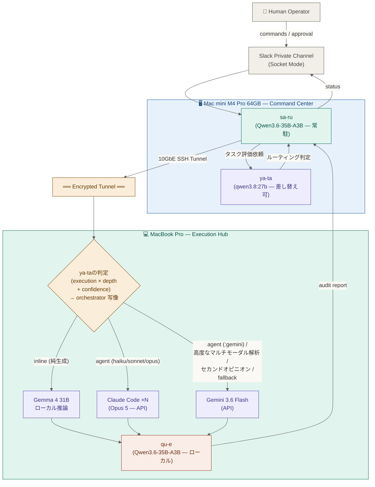
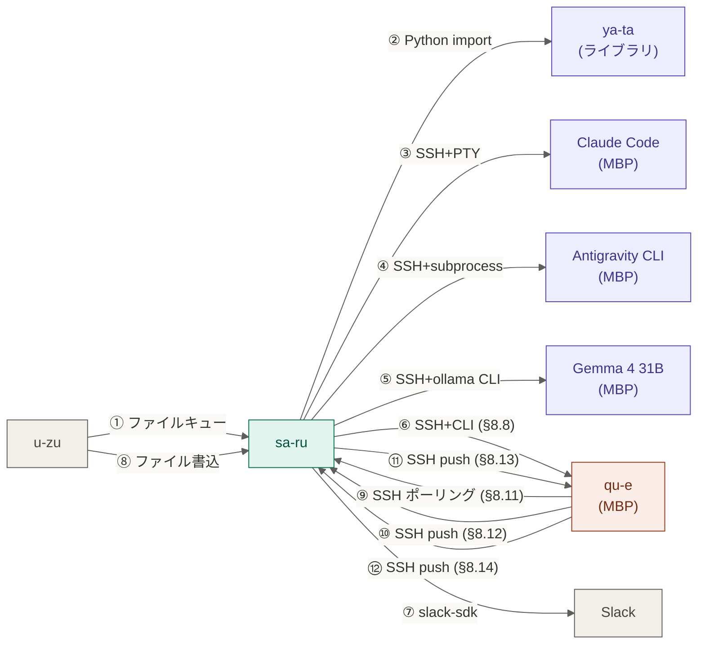
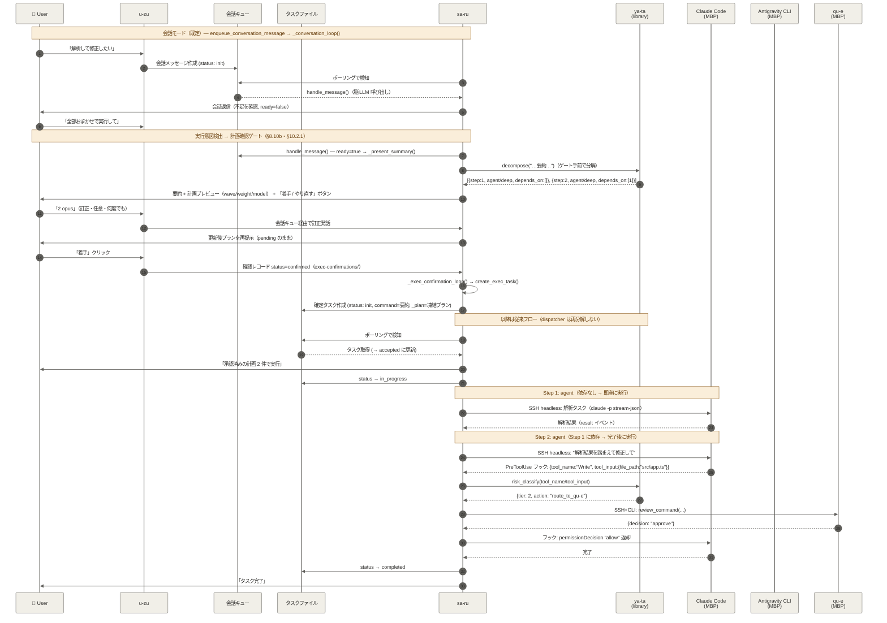

# TAKA-MA 自律型並行開発環境 設計書

## 設計思想（Philosophy）

本設計書のすべての判断は次の設計思想に従う。

- [設計思想のコア](design-philosophy-and-naming.md#core) — 「人と AI の協調」。AI に裁量を持たせ、人は重要な分岐点でのみ承認に介入する。放任でも過干渉でもない第三の状態。
- [AI Gateway がコアである必然性](design-philosophy-and-naming.md#gateway-core) — 人、AIの仕事に対する裁量と承認の境界線へのアプローチ。最適なAI(複数)へのタスク配分。人とAIの協調を物理的に成立させる。

## 設計書の構成（三部）

本設計書は次の三部で構成される。

- 本書（基本設計） — システム全体の構成・役割分担・通信の原則・タスクライフサイクル
- [詳細設計書（details/）](details/) — 部位別の仕様
- [修正記録（revisions/）](revisions/) — 設計改訂の経緯（機能追加・修正、障害対応）

節番号（§）は設計書全体で一意であり、他文書・ソースコードからは「設計書 §8.10f」の形で参照する。各節の本文は以下の目次から辿る。

### §1 システム・アーキテクチャ（全体像）

| 節 | 内容（クリックで該当節へ） |
|----|--------------------------|
| §1 | [システム・アーキテクチャ（全体像）](#sec-1) |
| §1.1 | [コア・インフラ](#sec-1-1) |
| §1.2 | [通信制約](#sec-1-2) |
| §1.3 | [モデル配置一覧](#sec-1-3) |
| §1.4 | [全体アーキテクチャ構成図](#sec-1-4) |

### §2 役割分担と知能の配置

| 節 | 内容（クリックで該当節へ） |
|----|--------------------------|
| §2 | [役割分担と知能の配置](#sec-2) |
| §2.1 | [sa-ru（Qwen3.6-35B-A3B — Mac mini 常駐）](#sec-2-1) |
| §2.2 | [ya-ta（qwen3.8:27b — Mac mini、差し替え可）](#sec-2-2) |
| §2.3 | [Claude Code ×N（Opus 5 — MBP 並行実行）](#sec-2-3) |
| §2.4 | [Gemini 3.6 Flash（API — MBP）](#sec-2-4) |
| §2.5 | [Gemma 4 31B（MBP ローカル）](#sec-2-5) |
| §2.6 | [qu-e（Qwen3.6-35B-A3B — MBP ローカル）](#sec-2-6) |

### §3 承認パイプライン設計

| 節 | 内容（クリックで該当節へ） |
|----|--------------------------|
| §3 | [承認パイプライン設計](details/03-approval-pipeline.md#sec-3) |
| §3.1 | [基本方針](details/03-approval-pipeline.md#sec-3-1) |
| §3.2 | [技術スタック（実行アダプタ別）](details/03-approval-pipeline.md#sec-3-2) |
| §3.3 | [リスク判定（スコープ判定 → 三段階リスク分類）](details/03-approval-pipeline.md#sec-3-3) |
| §3.4 | [承認フロー図](details/03-approval-pipeline.md#sec-3-4) |
| §3.5 | [監査ログ](details/03-approval-pipeline.md#sec-3-5) |

### §4 守護プロセス（qu-e）

| 節 | 内容（クリックで該当節へ） |
|----|--------------------------|
| §4 | [守護プロセス（qu-e）](details/04-sentinel.md#sec-4) |
| §4.1 | [使用モデル](details/04-sentinel.md#sec-4-1) |
| §4.2 | [主たる役割](details/04-sentinel.md#sec-4-2) |

### §5 実装コンポーネント一覧

| 節 | 内容（クリックで該当節へ） |
|----|--------------------------|
| §5 | [実装コンポーネント一覧](#sec-5) |

### §6 IaC（Infrastructure as Code）方針

| 節 | 内容（クリックで該当節へ） |
|----|--------------------------|
| §6 | [IaC（Infrastructure as Code）方針](details/06-infrastructure.md#sec-6) |
| §6.1 | [採用技術](details/06-infrastructure.md#sec-6-1) |
| §6.2 | [リポジトリ構造](details/06-infrastructure.md#sec-6-2) |
| §6.3 | [運用コマンド](details/06-infrastructure.md#sec-6-3) |
| §6.4 | [構築順序](details/06-infrastructure.md#sec-6-4) |
| §6.5 | [インストール来歴の記録とアンインストール](details/06-infrastructure.md#sec-6-5) |
| §6.6 | [配備元ガード（未マージ配備の停止）](details/06-infrastructure.md#sec-6-6) |

### §7 軽量タスク処理モデル セットアップ

| 節 | 内容（クリックで該当節へ） |
|----|--------------------------|
| §7 | [軽量タスク処理モデル セットアップ](details/07-task-models.md#sec-7) |
| §7.1 | [MBPリソース配分計画（128GB unified memory）](details/07-task-models.md#sec-7-1) |
| §7.1.1 | [将来拡張: マシン追加によるスケールアウト](details/07-task-models.md#sec-7-1-1) |
| §7.2 | [モデル選定](details/07-task-models.md#sec-7-2) |
| §7.3 | [Mac mini側（sa-ru用）](details/07-task-models.md#sec-7-3) |
| §7.4 | [モデル自動監視・半自動入替](details/07-task-models.md#sec-7-4) |

### §8 コンポーネント間通信仕様（IPC）

| 節 | 内容（クリックで該当節へ） |
|----|--------------------------|
| §8 | [コンポーネント間通信仕様（IPC）](#sec-8) |
| §8.1 | [通信原則](#sec-8-1) |
| §8.2 | [通信パス一覧](#sec-8-2) |
| §8.3 | [① u-zu → sa-ru（会話投入 → 確定要約 → タスク投入）](details/08-conversation-gateway.md#sec-8-3) |
| §8.4 | [② sa-ru → ya-ta（タスク分解・分類・リスク判定・契約化）](details/08-task-routing.md#sec-8-4) |
| §8.4.1 | [判定ログの記録と Phase 2（プロンプト自動改善）](details/08-task-routing.md#sec-8-4-1) |
| §8.4.x | [相互扶助機能（全モデル横断、ya-ta の中核価値）](details/08-task-routing.md#sec-8-4-x) |
| §8.5 | [③ sa-ru → worker CLI（重量タスク実行、実行アダプタ抽象）](details/08-worker-execution.md#sec-8-5) |
| §8.6 | [④ sa-ru → Antigravity CLI（subprocess 経路）](details/08-worker-execution.md#sec-8-6) |
| §8.7 | [⑤ sa-ru → Gemma 4 31B（軽量タスク実行）](details/08-worker-execution.md#sec-8-7) |
| §8.8 | [⑥ sa-ru → qu-e（Tier 2 コードレビュー）](details/08-sentinel-paths.md#sec-8-8) |
| §8.9 | [⑦ sa-ru → Slack（通知・承認リクエスト）](details/08-slack-interface.md#sec-8-9) |
| §8.10 | [⑧ u-zu → sa-ru（承認結果通知）](details/08-slack-interface.md#sec-8-10) |
| §8.10b | [計画確認ゲート（会話 → 実行の移譲トリガー）](details/08-conversation-gateway.md#sec-8-10b) |
| §8.10c | [u-zu → sa-ru（制御コマンド：手動 ollama 停止）](details/08-slack-interface.md#sec-8-10c) |
| §8.10d | [中止・取消命令の即時実行（承認ゲートを通さない制御コマンド分類）](details/08-slack-interface.md#sec-8-10d) |
| §8.10e | [intent 連続捕捉（依頼意図のドリフト検出 → 人の承認 → append）](details/08-conversation-gateway.md#sec-8-10e) |
| §8.10f | [会話⇄実行の受け渡し契約（命令原文・拘束条件・完了条件）](details/08-conversation-gateway.md#sec-8-10f) |
| §8.10g | [決定的実行と実測回答（LLM 裁量の構造撤去）](details/08-conversation-gateway.md#sec-8-10g) |
| §8.10h | [タスク受付の意図起票とブランチ束縛（レビュー系に載せる前段）](details/08-conversation-gateway.md#sec-8-10h) |
| §8.11 | [qu-e → sa-ru（監査アラート）](details/08-sentinel-paths.md#sec-8-11) |
| §8.12 | [qu-e file_audit → sa-ru（ファイル変更アラート）](details/08-sentinel-paths.md#sec-8-12) |
| §8.13 | [sa-ru → qu-e（タスクコンテキスト共有）](details/08-sentinel-paths.md#sec-8-13) |
| §8.14 | [qu-e → sa-ru（リソース最適化通知）](details/08-sentinel-paths.md#sec-8-14) |
| §8.15 | [待受方式の選択方針（poll / watchdog / タイマー / SSH）](#sec-8-15) |
| §8.16 | [Slack → u-zu（Socket Mode 受信の死活監視）](details/08-slack-interface.md#sec-8-16) |
| §8.16.1 | [sa-ru の死活監視（心拍 2 探針・自己終了復帰）](details/08-slack-interface.md#sec-8-16-1) |
| §8.17 | [G2（Even Realities AR グラス）チャネル — Claude リレー方式](details/08-slack-interface.md#sec-8-17) |

### §9 タスクライフサイクル

| 節 | 内容（クリックで該当節へ） |
|----|--------------------------|
| §9 | [タスクライフサイクル](#sec-9) |
| §9.1 | [タスク実行の全体フロー](#sec-9-1) |
| §9.2 | [承認パイプライン判定フロー](#sec-9-2) |

### §10 オーケストレーション設計

| 節 | 内容（クリックで該当節へ） |
|----|--------------------------|
| §10 | [オーケストレーション設計](details/10-orchestration.md#sec-10) |
| §10.1 | [設計思想](details/10-orchestration.md#sec-10-1) |
| §10.2 | [タスク分解](details/10-orchestration.md#sec-10-2) |
| §10.2.1 | [計画プレビュー契約](details/10-orchestration.md#sec-10-2-1) |
| §10.3 | [DAG 実行ロジック](details/10-orchestration.md#sec-10-3) |
| §10.4 | [ワーカーの並行制御](details/10-orchestration.md#sec-10-4) |
| §10.5 | [結果の受け渡し](details/10-orchestration.md#sec-10-5) |
| §10.6 | [execution × depth の分類範囲](details/10-orchestration.md#sec-10-6) |
| §10.7 | [常駐ループの堅牢性](details/10-orchestration.md#sec-10-7) |
| §10.8 | [LLM 処理待ちのハートビート進捗通知](details/10-orchestration.md#sec-10-8) |

### §11 検証仕様

| 節 | 内容（クリックで該当節へ） |
|----|--------------------------|
| §11 | [検証仕様](details/11-verification.md#sec-11) |
| §11.1 | [連携パス別の検証項目](details/11-verification.md#sec-11-1) |
| §11.2 | [エンドツーエンド検証シナリオ](details/11-verification.md#sec-11-2) |

---

## 設計書の構成

| 節 | 文書 | 扱う範囲 |
|-----|------|---------|
| §1・§2・§5・§8.1・§8.2・§8.15・§9 | 本書 | 全体像・役割分担・実装コンポーネント・通信原則・タスクライフサイクル |
| §3 | [03-approval-pipeline.md](details/03-approval-pipeline.md) | 承認パイプライン（3 Tier） |
| §4 | [04-sentinel.md](details/04-sentinel.md) | 守護プロセス qu-e（役割と使用モデル） |
| §6 | [06-infrastructure.md](details/06-infrastructure.md) | インフラ・IaC |
| §7 | [07-task-models.md](details/07-task-models.md) | モデルの配分・選定・自動監視 |
| §8.3・§8.10b・§8.10e〜h | [08-conversation-gateway.md](details/08-conversation-gateway.md) | 会話ゲートウェイ（人の依頼 → 実行契約） |
| §8.4 | [08-task-routing.md](details/08-task-routing.md) | タスク分解・分類・リスク判定・契約化（ya-ta） |
| §8.5〜§8.7 | [08-worker-execution.md](details/08-worker-execution.md) | worker 実行経路（実行アダプタ） |
| — | [08-worker-execution-adapters.md](details/08-worker-execution-adapters.md) | 実行アダプタの内部設計と実機検証（§8.5 の付属文書） |
| §8.8・§8.11〜§8.14 | [08-sentinel-paths.md](details/08-sentinel-paths.md) | sa-ru ⇄ qu-e の通信経路 |
| — | [08-resource-optimization-flow.md](details/08-resource-optimization-flow.md) | リソース最適化通知のフロー図（§8.14 の付属文書） |
| §8.9〜§8.10d・§8.16・§8.17 | [08-slack-interface.md](details/08-slack-interface.md) | Slack インターフェース（u-zu）と制御コマンド |
| §10 | [10-orchestration.md](details/10-orchestration.md) | オーケストレーション（DAG 実行） |
| — | [10-orchestration-flow.md](details/10-orchestration-flow.md) | オーケストレーションのフロー図（§10 の付属文書） |
| §11 | [11-verification.md](details/11-verification.md) | 検証仕様 |
| — | [design-philosophy-and-naming.md](design-philosophy-and-naming.md) | 設計思想と命名体系（コンポーネント名の由来） |
| — | [revisions/](revisions/) | 障害を契機とする設計改訂の経緯（事象 → 是正 → 反映先） |


---

<a id="sec-1"></a>
## 1. システム・アーキテクチャ（全体像）

<a id="sec-1-1"></a>
### 1.1 コア・インフラ

| 役割 | マシン | スペック |
|------|--------|---------|
| 司令塔 (Command Center) | Mac mini M4 Pro | 64GB / 2TB |
| 実行機 (Execution Hub) | MacBook Pro M4 Max | 128GB / 8TB (16CPU, 40GPU, 16NPU) |
| 人間インターフェース | Private Slack App | Socket Mode |
| 接続プロトコル | 10GbE 直結 + Tailscale SSH | 在宅: 10GbE直結 (172.16.0.0/30)、外出: Tailscale VPN (100.x.x.x)。自動切替 |

<a id="sec-1-2"></a>
### 1.2 通信制約

- **sa-ruが外部と通信できるのは Slack Private channel のみ**（人間とのインターフェース）
- 各モデルへのAPI通信（Claude Code → Anthropic、Antigravity CLI → Google）は各プロセスが自身で行う
- Mac mini ↔ MBP 間は 10GbE 直結 (在宅) / Tailscale VPN (外出) のデュアルモード SSH 接続

> **アクセス制御（実行者認可）**
> Slack 経由で sa-ru に命令を出せるのは、`users.yaml`（`/opt/taka-ma/config/users.yaml`）に登録された user ID のみ。未登録ユーザーの命令（スラッシュコマンド／メンション／DM／ボタン）は u-zu のハンドラ先頭で一律拒否される。ロールは Owner ⊃ Admin ⊃ User の 3 段階で、コマンドごとに必要ロールを設ける（タスク投入は User、承認・ログ等は Admin、停止・復旧・ユーザー管理は Owner 系）。実装は `src/slack_bot/services/role_check.py`（`check_role` / `authorize`）と各ハンドラのゲート。ユーザーの登録・昇格は `/taka-ma-user`（Owner/Admin）で行う。ロール要件表は [運用書](../operations/u-zu/slack-bot.md) の「アクセス制御」を正本とする。
>
> **Owner 不変条件**: システムを Owner 権限からロックアウトさせないため、Owner は常に最低 1 人を残す。最後の 1 人となった Owner の削除・降格（`/taka-ma-user remove` / `update`）は拒否する。この不変条件は書込の単一正本（`user_store`）で担保し、コマンド経路・ボタン経路の双方に効く。

<a id="sec-1-3"></a>
### 1.3 モデル配置一覧

| コンポーネント | モデル | 推論方式 | 配置場所 | 役割 |
|--------------|--------|---------|---------|------|
| sa-ru | Qwen3.6-35B-A3B | ローカル常駐（テキスト＋画像 vision） | Mac mini | stdout文脈抽出、オーケストレーション、stdin制御、人間とのテキスト/画像会話 |
| ya-ta | qwen3.8:27b | ローカル（差し替え可） | Mac mini | タスク難易度判定、最適モデル選択・ルーティング |
| 軽量タスク処理 | Gemma 4 31B | ローカル | MBP | 単純な質問応答、フォーマット変換等 |
| 重量タスク処理 | Claude Opus 5 | API (ProMax契約済) | MBP (Claude Code ×N) | 要件定義、設計、実装、テスト（最難関は Fable 5） |
| 重量タスク処理、 | Gemini 3.6 Flash | API (契約済) | MBP | heavy 対話、cross-review、Opus 障害時フォールバック（テキスト・コード）、高度なマルチモーダル解析（最上位は 3.1 Pro） |
| qu-e | Qwen3.6-35B-A3B | ローカル | MBP | コード検証、監視、y/n Tier2審査 |

<a id="sec-1-4"></a>
### 1.4 全体アーキテクチャ構成図


```mermaid
%%{init: {'theme':'base', 'themeVariables': {'background':'#FAF9F6','lineColor':'#5F5E5A','edgeLabelBackground':'#FAF9F6'}}}%%
flowchart TD
    HUMAN["👤 Human Operator"]
    HUMAN -->|"commands / approval"| SLACK

    SLACK["Slack Private Channel\n(Socket Mode)"]
    SLACK --> OC

    subgraph MINI["🖥️ Mac mini M4 Pro 64GB — Command Center"]
        OC["sa-ru\n(Qwen3.6-35B-A3B — 常駐)"]
        OC -->|"タスク評価依頼"| GW
        GW["ya-ta\n(qwen3.8:27b — 差し替え可)"]
        GW -->|"ルーティング判定"| OC
    end

    OC -->|"10GbE SSH Tunnel"| TUNNEL["══ Encrypted Tunnel ══"]

    TUNNEL --> ROUTER

    subgraph MBP["💻 MacBook Pro — Execution Hub"]
        ROUTER{"ya-taの判定\n(execution × depth\n+ confidence)\n→ orchestrator 写像"}
        ROUTER -->|"inline (純生成)"| LLAMA["Gemma 4 31B<br>ローカル推論"]
        ROUTER -->|"agent (haiku/sonnet/opus)"| CC["Claude Code ×N<br>(Opus 5 — API)"]
        ROUTER -->|"agent (:gemini) /<br>高度なマルチモーダル解析 /<br>セカンドオピニオン /<br>fallback"| GEMINI["Gemini 3.6 Flash<br>(API)"]

        LLAMA --> SENT
        CC --> SENT
        GEMINI --> SENT

        SENT["qu-e<br>(Qwen3.6-35B-A3B — ローカル)"]
    end

    SENT -->|"audit report"| OC
    OC -->|"status"| SLACK

    style HUMAN fill:#F1EFE8,stroke:#5F5E5A,color:#444441
    style SLACK fill:#F1EFE8,stroke:#5F5E5A,color:#444441
    style MINI fill:#E6F1FB,stroke:#185FA5,color:#0C447C
    style OC fill:#E1F5EE,stroke:#0F6E56,color:#085041
    style GW fill:#EEEDFE,stroke:#534AB7,color:#3C3489
    style TUNNEL fill:#FAEEDA,stroke:#854F0B,color:#633806
    style MBP fill:#E1F5EE,stroke:#0F6E56,color:#085041
    style ROUTER fill:#FAEEDA,stroke:#854F0B,color:#633806
    style LLAMA fill:#EEEDFE,stroke:#534AB7,color:#3C3489
    style CC fill:#EEEDFE,stroke:#534AB7,color:#3C3489
    style GEMINI fill:#EEEDFE,stroke:#534AB7,color:#3C3489
    style SENT fill:#FAECE7,stroke:#993C1D,color:#712B13
```

---

<a id="sec-2"></a>
## 2. 役割分担と知能の配置

<a id="sec-2-1"></a>
### 2.1 sa-ru（Qwen3.6-35B-A3B — Mac mini 常駐）

- Slackからの指示受信（唯一の人間インターフェース）。テキストと画像（vision）で人間の生入力を受ける。Qwen3.6-35B-A3B（MoE 総 35B / アクティブ 3B、vision 対応）を採用。アクティブ 3B により dense 12B より応答が速く、会話の体感待ち時間を短縮できる（実運用実測で会話 1 ターン中央値 44 秒・最大 120 秒タイムアウトが常態化した反省による選定。速度と推論品質の実利を優先）。音声・動画入力は未実装であり、実装する時点でモデル要件を再評価する。クラウド Gemini を使わずローカル維持するのは、人間の生入力の外部流出回避と常駐核のオフライン可用性（主権）を保つため
- **会話フロントエンド（既定）**: 脳モデルで人間と会話し、本当にやりたいこと（開発意図）を引き出して整理する。曖昧なら質問を返し、意図が固まったら構造化要約にまとめる。Slack の 1 通を即タスク化はしない（§8.3）
- **会話モード / 実行モードの分離**: 通常の発話は会話モードで処理し、実行（ya-ta への移譲）は「sa-ru が要約提示 → 人間の着手確認」を経た後にのみ行う
- **実行意図の判定は持たない（ya-ta へ移管）**: sa-ru の脳モデルが行うのは会話返信の文生成のみ。発話が「雑談か・状態確認か・実行依頼か」の意図判定は ya-ta の IntentClassifier（§8.4「意図判定の呼び出し」）が担う。移管の理由: 速度優先で選定した本モデル（アクティブ 3B）に判定業務を負わせ続けた結果、実行依頼を状態確認と誤判定して成果物に到達しない事故が反復した（[是正 2026-09-07](revisions/2026-09-07.md)）。sa-ru に残る判定はトリアージ（passive / 停止命令 / 計画訂正の振り分け）と workspace 記法の検証のみ。`/taka-ma-go` は従来どおり判定を経ない明示エスケープ
- MBP上の全プロセスの起動・停止・管理
- **実行アダプタ抽象**による worker CLI の制御（特定 CLI にロックインしない。§8.5）。Claude Code は headless アダプタ、agy 等は subprocess/interactive アダプタと、CLI 固有部分をアダプタに隔離して同一 IF で扱う
- worker の承認要求を構造化データ（tool_name/tool_input）として取得し、ya-ta / 承認パイプラインに判定を委譲
- 各コンポーネントは自分の判定・監査ログを構造化（日付別 jsonl）で個別に出力し、プロセス標準出力は launchd が `*.log` へ記録する。直近ログは Slack `/taka-ma-logs` で参照する（中央集約デーモンは持たない。各ログの後段処理は ya-ta-decisions=Phase2、approval-audit/file-audit=ローテーション等、生成元ごとに定義）
- ya-taへのタスク評価依頼と結果に基づく実行

<a id="sec-2-2"></a>
### 2.2 ya-ta（qwen3.8:27b — Mac mini、差し替え可）

- **実装方式**: sa-ru プロセス内で Python import するライブラリ方式（launchd サービス廃止。クラッシュ問題（exit -15）の構造的解消）
- **意図判定（IntentClassifier・sa-ru から移管）**: 発話ごとに `{action: chat|probe_repo|probe_task|execute, confidence, evidence}` を判定する（§8.4「意図判定の呼び出し」）。一次はローカル `ya-ta.model`（qwen3.8:27b）、機械検証の不合格・低 confidence で worker CLI（opus）へ昇格する 2 段構成。評価と判定の分離: sa-ru の会話脳は返信文の生成のみを担い、実行に進むか否かの判定は本機能に一本化する
- **タスク分解**: ユーザーの 1 指示をサブタスクの DAG に分解。担当は推論特化のローカル dense モデルで、現行は **qwen3.8:27b**（正は `ya-ta.yaml` の `model`）。入替来歴: DeepSeek-R1 32B → Qwen3.6-27B（GPQA Diamond 62.1→87.8 / AIME 72.6→79.3 / LiveCodeBench 57.2→65.7 と全項目上回り、4-bit 必要メモリも 19GB→18GB）→ qwen3.8:27b（2026-08-26 承認・claims: `docs/claims/model-swap_ya-ta_qwen3.6-27b_to_qwen3.8-27b.md`）
- **コンテキスト長 (num_ctx)**: 32768（32K）。Mac mini 64GB に sa-ru と同居するため、既定の長大コンテキストでは KV キャッシュが膨らみ OOM する（旧 DeepSeek-R1 32B での実測: 128K=常駐 47GB → 32K=常駐 26GB。Qwen3.6-27B の実常駐は入替 deploy 時に §7.4 ランブックで実測し `model_capacity.yaml` へ記録する。qwen3.8:27b は 32K で実常駐 18GB・2026-08-26 実測）。分解・分類・リスク判定の用途には 32K で十分。コードは ollama 呼び出しで num_ctx を渡さないため、**初期投入時に PyInfra（ai_gateway deploy）がモデルに `PARAMETER num_ctx 32768` を焼き込む**（同タグ上書き・冪等）。設定源は `ya-ta.yaml` の `num_ctx`（構築手順書 04 §1-2）
- **タスク分類（execution × depth 直交 2 軸）**: `light` / `heavy` の 1 次元 2 値を廃し、独立した 2 軸で判定する（ルールベース不採用）。ya-ta は各サブタスクに次を産出する。**軸は生判定のまま返し、モデルへの写像は orchestrator が一手に行う**（ya-ta はモデル名を決めない＝関心の分離）
  - **execution 軸**: `inline`（1 回のプロンプト応答で完結する純生成・単発）／ `agent`（探索・試行錯誤・ツール使用・対話反復を伴うエージェント実行）。**写像テーブル（`routing.matrix`）の入力軸**であって、キューのレーンを直接決める軸ではない
  - **depth 軸**: `shallow`（浅い・定型的）／ `deep`（深い・設計/難所）／ 省略（判断がつかない）。**モデル階梯を決める軸**
  - **レーンは写像後モデルの実行 method で決まる**（`subprocess` → inline 無制限レーン、`headless` / `pty` → agent 並行数制限レーン）。execution 軸でレーンを決めてはならない: `execution: inline` でも confidence が閾値未満なら写像は haiku（headless）へ落ちるため、execution を根拠にレーンを決めると headless worker が無制限レーンで青天井に同時起動する
  - **confidence**: ya-ta の自己申告（0.0–1.0）。閾値（既定 0.8・後述の較正対象）未満は「迷い」とみなし、階梯の中位（sonnet）へ落とす
- **写像テーブル（execution × depth × confidence → モデル）**: 解決は `ya-ta.yaml` の `routing.matrix` を唯一の源とする。orchestrator が下表で primary モデルを決める（`conf` は confidence、`th` は `routing.confidence_threshold`）

  | execution | depth | confidence | モデル | 意図 |
  |-----------|-------|-----------|--------|------|
  | inline | —（不問） | `conf ≥ th` | **gemma** | ローカル純生成で完結 |
  | inline | —（不問） | `conf < th` | **haiku** | 生成だが迷い → 安価な API で確実に |
  | agent | shallow | `conf ≥ th` | **haiku** | 浅いエージェント作業 |
  | agent | deep | `conf ≥ th` | **opus** | 深い設計/難所 |
  | agent | 省略 or `conf < th` | （左記） | **sonnet** | 迷いの落下先（中位・万能） |

  `:fable` / `:gemini` / `:gemini-pro` は**明示指定のときのみ**選ばれる（自動写像先には現れない）。
- **昇格ラダー（実行後の段階昇格）**: 実行時に worker が難所に当たった場合、`routing.escalation.ladder`（既定 `[haiku, sonnet, opus]`）に沿って段階的にモデルを上げて再実行する。引き金は 2 つ — (a) worker が出力に `ESCALATE:<理由>` を自己申告、(b) 例外・タイムアウト。現モデルがラダー上にあれば次段へ、ラダー外（gemma）なら先頭から入る。ラダー最終段まで昇格して失敗したら当該ステップを failed とする。ユーザーが `:モデル名` で明示指定した場合は昇格しない（指定モデル尊重）
- **depth の三層補正**: depth は 3 段で補正される。(1) ya-ta の事前当たり（分解時の depth 判定）、(2) 人間の計画確認（§10.2.1 の計画プレビューでの上書き。上流フィルタであって昇格の代替ではない）、(3) 実行後の昇格ラダー。事前判定が浅めでも、計画確認と実行時昇格で深い作業へ引き上げられる
- **モデル登録制**: `ya-ta.yaml` の `models` セクションに capabilities ベースで登録（Opus / Gemini / 外部サービス（SUNO / Runway 等）も登録可能）。プロンプト内ではモデル名を抽象化（具体名は yaml で一元管理）
- **ユーザーモデル指定**: Slack メッセージ末尾に `:opus` / `:gemini` / `:sonnet` 等の短縮名で指定（完全一致のみ受理。不正指定はエラー通知 + 利用可能一覧返却）
- **cross-review**: `:opus :gemini` のように 2 つ以上指定すれば cross-review として処理（専用キーワードなし）。**並行投入・結果収集は orchestrator が担当**（`asyncio.gather` で各モデルへ並行投入、各 agent レーン Semaphore を個別取得、部分成功許容、失敗モデルは Slack 通知）、**結果統合は ya-ta（分解脳モデル）が知的に実施**。全モデル失敗、または成功結果はあるが統合実行自体が失敗（統合モデルの異常終了・タイムアウト）した場合は当該ステップを failed とする（§10.3 の Future 解決の不変条件に従い、Future を例外で解決する）
- **明示モデル指定時はフォールバックしない**: ユーザーが `:opus` 等で指定したモデルが障害になった場合、昇格ラダーへは進まずそのまま failed を返す（指定モデル尊重）
- **閾値・rubric は実データで較正**: `confidence_threshold`（0.8）と昇格ラダーの段構成・depth の shallow/deep 判定基準は**机上で決め打ちしない**。判定ログ（§8.4.1・`YaTaLogger`）に蓄積される実 execution/depth/confidence と実行成否・昇格発生の実データを突合し、誤判定・過昇格/過小昇格の傾向から調整する。初期値は暫定であり、運用ログが溜まるまでの叩き台に過ぎない
- **Classifier 変数名**: `model`（旧 `user_tag` / `directive` は使用しない）
- **Phase 2: プロンプト自動改善**: 判定ログ蓄積から誤判定パターンを抽出し、分類プロンプトに few-shot 例として追加（判定ログの記録経路と Phase 2 の手順詳細は §8.4.1）
- **agent レーン並行数 (`max_heavy_instances`)**: agent 実行（Claude Code / agy 等の重い worker）の同時起動上限。Phase 6 の実機検証で決定（**未定**）。名称は §8.14 / qu-e 連携の互換のため `max_heavy_instances` を踏襲する（旧「heavy カテゴリ」ではなく「agent レーン」の並行数を指す）
- **検証コマンド `/exam_gw`**: タスク分解・分類・モデル選択・実行方式の判定結果のみ返すドライラン
- 将来のモデル差し替えに備え、独立した箱として設計

<a id="sec-2-3"></a>
### 2.3 Claude Code ×N（Opus 5 — MBP 並行実行）

- ProMax契約のClaude Opus 5をCLIで複数インスタンス並行起動（最難関タスクは Fable 5 を `:fable` で明示指定）
- 各インスタンスが独立してAnthropic APIと通信
- 役割例: Frontend / Backend / QA・テスト

<a id="sec-2-4"></a>
### 2.4 Gemini 3.6 Flash（API — MBP）

- Pro 契約による API 利用。CLI は **agy（Antigravity CLI）** — Gemini CLI の後継のコーディングエージェント。認証は macOS keychain 依存（§8.5 / §8.6）
- **モデル版**: 既定は **Gemini 3.6 Flash**（agy 既定）。最上位が要るタスクは 3.1 Pro を `:gemini-pro` で明示指定する（`agy --model "<agy models の表示名>" -p`。`--model` は `-p` より前・名前は `agy models` の表示名そのままが必須。agy 1.0.16 実機で確認）
- **`:gemini-pro` は subprocess 単発のみ**: 表示名が空白と括弧を含むため、PTY 経路の起動文字列（`ssh -tt 'tmux new-session … "<invocation>"'`）の入れ子クォートを壊す。`:gemini-pro` の用途（高度なマルチモーダル解析の単発・長文脈）は subprocess で満たせるため `methods: [subprocess]` に限定する。PTY 経路のクォート堅牢化は別タスク
- **役割（初期リリース）**: **heavy 対話 / cross-review / Opus 障害時フォールバック（テキスト・コード）**。heavy 対話タスクは Claude Code 同等（`:gemini` 指定で利用）
- **マルチモーダル解析の初期リリース方針**: 音声・画像・動画の基本的な解析（理解）は**ローカル gemma4:31b（MBP worker、マルチモーダル）**で賄い、**高度な解析のみ** Gemini API（agy）経由とする。sa-ru 会話脳（Qwen3.6-35B-A3B）は会話中の画像理解（vision）のみ担い、音声・動画の解析タスクは worker 側へ委譲する
- **生成は Phase 2（生成基盤）へ延期**: 動画・音楽等の生成は初期リリースの対象外。生成基盤（veo / lyria / Runway / Suno 等の外部サービス登録制）は Phase 2 として設計・実装する（前方参照）
- セカンドオピニオン / フォールバックは **ya-ta の汎用機能**（§8.4.x 相互扶助機能）であり、Gemini に限定されない。Gemini は当該機能に参加する 1 候補として扱われる
- **meta カテゴリ廃止（2026-04-19）**: Gemini のコンテキスト窓が 1M（Opus と同じ）になり、「長文コンテキスト担当」という meta の技術的根拠が消失。Gemini の差別化要因はマルチモーダルに絞られた
- コードベース解析・アーキテクチャ判断は heavy（Opus）が主担当（メタ推論は heavy に統合）

<a id="sec-2-5"></a>
### 2.5 Gemma 4 31B（MBP ローカル）

- MBP上でローカル推論（ollama、Q4_K_M量子化、~20GB）
- 256Kコンテキスト対応
- 軽量タスクを高速処理（外部通信不要）
- **マルチモーダル解析の基本担当（初期リリース）**: 音声・画像・動画の基本的な解析（理解）を worker 側で担う。高度な解析のみ Gemini API 経由（§2.4）

<a id="sec-2-6"></a>
### 2.6 qu-e（Qwen3.6-35B-A3B — MBP ローカル）

- コードの最終検証・脆弱性検知
- MBPへの書き込み承認（y/n Tier 2審査）
- システム全体の健全性チェック（CPU/メモリ/ディスク/ネットワーク）
- ファイルシステム変更のリアルタイム監査
- 不正なファイル操作やリソース過負荷の常時検閲

---

<a id="sec-5"></a>
## 5. 実装コンポーネント一覧

| # | コンポーネント | 概要 | 実行場所 |
|---|--------------|------|---------|
| 1 | sa-ru本体 | Qwen3.6-35B-A3B常駐、実行アダプタ（headless/interactive/subprocess）+ プロセス管理（ログは各コンポーネント個別出力、中央集約器なし） | Mac mini |
| 2 | ya-ta | qwen3.8:27b ローカル推論、タスク判定 + モデルルーティング（差し替え可） | Mac mini |
| 3 | y/n承認パイプライン | pexpect stdin制御 + 三段階リスク判定 + qu-e連携 | Mac mini → MBP |
| 4 | qu-e daemon | Qwen3.6-35B-A3B ローカル推論、コード検証 + ヘルスチェック + ファイル監査 | MBP |
| 5 | u-zu | Socket Mode接続 + コマンドIF + 人間承認通知（唯一の外部通信） | Mac mini |
| 6 | SSH/トンネル設定 | 10GbE接続 + リバーストンネル + セキュリティ | Mac mini ↔ MBP |
| 7 | Gemma 4 31B ローカル推論 | ollama によるMBPローカル推論 | MBP |
| 8 | Gemini 連携 | API経由の heavy 対話 + cross-review + フォールバック + 高度なマルチモーダル解析 | MBP |

---

<a id="sec-8"></a>
## 8. コンポーネント間通信仕様（IPC）

<a id="sec-8-1"></a>
### 8.1 通信原則

| 原則 | 内容 |
|------|------|
| マシン間通信 | SSH のみ。ポート開放・REST API 禁止 |
| Mac mini 内（同一マシン） | Python ライブラリ import、またはファイルベースキュー |
| MBP 上のローカル API | ollama HTTP API（localhost:11434）は既存インフラとして利用可 |
| データ形式 | JSON（構造化データ）、プレーンテキスト（CLI 出力） |

> **マルチワークスペース対応について**: タスクの送信元ワークスペースは `team_id` で識別し、タスクファイル（§8.3）に記録する。これにより応答・通知を `(team_id, channel_id)` で宛先特定できる。
> 現行は Socket Mode（ポート開放不要）で運用するため、複数ワークスペースを運用する場合は、各ワークスペースの bot/app トークンを構築手順書 03（slack-bot）の手順で個別に登録する（OAuth installer は公開エンドポイント＝ポート開放が必要なため採らない）。

<a id="sec-8-2"></a>
### 8.2 通信パス一覧


```mermaid
%%{init: {'theme':'base', 'themeVariables': {'background':'#FAF9F6','lineColor':'#5F5E5A','edgeLabelBackground':'#FAF9F6'}}}%%
flowchart LR
    %% Node ID 凡例:
    %%   SB = u-zu / OC = orchestrator (sa-ru) / GW = Gateway (ya-ta = ai_gateway)
    %%   CC = Claude Code / GM = Gemini / QW = Gemma 4 31B
    %%   SN = Sentinel (qu-e) / SK = Slack
    SB["u-zu"]
    OC["sa-ru"]
    GW["ya-ta\n(ライブラリ)"]
    CC["Claude Code\n(MBP)"]
    GM["Antigravity CLI\n(MBP)"]
    QW["Gemma 4 31B\n(MBP)"]
    SN["qu-e\n(MBP)"]
    SK["Slack"]

    SB -->|"① ファイルキュー"| OC
    OC -->|"② Python import"| GW
    OC -->|"③ SSH+PTY"| CC
    OC -->|"④ SSH+subprocess"| GM
    OC -->|"⑤ SSH+ollama CLI"| QW
    OC -->|"⑥ SSH+CLI (§8.8)"| SN
    OC -->|"⑦ slack-sdk"| SK
    SB -->|"⑧ ファイル書込"| OC
    SN -->|"⑨ SSH ポーリング (§8.11)"| OC
    SN -->|"⑩ SSH push (§8.12)"| OC
    OC -->|"⑪ SSH push (§8.13)"| SN
    SN -->|"⑫ SSH push (§8.14)"| OC

    style SB fill:#F1EFE8,stroke:#5F5E5A,color:#444441
    style OC fill:#E1F5EE,stroke:#0F6E56,color:#085041
    style GW fill:#EEEDFE,stroke:#534AB7,color:#3C3489
    style CC fill:#EEEDFE,stroke:#534AB7,color:#3C3489
    style GM fill:#EEEDFE,stroke:#534AB7,color:#3C3489
    style QW fill:#EEEDFE,stroke:#534AB7,color:#3C3489
    style SN fill:#FAECE7,stroke:#993C1D,color:#712B13
    style SK fill:#F1EFE8,stroke:#5F5E5A,color:#444441
```

**各パスの仕様がどこに在るか**（§ 番号は再編前から不変）:

| パス | 節 | 詳細設計書 |
|------|----|-----------|
| ① u-zu → sa-ru（会話投入 → 確定要約 → タスク投入） | §8.3 | [conversation-gateway](details/08-conversation-gateway.md) |
| ② sa-ru → ya-ta（分解・分類・リスク判定・契約化） | §8.4 | [task-routing](details/08-task-routing.md) |
| ③ sa-ru → worker CLI | §8.5 | [worker-execution](details/08-worker-execution.md) |
| ④ sa-ru → Antigravity CLI | §8.6 | [worker-execution](details/08-worker-execution.md) |
| ⑤ sa-ru → Gemma 4 31B | §8.7 | [worker-execution](details/08-worker-execution.md) |
| ⑥ sa-ru → qu-e（Tier 2 コードレビュー） | §8.8 | [approval-pipeline](details/03-approval-pipeline.md) |
| ⑦ sa-ru → Slack（通知・承認リクエスト） | §8.9 | [slack-interface](details/08-slack-interface.md) |
| ⑧ u-zu → sa-ru（承認結果通知） | §8.10 | [slack-interface](details/08-slack-interface.md) |
| ⑨〜⑫ qu-e ⇄ sa-ru（監査・ファイル変更・文脈共有・資源最適化） | §8.11〜§8.14 | [sentinel](details/04-sentinel.md) |
| 会話 → 実行の移譲（計画確認・意図捕捉・受け渡し契約・決定的実行・受付の起票とブランチ束縛） | §8.10b・§8.10e・§8.10f・§8.10g・§8.10h | [conversation-gateway](details/08-conversation-gateway.md) |
| 制御コマンド（手動 ollama 停止・中止/取消の即時実行） | §8.10c・§8.10d | [slack-interface](details/08-slack-interface.md) |
| 待受方式の選択方針 | §8.15 | [infrastructure](details/06-infrastructure.md) |
| Socket Mode 受信と sa-ru の死活監視 | §8.16・§8.16.1 | [slack-interface](details/08-slack-interface.md) |
| G2（AR グラス）チャネル | §8.17 | [slack-interface](details/08-slack-interface.md) |

<a id="sec-8-15"></a>
### 8.15 待受方式の選択方針（poll / watchdog / タイマー / SSH）

§8 各経路の「監視方法」は、待つ対象の性質で選ぶ。**既定はポーリング**であり、watchdog はファイル内容の外部改変を検知する用途に限定する。一律 watchdog 化はしない。

### 判断基準

| 何を待つか | 方式 | 該当経路 |
|-----------|------|---------|
| **自分が決めた場所に JSON が1個置かれる**（投入者・パス・形式が既知の受信キュー） | **ポーリング**（`glob` + `sleep`） | §8.3 会話／タスク、§8.10b 着手確認、§8.10c 制御、§8.10 承認（待ち中のみ） |
| **外部プロセスによるファイル内容の改変を検知**（誰が・いつ・何を上書きするか不定） | **watchdog（FSEvents）** | §8.12 file_audit |
| 上記 watchdog 経路への **SSH push 受信** | **watchdog（FSEvents）** | §8.14 リソース最適化通知 |
| **時間が経過したこと**（pending のまま N 秒）。ファイルイベントでは検知できない | **タイマー**（現状はポーリング周期内で経過判定） | §8.10 のタイムアウト |
| **別マシン上のファイル**。ローカル watchdog の監視対象外 | **SSH 定期取得** | §8.11 ヘルス |

### ポーリングを既定とする根拠

1. **負荷は無視できる**。監視ディレクトリは処理済みを `done/` へ退避して常にほぼ空に保つため、`glob` 1 回は数 µs（実測 2〜8 µs／darwin・arm）。2 秒間隔でも CPU 占有は概ね 0.0001%。夜間に会話が無く空振りを続けても実害は無い。
2. **大量到着に強い**。一度に多数のファイルが届いても、1 周期で `glob` がまとめて拾いバッチ処理できる（coalescing）。watchdog はファイル単位でイベントが発生するため、突発的な大量変更ではイベントが分散し不利になりうる。
3. **実装が単純で疎結合**。各ループは asyncio タスク 1 個で完結し、受信形式を共通化しやすい。watchdog は Observer スレッド常駐とスレッド↔イベントループ間連携（`run_coroutine_threadsafe` 等）を要し、待受ごとに複雑さが増す。

### watchdog を限定採用する根拠

file_audit（§8.12）は「ファイルの**中身が外部から変わる**」ことの即時検知が本質で、変更主体・タイミング・パスが予測できない。これはポーリングの「自分が置いた既知ファイルを拾う」モデルと性質が異なり、FSEvents による常時監視が適する。リソース最適化通知（§8.14）はその file_audit と同じ SSH push 受信機構に相乗りするため watchdog を用いる。**この 2 経路以外で watchdog は使わない。**

> **補足**: 上記により、受信キュー（§8.3／§8.10／§8.10b／§8.10c）の常駐ポーリングは設計上の選択であって最適化漏れではない。負荷削減を目的とした watchdog 化は効果が無く（既に実質ゼロ）、むしろ実装複雑化を招くため採らない。

---

<a id="sec-9"></a>
## 9. タスクライフサイクル

<a id="sec-9-1"></a>
### 9.1 タスク実行の全体フロー


```mermaid
%%{init: {'theme':'base', 'themeVariables': {'background':'#FAF9F6','actorBkg':'#F1EFE8','actorBorder':'#5F5E5A','actorTextColor':'#2B2A28','actorLineColor':'#5F5E5A','signalColor':'#5F5E5A','signalTextColor':'#2B2A28','labelBoxBkgColor':'#F1EFE8','labelBoxBorderColor':'#5F5E5A','labelTextColor':'#2B2A28','loopTextColor':'#2B2A28','noteBkgColor':'#FAEEDA','noteBorderColor':'#854F0B','noteTextColor':'#633806','sequenceNumberColor':'#2B2A28'}}}%%
sequenceDiagram
    autonumber
    participant U as 👤 User
    participant SB as u-zu
    participant CQ as 会話キュー
    participant TQ as タスクファイル
    participant OC as sa-ru
    participant GW as ya-ta<br>(library)
    participant CC as Claude Code<br>(MBP)
    participant GM as Antigravity CLI<br>(MBP)
    participant SN as qu-e<br>(MBP)

    Note over U,OC: 会話モード（既定）— enqueue_conversation_message → _conversation_loop()
    U->>SB: 「解析して修正したい」
    SB->>CQ: 会話メッセージ作成 (status: init)
    OC->>CQ: ポーリングで検知
    CQ-->>OC: handle_message()（脳 LLM 呼び出し）
    OC->>U: 会話返信（不足を確認, ready=false）
    U->>SB: 「全部おまかせで実行して」

    Note over U,OC: 実行意図検出 → 計画確認ゲート（§8.10b・§10.2.1）
    OC->>CQ: handle_message() — ready=true → _present_summary()
    OC->>GW: decompose("…要約…")（ゲート手前で分解）
    GW-->>OC: [{step:1, agent/deep, depends_on:[]}, {step:2, agent/deep, depends_on:[1]}]
    OC->>U: 要約 + 計画プレビュー（wave/weight/model） + 「着手 / やり直す」ボタン
    U->>SB: 「2 opus」（訂正・任意・何度でも）
    SB->>OC: 会話キュー経由で訂正発話
    OC->>U: 更新後プランを再提示（pending のまま）
    U->>SB: 「着手」クリック
    SB->>OC: 確認レコード status=confirmed（exec-confirmations/）
    OC->>OC: _exec_confirmation_loop() → create_exec_task()
    OC->>TQ: 確定タスク作成 (status: init, command=要約, _plan=凍結プラン)

    Note over OC,GW: 以降は従来フロー（dispatcher は再分解しない）
    OC->>TQ: ポーリングで検知
    TQ-->>OC: タスク取得 (→ accepted に更新)
    OC->>U: 「承認済みの計画 2 件で実行」
    OC->>TQ: status → in_progress

    Note over OC,CC: Step 1: agent（依存なし → 即座に実行）
    OC->>CC: SSH headless: 解析タスク（claude -p stream-json）
    CC-->>OC: 解析結果（result イベント）

    Note over OC,CC: Step 2: agent（Step 1 に依存 → 完了後に実行）
    OC->>CC: SSH headless: "解析結果を踏まえて修正して"

    CC-->>OC: PreToolUse フック: {tool_name:"Write", tool_input:{file_path:"src/app.ts"}}
    OC->>GW: risk_classify(tool_name/tool_input)
    GW-->>OC: {tier: 2, action: "route_to_qu-e"}
    OC->>SN: SSH+CLI: review_command(...)
    SN-->>OC: {decision: "approve"}
    OC->>CC: フック: permissionDecision "allow" 返却

    CC-->>OC: 完了
    OC->>TQ: status → completed
    OC->>U: 「タスク完了」
```

<a id="sec-9-2"></a>
### 9.2 承認パイプライン判定フロー

```
ツール実行前の承認要求（headless=PreToolUse フック / interactive=y/n 検出）
  │  ※判定入力は構造化 tool_name/tool_input。決定は allow/deny を返す
  │   （headless=フック permissionDecision:allow/exit2、interactive=y/n 送信）
  ├─ Tier 1 (Low Risk) ──→ 自動 allow ──→ 実行
  │
  ├─ Tier 2 (Medium Risk) ──→ qu-e レビュー
  │     ├─ approve ──→ allow ──→ 実行
  │     └─ deny / escalate ──→ Tier 3 へ
  │
  └─ Tier 3 (High Risk) ──→ Slack 承認リクエスト（§8.10 ポーリング）
        ├─ Approve ──→ allow ──→ 実行
        ├─ Reject ──→ deny ──→ 中止
        └─ 猶予（hold_grace_sec）超過 ──→ hold（保留）
              │  承認は pending のまま存置（自動 deny しない）
              │  worker を畳む、タスク pending_approval（completed にしない）、並行枠を解放
              │  済んだサブタスクの結果をタスクファイルへ永続化
              └─ 人間の決着（期限なし）
                    ├─ Approve ──→ 未了サブタスクから再投入 ──→ 実行
                    │              （文脈 = workspace の成果物 + completed_steps）
                    └─ Reject ──→ deny ──→ 中止
```

---

