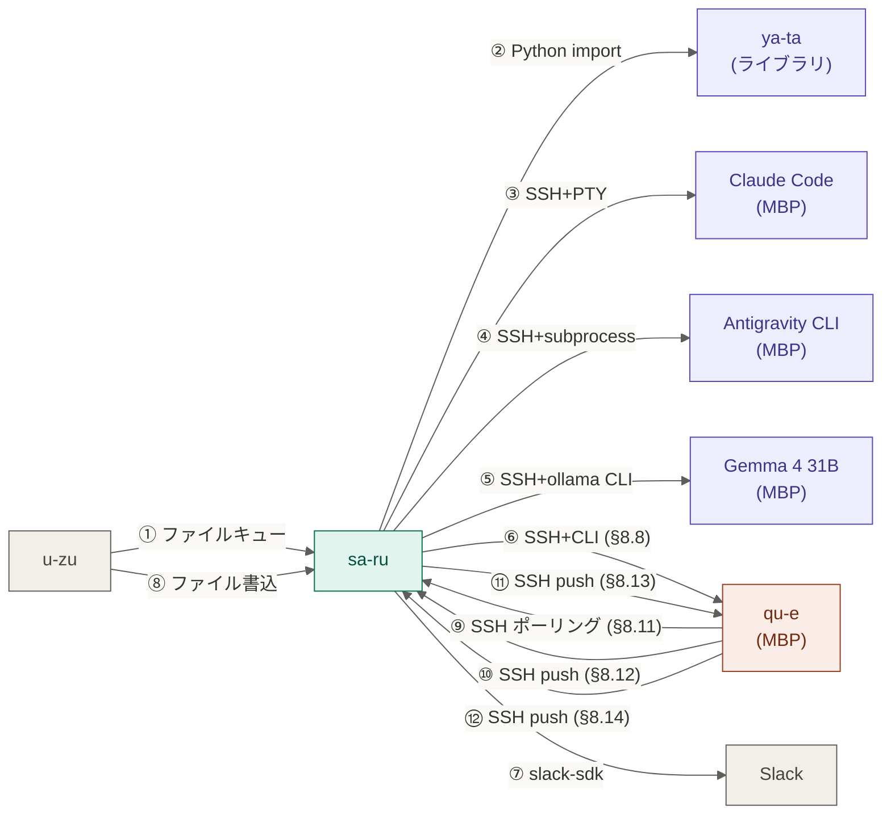
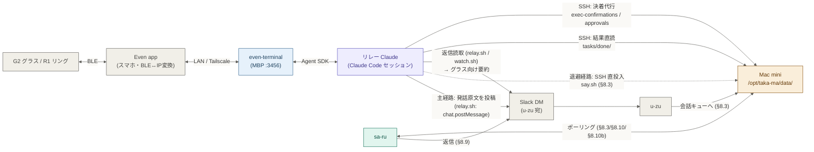
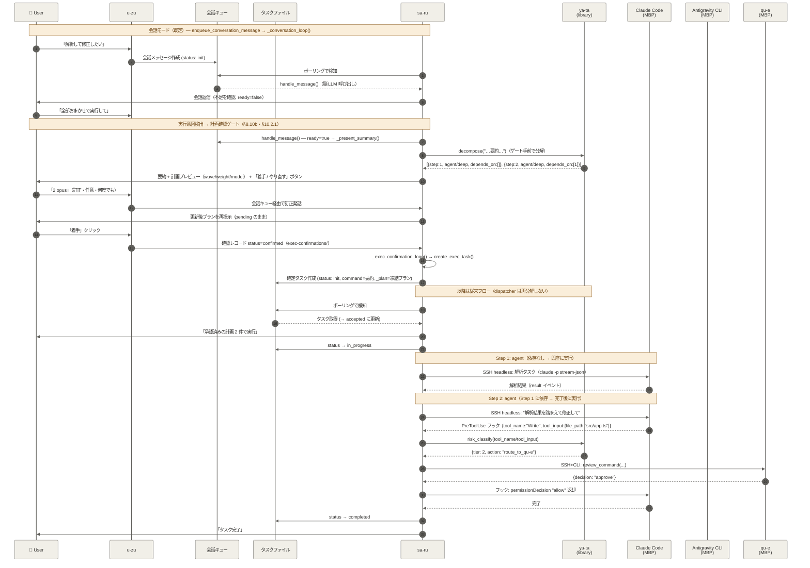

# M4 Pro Mac mini ↔ MBP 自律型並行開発環境 設計書

---

## 目次

- [1. システム・アーキテクチャ（全体像）](#1-システムアーキテクチャ全体像)
  - [1.1 コア・インフラ](#11-コアインフラ)
  - [1.2 通信制約](#12-通信制約)
  - [1.3 モデル配置一覧](#13-モデル配置一覧)
  - [1.4 全体アーキテクチャ構成図](#14-全体アーキテクチャ構成図)
- [2. 役割分担と知能の配置](#2-役割分担と知能の配置)
  - [2.1 sa-ru（Qwen3.6-35B-A3B — Mac mini 常駐）](#21-sa-ruqwen36-35b-a3b--mac-mini-常駐)
  - [2.2 ya-ta（Qwen3.6-27B — Mac mini、差し替え可）](#22-ya-taqwen36-27b--mac-mini差し替え可)
  - [2.3 Claude Code ×N（Opus 5 — MBP 並行実行）](#23-claude-code-nopus-5--mbp-並行実行)
  - [2.4 Gemini 3.6 Flash（API — MBP）](#24-gemini-36-flashapi--mbp)
  - [2.5 Gemma 4 31B（MBP ローカル）](#25-gemma-4-31bmbp-ローカル)
  - [2.6 qu-e（Qwen3.6-35B-A3B — MBP ローカル）](#26-qu-eqwen36-35b-a3b--mbp-ローカル)
- [3. 承認パイプライン設計](#3-承認パイプライン設計)
  - [3.1 基本方針](#31-基本方針)
  - [3.2 技術スタック](#32-技術スタック)
  - [3.3 リスク判定（スコープ判定 → 三段階リスク分類）](#33-リスク判定スコープ判定--三段階リスク分類)
  - [3.4 承認フロー図](#34-承認フロー図)
  - [3.5 監査ログ](#35-監査ログ)
- [4. 守護プロセス（qu-e）](#4-守護プロセスqu-e)
  - [4.1 使用モデル](#41-使用モデル)
  - [4.2 主たる役割](#42-主たる役割)
- [5. 実装コンポーネント一覧](#5-実装コンポーネント一覧)
- [6. IaC（Infrastructure as Code）方針](#6-iacinfrastructure-as-code方針)
  - [6.1 採用技術](#61-採用技術)
  - [6.2 リポジトリ構造](#62-リポジトリ構造)
  - [6.3 運用コマンド](#63-運用コマンド)
  - [6.4 構築順序](#64-構築順序)
  - [6.5 インストール来歴の記録とアンインストール](#65-インストール来歴の記録とアンインストール)
- [7. 軽量タスク処理モデル セットアップ](#7-軽量タスク処理モデル-セットアップ)
  - [7.1 MBPリソース配分計画（128GB unified memory）](#71-mbpリソース配分計画128gb-unified-memory)
  - [7.1.1 将来拡張: マシン追加によるスケールアウト](#711-将来拡張-マシン追加によるスケールアウト)
  - [7.2 モデル選定](#72-モデル選定)
  - [7.3 Mac mini側（sa-ru用）](#73-mac-mini側sa-ru用)
  - [7.4 モデル自動監視・半自動入替](#74-モデル自動監視半自動入替)
- [8. コンポーネント間通信仕様（IPC）](#8-コンポーネント間通信仕様ipc)
  - [8.1 通信原則](#81-通信原則)
  - [8.2 通信パス一覧](#82-通信パス一覧)
  - [8.3 ① u-zu → sa-ru（会話投入 → 確定要約 → タスク投入）](#83-①-u-zu--sa-ru会話投入--確定要約--タスク投入)
  - [8.4 ② sa-ru → ya-ta（タスク分解・分類・リスク判定）](#84-②-sa-ru--ya-taタスク分解分類リスク判定)
  - [8.5 ③ sa-ru → worker CLI（重量タスク実行、実行アダプタ抽象）](#85-③-sa-ru--worker-cli重量タスク実行実行アダプタ抽象)
  - [8.6 ④ sa-ru → Antigravity CLI（subprocess 経路）](#86-④-sa-ru--antigravity-clisubprocess-経路)
  - [8.7 ⑤ sa-ru → Gemma 4 31B（軽量タスク実行）](#87-⑤-sa-ru--gemma-4-31b軽量タスク実行)
  - [8.8 ⑥ sa-ru → qu-e（Tier 2 コードレビュー）](#88-⑥-sa-ru--qu-etier-2-コードレビュー)
  - [8.9 ⑦ sa-ru → Slack（通知・承認リクエスト）](#89-⑦-sa-ru--slack通知承認リクエスト)
  - [8.10 ⑧ u-zu → sa-ru（承認結果通知）](#810-⑧-u-zu--sa-ru承認結果通知)
  - [8.10b 計画確認ゲート（会話 → 実行の移譲トリガー）](#810b-計画確認ゲート会話--実行の移譲トリガー)
  - [8.10c u-zu → sa-ru（制御コマンド：手動 ollama 停止）](#810c-u-zu--sa-ru制御コマンド手動-ollama-停止)
  - [8.10d 中止・取消命令の即時実行（承認ゲートを通さない制御コマンド分類）](#810d-中止取消命令の即時実行承認ゲートを通さない制御コマンド分類)
  - [8.10e intent 連続捕捉（依頼意図のドリフト検出 → 人の承認 → append）](#810e-intent-連続捕捉依頼意図のドリフト検出--人の承認--append)
  - [8.11 qu-e → sa-ru（監査アラート）](#811-qu-e--sa-ru監査アラート)
  - [8.12 qu-e file_audit → sa-ru（ファイル変更アラート）](#812-qu-e-file_audit--sa-ruファイル変更アラート)
  - [8.13 sa-ru → qu-e（タスクコンテキスト共有）](#813-sa-ru--qu-eタスクコンテキスト共有)
  - [8.14 qu-e → sa-ru（リソース最適化通知）](#814-qu-e--sa-ruリソース最適化通知)
  - [8.15 待受方式の選択方針（poll / watchdog / タイマー / SSH）](#815-待受方式の選択方針poll--watchdog--タイマー--ssh)
  - [8.16 Slack → u-zu（Socket Mode 受信の死活監視）](#816-slack--u-zusocket-mode-受信の死活監視)
  - [8.17 G2（Even Realities AR グラス）チャネル — Claude リレー方式](#817-g2even-realities-ar-グラスチャネル--claude-リレー方式)
- [9. タスクライフサイクル](#9-タスクライフサイクル)
  - [9.1 タスク実行の全体フロー](#91-タスク実行の全体フロー)
  - [9.2 承認パイプライン判定フロー](#92-承認パイプライン判定フロー)
- [10. オーケストレーション設計](#10-オーケストレーション設計)
  - [10.1 設計思想](#101-設計思想)
  - [10.2 タスク分解](#102-タスク分解)
  - [10.2.1 計画プレビュー契約](#1021-計画プレビュー契約)
  - [10.3 DAG 実行ロジック](#103-dag-実行ロジック)
  - [10.4 ワーカーの並行制御](#104-ワーカーの並行制御)
  - [10.5 結果の受け渡し](#105-結果の受け渡し)
  - [10.6 execution × depth の分類範囲](#106-execution--depth-の分類範囲)
  - [10.7 常駐ループの堅牢性](#107-常駐ループの堅牢性)
  - [10.8 LLM 処理待ちのハートビート進捗通知](#108-llm-処理待ちのハートビート進捗通知)
- [11. 検証仕様](#11-検証仕様)
  - [11.1 連携パス別の検証項目](#111-連携パス別の検証項目)
  - [11.2 エンドツーエンド検証シナリオ](#112-エンドツーエンド検証シナリオ)

---

## 1. システム・アーキテクチャ（全体像）

### 1.1 コア・インフラ

| 役割 | マシン | スペック |
|------|--------|---------|
| 司令塔 (Command Center) | Mac mini M4 Pro | 64GB / 2TB |
| 実行機 (Execution Hub) | MacBook Pro M4 Max | 128GB / 8TB (16CPU, 40GPU, 16NPU) |
| 人間インターフェース | Private Slack App | Socket Mode |
| 接続プロトコル | 10GbE 直結 + Tailscale SSH | 在宅: 10GbE直結 (172.16.0.0/30)、外出: Tailscale VPN (100.x.x.x)。自動切替 |

### 1.2 通信制約

- **sa-ruが外部と通信できるのは Slack Private channel のみ**（人間とのインターフェース）
- 各モデルへのAPI通信（Claude Code → Anthropic、Antigravity CLI → Google）は各プロセスが自身で行う
- Mac mini ↔ MBP 間は 10GbE 直結 (在宅) / Tailscale VPN (外出) のデュアルモード SSH 接続

> **アクセス制御（実行者認可）**
> Slack 経由で sa-ru に命令を出せるのは、`users.yaml`（`/opt/taka-ma/config/users.yaml`）に登録された user ID のみ。未登録ユーザーの命令（スラッシュコマンド／メンション／DM／ボタン）は u-zu のハンドラ先頭で一律拒否される。ロールは Owner ⊃ Admin ⊃ User の 3 段階で、コマンドごとに必要ロールを設ける（タスク投入は User、承認・ログ等は Admin、停止・復旧・ユーザー管理は Owner 系）。実装は `src/slack_bot/services/role_check.py`（`check_role` / `authorize`）と各ハンドラのゲート。ユーザーの登録・昇格は `/taka-ma-user`（Owner/Admin）で行う。ロール要件表は [運用書](docs/operations/u-zu/slack-bot.md) の「アクセス制御」を正本とする。
>
> **Owner 不変条件**: システムを Owner 権限からロックアウトさせないため、Owner は常に最低 1 人を残す。最後の 1 人となった Owner の削除・降格（`/taka-ma-user remove` / `update`）は拒否する。この不変条件は書込の単一正本（`user_store`）で担保し、コマンド経路・ボタン経路の双方に効く。

### 1.3 モデル配置一覧

| コンポーネント | モデル | 推論方式 | 配置場所 | 役割 |
|--------------|--------|---------|---------|------|
| sa-ru | Qwen3.6-35B-A3B | ローカル常駐（テキスト＋画像 vision） | Mac mini | stdout文脈抽出、オーケストレーション、stdin制御、人間とのテキスト/画像会話 |
| ya-ta | Qwen3.6-27B | ローカル（差し替え可） | Mac mini | タスク難易度判定、最適モデル選択・ルーティング |
| 軽量タスク処理 | Gemma 4 31B | ローカル | MBP | 単純な質問応答、フォーマット変換等 |
| 重量タスク処理 | Claude Opus 5 | API (ProMax契約済) | MBP (Claude Code ×N) | 要件定義、設計、実装、テスト（最難関は Fable 5） |
| 重量タスク処理、 | Gemini 3.6 Flash | API (契約済) | MBP | heavy 対話、cross-review、Opus 障害時フォールバック（テキスト・コード）、高度なマルチモーダル解析（最上位は 3.1 Pro） |
| qu-e | Qwen3.6-35B-A3B | ローカル | MBP | コード検証、監視、y/n Tier2審査 |

### 1.4 全体アーキテクチャ構成図


```mermaid
%%{init: {'theme':'base', 'themeVariables': {'background':'#FAF9F6','lineColor':'#5F5E5A','edgeLabelBackground':'#FAF9F6'}}}%%
flowchart TD
    HUMAN["👤 Human Operator"]
    HUMAN -->|"commands / approval"| SLACK

    SLACK["Slack Private Channel\n(Socket Mode)"]
    SLACK --> OC

    subgraph MINI["🖥️ Mac mini M4 Pro 64GB — Command Center"]
        OC["sa-ru\n(Qwen3.6-35B-A3B — 常駐)"]
        OC -->|"タスク評価依頼"| GW
        GW["ya-ta\n(Qwen3.6-27B — 差し替え可)"]
        GW -->|"ルーティング判定"| OC
    end

    OC -->|"10GbE SSH Tunnel"| TUNNEL["══ Encrypted Tunnel ══"]

    TUNNEL --> ROUTER

    subgraph MBP["💻 MacBook Pro — Execution Hub"]
        ROUTER{"ya-taの判定\n(execution × depth\n+ confidence)\n→ orchestrator 写像"}
        ROUTER -->|"inline (純生成)"| LLAMA["Gemma 4 31B<br>ローカル推論"]
        ROUTER -->|"agent (haiku/sonnet/opus)"| CC["Claude Code ×N<br>(Opus 5 — API)"]
        ROUTER -->|"agent (:gemini) /<br>高度なマルチモーダル解析 /<br>セカンドオピニオン /<br>fallback"| GEMINI["Gemini 3.6 Flash<br>(API)"]

        LLAMA --> SENT
        CC --> SENT
        GEMINI --> SENT

        SENT["qu-e<br>(Qwen3.6-35B-A3B — ローカル)"]
    end

    SENT -->|"audit report"| OC
    OC -->|"status"| SLACK

    style HUMAN fill:#F1EFE8,stroke:#5F5E5A,color:#444441
    style SLACK fill:#F1EFE8,stroke:#5F5E5A,color:#444441
    style MINI fill:#E6F1FB,stroke:#185FA5,color:#0C447C
    style OC fill:#E1F5EE,stroke:#0F6E56,color:#085041
    style GW fill:#EEEDFE,stroke:#534AB7,color:#3C3489
    style TUNNEL fill:#FAEEDA,stroke:#854F0B,color:#633806
    style MBP fill:#E1F5EE,stroke:#0F6E56,color:#085041
    style ROUTER fill:#FAEEDA,stroke:#854F0B,color:#633806
    style LLAMA fill:#EEEDFE,stroke:#534AB7,color:#3C3489
    style CC fill:#EEEDFE,stroke:#534AB7,color:#3C3489
    style GEMINI fill:#EEEDFE,stroke:#534AB7,color:#3C3489
    style SENT fill:#FAECE7,stroke:#993C1D,color:#712B13
```

---

## 2. 役割分担と知能の配置

### 2.1 sa-ru（Qwen3.6-35B-A3B — Mac mini 常駐）

- Slackからの指示受信（唯一の人間インターフェース）。テキストと画像（vision）で人間の生入力を受ける。Qwen3.6-35B-A3B（MoE 総 35B / アクティブ 3B、vision 対応）を採用。アクティブ 3B により dense 12B より応答が速く、会話の体感待ち時間を短縮できる（実運用実測で会話 1 ターン中央値 44 秒・最大 120 秒タイムアウトが常態化した反省による選定。速度と推論品質の実利を優先）。音声・動画入力は未実装であり、実装する時点でモデル要件を再評価する。クラウド Gemini を使わずローカル維持するのは、人間の生入力の外部流出回避と常駐核のオフライン可用性（主権）を保つため
- **会話フロントエンド（既定）**: 脳モデルで人間と会話し、本当にやりたいこと（開発意図）を引き出して整理する。曖昧なら質問を返し、意図が固まったら構造化要約にまとめる。Slack の 1 通を即タスク化はしない（§8.3）
- **会話モード / 実行モードの分離**: 通常の発話は会話モードで処理し、実行（ya-ta への移譲）は「sa-ru が要約提示 → 人間の着手確認」を経た後にのみ行う
- **実行意図の判定**: 各発話を「会話継続 / 今すぐ実行」に脳モデルで分類する。締めワードは文字列マッチで列挙しない（言い回し非依存）。`/taka-ma-go` は LLM 判定を待たない明示エスケープ
- MBP上の全プロセスの起動・停止・管理
- **実行アダプタ抽象**による worker CLI の制御（特定 CLI にロックインしない。§8.5）。Claude Code は headless アダプタ、agy 等は subprocess/interactive アダプタと、CLI 固有部分をアダプタに隔離して同一 IF で扱う
- worker の承認要求を構造化データ（tool_name/tool_input）として取得し、ya-ta / 承認パイプラインに判定を委譲
- 各コンポーネントは自分の判定・監査ログを構造化（日付別 jsonl）で個別に出力し、プロセス標準出力は launchd が `*.log` へ記録する。直近ログは Slack `/taka-ma-logs` で参照する（中央集約デーモンは持たない。各ログの後段処理は ya-ta-decisions=Phase2、approval-audit/file-audit=ローテーション等、生成元ごとに定義）
- ya-taへのタスク評価依頼と結果に基づく実行

### 2.2 ya-ta（Qwen3.6-27B — Mac mini、差し替え可）

- **実装方式**: sa-ru プロセス内で Python import するライブラリ方式（launchd サービス廃止。クラッシュ問題（exit -15）の構造的解消）
- **タスク分解**: ユーザーの 1 指示をサブタスクの DAG に分解（推論特化モデル Qwen3.6-27B が担当。DeepSeek-R1 32B からの入替: GPQA Diamond 62.1→87.8 / AIME 72.6→79.3 / LiveCodeBench 57.2→65.7 と全項目上回り、4-bit 必要メモリも 19GB→18GB と軽い）
- **コンテキスト長 (num_ctx)**: 32768（32K）。Mac mini 64GB に sa-ru と同居するため、既定の長大コンテキストでは KV キャッシュが膨らみ OOM する（旧 DeepSeek-R1 32B での実測: 128K=常駐 47GB → 32K=常駐 26GB。Qwen3.6-27B の実常駐は入替 deploy 時に §7.4 ランブックで実測し `model_capacity.yaml` へ記録する）。分解・分類・リスク判定の用途には 32K で十分。コードは ollama 呼び出しで num_ctx を渡さないため、**初期投入時に PyInfra（ai_gateway deploy）がモデルに `PARAMETER num_ctx 32768` を焼き込む**（同タグ上書き・冪等）。設定源は `ya-ta.yaml` の `num_ctx`（構築手順書 04 §1-2）
- **タスク分類（execution × depth 直交 2 軸）**: `light` / `heavy` の 1 次元 2 値を廃し、独立した 2 軸で判定する（ルールベース不採用）。ya-ta は各サブタスクに次を産出する。**軸は生判定のまま返し、モデルへの写像は orchestrator が一手に行う**（ya-ta はモデル名を決めない＝関心の分離）
  - **execution 軸**: `inline`（1 回のプロンプト応答で完結する純生成・単発）／ `agent`（探索・試行錯誤・ツール使用・対話反復を伴うエージェント実行）。**写像テーブル（`routing.matrix`）の入力軸**であって、キューのレーンを直接決める軸ではない
  - **depth 軸**: `shallow`（浅い・定型的）／ `deep`（深い・設計/難所）／ 省略（判断がつかない）。**モデル階梯を決める軸**
  - **レーンは写像後モデルの実行 method で決まる**（`subprocess` → inline 無制限レーン、`headless` / `pty` → agent 並行数制限レーン）。execution 軸でレーンを決めてはならない: `execution: inline` でも confidence が閾値未満なら写像は haiku（headless）へ落ちるため、execution を根拠にレーンを決めると headless worker が無制限レーンで青天井に同時起動する
  - **confidence**: ya-ta の自己申告（0.0–1.0）。閾値（既定 0.8・後述の較正対象）未満は「迷い」とみなし、階梯の中位（sonnet）へ落とす
- **写像テーブル（execution × depth × confidence → モデル）**: 解決は `ya-ta.yaml` の `routing.matrix` を唯一の源とする。orchestrator が下表で primary モデルを決める（`conf` は confidence、`th` は `routing.confidence_threshold`）

  | execution | depth | confidence | モデル | 意図 |
  |-----------|-------|-----------|--------|------|
  | inline | —（不問） | `conf ≥ th` | **gemma** | ローカル純生成で完結 |
  | inline | —（不問） | `conf < th` | **haiku** | 生成だが迷い → 安価な API で確実に |
  | agent | shallow | `conf ≥ th` | **haiku** | 浅いエージェント作業 |
  | agent | deep | `conf ≥ th` | **opus** | 深い設計/難所 |
  | agent | 省略 or `conf < th` | （左記） | **sonnet** | 迷いの落下先（中位・万能） |

  `:fable` / `:gemini` / `:gemini-pro` は**明示指定のときのみ**選ばれる（自動写像先には現れない）。
- **昇格ラダー（実行後の段階昇格）**: 実行時に worker が難所に当たった場合、`routing.escalation.ladder`（既定 `[haiku, sonnet, opus]`）に沿って段階的にモデルを上げて再実行する。引き金は 2 つ — (a) worker が出力に `ESCALATE:<理由>` を自己申告、(b) 例外・タイムアウト。現モデルがラダー上にあれば次段へ、ラダー外（gemma）なら先頭から入る。ラダー最終段まで昇格して失敗したら当該ステップを failed とする。ユーザーが `:モデル名` で明示指定した場合は昇格しない（指定モデル尊重）
- **depth の三層補正**: depth は 3 段で補正される。(1) ya-ta の事前当たり（分解時の depth 判定）、(2) 人間の計画確認（§10.2.1 の計画プレビューでの上書き。上流フィルタであって昇格の代替ではない）、(3) 実行後の昇格ラダー。事前判定が浅めでも、計画確認と実行時昇格で深い作業へ引き上げられる
- **モデル登録制**: `ya-ta.yaml` の `models` セクションに capabilities ベースで登録（Opus / Gemini / 外部サービス（SUNO / Runway 等）も登録可能）。プロンプト内ではモデル名を抽象化（具体名は yaml で一元管理）
- **ユーザーモデル指定**: Slack メッセージ末尾に `:opus` / `:gemini` / `:sonnet` 等の短縮名で指定（完全一致のみ受理。不正指定はエラー通知 + 利用可能一覧返却）
- **cross-review**: `:opus :gemini` のように 2 つ以上指定すれば cross-review として処理（専用キーワードなし）。**並行投入・結果収集は orchestrator が担当**（`asyncio.gather` で各モデルへ並行投入、各 agent レーン Semaphore を個別取得、部分成功許容、失敗モデルは Slack 通知）、**結果統合は ya-ta（分解脳モデル）が知的に実施**。全モデル失敗、または成功結果はあるが統合実行自体が失敗（統合モデルの異常終了・タイムアウト）した場合は当該ステップを failed とする（§10.3 の Future 解決の不変条件に従い、Future を例外で解決する）
- **明示モデル指定時はフォールバックしない**: ユーザーが `:opus` 等で指定したモデルが障害になった場合、昇格ラダーへは進まずそのまま failed を返す（指定モデル尊重）
- **閾値・rubric は実データで較正**: `confidence_threshold`（0.8）と昇格ラダーの段構成・depth の shallow/deep 判定基準は**机上で決め打ちしない**。判定ログ（§8.4.1・`YaTaLogger`）に蓄積される実 execution/depth/confidence と実行成否・昇格発生の実データを突合し、誤判定・過昇格/過小昇格の傾向から調整する。初期値は暫定であり、運用ログが溜まるまでの叩き台に過ぎない
- **Classifier 変数名**: `model`（旧 `user_tag` / `directive` は使用しない）
- **Phase 2: プロンプト自動改善**: 判定ログ蓄積から誤判定パターンを抽出し、分類プロンプトに few-shot 例として追加（判定ログの記録経路と Phase 2 の手順詳細は §8.4.1）
- **agent レーン並行数 (`max_heavy_instances`)**: agent 実行（Claude Code / agy 等の重い worker）の同時起動上限。Phase 6 の実機検証で決定（**未定**）。名称は §8.14 / qu-e 連携の互換のため `max_heavy_instances` を踏襲する（旧「heavy カテゴリ」ではなく「agent レーン」の並行数を指す）
- **検証コマンド `/exam_gw`**: タスク分解・分類・モデル選択・実行方式の判定結果のみ返すドライラン
- 将来のモデル差し替えに備え、独立した箱として設計

### 2.3 Claude Code ×N（Opus 5 — MBP 並行実行）

- ProMax契約のClaude Opus 5をCLIで複数インスタンス並行起動（最難関タスクは Fable 5 を `:fable` で明示指定）
- 各インスタンスが独立してAnthropic APIと通信
- 役割例: Frontend / Backend / QA・テスト

### 2.4 Gemini 3.6 Flash（API — MBP）

- Pro 契約による API 利用。CLI は **agy（Antigravity CLI）** — Gemini CLI の後継のコーディングエージェント。認証は macOS keychain 依存（§8.5 / §8.6）
- **モデル版**: 既定は **Gemini 3.6 Flash**（agy 既定）。最上位が要るタスクは 3.1 Pro を `:gemini-pro` で明示指定する（`agy --model "<agy models の表示名>" -p`。`--model` は `-p` より前・名前は `agy models` の表示名そのままが必須。agy 1.0.16 実機で確認）
- **`:gemini-pro` は subprocess 単発のみ**: 表示名が空白と括弧を含むため、PTY 経路の起動文字列（`ssh -tt 'tmux new-session … "<invocation>"'`）の入れ子クォートを壊す。`:gemini-pro` の用途（高度なマルチモーダル解析の単発・長文脈）は subprocess で満たせるため `methods: [subprocess]` に限定する。PTY 経路のクォート堅牢化は別タスク
- **役割（初期リリース）**: **heavy 対話 / cross-review / Opus 障害時フォールバック（テキスト・コード）**。heavy 対話タスクは Claude Code 同等（`:gemini` 指定で利用）
- **マルチモーダル解析の初期リリース方針**: 音声・画像・動画の基本的な解析（理解）は**ローカル gemma4:31b（MBP worker、マルチモーダル）**で賄い、**高度な解析のみ** Gemini API（agy）経由とする。sa-ru 会話脳（Qwen3.6-35B-A3B）は会話中の画像理解（vision）のみ担い、音声・動画の解析タスクは worker 側へ委譲する
- **生成は Phase 2（生成基盤）へ延期**: 動画・音楽等の生成は初期リリースの対象外。生成基盤（veo / lyria / Runway / Suno 等の外部サービス登録制）は Phase 2 として設計・実装する（前方参照）
- セカンドオピニオン / フォールバックは **ya-ta の汎用機能**（§8.4.x 相互扶助機能）であり、Gemini に限定されない。Gemini は当該機能に参加する 1 候補として扱われる
- **meta カテゴリ廃止（2026-04-19）**: Gemini のコンテキスト窓が 1M（Opus と同じ）になり、「長文コンテキスト担当」という meta の技術的根拠が消失。Gemini の差別化要因はマルチモーダルに絞られた
- コードベース解析・アーキテクチャ判断は heavy（Opus）が主担当（メタ推論は heavy に統合）

### 2.5 Gemma 4 31B（MBP ローカル）

- MBP上でローカル推論（ollama、Q4_K_M量子化、~20GB）
- 256Kコンテキスト対応
- 軽量タスクを高速処理（外部通信不要）
- **マルチモーダル解析の基本担当（初期リリース）**: 音声・画像・動画の基本的な解析（理解）を worker 側で担う。高度な解析のみ Gemini API 経由（§2.4）

### 2.6 qu-e（Qwen3.6-35B-A3B — MBP ローカル）

- コードの最終検証・脆弱性検知
- MBPへの書き込み承認（y/n Tier 2審査）
- システム全体の健全性チェック（CPU/メモリ/ディスク/ネットワーク）
- ファイルシステム変更のリアルタイム監査
- 不正なファイル操作やリソース過負荷の常時検閲

---

## 3. 承認パイプライン設計

**本節は worker CLI に依存しない承認判定の中核**を定める。CLI 固有の「承認要求の取得」「決定の伝達」は実行アダプタ（§8.5）の責務で、本中核はそれを知らない。

### 3.1 基本方針

- `--dangerously-skip-permissions` は **使用しない**
- **承認判定は CLI 非依存の中核**で行う。中核の唯一の入口は `ApprovalPipeline.decide(pending) -> Decision`。
  - 入力 `PendingApproval{tool_name, tool_input, tool_use_id}`（アダプタが自 CLI 形式から変換して渡す構造化データ）
  - 出力 `Decision{allow: bool, reason: str}`（アダプタが自 CLI の伝達手段へ変換する）
  - 中核は決定を**どう物理的に伝えるか**（キー送信 / プロセス exit code 等）を知らない。これが特定 CLI にロックインしない担保
- **handler の返却契約**: Tier1/2/3 handler はキー送信を直接行わず `Decision` を戻り値で返す（旧 pty 直呼びを廃し、伝達はアダプタへ移す）
- 三段階リスク判定による自動/半自動/手動承認

### 3.2 技術スタック（実行アダプタ別）

承認の**判定中核**（Tier1/2/3・安全性・§8.10）は CLI 非依存で共通。**承認要求の取得と決定の伝達**のみアダプタごとに異なる。

- **headless アダプタ（Claude Code）**: `claude -p --output-format stream-json --verbose --include-hook-events`。**PreToolUse フック**が各ツール実行前に構造化 JSON（`tool_name`/`tool_input`）を stdin で受け、判定中核を呼び、`permissionDecision:"allow"`（許可）/ exit 2（拒否）を返す。判定中核は Mac mini 常駐の decide デーモンが実行し、フックは薄いクライアントとして SSH 経由で問い合わせる（§8.5）。完了は `result` イベント（実機検証で確定。詳細は Appendix §0）
- **interactive(pty) アダプタ（将来 Codex 等の汎用対話 CLI。現在この経路を使う登録モデルは無い・§8.6）**: `pexpect` で子プロセス起動、レガシー y/n（`[y/n]`/`(yes/no)`/`Allow?`）を stdout から検出、判定中核を呼び、`y`/`n` を stdin 送信
- **subprocess アダプタ（ollama / keychain 依存 agy）**: 単発実行。per-tool 承認は持たない（§8.7 / §8.6）

### 3.3 リスク判定（スコープ判定 → 三段階リスク分類）

> **実装**: [構築手順書 04-ai-gateway.md](../procedures/04-ai-gateway.md)（`RiskClassifier`）


ツール実行前（headless=フック、interactive=y/n 検出）の承認フローは 決定論の安全性（最優先）＋ 2 段階のリスク判定（2026-04-19 改訂、安全性を 2026-06-19 明文化）。判定入力は構造化データ（`tool_name`/`tool_input`）で、アダプタが変換して中核へ渡す。

**(0) 静的安全性（決定論・Tier 判定前・最優先）**

ya-ta（LLM）が判定する**前**に、承認パイプラインが静的安全性チェックと**決定論で**照合する。これは LLM の判定が誤った・乗っ取られた場合でも破壊的操作を通さない最終防壁であり、意図的に LLM を介さない（機械的・コード固定）。

- `always_deny`（例: `rm -rf /` / `mkfs` / fork bomb）に一致 → **Tier 判定をスキップして即時 deny（拒否）**。監査ログの `reason` に該当規則を記録。照合対象は操作文字列（Bash は `tool_input["command"]`、書き込み系は `Write to: <path>`。構造化しても照合対象は不変）。
- `always_escalate_to_human`（例: `sudo` / `deploy` / `production`）に一致 → スコープ・Tier 判定をスキップして **Tier 3（人間承認）** へ直行。
- どちらにも一致しなければ (1) スコープ判定へ進む。

**照合の正規化（自明なバイパスを塞ぐ）**: 素の command 文字列をそのまま照合すると、空白の水増し（`rm   -rf  /`）・絶対パス起動（`/bin/rm -rf /`）・フラグ順の入替（`rm -fr /`）・大小文字の違いで規則を素通りできる。照合前に操作文字列と規則の双方を同一手順で正規化してから語境界照合する: (a) 連続する空白（タブ・改行含む）を単一スペースに畳み前後を除去、(b) 先頭トークンの実行ファイル絶対パス接頭辞（`/bin/` `/usr/bin/` `/usr/local/bin/` `/sbin/` `/usr/sbin/`）を剥いで basename に落とす、(c) 連結ショートフラグ（`-rf` / `-fr` 等の 1 ダッシュ＋複数英字）を小文字化＋文字順ソートで正規化し `rm -fr /` を `rm -rf /` と同一視、(d) 照合は大小文字を無視（IGNORECASE）。なお (b) の絶対パス剥がしは「先頭トークン＝実行ファイル」を前提とするが、レガシー interactive 経路の scrape 文字列は先頭に指示語 `Run:` / `Execute:` / `Write to:` が付き先頭トークンが実行ファイルにならない。そこで (b) の前段で先頭の指示接頭辞を除去し、headless（`tool_input.command`）と interactive scrape の双方で絶対パス起動（`Run: /bin/rm -rf /`）を捕捉する。静的安全性チェックは**決定論の最終防壁**であって網羅的サンドボックスではない — 任意の難読化・変数展開・パイプ迂回まで潰す責務は負わない（grey zone は (1)(2) が、真に危険な不可逆操作は Tier 3 が受ける）。目的は「リストに載っている破滅的コマンドを自明な字面変化で回避させない」ことに絞る。

**チェックは無効化されない（ロード失敗時 fail-closed）**: 静的安全性チェックの規則は**コード固定のデフォルト**（`rm -rf /` / `mkfs` / `dd if=/dev/zero` / fork bomb を deny、`sudo` / `deploy` / `production` を escalate）を常時内蔵し、`pipeline.yaml` の `safety` はこれに**和集合で追加**する（yaml 側で内蔵規則を置換・削除・弱体化することはできない）。したがって yaml が欠落・空でも静的安全性チェックは決して無効化されない。加えて `pipeline.yaml` の**ロードに失敗**（ファイル不在・破損 YAML・権限エラー等）した場合は承認パイプラインを degraded 状態にし、静的安全性チェックにもスコープにも該当せず本来 (1)(2) の LLM 判定へ進むはずの操作を **Tier 3（人間承認）へ escalate** する。設定不備は「LLM 自動 allow へ倒す（fail-open）」のではなく「人間へ倒す（fail-closed）」。degraded は運用ログに error として残す。

> 静的安全性チェックは**コード固定デフォルト ＋ `pipeline.yaml`（SSOT・追加のみ）** の二重化。LLM 判定の grey zone（可逆/不可逆）のみ (1)(2) が担い、絶対防壁は本段で決定論的に守る二層構造。

**(1) タスク指示スコープ判定（安全性を通過した操作のみ）**

ya-ta が Tier 判定する前に、ユーザーの元の指示から「期待される操作」かを判定する。スコープ内であれば Tier に関係なく自動 allow し、ユーザーが指示した操作をユーザーに再確認しない。スコープ外の操作のみ Tier 判定（下記 (2)）へ進む。

- スコープ内の例: 「ログイン機能を実装して」→ Claude Code が `src/auth/login.py` を新規作成 → スコープ内 → 自動 y
- スコープ外の例: 上記タスク中で `git push --force origin main` が出る → 元の指示に含まれない不可逆操作 → Tier 判定へ

**(2) 三段階リスク分類（スコープ外操作のみ）**

#### Tier 1: Low risk → 自動承認

ya-taが即座に判定し、allow を返す（headless=フックが `permissionDecision:allow`、interactive=`y` を stdin 送信）。qu-eは不要。

対象操作:
- ファイル読み取り（read-only）
- ディレクトリ一覧取得
- 安全なnpm/pip install（ホワイトリスト内パッケージ）
- git status / git log 等の参照系コマンド

#### Tier 2: Medium risk → qu-e審査（可逆 — git で復元可能）

ya-taからqu-e（Qwen3.6-35B-A3B）にルーティング。qu-eがdiff内容・コマンドコンテキストを精査。

対象操作（やり直せる変更）:
- ファイル書き込み / 作成（git で復元可能）
- git commit / git push（--forceは除く）
- 設定ファイルの変更
- パッケージのインストール / 削除

qu-e判定基準:
- 悪意あるコード注入の検知
- 破壊的変更（既存機能への影響）の検知
- セキュリティ脆弱性パターンの検知
- 拒否時は自動的にTier 3（人間）にエスカレート

#### Tier 3: High risk → 人間承認（不可逆 or 復旧コストが高い）

Slackチャンネルへ通知を飛ばし、物理的な人間の承認を仰ぐ。判定基準は **不可逆性**（やり直せない / 復旧コストが極めて高い）。

対象操作:
- 不可逆な git 操作（`git push --force` / `git reset --hard` 等。履歴改変・作業消失）
- 広範囲の削除（`rm -rf` 等）
- システムレベルのコマンド（sudo, chmod, chown 等）
- ネットワーク操作（ポート開放、外部API接続設定）
- データベース操作
- 環境変数・シークレットの変更
- 本番環境へのデプロイ関連

#### (3) interactive(pty) の信頼境界（フェイルセーフ）

headless アダプタの判定入力（`tool_name`/`tool_input`）は worker ランタイムが構造化して渡す**権威的**なデータで、「審査した操作＝実際に実行される操作」が一致する。一方 interactive(pty) アダプタは、承認対象コマンドを worker の **stdout スクレイプ**（context バッファから `Run:`/`Execute:`/`Write to:` 行を復元）で推定するため、次の 2 つの構造的欠陥を持つ:

- **判定不能（unknown フォールスルー）**: 提示行が無いプロンプトでは復元に失敗する。これを無害な文字列（旧実装の `"unknown"`）として素通しすると、実際の危険操作が「文脈不明」の名の下に Tier1 自動承認され得る。
- **審査対象と承認操作の乖離（なりすまし）**: スクレイプ元の stdout は worker（agy 等）が制御でき、承認要求の直前に偽の `Run: <無害コマンド>` を出力すれば、審査されるのは無害文字列だが `y` が承認する実操作は別物になり得る。

このため interactive(pty) 由来の承認は「審査した文字列＝実際に承認される操作」を保証できない。安全側に倒すため次を規定する（決定論・LLM 判定の前段）:

- **操作が判定不能なら Tier 1/2 の自動判定に載せず、人間承認（Tier 3）へ直行**する。context 全体を承認リクエストに添えて人間が実操作を確認する。
- **単一スクレイプ行のみを根拠に Tier 1 自動承認しない**。interactive 由来は最低でも qu-e 審査（Tier 2）を経る。qu-e は 1 行でなく直近 stdout 全体（context）を読むため、承認要求直前に差し込まれた偽の提示行に依存しない再審査ができる。
- 残存リスク: stdout スクレイプに依存する限りなりすましを完全には排除できない（qu-e/人間が context 全体を見て判断する緩和に留まる）。構造化された承認要求を持つ CLI は headless アダプタへ寄せるのが本質的解決。

**検出精度（誤検出の是正）**: プロンプト検出は `[y/n]`/`(yes/no)`/`Allow?` のマーカー出現だけを根拠にしない。help/usage 出力（例: `Usage: foo [y/n]`）はマーカーを含んでも承認要求ではないため、マーカーが載る行が usage/options/example 等の説明行のときは承認プロンプトと見なさない（誤検出すると偽の承認フローが起き、無関係な文字列を審査してしまう）。

> headless アダプタ（Claude Code）はこの信頼境界の対象外（`tool_input` が権威的）。本規定は stdout スクレイプに依存する interactive(pty) 専用。

#### (4) 人間承認は期限を持たない（保留 → 決着後に未了分から再投入）

Tier 3 の人間承認に期限を設けて自動 deny すると、人が席を外していただけで作業が失われる。しかも「操作はブロックされたのにタスクは成功として記録される」という記録の嘘が残る。人間は放置してよく、系は放置に耐える、を成り立たせる。

**設計の要点は「worker のセッションを復元しない」こと**。承認待ちは worker を畳んで**保留状態**に落とし、決着後は「そこまでの成果物を前提に、未了のサブタスクから実行する」新しい worker 実行として再投入する。セッション復元を前提にすると、識別子の永続化・再開後に同じ操作を二度聞かないための一回限りの許可・その指紋照合・照合が外れたときの循環と、対処が連鎖的に必要になる。復元しないと決めることで、この連鎖が根元から不要になる。

| 決定 | 意味 | 中核が返すもの | タスク状態 |
|---|---|---|---|
| allow | 実行してよい | `Decision{allow:true}` | 継続 |
| deny | 実行してはならない（`always_deny`・Reject 等） | `Decision{allow:false}` | 中止（`failed`） |
| **hold** | 今は決まらない。**待たせず畳んで、決着後にやり直す** | `Decision{allow:false, hold:true}` | `pending_approval`（保留） |

**規定:**

- **hold は「拒否」ではない**。承認要求は `pending` のまま生き続け、期限で失効しない。人間はいつ押してもよい。
- **保留を成功として記録しない**（従来の最大の実害）。操作がブロックされた以上、タスクは `completed` にしてはならない。
- **保留状態はディスク上で自己完結する**。必要な情報は「タスクファイル（元の指示・計画・workspace・Slack 宛先・**済んだサブタスクの結果**）」と「承認ファイル（何を承認待ちか）」の 2 つだけ。プロセス内のメモリに待機状態を抱えないため、sa-ru を再起動しても保留は失われない。
- **再投入は新規の worker 実行**。成果物は workspace に残っており、済んだサブタスクの出力はタスクファイルに永続化されている。この 2 つが文脈であり、worker のセッション履歴は文脈の担い手ではない。
- **CLI に依存しない**。再投入は「未了サブタスクを実行する」以上のことを要求しないため、どの実行アダプタでも成立する。特定 CLI の再開機能に依存しない（§8.5 seam B）。
- **保留中は並行枠を握らない**（§10.4）。人間待ちは無期限であり、枠を占有し続けると他タスクが進めなくなる。

> **git は人が管理する**: workspace の commit / branch は人間の裁量に属し、系は保留・再投入に際して自動 commit や自動 stash を行わない。これは中断特有の話ではなく通常の完了時と同じ扱いであり、承認機構の責務に含めない。

### 3.4 承認フロー図

> **実装**: [構築手順書 08-approval-pipeline.md](../procedures/08-approval-pipeline.md)（`ApprovalPipeline.process()`）



```mermaid
%%{init: {'theme':'base', 'themeVariables': {'background':'#FAF9F6','lineColor':'#5F5E5A','edgeLabelBackground':'#FAF9F6'}}}%%
flowchart TD
    A["worker がツール実行を要求\n(headless=PreToolUse フック / interactive=y/n)"]
    A --> B

    B["実行アダプタが承認要求を\n構造化 tool_name/tool_input へ変換"]
    B --> SF

    SF["承認パイプライン<br>静的安全性照合（決定論）<br>pipeline.yaml: always_deny / always_escalate"]
    SF --> SFD{"安全性に一致？"}

    SFD -->|"always_deny 一致"| ND["❌ deny を返す<br>即時拒否 (Tier 判定スキップ)"]
    SFD -->|"always_escalate 一致"| T3
    SFD -->|"不一致"| SC

    SC["ya-ta<br>スコープ判定<br>(元の指示の範囲内か？)"]
    SC --> SCD{"スコープ内？"}

    SCD -->|"Yes (指示範囲内)"| YS["✅ allow を返す<br>自動承認 (Tier 判定スキップ)"]
    SCD -->|"No (範囲外)"| C

    C["ya-ta\nRisk classification<br>(不可逆性で判定)"]
    C --> D{"Risk level?"}

    D -->|"Low"| T1
    D -->|"Medium<br>(可逆)"| T2
    D -->|"High<br>(不可逆)"| T3

    T1["Tier 1: Auto-approve"]
    T1 --> Y1["✅ allow を返す\n(フック allow / y 送信)\n実行許可"]

    T2["Tier 2: Route to qu-e"]
    T2 --> S

    S["qu-e (Qwen3.6-35B-A3B)\nCode safety review"]
    S --> R{"qu-e判定"}

    R -->|"OK"| Y2["✅ allow を返す\n(フック allow / y 送信)\n実行許可"]
    R -->|"DENY"| ESC

    ESC["⚠️ エスカレート"]
    ESC --> T3

    T3["Tier 3: Route to Human"]
    T3 --> SLACK

    SLACK["Slack通知\n承認リクエスト送信"]
    SLACK --> H{"Human判定\n(猶予 hold_grace_sec 内)"}

    H -->|"Approve"| Y3["✅ allow を返す\n(フック allow / y 送信)\n実行許可"]
    H -->|"Reject"| N["❌ deny を返す\n(フック exit 2 / n 送信)\n実行拒否"]
    H -->|"猶予超過\n(未決着)"| INT

    INT["⏸ hold を返す\n承認は pending のまま存置\nworker を畳む\nタスク pending_approval・並行枠を解放\n(completed にしない)"]
    INT --> WAIT{"人間の決着\n(期限なし)"}
    WAIT -->|"Approve"| RES["🔄 未了サブタスクから再投入\n文脈 = workspace の成果物\n+ タスクファイルの済み結果"]
    WAIT -->|"Reject"| N

    style A fill:#EEEDFE,stroke:#534AB7,color:#3C3489
    style B fill:#E1F5EE,stroke:#0F6E56,color:#085041
    style SF fill:#E1F5EE,stroke:#0F6E56,color:#085041
    style SFD fill:#FAEEDA,stroke:#854F0B,color:#633806
    style ND fill:#FCEBEB,stroke:#A32D2D,color:#791F1F
    style SC fill:#EEEDFE,stroke:#534AB7,color:#3C3489
    style SCD fill:#FAEEDA,stroke:#854F0B,color:#633806
    style YS fill:#EAF3DE,stroke:#3B6D11,color:#27500A
    style C fill:#EEEDFE,stroke:#534AB7,color:#3C3489
    style D fill:#FAEEDA,stroke:#854F0B,color:#633806
    style T1 fill:#EAF3DE,stroke:#3B6D11,color:#27500A
    style T2 fill:#EEEDFE,stroke:#534AB7,color:#3C3489
    style T3 fill:#FAECE7,stroke:#993C1D,color:#712B13
    style S fill:#FAECE7,stroke:#993C1D,color:#712B13
    style R fill:#FAEEDA,stroke:#854F0B,color:#633806
    style ESC fill:#FAEEDA,stroke:#854F0B,color:#633806
    style SLACK fill:#F1EFE8,stroke:#5F5E5A,color:#444441
    style H fill:#FAEEDA,stroke:#854F0B,color:#633806
    style Y1 fill:#EAF3DE,stroke:#3B6D11,color:#27500A
    style Y2 fill:#EAF3DE,stroke:#3B6D11,color:#27500A
    style Y3 fill:#EAF3DE,stroke:#3B6D11,color:#27500A
    style N fill:#FCEBEB,stroke:#A32D2D,color:#791F1F
    style INT fill:#FAECE7,stroke:#993C1D,color:#712B13
    style WAIT fill:#FAEEDA,stroke:#854F0B,color:#633806
    style RES fill:#EAF3DE,stroke:#3B6D11,color:#27500A
```

> **degraded（fail-closed）**: `pipeline.yaml` のロードに失敗した場合、静的安全性チェックはコード固定デフォルトで継続しつつ、チェックにもスコープにも該当せず本来「ya-ta Risk classification」へ進むはずの操作を Tier 3（人間承認）へ直行させる（LLM 自動 allow へは倒さない）。詳細は §3.3 (0)「チェックは無効化されない」。

### 3.5 監査ログ

全操作は以下の情報を含むJSONログとして記録:
- タイムスタンプ
- Claude Codeインスタンス ID
- 要求されたコマンド/操作
- リスク分類結果（Tier 1/2/3）
- 判定者（Gateway / qu-e / Human）
- 判定結果（approve / deny / escalate）
- 判定にかかった時間

---

## 4. 守護プロセス（qu-e）

### 4.1 使用モデル

Qwen3.6-35B-A3B（ローカル推論）

- 総35Bパラメータ（MoE、active 3B）、Q4_K_M で重み ~23GB・実常駐 27GB@262144（2026-06-25 実測）
- コーダー/agentic 特化の新世代モデル。MoE で常駐デーモンでも推論・コールドロードが軽量
- MBP 128GB で Gemma 4 31B（実常駐 ~36GB）と共存（同居 63GB ≤ 予算 116GB）
- ollama 対応済み（`ollama pull qwen3.6:35b-a3b-q4_K_M`）

### 4.2 主たる役割

1. **コードレビュー（Tier 2承認）**: y/n承認パイプラインの中間審査
2. **ヘルスチェック**: CPU/メモリ/ディスク/ネットワークの常時監視
3. **ファイル監査**: watchdog 等でファイルシステム変更をリアルタイム検知し、qu-e が最終判断者として危険性を判定。deny / escalate は sa-ru 経由で Slack に通知（§8.12 参照）
4. **リソース最適化**: worker LLM（agent レーン）並行実行数の動的調整（§8.14 参照）

**常駐ループの堅牢化（沈黙死の禁止）**: qu-e の常駐ループ（ヘルスチェック・リソース最適化通知・日次ローテーション）は、1 回の反復で発生した例外（設定キー欠落・psutil の一時失敗・SSH 失敗等）でループ自体を停止させてはならない。例外はログに記録して次の周期へ継続する。ループが例外で消滅するとプロセスは生存したまま監視だけが止まり、「異常なし」を偽装する（false healthy）——監視を担う qu-e にとってこれは監視対象の障害より重い欠陥として扱う。

**推論の直列化（単一モデルの競合排除）**: 上記のうち LLM 推論を伴う役割（1. コードレビュー＝Tier 2 審査、3. ファイル監査）は、いずれも単一の Qwen モデル（§4.1）を叩く。Tier 2 は別プロセス（承認パイプライン）からの SSH 1 ショット、ファイル監査は qu-e 常駐プロセス内からの呼び出しで**発生源が異なり同時に走り得る**。同一 ollama モデルへ並行リクエストを投げると相互に遅延し、双方が推論タイムアウトで escalate に倒れる（fail-closed だが不要なノイズ）。これを避けるため、**qu-e への推論要求は直列化する（同時に走るのは 1 件、後続はキューで待つ）**。タイムアウトは**実行開始（直列化ロック取得後）を起点に計測**し、キュー待ち時間を算入しない——競合を見込んでタイムアウト値を水増しするのではなく、直列化で競合そのものを排除し、各推論は単独実行と同じ時間条件で判定する。

> **worker（task_models）の並行実行とは別レイヤー**: ここで直列化するのは **qu-e という単一審査モデル（§4.1 の 1 インスタンス）への審査/監査の推論要求**のみである。タスク実行を担う worker LLM（heavy: §8.14 `max_heavy_instances` で動的調整）の**並行実行は従来どおり維持する**。worker は各タスクを別モデル・別プロセスで走らせるためスループット目的の並行が正しいが、qu-e は同一 ollama の同一モデル 1 本に相乗りするため、並行させても KV キャッシュ／メモリが 1 推論分でピークとなり**速くならず両方が遅延する**——ゆえに直列が最適。並行 worker 増加時に qu-e 審査がボトルネック化するトレードオフは、qu-e 負荷に応じた heavy 並行数の調整（§8.14）および将来の可観測性（Observability）で扱う。

---

## 5. 実装コンポーネント一覧

| # | コンポーネント | 概要 | 実行場所 |
|---|--------------|------|---------|
| 1 | sa-ru本体 | Qwen3.6-35B-A3B常駐、実行アダプタ（headless/interactive/subprocess）+ プロセス管理（ログは各コンポーネント個別出力、中央集約器なし） | Mac mini |
| 2 | ya-ta | Qwen3.6-27Bローカル推論、タスク判定 + モデルルーティング（差し替え可） | Mac mini |
| 3 | y/n承認パイプライン | pexpect stdin制御 + 三段階リスク判定 + qu-e連携 | Mac mini → MBP |
| 4 | qu-e daemon | Qwen3.6-35B-A3B ローカル推論、コード検証 + ヘルスチェック + ファイル監査 | MBP |
| 5 | u-zu | Socket Mode接続 + コマンドIF + 人間承認通知（唯一の外部通信） | Mac mini |
| 6 | SSH/トンネル設定 | 10GbE接続 + リバーストンネル + セキュリティ | Mac mini ↔ MBP |
| 7 | Gemma 4 31B ローカル推論 | ollama によるMBPローカル推論 | MBP |
| 8 | Gemini 連携 | API経由の heavy 対話 + cross-review + フォールバック + 高度なマルチモーダル解析 | MBP |

---

## 6. IaC（Infrastructure as Code）方針

### 6.1 採用技術

| 項目 | 選定 | 理由 |
|------|------|------|
| IaCツール | **Pyinfra** | Python製agentless構成管理。Ansibleの10倍速。pexpect等とスタック統一 |
| パッケージ管理 | **Homebrew (Brewfile)** | macOS標準。Pyinfraから呼び出し |
| バージョン管理 | **GitHub** | IaCコード・設計書・構築手順書を一元管理 |

### 6.2 リポジトリ構造

```
taka-ma/
├── design-development-system.md          # 基本設計書
├── docs/procedures/                      # 各コンポーネント構築手順書
│   ├── 01-common-base.md
│   ├── 02-ssh-tunnel.md
│   ├── 03-slack-bot.md
│   ├── 04-ai-gateway.md
│   ├── 05-orchestrator.md
│   ├── 06-task-models.md
│   ├── 07-sentinel.md
│   └── 08-approval-pipeline.md
├── pyinfra/
│   ├── deploys/
│   │   ├── common.py                     # 共通基盤（Homebrew, Python, venv, ディレクトリ）
│   │   ├── ssh_tunnel.py                 # SSH/Tailscale 設定
│   │   ├── orchestrator.py               # sa-ru 本体
│   │   ├── ai_gateway.py                 # ya-ta
│   │   ├── slack_bot.py                  # u-zu
│   │   ├── sentinel.py                   # qu-e daemon
│   │   ├── approval_pipeline.py          # 承認パイプライン
│   │   ├── task_models.py                # task_models（MBP のローカル LLM 群）
│   │   └── _manifest.py                  # インストール来歴の記録ヘルパ
│   ├── lib/
│   │   ├── install_manifest.py           # マニフェスト読み書き
│   │   └── uninstall.py                  # 逆順（LIFO）アンインストール runner
│   ├── templates/                        # launchd plist / sshd conf テンプレート
│   └── keys/                             # SSH 鍵（taka-ma-cluster、git 管理外）
├── scripts/
│   ├── bootstrap.sh                      # 初回セットアップ（Homebrew→Python→uv→Pyinfra）
│   └── stub_audit.py                     # stub 検出の監査ヘルパ
├── Brewfile                              # Homebrew依存パッケージ
└── README.md
```

**デプロイ先構造（2 層）**

各コンポーネントは `/opt/taka-ma/<コンポーネント名>/<役割名パッケージ>/` の 2 層構造で配備する（コンポーネント名と役割名を明示的に分離）:

| コンポーネント | デプロイ先 |
|--------------|-----------|
| sa-ru | `/opt/taka-ma/sa-ru/orchestrator/`（承認パイプライン `approval-pipeline/` を同梱） |
| ya-ta | `/opt/taka-ma/ya-ta/ai_gateway/` |
| qu-e | `/opt/taka-ma/qu-e/sentinel/` |
| u-zu | `/opt/taka-ma/u-zu/slack_bot/` |

- 設定ファイルは各コンポーネント配下の `config/`（例: `/opt/taka-ma/sa-ru/config/sa-ru.yaml`、`/opt/taka-ma/qu-e/config/qu-e.yaml`）
- 共有データ・ログ・環境変数は横断で `/opt/taka-ma/{data,logs,config}/`

### 6.3 運用コマンド

```bash
# 初回: Pyinfra のインストール（各マシンで 1 回）
./scripts/bootstrap.sh

# 構築: 各コンポーネントを pyinfra で冪等デプロイ（順序・対象ホストは構築手順書 01〜08 を参照）
pyinfra <host> pyinfra/deploys/<component>.py
# 例) pyinfra mac-mini pyinfra/deploys/common.py

# 全環境撤去: インストール・マニフェストを逆順（LIFO）で再生
/opt/taka-ma-env/bin/python /opt/taka-ma/lib/uninstall.py            # dry-run
/opt/taka-ma-env/bin/python /opt/taka-ma/lib/uninstall.py --apply    # 実撤去
```

### 6.4 構築順序

依存関係に基づく構築順:

```
01. SSH/トンネル設定       ← 最初（マシン間接続の基盤）
02. 共通基盤               ← Homebrew, Python, Pyinfra
03. Gemma 4 31B ローカル推論  ← ローカルモデル基盤
04. sa-ru本体           ← オーケストレーター
05. ya-ta             ← ルーティング
06. u-zu              ← 人間インターフェース
07. qu-e daemon        ← 監視・検証
08. Gemini 連携     ← API連携
09. y/n承認パイプライン     ← 最後（全コンポーネント連携）
```

### 6.5 インストール来歴の記録とアンインストール

本システムは「正確に入れて、正確に消せる」ことを設計要件とする（OSS 配布前提）。構築の各ステップ（pyinfra の自動操作・ユーザーの手動操作の両方）を完了ごとに **インストール・マニフェスト** へ構造的に記録し、アンインストールはこのマニフェストを **逆順（LIFO）で再生** して撤去する。

**記録対象と記録元**

| 種別 | 記録元 | 方式 |
|------|--------|------|
| 自動ステップ | pyinfra 各オペレーションの `changed` 結果 | デプロイ時に構造化（JSON 等）でマニフェストへ追記 |
| 手動ステップ | ユーザーが会話で実施・完了報告する操作（Slack App 登録・API キー入力等） | 構築主体の AI が会話内で完了確認し、同じマニフェストへ追記 |

構築主体は基本 AI エージェントであり、手動部分も会話で完了確認が取れるため、自動・手動の双方を一つの来歴として残せる。

**マニフェストの保存先と形式**

- 各マシンの `/opt/taka-ma/data/install-manifest.jsonl`（追記式 JSONL、1 行 = 1 ステップ）。構築は host ごとに走るため、マニフェストもマシン単位で保持する。
- ローカル保管・外部送信しない。機微情報（SSH 鍵パス・トークン・API キー値）は記録せず、種別・宛先のみとする。

**レコード・スキーマ（1 ステップ）**

```json
{
  "seq": 12,
  "ts": "2026-06-03T10:21:33+09:00",
  "host": "mac-mini",
  "source": "pyinfra",
  "component": "sa-ru",
  "operation": "files.directory /opt/taka-ma/sa-ru",
  "target": "/opt/taka-ma/sa-ru",
  "teardown": { "op": "files.directory", "path": "/opt/taka-ma/sa-ru", "present": false },
  "status": "completed"
}
```

- `source`: `pyinfra`（自動）/ `manual`（ユーザー操作）。
- `seq`: 記録順。アンインストールはこの降順（LIFO）で `teardown` を実行する。
- `teardown`: 撤去に必要な対称オペレーション（`files.*(present=False)` / `launchctl bootout` / `ollama rm` 等）。

**記録タイミング**

| 種別 | 誰が | タイミング |
|------|------|-----------|
| 自動（pyinfra） | 構築する AI | 各 deploy の完了時、オペレーションの `changed` 結果を解析してマニフェストへ追記 |
| 手動（ユーザー操作） | 構築する AI | 会話で完了確認した時点で、同じマニフェストへ追記 |

**アンインストール（逆順撤去）**

- マニフェストを `seq` 降順（LIFO）で再生し、各レコードの `teardown` を実行する。
- 常駐サービスの停止を最優先（launchd `KeepAlive` の自動再起動を止める）。
- 共有資源（汎用 Homebrew パッケージ等）・外部資産（Slack App・API キー・Tailscale）は `teardown` に含めず、利用者の明示判断に委ねる。
- 俯瞰と手動手順は [構築手順書 00](../procedures/00-overview.md#アンインストール方法と仕組み) を参照。

### 6.6 配備元ガード（未マージ配備の停止）

未マージ worktree からの pyinfra 配備は「main に無いコミットの内容」を実機へ書き、他タスクのマージ済み修正を静かに巻き戻しうる（2026-07-31: #135 未マージ worktree からの配備が #136 修正済み converse.md を修正前へ上書きした実事故。`private/docs/incidents/2026-08-14-wave1-B-regression-report.md` 検証1）。再発防止として、全 deploy は読み込み時に **配備元ガード** を通す。

- 実装は `pyinfra/deploys/_guard.py` の `ensure_merged_head()`。各 deploy が `ensure_brew_path()` と同位置（読み込み時・オペレーション宣言より前）で呼ぶ。
- 検査: 配備元リポジトリの HEAD コミットが **main（`origin/main` またはローカル `main` のいずれか）に含まれる**こと。未マージなら配備全体を即時エラー停止する。
- 検査不能（git 不在・リポジトリ外・main 参照なし）も黙って通さず停止する（フェイルクローズ）。
- 迂回は明示フラグ **`TAKA_MA_ALLOW_UNMERGED=1`**（環境変数・値 `"1"` のみ有効）に限る。迂回時はその旨を stderr に明示する。
- 判定ロジックは純粋関数 `evaluate()` に分離し、pyinfra 無しで単体テスト可能（`pyinfra/tests/test_deploy_guard.py`）。

---

## 7. 軽量タスク処理モデル セットアップ

### 7.1 MBPリソース配分計画（128GB unified memory）

#### 通常モード（開発時）

| コンポーネント | メモリ割当 | GPU cores | 備考 |
|--------------|-----------|-----------|------|
| Gemma 4 31B (軽量タスク) | ~20GB | 共有 | Q4_K_M量子化、256Kコンテキスト |
| qu-e (Qwen3.6-35B-A3B) | ~27GB | 共有 | Q4_K_M、MoE active 3B、実常駐27GB@262144（2026-06-25実測） |
| Claude Code ×3 | ~6GB | — | CLI軽量、推論はAPI側 |
| Gemini 連携プロセス | ~1GB | — | API呼び出しのみ |
| Docker / OS / バッファ | ~20GB | — | |
| **予備** | **~76GB** | | Blender / 将来拡張 |

#### レンダリングモード（Blender使用時）

sa-ruがBlenderプロセスを検知し、自動でモード切替:

| アクション | 内容 |
|-----------|------|
| LLM一時停止 | 稼働中の ollama モデルを停止、GPU+メモリ解放 |
| Claude Code | API通信のため継続可（GPUに依存しない） |
| Blender | GPU 40コア + 最大~101GB メモリを専有可能 |
| 復帰 | Blenderプロセス終了検知 → 次回推論リクエストで ollama が自動ロード（明示的な再起動は不要） |

> **設計方針**: 共倒れを防ぐため排他制御を採用。将来的にはマシン追加でレンダリングと開発を物理分離する

> **停止の実装（SSOT）**: LLM停止は「`ollama ps` で稼働モデルを列挙 → 各モデルを `ollama stop <model>` で停止」で行う。引数なしの `ollama stop` は MODEL 必須で何も止めない no-op になるため、必ず稼働モデル名を `ollama ps` から取得して個別に停止する。この停止ロジックは `RemoteProcessManager.stop_ollama()` を唯一の実体とし、Blender 検知による自動停止（`ResourceMonitor`）はこれへ委譲する。将来の手動停止・アイドルスリープも同一実体を共有し、停止挙動の二重実装を避ける。再起動は不要で、停止後に次の推論リクエストが来れば ollama が自動でモデルをロードする。

### 7.1.1 将来拡張: マシン追加によるスケールアウト

現在の2台構成は、Pyinfraのinventory追加で3台以上にスケール可能:

```
現在:  Mac mini (司令塔) ──── MBP (実行 + レンダリング兼用)

将来:  Mac mini (司令塔) ─┬── MBP (実行機: LLM + Claude Code)
                          └── Mac3 (レンダリング専用)
```

Pyinfra側の変更は inventory ファイルの追加と role の割り当てのみ。
sa-ruのオーケストレーション対象にマシンを追加するだけで、アーキテクチャの変更は不要。

### 7.2 モデル選定

| 項目 | 選定 | 理由 |
|------|------|------|
| モデル | **Gemma 4 31B** (Dense 31Bパラメータ) | AIME'25 89.2%、LiveCodeBench v5 80.0%。同サイズ帯で最高性能 |
| 量子化 | **Q4_K_M** (~20GB) | 軽量タスク用途に十分な品質。予備メモリ~76GB確保 |
| コンテキスト | **256K** | Qwen3 32B（128K）の2倍 |
| 推論エンジン | **ollama** | セットアップ容易、Apple Silicon最適化済み、API互換 |
| ollama タグ | `gemma4:31b` | Q4_K_Mがデフォルト |

> NOTE: 当初 Llama 4 Scout Q8_0 → Qwen3 32B Q4_K_M（2026-03-31）→ Gemma 4 31B Q4_K_M（2026-04-08）と変更。Gemma 4 31Bが同サイズ帯でQwen3 32Bを大幅に上回るベンチマークを記録したため（詳細: docs/claims/model-swap-qwen3-to-gemma4.md）

### 7.3 Mac mini側（sa-ru用）

| 項目 | 選定 | 理由 |
|------|------|------|
| モデル | **Qwen3.6-35B-A3B** | sa-ruのオーケストレーション + 人間とのテキスト/画像（vision）会話用。MoE アクティブ 3B で dense 12B より生成が速く、会話の体感待ち時間を短縮 |
| 量子化 | **Q4_K_M**（約 24GB。実常駐＝重み+KV は入替 deploy 時に §7.4 ランブックで実測し `model_capacity.yaml` へ記録） | 64GBのためメモリ節約。ya-ta(Qwen3.6-27B)との共存 |
| コンテキスト | **262K**（モデル上限。実効 num_ctx は容量実測とあわせて決定） | 会話履歴＋要約の投入に十分 |
| ライセンス | **Apache 2.0** | — |
| ollama タグ | `qwen3.6:35b-a3b` | Q4_K_Mがデフォルト。qu-e（MBP）と同系モデルで運用知見を共有 |
| 推論エンジン | **ollama** | MBP側と統一 |

> NOTE: Mac miniではsa-ru(Qwen3.6-35B-A3B) + ya-ta(Qwen3.6-27B) が共存するため、量子化でメモリを節約する。同居実常駐合計 ≤ RAM 予算の検算は §7.4 `evaluate_swap`
> NOTE: sa-ru のモデルは Qwen3 8B（テキスト専用）→ Gemma 4 12B（マルチモーダル、2026-06-06決定）→ Qwen3.6-35B-A3B（vision 対応、2026-07-13決定）と変更。gemma4:12b は会話 1 ターン中央値 44 秒・120 秒タイムアウト常態化が実運用で判明し、速度（アクティブ 3B）と推論品質を優先した。音声・動画入力は未実装のため要件から外し、実装時にモデル要件を再評価する。クラウド Gemini を使わずローカル維持するのは主権・オフライン可用性の確保のため
> NOTE: MBP側の軽量タスクモデルは Qwen3 32B → Gemma 4 31B に変更（2026-04-08決定）
> NOTE: 旧 `gemma4:12b` 時代の実測（重み 7.6 + KV 1.1 = 8.7GB、num_ctx 40960・q8_0・ollama 0.30.10、2026-06-20）は参考値として残す。現行値の正本は §7.4 `model_capacity.yaml`（sa-ru 役割）

### 7.4 モデル自動監視・半自動入替

各役割（inline / agent / ya-ta 分解脳 / qu-e 審査）について、より新しい / 適したモデル候補と
稼働機メモリ容量への適合を洗い出し、**人間の承認を経て**モデルを入れ替える仕組み。完全自動化は
しない（モデルのスペックは一次ソースで検証し AI 出力を鵜呑みにしない方針のため）。

**対象枠とホスト容量制約**

| 枠 | 役割モデル例 | 稼働機 | 容量制約 | 入替の実体 |
|----|------------|--------|---------|----------|
| ローカル | ya-ta 分解脳（Qwen3.6-27B）/ sa-ru 会話脳（Qwen3.6-35B-A3B）/ inline（Gemma）/ qu-e（Qwen3.6） | Mac mini（ya-ta・sa-ru）/ MBP（inline・qu-e） | あり（**実常駐=重み+KV** ＋同居モデル合計 ≤ ホスト RAM 予算） | config 更新 ＋ モデル pull ＋ サービス reload |
| API | agent（haiku / sonnet / opus / Gemini） | MBP（API 呼出） | なし | config 更新のみ（full_name / version） |

空きメモリ量は §4.2 / `ResourceOptimizer` の値を流用する。

**フロー（半自動 = 人間ゲート）**

| 段階 | 内容 |
|------|------|
| 監視 | トリガ起点（Slack 手動コマンド or 定期）。**自動スクレイピングはしない**。候補はキュレートした一次ソース（HuggingFace 等）から取得 |
| 検証 | 候補の量子化サイズ・コンテキスト長・ライセンスを `docs/claims/` で検証（モデル更新の評価プロセスを再利用） |
| 適合判定 | ローカル枠: 候補の**実常駐（重み+KV、同 context で実測）**＋同居モデル合計が稼働機 RAM 予算に収まるか。API 枠: 容量不問（契約・可用性のみ） |
| 提示 | Slack へ「役割 / 現行 → 候補 / サイズ / 容量適合 / 根拠（ベンチ・claims リンク）」を **Approve / Reject ボタン**付きで提示（§8.9 / §8.10 の既存承認経路を再利用） |
| 入替 | 承認後、`ya-ta.yaml` の該当枠を更新 → モデル pull（pyinfra の yaml 駆動）→ サービス reload → `docs/claims/` と判定ログに記録 |

**判定主体**: 候補抽出・容量適合判定はシステム、最終採用判断は人間（半自動）。

**容量データの維持（deploy 時の実測記録・ランブック駆動）**

容量適合判定の入力 `model_capacity.yaml` の `size_gb` は **実常駐（重み＋KV キャッシュ）** であり、推測値を入れない（本リポジトリの開発方針）。値は実機測定で維持する。実測・記入・入替は「決定論だが進化する操作」のため**コード固定せずランブック化**（[`docs/sa-runbooks/model-capacity-and-swap.md`](../sa-runbooks/model-capacity-and-swap.md)）し、エージェントが deploy のたびに **Do→Check→Record** で更新する。コードに固定する不変条件は**容量不等式 `evaluate_swap` のみ**。

| 項目 | 内容 |
|------|------|
| トリガ | 各 deploy（`ollama pull` / `num_ctx` 焼込の後）。冪等 |
| 測定 | 当該 host で `ollama run <model>` でロード → `ollama ps` の SIZE 列（実常駐）と CONTEXT を取得 → `ollama stop` で解放 |
| 書込 | `model_capacity.yaml` の該当 role に `context` / `size_gb`（必要に応じ `kv_gb` = size − weights）を **upsert**（既存値を実測で上書き、無ければ追加） |
| 効果 | モデル変更・`num_ctx` 変更・再デプロイのたびに容量データが実機と同期。`evaluate_swap` が正しい実常駐で判定でき、Mac mini 等の OOM 見逃しを防ぐ |
| 実装方針 | **コード（不変条件のみ固定）**: `model_monitor.py` の `evaluate_swap`（同居実常駐合計 ≤ 予算 の検算）。**ランブック（可変・操作本体）**: 実測（host で `ollama ps`）→ `model_capacity.yaml` 記入 → `evaluate_swap` で検算（Check）→ 記録（Record）。スロップ対策は **Do→Check→Record ＋ verify-after-act**。`ollama ps` は当該 host のみのため MBP / Mac mini 各々で実施。将来「無人化が要る操作」だけ個別にコード昇格する（big-bang 改修はしない） |
| 注意 | プロダクション command center（Mac mini）でのロードは一時的にメモリを占有するため、測定は deploy の単発・直後 `ollama stop` で最小化する |

---

## 8. コンポーネント間通信仕様（IPC）

### 8.1 通信原則

| 原則 | 内容 |
|------|------|
| マシン間通信 | SSH のみ。ポート開放・REST API 禁止 |
| Mac mini 内（同一マシン） | Python ライブラリ import、またはファイルベースキュー |
| MBP 上のローカル API | ollama HTTP API（localhost:11434）は既存インフラとして利用可 |
| データ形式 | JSON（構造化データ）、プレーンテキスト（CLI 出力） |

> **マルチワークスペース対応について**: タスクの送信元ワークスペースは `team_id` で識別し、タスクファイル（§8.3）に記録する。これにより応答・通知を `(team_id, channel_id)` で宛先特定できる。
> 現行は Socket Mode（ポート開放不要）で運用するため、複数ワークスペースを運用する場合は、各ワークスペースの bot/app トークンを構築手順書 03（slack-bot）の手順で個別に登録する（OAuth installer は公開エンドポイント＝ポート開放が必要なため採らない）。

### 8.2 通信パス一覧


```mermaid
%%{init: {'theme':'base', 'themeVariables': {'background':'#FAF9F6','lineColor':'#5F5E5A','edgeLabelBackground':'#FAF9F6'}}}%%
flowchart LR
    %% Node ID 凡例:
    %%   SB = u-zu / OC = orchestrator (sa-ru) / GW = Gateway (ya-ta = ai_gateway)
    %%   CC = Claude Code / GM = Gemini / QW = Gemma 4 31B
    %%   SN = Sentinel (qu-e) / SK = Slack
    SB["u-zu"]
    OC["sa-ru"]
    GW["ya-ta\n(ライブラリ)"]
    CC["Claude Code\n(MBP)"]
    GM["Antigravity CLI\n(MBP)"]
    QW["Gemma 4 31B\n(MBP)"]
    SN["qu-e\n(MBP)"]
    SK["Slack"]

    SB -->|"① ファイルキュー"| OC
    OC -->|"② Python import"| GW
    OC -->|"③ SSH+PTY"| CC
    OC -->|"④ SSH+subprocess"| GM
    OC -->|"⑤ SSH+ollama CLI"| QW
    OC -->|"⑥ SSH+CLI (§8.8)"| SN
    OC -->|"⑦ slack-sdk"| SK
    SB -->|"⑧ ファイル書込"| OC
    SN -->|"⑨ SSH ポーリング (§8.11)"| OC
    SN -->|"⑩ SSH push (§8.12)"| OC
    OC -->|"⑪ SSH push (§8.13)"| SN
    SN -->|"⑫ SSH push (§8.14)"| OC

    style SB fill:#F1EFE8,stroke:#5F5E5A,color:#444441
    style OC fill:#E1F5EE,stroke:#0F6E56,color:#085041
    style GW fill:#EEEDFE,stroke:#534AB7,color:#3C3489
    style CC fill:#EEEDFE,stroke:#534AB7,color:#3C3489
    style GM fill:#EEEDFE,stroke:#534AB7,color:#3C3489
    style QW fill:#EEEDFE,stroke:#534AB7,color:#3C3489
    style SN fill:#FAECE7,stroke:#993C1D,color:#712B13
    style SK fill:#F1EFE8,stroke:#5F5E5A,color:#444441
```

### 8.3 ① u-zu → sa-ru（会話投入 → 確定要約 → タスク投入）

会話フロントエンド化に伴い、本経路は 2 フェーズに分かれる。Slack の 1 通を即タスク化せず、**(A) 会話**で意図を引き出し、**(B) 人間の着手確認**を得てから確定タスクを生成する。タスク生成の責任は「u-zu の生文」から「sa-ru の確定要約」へ移る（`command` の中身が生文 → 構造化意図に変わる）。

#### (A) 会話投入（u-zu → sa-ru 会話キュー）

| 項目 | 仕様 |
|------|------|
| 方式 | ファイルベース会話キュー |
| ディレクトリ | `/opt/taka-ma/data/conversations/` |
| ファイル名 | `{timestamp}_{message_id}.json` |
| 監視方法 | sa-ru がポーリング（2秒間隔） |

**入力方式:**

| 入力方式 | @メンション | 説明 |
|---------|-----------|------|
| `@taka-ma ...` | 必要 | チャンネルでのメンション。会話キューへ |
| **Bot に DM** | **不要** | Bot との DM。会話キューへ |
| `/taka-ma-task "..."` | 不要 | スラッシュコマンド。会話キューへ 1 ターン投入（即実行はしない） |
| `/taka-ma-go "..."` | 不要 | **定型命令の明示エスケープ**。`force_ready=true` で投入し、LLM 判定を待たず直近会話を要約して着手確認へ進む |

`source` で区別する（`slack_mention` / `slack_dm` / `slack_command` / `slack_go`）。`conversation_id` = (team_id, channel_id, thread_ts または user_id) で会話セッションを分離する（DM は人単位、スレッドはスレッド単位）。

> **返信のスレッド化**: メンション／DM は発話の `thread_ts`（無ければ発話自身の `ts`）を会話メッセージへ引き継ぎ、sa-ru の返信・要約・進捗を同一スレッドへ返す。**スラッシュコマンド（`/taka-ma-task` / `/taka-ma-go`）は Slack 仕様上 `thread_ts` を持たない**ため、受付返信も sa-ru の応答も**通常投稿**になる（スレッドにまとめたい場合はメンション／DM を使う）。ユーザー向け説明は [運用書](docs/operations/u-zu/slack-bot.md) の「入力の3経路と会話の流れ」を正本とする。

> **再送の冪等化**: Slack のイベント配信は at-least-once で、u-zu の応答が遅いと同一発話が `event_id` 付きで再送される。会話キューへの投入は `event_id` で重複排除し、同じイベントを二重に会話へ入れない（同一発話が 2 ターン分の会話として処理される事故を防ぐ）。スラッシュコマンド／ボタンは Slack が 3 秒以内の `ack` で再送を止めるため対象外。

**上り発話の正規化（原文保全）:**

搬送路（Slack）が発話本文へ混ぜ込む情報を、会話キューへ入れる**前に**落とす。sa-ru から先は「人間が言ったことだけ」が流れる状態を不変条件とし、搬送路の都合を中核へ持ち込まない（chat 抽象化と同方向の分離）。

現に落とす必要があるのは、**アプリ経由で投稿された発話の末尾に Slack が付けるアプリ帰属表記**である。ユーザー本人の認可でアプリが投稿すると、Slack は本文そのものへ `*<文言>* <アプリ名>` を追記する（2026-07-29 実測。複数行でも改行を挟まず最終行へ連結される）。これが残ると、意図解釈に常時ノイズが乗るだけでなく、**訂正の簡易記法（§10.2.1）が必ず不一致になる**（行全体をアンカーする決定的パースのため）。

| 項目 | 仕様 |
|------|------|
| 適用箇所 | u-zu の受信入口（メンション・DM の両経路）。ログ・認可・受付リアクション・キュー投入の**すべてより前**に効かせる |
| 対象の判定 | Slack イベントの `app_id` の**完全一致**。人手で打った発話に `app_id` は付かないため、本文に依存せず対象を切り分けられる（誤除去の構造的な排除） |
| 除去する文字列 | 登録済みアプリごとに列挙した**末尾完全一致**の文字列。表示言語やアプリ名で文言が変わるため、構造推定（正規表現）では過剰除去の危険があり採らない |
| 設定 | `u-zu.yaml` に `app_id` と対応する suffix 群を**1 ブロック**で保持する（suffix にアプリ名が埋まっており両者は 1 対 1。分離すると片方だけ更新する事故と、別アプリの suffix 誤適用を招く）。コード側に既定値を置かない |
| 未登録アプリ | 加工しない（他社アプリの投稿へ干渉しない） |

> **ドリフト検知**: 正常時はログを増やさない（既存の受信ログに除去後の本文が載るため、追加の 1 行は毎発話ぶんの純粋なノイズになる）。**対象 `app_id` の投稿なのに既知の suffix に一致しない**ときだけ WARNING を出す。これは Slack の文言変更・アプリ改名でしか起きず、放置すると原文汚染が静かに復活するため、その状態だけを鳴らす。

**会話メッセージ形式:**

```json
{
  "message_id": "uuid",
  "conversation_id": "T12345:C12345:1234567890.123456",
  "status": "init",
  "source": "slack_dm",
  "text": "ログイン周りを直したい",
  "force_ready": false,
  "user_id": "U12345",
  "team_id": "T12345",
  "channel_id": "C12345",
  "thread_ts": "1234567890.123456",
  "created_at": "2026-06-11T10:00:00+00:00"
}
```

sa-ru は脳モデル（`sa-ru.model`）で各発話を処理し、`ready=false` なら会話返信（Slack 直送）、`ready=true` なら構造化要約 + **計画プレビュー**（§10.2.1）+ 着手確認ボタンを提示する。`force_ready=true`（`/taka-ma-go`）は判定を待たず要約に進む。

> **確認系質問への実測応答（probe）**: リポジトリ・ブランチ・ファイル名等、**実状態の確認**を求める発話には、宣言（「実行して結果を報告します」）を返さない。脳 LLM は出力 JSON に `probe: "repo_status"` を立てて返し（`ready=false`）、sa-ru が当該会話の直近タスクの workspace（§8.13）に対して読み取り専用コマンド（`git remote -v` / `git rev-parse --abbrev-ref HEAD` / `ls -la`）を SSH 実行し、その実出力（rc 併記）を **1 メッセージ**で返信する。実行不能（workspace 不明・SSH 不達等）の場合も、その事実とエラーを同じ 1 メッセージで返す。返信本文は脳 LLM の生成テキストではなくコマンド実出力から組み立てる（§8.9「完了報告の実出力グラウンディング」と同じ規律）。直近タスクの workspace は確定タスク生成・完了還流の時点で会話セッションに記録し、セッション永続化と同様に再起動をまたいで保持する。

> **会話出口の内部 JSON フィルタ**: 脳 LLM の応答契約 `{reply, ready, summary}` はパース不能な壊れ形（切断・多重 JSON・裸キー等）で返ることがある。パース失敗時のフォールバックは素の stdout を会話返信に回す（解釈できない出力で勝手に実行へ進めない安全側）が、引用符付き契約キー（`"reply"` / `"ready"` / `"summary"` ＋コロン。Python dict 風のシングルクォートも含む）の断片を含む出力は内部構造の漏出になるため人へ見せず、定型の言い直し文言へ縮退する（`_CONTRACT_KEY_RE` で検出）。縮退時も会話継続（`ready=false`）を維持してタスクは止めず、縮退文言・壊れ出力とも履歴へは残さない（エラー文言のオウム返し防止と同じ扱い）。2026-08-10 Slack DM インシデント F2（planner 内部構造の生 JSON 漏出）の再発防止。

> **ready 判定の方針（明確な単発依頼の即時発火）**: ready 判定の基準は converse.md「毎ターン行う判定」が正本。**対象**（ファイル・リポジトリ・成果物）と**動作**（要約・作成・修正・調査等）が発話から特定できる明確な依頼は、完了条件が明示されていなくても 1 発話で `ready=true` とし、確認質問を挟まず計画プレビュー＋着手確認へ進む（実測 2026-08-16: 「リポジトリ: /path の README を要約して」で `ready=false` のまま「要約しますね」と宣言だけ返して停止する取りこぼしを確認。#taka-ma/144）。あわせて**宣言と判定の一致**を課す: 着手を宣言する reply（「〜しますね」等）を書けるのは `ready=true` のときだけ（宣言と実態の乖離は 2026-08-10 インシデント F2 と同型）。雑談・知識質問・相談・対象や動作が特定できない依頼は従来どおり `ready=false`（過剰発火の抑制は同判定の退行テストで担保）。

> **契約逸脱（`ready` キー欠落・型不正）の明示処理**: JSON としてはパースできても、契約キー `ready` 自体が欠落した応答や、boolean 以外の値（`"true"` 等の文字列・数値・null）を持つ応答が返ることがある（qwen3.6:35b-a3b・think=false の実測 2026-08-16）。この逸脱は暗黙のフォールバック（欠落 → None → falsy）に任せず、明示コード（`_coerce_ready`）で処理する: いずれの逸脱も**安全側の会話継続（`ready=false`）へ縮退**し（解釈できない応答で実行確認へ進めない。文字列 `"false"` を truthy と誤解釈して実行へ進む事故も同時に塞ぐ）、warning ログへ記録して**発生率を観測可能にする**（プロンプト側の契約記述強化の効果測定に使う）。逸脱応答でも `reply` は通常どおり会話返信へ回し、会話は止めない。ready 判定の基準そのものはプロンプト（converse.md）の責務であり、この処理は値の型・存在の検証のみを行う。

> **計画確認中の発話の扱い（訂正経路）**: 当該 `conversation_id` に `pending` の確認レコード（§8.10b）が在るあいだ、後続の発話は会話ではなく**提示済みプランへの訂正**として先に解釈する（§10.2.1「訂正の入力経路」）。訂正として解釈できた発話は会話履歴を進めず、プランを更新して再提示する。訂正と解釈できない発話は通常の会話処理へ落とす（人間がプランを捨てて話を続けられる経路を塞がない）。

**会話セッション履歴の永続化:**

会話セッション（conversation_id → ターン列）は in-memory 保持のみとせず、ターン追記のたびに `/opt/taka-ma/data/conversations/sessions/` 配下へ conversation_id 単位の JSON として原子書込で永続化する。sa-ru 再起動・時間経過で会話の記憶を失わない。

- TTL（`session_ttl_sec`）の役割は「セッション破棄」から「**メモリからのアンロード**」に変える。アンロードされてもファイルは残り、次の発話時に遅延ロードして文脈を回復する
- 永続化ファイル側のターン列は丸めず**全履歴を保持**する（スレッド冒頭の依頼前提を時間経過で失わない）。脳 LLM のプロンプトへ投入する分だけを「冒頭 + 直近」の二窓ビュー（head+tail）に丸める（(C)「履歴の恒久保持と脳 LLM ビュー」）

#### (B) 確定要約 → タスク投入（着手確認後に sa-ru が生成）

計画確認ゲート（後述 §8.10b）で人間が「着手」を押すと、sa-ru が確定タスクを生成する。確定タスクには**承認された時点のサブタスク列（凍結プラン）**が載り、dispatcher は再分解せずそのまま実行へ回す（§10.2「凍結プランの実行」）。以降の処理（dispatcher → worker 実行）は従来どおり。

| 項目 | 仕様 |
|------|------|
| 方式 | ファイルベースタスクキュー |
| ディレクトリ | `/opt/taka-ma/data/tasks/` |
| ファイル名 | `{timestamp}_{task_id}.json` |
| 監視方法 | sa-ru がポーリング（5秒間隔） |

**タスクファイル形式:**

```json
{
  "task_id": "uuid",
  "status": "init",
  "source": "conversation",
  "command": "ログインフォームのバリデーションを実装し、テストを追加する",
  "user_id": "U12345",
  "team_id": "T12345",
  "channel_id": "C12345",
  "thread_ts": "1234567890.123456",
  "conversation_id": "T12345:C12345:1234567890.123456",
  "parent_task_id": null,
  "_plan": [
    {"step": 1, "command": "…", "execution": "agent", "depth": "deep", "confidence": 0.9, "depends_on": []}
  ],
  "created_at": "2026-06-11T10:00:00+00:00",
  "updated_at": "2026-06-11T10:00:00+00:00"
}
```

`_plan` は計画確認で承認された**凍結プラン**（訂正の上書き反映済み）。会話由来のタスクにのみ載り、file_audit の Reject 由来など会話を経ないタスクには無い（その場合 dispatcher が従来どおり ya-ta 分解する）。

`source` は会話由来の `conversation`。file_audit の **Reject** ボタン経由のタスク（`slack_action`）は会話を経ず従来どおり直接 §8.3 (B) のタスクとして投入される（A1 §3「すべての操作・作業は同じ経路（§8.3）を通る」、§8.12）。**Approve は判断が人により確定済みの定型処理（監査済みマーク記録）であり LLM 実行を伴わないため §8.3 のタスクを作らない**（§8.12「押下後経路」）。`command` は生文ではなく sa-ru が固めた構造化要約。`conversation_id` / `parent_task_id` は会話→タスクの継続紐づけ（(C)）。会話を経ないタスクには無い。

**ステータス遷移:**

```
init（作成直後） → accepted → in_progress → completed | failed
```

- sa-ru が着手確認後に `status: "init"` で作成（会話由来）／ u-zu が `slack_action` で作成（file_audit の **Reject** 由来。Approve は定型処理でタスク化しない）
- sa-ru（dispatcher）が取得時に `accepted` に更新
- タスク実行開始で `in_progress`、完了で `completed`、異常で `failed`

**エラーハンドリング:**

- JSON パースエラー → `failed` に更新、Slack にエラー通知
- sa-ru 停止中 → ファイルはディスクに残存、再起動後に処理再開（会話セッション履歴もディスク永続化されており再起動・長時間放置で失われない。確定タスク・確認レコードも従来どおりディスクに残り実行は取りこぼさない）
- 会話 LLM 呼び出し失敗 → 原因種別（生成タイムアウト / 接続失敗（ollama 未起動・モデル未 pull） / 出力パース不能）を区別して扱う。タイムアウト・接続失敗は 1 回リトライし、それでも失敗すれば**原因を明示した文言**（何が・何秒で・なぜ失敗したか）で返信する。「（内部エラーが発生しました）」のような原因不明の包括表現は使わない
- 壊れた/読めない会話・タスクファイル → 当該ファイルのみ `failed/` へ隔離して走査対象から除外（ループ全体は止めない）

**書込の原子性（torn-read / クラッシュ torn ファイルの防止）:**

タスク・会話・確認レコードのファイル書込は、u-zu（生成側）・sa-ru（状態遷移側）とも、一時ファイルへ全量書込してから `os.replace` で本ファイルへ差し替える**原子書込**に統一する（承認レコード store と同一規律）。書込先を直接 truncate して書く方式は、書込の途中で別プロセスや次のポーリングが中途半端な JSON を読む torn-read を生み、また書込中にクラッシュすると壊れたファイルが本パスに残り、次回起動の再開処理を誤らせる。原子書込ではリーダーは常に「旧版全体」か「新版全体」のいずれかだけを見る。

**予約の再起動回収（reserve-then-crash からの回復）:**

dispatcher は未処理タスク（`init`）を `accepted` に予約してから `in_progress` で実行する（二重取得の防止）。予約済み（`accepted` / `in_progress`）のまま sa-ru がクラッシュすると、取得は `init` のみを拾うため、当該タスクは恒久的に滞留し「再起動後に処理再開」が成立しない。これを防ぐため、**起動時に予約済みタスクを走査し `init` へ戻す**回収スキャンを行う。回収は at-least-once（`in_progress` 途中でクラッシュしたタスクの再実行は副作用が重複しうるが、恒久ロストより回復を優先する。孤児化したワーカー側プロセスの是正は worker I/O 堅牢化で別途扱う）。

#### (C) 会話とタスクの継続紐づけ（配管層）

依頼（会話）とタスクの対応を、時間経過・sa-ru 再起動・スレッドの長期化をまたいで保ち続けるための配管層。§8.10e（intent 連続捕捉 = 意味層）が「どの発話列がどのタスクへ繋がるか」を前提にできるのは本節の責務による（§8.10e「責務分界」）。一次目標は 2026-08-10 Slack DM インシデント F3（スレッド冒頭で提示済みのプロジェクト内容をゼロから質問し直す文脈喪失）の再発防止。

**一次キー:** 会話セッションの一次キーは (A) の `conversation_id`（= team_id : channel_id : thread_ts。スレッド外の DM・スラッシュコマンドは末尾が user_id）。Slack スレッドが会話の単位であり thread_ts は日を跨いでも変わらないため、スレッドの寿命 = セッションの寿命になる（TTL はメモリアンロードのみ・(A) 永続化）。

**確定タスクへの紐づけの永続化:**

確定タスク（(B)）に以下 2 キーを持たせ、会話→タスクの対応をタスクファイル自身へ永続化する:

| キー | 内容 |
|------|------|
| `conversation_id` | 発生元会話セッションのキー（着手確認レコードから引き継ぐ） |
| `parent_task_id` | 同一会話から直前に生成された確定タスクの task_id（無ければ null）。同一スレッドの依頼列を親子チェーンとして辿れる |

- セッション永続化ファイルに `last_task_id`（同一会話の直近確定タスク）を記録し、次の確定タスク生成時に `parent_task_id` として継承する（sa-ru 再起動をまたいで保持）
- 完了結果の還流（§8.9）は task の `conversation_id` を還流先として直接使う。従来の team/channel/thread からの再導出は、キーを持たない旧タスクへのフォールバックとして残す（導出規則の二重管理の解消）
- §8.10e の intent レコード（task_id・conversation_id）はこの紐づけをそのまま用いる

**履歴の恒久保持と脳 LLM ビュー（head+tail）:**

セッション永続化ファイルのターン列は丸めない（全履歴保持・(A)）。脳 LLM のプロンプトへ投入する履歴だけを「冒頭 `history_head_turns` ターン + 直近 `history_tail_turns` ターン」の二窓に丸め、間は「（中略 n ターン）」と明示する。両値は sa-ru.yaml `conversation` 節が唯一の供給元（コード既定値なし。従来のコード定数 `MAX_HISTORY_TURNS` は廃止）。

- 冒頭窓が常に含まれるため、依頼の前提（プロジェクト概要・目的等、スレッド冒頭で提示される情報）は履歴がどれだけ伸びても**回答・確定要約（= 分解の入力）の双方**へ届く（F3 再発防止）
- 全量投入を採らない理由: 脳モデルの `num_ctx`（32K 焼込・§2.1）を超えた分は**古い側から**暗黙に切り捨てられるため、長大スレッドで冒頭プロンプトが静かに消える = F3 と同型の失敗が再発する。二窓は上限サイズが決定的で、冒頭の残存を構造的に保証する
- 中間ターンはビューから落ちるが、確定要約・タスク完了結果は還流ターン（§8.9）として直近側へ再登場し、ファイル側には全量が残る（下記グルーピング検討の材料になる）

**非メンション発話の記録（チャンネルスレッド・passive）:**

チャンネルではメンション付き発話のみが会話ターンとして処理されるが、既存セッションのスレッド内での**非メンション返信**（人どうしの補足・訂正）も文脈の一部である。u-zu はこれを `passive: true`・`source: slack_thread_passive` の会話メッセージとして投入し、sa-ru は**セッションが既に存在する場合に限り** user ターンとして履歴へ追記のみ行う（脳 LLM 呼び出し・返信・受付リアクションはしない。セッションが無ければ破棄 = 無関係スレッドの発話は収集しない）。

- 認可（§1.2）は通常発話と同一の台帳で判定するが、未認可ユーザーの passive 発話は拒否メッセージを返さず黙って捨てる（bot が呼ばれていない場で自発発言しない）
- bot 自身の投稿・メンション付き発話（app_mention 側で能動処理される）は対象外。DM は全発話が能動ターンとして届くため対象外
- 前提: Slack アプリが当該チャンネルの message イベントを購読していること（購読が無い環境では本記録が働かないだけで、他機能へ影響しない）

**同一スレッド内の複数依頼（話題）の扱い（検討結果）:**

同一スレッドに複数依頼（AAA/BBB）が混在した場合の話題別グルーピングは、**「1 スレッド = 1 セッション」を維持し、配管層では親子チェーン（`parent_task_id`）と全履歴保持までを担う**方式を採る。発話がどの依頼（タスク）への続きかの切り分けは意味層（§8.10e ドリフト検出が task_id 単位で判定する構造）に置く。セッションを話題単位に分割する方式（topic_id サブセッション）は、話題分類の誤りがそのまま会話文脈の分断（= F3 と同型の文脈喪失）として現れるリスクに対し、混在頻度の実測が無い現段階では採らない。混在の実害が観測された時点で、ready 判定時に脳 LLM へ「当該依頼に関係する発話範囲」を選ばせる文脈スライス方式を再検討する。

### 8.4 ② sa-ru → ya-ta（タスク分解・分類・リスク判定）

| 項目 | 仕様 |
|------|------|
| 方式 | Python ライブラリ import（同一プロセス内） |
| 呼び出し元 | `src/sa-ru/orchestrator.py` |
| 呼び出し先 | `src/ya-ta/decomposer.py`, `src/ya-ta/classifier.py`, `src/ya-ta/risk_classifier.py` |
| LLM バックエンド | 分解・分類: Qwen3.6-27B（dense）／リスク判定: Qwen3.6-35B-A3B（MoE）。いずれも ollama localhost・HTTP API（下記「リスク判定のモデル分離」） |

**ya-ta は launchd サービスとしては廃止。** sa-ru が直接 import して関数呼び出しする。これによりクラッシュ問題（exit -15）が構造的に解消される。モジュールとしての独立性は維持する（将来のモデル差し替え対応）。

**ollama 呼び出し方式（共通口・HTTP API）:**

sa-ru プロセス内の全ローカル LLM 呼び出し（会話脳・分解・分類・リスク判定）は、`ollama run` の subprocess 起動ではなく **ollama HTTP API（`localhost:11434/api/generate`）** に統一する。subprocess 方式は呼び出しごとに CLI を起動し、`keep_alive` を制御できず、プロンプト全量を毎回ゼロから評価するため、会話履歴が伸びるほど毎ターン遅くなる（実運用実測: 会話 1 ターン中央値 44 秒・履歴肥大時 64〜120 秒でタイムアウト）。HTTP API 化で次を得る:

- `keep_alive` によるモデル常駐（ロード往復の排除）と、同一プレフィックスの KV キャッシュ再利用
- 接続失敗（ollama 未起動・モデル未 pull）と生成タイムアウトの例外区別。上位はこの種別をユーザー通知にそのまま反映する（§8.3 エラーハンドリング。包括的な「内部エラー」表現は使わない）
- タイムアウト値は実測の p95 に余裕を載せて config（`sa-ru.yaml` / `ya-ta.yaml`）で管理する。実所要と同水準の際どい値（旧: 分解 58 秒実測に対し timeout 60 秒）を置かない

**思考（thinking）の制御:**

思考型モデルでは思考トークンの生成が応答時間の支配項になる（実測: 会話 1 ターンの思考約 1400 トークン＝30 秒、分解の思考 3352 トークン＝281 秒。think 無効化でそれぞれ 2〜3 秒・12 秒）。呼び出し用途ごとに config の `llm_think` で制御する（`sa-ru.yaml`＝会話 / `ya-ta.yaml`＝分解・分類・リスク判定。未指定はモデル既定に従い、think 非対応モデルには送らない）。会話・分解いずれも構造化出力が主で、思考の品質寄与より応答時間の実害が大きいことを実機で確認して無効化を既定とした。判定品質の劣化が運用ログ（判定ログ §8.4.1）で観測された場合は、該当用途のみ有効へ戻して比較する。

**リスク判定のモデル分離（応答速度）:**

リスク判定は worker のツール呼び出しごとに同期で挟まる位置に在り、1 回の所要時間がツール数に比例して worker の実行時間へ積み上がる。実測（2026-07-29 本番ログ・ファイル 1 個作成の agent サブタスク）では、worker ステップ 68.6 秒のうち承認判定が 47.3 秒（69%）を占め、その内訳はツール 3 回分のリスク判定 32.6 秒 ＋ qu-e 審査 14.7 秒だった。つまり worker の起動・推論ではなく**承認ゲート内のローカル LLM が支配項**である。

そこでリスク判定のモデルを分解用と分けて `ya-ta.yaml` の `risk_model` で指定する（分解は判定品質優先で dense、リスク判定は応答速度優先で MoE）。実測（2026-07-30・Mac mini・両モデル常駐・同一プロンプト 5 操作: 読み取り / 書き込み / `rm -rf` / `git push --force` / 参照系コマンド）:

| モデル | 1 判定あたり | tier 判定 |
|---|---|---|
| Qwen3.6-27B（dense・従来） | 9.4〜12.8 秒 | 基準 |
| Qwen3.6-35B-A3B（MoE・採用） | 2.0〜2.4 秒 | 5 操作すべて一致 |

MoE 側は sa-ru の会話脳と同一モデルで、Mac mini に既に常駐しているため追加メモリを要さない。tier の一致は上記 5 操作での確認であり、判定品質の継続監視は判定ログ（§8.4.1）で行う。

**タスク分解の呼び出し:**

ユーザーの1つの指示をサブタスクに分解し、各サブタスクの分類と依存関係を判定する。
単純な指示（1つのモデルで完結する）はサブタスク1件として返す。

**分解粒度（過剰分割の抑制）:** 分割は「対象が別々で依存が無い（並行実行で短くなる）」か「前段の結果を見ないと後段が決まらない」ときに限る。同じ対象に対して同じ担当が続けて行うだけの工程（内容を決める → その内容をファイルへ書く 等）を分けると、実行者は同じまま worker 起動と操作ごとの承認判定が丸ごと重複し、その分だけ遅くなる。実測（2026-07-29）ではファイル 1 個の作成が 2 サブタスクに分割され、余分な 1 件が 68 秒を要した。この規則は分解プロンプト（`src/ai_gateway/prompts/decompose_task.md`）に置く。

```python
from ya_ta.decomposer import TaskDecomposer

decomposer = TaskDecomposer(config)
subtasks = decomposer.decompose("プロジェクトを解析して、設計を見直して、コードを修正して")
# => [
#   {"step": 1, "command": "プロジェクト全体を解析", "execution": "agent", "depth": "deep",    "confidence": 0.9, "depends_on": []},
#   {"step": 2, "command": "解析結果に基づき設計見直し", "execution": "agent", "depth": "deep",    "confidence": 0.9, "depends_on": [1]},
#   {"step": 3, "command": "設計に従いコード修正",     "execution": "agent", "depth": "shallow", "confidence": 0.85, "depends_on": [2]}
# ]
```

**分解結果の JSON 構造（`category` を `execution` + `depth` の 2 軸へ）:**

| フィールド | 型 | 説明 |
|-----------|---|------|
| `step` | int | サブタスク番号（1始まり） |
| `command` | str | サブタスクの内容 |
| `execution` | str | `inline`（純生成・単発）/ `agent`（探索・ツール使用・対話反復）。写像テーブルの入力軸（レーンは写像後モデルの method で決まる・§2.2） |
| `depth` | str | `shallow` / `deep` / 省略（null）。モデル階梯を決める |
| `confidence` | float | ya-ta の自己申告（0.0–1.0）。`routing.confidence_threshold` 未満は「迷い」として sonnet へ落とす |
| `depends_on` | list[int] | 依存するステップ番号のリスト。空リスト = 依存なし（即座に実行可能） |

**モデルへの写像は ya-ta ではなく orchestrator が行う**（§2.2 の写像テーブル）。ya-ta は execution/depth/confidence の生判定のみ返し、`model` フィールドはユーザーが `:モデル名` を明示指定したときにのみ格納する。

**タスク分類の呼び出し:**

分解時に分解脳（Qwen3.6-27B）がカテゴリも同時に判定するが、個別のサブタスクに対して再分類が必要な場合にも使用する。

```python
from ya_ta.classifier import TaskClassifier

classifier = TaskClassifier(config)
result = classifier.classify("ログインフォームを実装して")
# => {"execution": "agent", "depth": "deep", "reason": "...", "confidence": 0.92}
```

**リスク分類の呼び出し:**

```python
from ya_ta.risk_classifier import RiskClassifier

risk = RiskClassifier(config)
result = risk.classify("Write to: src/app.ts")
# => {"tier": 2, "reason": "ファイル書き込み", "action": "route_to_qu-e"}
```

**フォールバック（ya-ta 自体の判定エラー時の安全側挙動）:**

- タスク分解: パースエラー時 → 元の指示をサブタスク1件（`execution: agent` / `depth` 省略 / `confidence: 0.0`）として扱う。これは写像テーブル上 sonnet（中位・万能）へ落ち、かつ agent レーンで実行される安全側の既定
- タスク分類: パースエラー時 → `{"execution": "agent", "depth": null, "confidence": 0.0}`（安全側に倒す＝sonnet）
- リスク分類: パースエラー時 → `{"tier": 3}` （人間判断に倒す）
- confidence < `routing.confidence_threshold`（既定 0.8）の判定 → 写像テーブル上で自動的に sonnet（迷いの落下先）へ。旧「light → heavy 強制ルーティング」はこの落下で置換された。閾値は設定ファイルで管理し、判定ログの実データで較正する（§2.2「閾値・rubric は実データで較正」）

**LLM 呼び出し・出力の失敗検知（フォールバック発動条件の明確化）:**

上記フォールバックは「パースエラー時」を発動条件とするが、その手前で失敗が握りつぶされ、空・不正な出力が正常値として下流へ流れる経路があってはならない。次を失敗として検知し、各用途の安全側フォールバックへ合流させる。

- **ollama 実行失敗の検知**: ローカル ollama 呼び出し（上記「ollama 呼び出し方式」の HTTP API）は `stream=true` の NDJSON 逐次受信で行う。接続先は `sa-ru.yaml` の `sa-ru.ollama_host` を唯一の源として呼び出し元から渡す。接続失敗・HTTP エラー応答・ストリーム中のエラーチャンク／不正行を失敗とみなし、内容を添えて例外を送出する（ollama 未起動・モデル未 pull 等で空・部分的な出力が返っても、それを正常な生成結果として返さない）。呼び出し側はこの例外をパースエラーと同列に扱い、用途別フォールバック（分解＝元指示1件を `execution: agent`／分類＝`execution: agent`・`depth` 省略・`confidence: 0.0`＝sonnet／リスク＝tier3）へ落とす。timeout は deadline 方式で接続〜生成完了の全体に適用する（ストリーミングで逐次受信していても、生成全体が timeout を超えたら打ち切って timeout 例外を送出する）。timeout 値はコードに置かず yaml を唯一の源とする（分解・分類・リスク判定＝`ya-ta.yaml` の `ya-ta.llm_timeout_sec`、会話応答＝`sa-ru.yaml` の `sa-ru.converse_timeout_sec`）。ストリーミングの受信チャンク数は生成トークン数の進捗として共有ホルダーに記録し、ハートビート進捗通知（§10.8）が読む。
- **分解結果の構造検証**: 分解出力は「サブタスクの配列」であり、各要素が少なくとも `command` と `execution` を持つことを検証する。`step` を欠く要素は配列順の連番（1始まり）で補完する（下流の依存解決が `step` を前提とするため、欠落を放置すると無音でロストする）。`depth` 欠落は「省略」（null）として正規化する。配列でない・必須フィールドを欠く要素を含む等、構造が満たされない場合はフォールバック（元指示1件を `execution: agent`＝sonnet）へ落とす。
- **confidence 欠損値の正規化**: `confidence` が欠落または `null` の場合は既定値（現行同様 1.0）として扱い、閾値比較で例外を起こさない。値の欠損自体でフォールバック全体を落とさない。
- **JSON 抽出の対応括弧**: LLM 出力からの JSON 本体抽出は、開き括弧と同種の閉じ括弧（`{`↔`}` または `[`↔`]`）を対にして切り出す。開き `{` と別種の閉じ `]` を跨ぐ等、対応の取れない不整合な範囲を返さない。

#### 8.4.1 判定ログの記録と Phase 2（プロンプト自動改善）

ya-ta の分類精度を運用ログから継続改善するための土台。**記録（本節 live 経路）→ 蓄積 → 消費（Phase 2）** の 2 段で構成する。

**(1) 記録経路（live・本タスクで実装済み）**

live の正規分類経路は `TaskDecomposer.decompose()` である。各サブタスクの判定が確定した時点で `YaTaLogger.log_decision()` を呼び、判定ログを追記する。`TaskClassifier.classify()`（個別サブタスクの再分類用・呼ばれた場合のみ）も同様に記録する。

| 項目 | 仕様 |
|------|------|
| 記録箇所 | `src/ai_gateway/decomposer.py` `decompose()`（サブタスク単位）／ `classifier.py` `classify()`（再分類時） |
| 記録値 | モデルの**生判定**（`execution` / `depth` / `model` / `reason` / `confidence`）。orchestrator による写像・昇格の**前**の生軸を残す（Phase 2 と閾値較正が「モデルがどう軸を誤ったか」を学習対象にするため。§2.2「閾値・rubric は実データで較正」の入力データでもある） |
| 出力先 | `/opt/taka-ma/logs/ya-ta-decisions-{YYYY-MM-DD}.jsonl`（日付別・1 行 1 判定の JSONL）。設定源は `ya-ta.yaml` の `decision_log_dir` |
| 耐障害 | ログ書き込み失敗は分解・分類の本体処理を壊さない（try/except で握る）。判定ログは運用改善の補助であり実行の必須経路ではない |

> 注意（来歴）: 旧実装は `classify()` のみに記録を入れたが、`classify()` は live で呼ばれず（live は `decompose()`）、production では判定ログが 1 件も残っていなかった。後続改修で `decompose()` に記録を移し、live で実際に蓄積されるようにした。

**(2) 消費 = Phase 2: プロンプト自動改善（後追いバッチ・現時点では未実装）**

蓄積した判定ログを入力に、分類プロンプトを改善する後追い処理。**記録経路が無ければ入力データが存在せず Phase 2 自体が成立しない**ため、(1) が前提となる。

1. **収集**: `ya-ta-decisions-*.jsonl` を期間指定で読み込む。
2. **実結果の突合**: 各判定に対し、実行成否・人手による再分類/やり直しの有無を `actual_result` として突合する（記録時点では `actual_result` は空。この突合機構は Phase 2 で新設する）。
3. **誤判定の特定**: 判定 `execution` / `depth` / `confidence` と実結果（実行成否・昇格発生）が食い違うエントリを誤判定として抽出する。
4. **パターン抽出**: 誤判定をクラスタリングし、「本来 agent/deep だが inline や shallow と誤判定されやすい言い回し」「confidence を過大申告しやすいパターン」等の傾向を得る（§2.2 の閾値較正の入力）。
5. **few-shot 反映**: 抽出パターンを分類プロンプト（`decompose_task.md` / `classify_task.md`）に few-shot 例として追記する（**モデル重みは変えず、プロンプトのみ改善**）。
6. **適用**: 更新プロンプトで以後の分解・分類を実行する。

#### 8.4.x 相互扶助機能（全モデル横断、ya-ta の中核価値）

ya-ta の本質的な価値は「**すべての worker LLM が任意の組み合わせで互いを補える**」点にある。特定モデル（例: Gemini）が固定的に「セカンドオピニオン担当 / フォールバック担当」になるわけではない。`ya-ta.yaml` の `models` に登録された全モデルが、状況に応じて以下の機能の参加候補になる。

**(a) 障害・難所フォールバック（昇格ラダーによる段階代替）**

写像テーブルで決めた primary モデルが失敗、または worker が難所を自己申告した場合、`routing.escalation.ladder`（既定 `[haiku, sonnet, opus]`）に沿って段階的に上位へ切替える（旧 `category_defaults` 配列の順次代替を置換）。ラダーは管理者が編成可能。

| 例（ladder `[haiku, sonnet, opus]`） | 挙動 |
|---|---|
| haiku が API エラー / `ESCALATE:` 申告 | sonnet で再実行（昇格通知） |
| sonnet も失敗 | opus で再実行 |
| opus も失敗 | 次段なし → failed |
| gemini 等の horizontal fallback | `models.<name>.fallback` に別モデルを列挙した場合はそちらを優先（マルチモーダル障害時の gemini→gemini-pro 等） |

**(b) 能力不足フォールバック（迷い → sonnet、実行時は昇格ラダー）**

ya-ta の confidence が `routing.confidence_threshold` 未満、または depth 省略の場合、写像テーブルが自動的に sonnet（中位・万能）を選ぶ（旧「light→heavy 昇格」を入口の写像で置換）。実行後にさらに難所へ当たれば昇格ラダーで opus まで引き上げる。特定モデルの専売ではなく、ラダー上のモデルが順に引き受ける。

**(c) cross-review（複数モデル並行投入によるクロスチェック）**

ユーザーが `:opus :gemini` / `:opus :sonnet` / `:gemma :haiku` 等で **任意の複数モデルを明示指定** → 各モデルへ並行投入し、ya-ta（分解脳モデル）が結果を統合して 1 メッセージで返す。

- モデル組み合わせは制限なし（Claude 系同士 / 軽量同士 / マルチモーダル混在 / 3 モデル以上 すべて可）
- 各モデルは「明示指定扱い」のため個別の fallback は行わない（指定モデル尊重）
- 部分成功許容: 1 つでも成功すれば成功分を統合

**(d) 実行途中の能力切替（将来拡張）**

主モデル実行中に「タスクの中身がそのモデルの能力範囲を超える」ことが判明した場合（例: Claude Code が動画の高度な解析の必要を検出 → マルチモーダル解析能力を持つ Gemini に引き渡し）、ya-ta が再判定して別モデルへ受け渡す機能。

- **現状: 未実装**。初動の ya-ta 判定で決まったモデルが最後まで実行する
- 将来、タスク中間で `capabilities` 不足を検出した際に再ルーティングする経路を追加する予定

**機能の対象モデル**

`ya-ta.yaml` の `models.<name>.capabilities` / `methods` で各モデルが対応可能な能力・経路を宣言。ya-ta はユーザー指定・ya-ta 判定・配列設定からこれらを引き合わせて選択する。**「Gemini = セカンドオピニオン担当」のような固定割り当ては存在しない。**

### 8.5 ③ sa-ru → worker CLI（重量タスク実行、実行アダプタ抽象）

agent 実行（旧 heavy）で使用する worker 実行は **3 つの実行アダプタ**に分け、CLI 固有部分をアダプタに隔離する。**特定 worker CLI（Claude Code 等）にロックインしない**ことを最上位制約とする。承認判定は CLI 非依存の中核（`ApprovalPipeline.decide(tool_name/tool_input → allow/deny)`）で共通に行い、各アダプタは「承認要求の取得」と「決定の伝達」だけを自 CLI 形式へ変換する。

> **詳細**: [docs/design/Appendix_worker-execution-adapters.md](Appendix_worker-execution-adapters.md)（抽象化 seam A/B、実機検証結果、設計判断の根拠）。

**実行 dispatch（seam B・CLI 非依存）**: `_select_method(model_conf.methods)` が worker の `methods` 宣言で実行アダプタを選ぶ（`headless` / `pty`(interactive) / `subprocess`）。新 CLI 追加＝`methods` 宣言＋アダプタ実装のみ。

| アダプタ | 対象 | 承認要求の取得（→ 中核へ） | 決定の伝達 | 起動 |
|---|---|---|---|---|
| **headless** | Claude Code（`methods:[headless]`） | **PreToolUse フック** stdin の `{tool_name, tool_input, tool_use_id}` | フックが `permissionDecision:"allow"` / exit 2 | `claude -p --output-format stream-json --verbose --include-hook-events --settings <hook> --model <flag>`（argv 配列・SSH 経由 MBP） |
| **interactive(pty)** | 汎用対話 CLI（将来 Codex 等。`methods:[pty]`）。**現在これを宣言する登録モデルは無い**（§8.6） | interceptor の**レガシー y/n** 検出（`[y/n]`/`(yes/no)`/`Allow?`）＋ context 抽出。承認要求の信頼境界とフェイルセーフは §3.3 (3) | `WorkerPtyWrapper` が `y`/`n` を stdin 送信 | SSH + pexpect + tmux |
| **subprocess** | ollama / keychain 依存 agy（§8.6/§8.7） | per-tool 承認なし（対象外） | — | 単発 stdin |

**worker 起動前の認証プリフライト（headless 起動直前・`AuthPreflight`）:**

worker ホストでのタスク失敗は (1) sa-ru → worker ホストの SSH 断、(2) worker ホスト → git remote の認証・到達性、(3) Anthropic 認証の失効のどの経路でも起き、事後のエラー文からの推測は SSH 認証エラーと Anthropic subscription エラーの混同（登録済み鍵への再作成提案という誤診断）を招いた実績がある。headless アダプタは worker 起動の直前に `AuthPreflight` で 3 経路を依存の浅い順（SSH → git → Anthropic）に検査し、最初の不合格で打ち切って worker を起動しない。

- **判定は exit code のみ**: SSH は `ssh <mbp> true`、git は workspace の `git ls-remote origin HEAD`（stdout 破棄）、Anthropic は worker CLI の最小プローブ（`claude -p ok`・stdout 破棄）。鍵・トークン本体を出力するコマンドは使わない。workspace が git repo でない / origin 未設定（新規 clone 運用）は git 検査の対象外とし不合格にしない。
- **報告は種別＋エラー実出力の該当 1 行**: 不合格時は原因経路（ssh / git / anthropic）と「どの経路の問題で・どの経路の問題ではないか」の切り分け事実、エラー出力の最終行（既知トークン形式は伏字化）を Slack へ通知する。対処提案（鍵の再作成等）は出さない。合格・対象外は無音で通過する。
- **TTL キャッシュ**: PASS は `pass_ttl_sec` 内で再検査しない（多段起動で Anthropic プローブの実推論コストを毎回払わない）。FAIL は `fail_ttl_sec` 内の再検出に cached 印を付け、昇格ラダー再突入時の重複 Slack 通知を抑止しつつ、復旧後の再試行を長く塞がない。運用値は sa-ru.yaml の `preflight` ブロックが唯一の源（コード側に既定値なし）。
- 不合格は例外としてそのまま既存の失敗経路（昇格・failed 決着・Slack 通知）へ乗る。検査自体は CLI 非依存の SSH/git 検査＋アダプタ固有の認証プローブで構成し、headless アダプタ側（Claude 固有経路）から呼ぶ。

**headless アダプタ（Claude Code）の実行フロー:**

```
0. sa-ru: AuthPreflight（SSH → git remote → Anthropic）— 不合格なら worker を起動せず種別明示で Slack 通知
1. sa-ru: workspace(/opt/taka-ma/work/{task_id}) を mkdir → claude -p "<task>" を argv 配列で SSH 起動
2. sa-ru: stream-json を逐次パース（session_id を system/init から取得、tool_use/text を蓄積）
3. 各ツール実行前: PreToolUse フック（MBP）→ SSH（ControlMaster 多重化）→ Mac mini の decide デーモン
   （常駐の中核 decide()＝安全性/スコープ/Tier1/2/3）→ allow/deny
4. 完了: result イベント受信で自己終了 → 結果を取得 → Slack 通知
   （result 無しでプロセス終了 = ハング（v2.1.163+ の5秒 grace kill）→ retry/fallback。無応答スタック検知を本経路に統合）
```

**承認保留時のアダプタ責務（§3.3 (4) / §8.10）:**

保留（hold）は**セッションの復元を前提としない**。アダプタが担うのは「ツールをブロックし、worker の実行実体を確実に畳む」ことだけで、再開に必要な文脈はアダプタの外（タスクファイルと workspace）にある。したがって**どのアダプタも特別な再開機能を要求されない**。

| アダプタ | ブロックの伝達 | worker を畳む手段 |
|---|---|---|
| **headless** | フックが exit 2 | worker はツールを諦めて自ら終了する。終了しない場合も全体上限（`run_timeout_sec`）と `ssh -tt` の SIGHUP 伝播で回収される（下記 資源回収） |
| **interactive(pty)** | `n`（拒否）を stdin 送信 | tmux セッションを kill（無応答で放置しない） |
| **subprocess** | — | per-tool 承認を持たないため保留は発生しない |

- **worker の終了状態を保留の根拠にしない**: ブロックされた worker は「指示どおり終わっただけ」＝ `is_error=false` の正常終了として返る（headless は実機実測 2026-07-27。Claude Code 2.1.220 で haiku / sonnet / opus いずれもツール試行 1 回で終了）。判定根拠は §8.10 の承認レコードに一本化する。
- **「答えないこと」を拒否として使わない**: 猶予超過時は必ず能動的にブロックを伝達し、実行実体を畳む。無応答のまま生かしておくと、拒否の成立が worker 側の未応答時の既定動作に依存してしまう。

> ⚠️ **interactive(pty) 経路は現在どの登録モデルからも使われていない**（2026-07-28。`ya-ta.yaml` から `pty` を外した・§8.6）。本経路の承認配線は実機 end-to-end 検証がされておらず（E2E T08-V23 は 2026-07-06 時点で未実施＝スキップ）、「承認プロンプトに誰も答えなかったとき worker がどう振る舞うか」も未測定であるため、未検証のまま有効にしておかない判断による。アダプタの実装（`WorkerPtyWrapper` / interceptor のレガシー y/n 検出）は将来の対話 CLI 向けに温存する。**再開の条件**: 無応答時の挙動を実測し fail-closed を確認すること。

**承認フックの判定実行系（decide デーモン — Mac mini 常駐）:**

フックは worker と同じ MBP で発火するが、判定中核 `decide()` が要する資源（ya-ta・承認ファイル・pipeline.yaml・監査ログ）は Mac mini 側にある。ツール呼び出しごとに SSH 接続と Python コールドスタート（依存 import・config ロード・SlackNotifier 構築）を払う方式は、承認レイテンシがツール数に比例して累積するため採らず、判定側を常駐プロセスに分離する。

- **decide デーモン（Mac mini・launchd 常駐）**: 起動時に config（ya-ta.yaml / sa-ru.yaml / pipeline.yaml）と `ApprovalPipeline`・`SlackNotifier` を一度だけ構築し、Unix ドメインソケットで判定リクエストを受ける（ポート開放なし＝通信方式 SSH の原則維持）。asyncio で並行処理し、Tier3 の人間待ち（最大 300 秒）が他 worker の判定をブロックしない。config 変更は yaml の mtime 検知で自動再ロード、crash は launchd KeepAlive で自動再起動。
- **フック＝薄いクライアント**: フックコマンドは SSH で Mac mini の decide クライアント（標準ライブラリのみ・venv / PYTHONPATH 非依存）を起動し、フック stdin（`tool_name`/`tool_input`）とタスク文脈（task_id / team_id / channel / thread_ts）をソケットへ渡して allow/deny を受ける。判定依存の import をクライアントから排し、依存解決の失敗でフック自体が壊れる事故を構造的に無くす。
- **fail-closed（全異常を exit 2 へ集約）**: クライアント・SSH・デーモンのどの段の異常（到達不可・タイムアウト・例外）も必ず exit 2（deny）で終える。exit 2 以外の非 0 終了は「フックのエラー」として Claude Code の既定権限評価に落ち、read 系ツールが承認パイプラインを素通りする（fail-open）ため、フックコマンド全体を exit 2 に集約する。

> 詳細（プロトコル・終了コード契約・タイムアウト設計・launchd・計測）は [Appendix §2.1](Appendix_worker-execution-adapters.md#21-判定実行系--decide-デーモンmac-mini-常駐とフックの薄いクライアント化)。

**モデルルーティング保持**: `model_flag`（`--model <name>`）・`command` を各アダプタで保持。headless は argv 配列で組み立て、シェル文字列連結を廃す。

**終了・タイムアウト時の資源回収（リモート孤児・セッションリークの防止）:**

worker は SSH 越しに MBP 上で動く。sa-ru 側でタイムアウトや完了により実行を打ち切るとき、**リモートで動くプロセスとローカルに紐づく資源を確実に破棄する**。取りこぼすと、MBP 上に孤児プロセスや使われないセッションが積み上がり、資源を食い潰す。

- **headless（SSH 越しの `claude -p`）**: タイムアウト時にローカルの SSH クライアントを kill するだけでは、リモートの `claude -p` は切断を知らされず孤児化して走り続ける。SSH に疑似端末を割り当てておき（`-tt`）、セッションが切れたときにリモート側へ SIGHUP が伝播してプロセスが終了するようにする。
- **interactive(pty)**: 切断耐性のため tmux の detached セッション内で CLI を起動する。タスク終了時にこのセッションを明示的に閉じないと（tmux は attach が切れても detached で生存し続ける設計ゆえ）セッションがリークする。終了処理でセッションを kill する。この後始末に伴う SSH もイベントループを凍結させないよう別スレッドで行う（§10.7）。

> **NOTE（agy の認証制約）**: agy の認証は macOS keychain 依存で、素の SSH セッションからは読めない（**SSH 直実行不可**）。**GUI セッション起源の tmux 経由でのみ実行可**（実測 2026-07-03）。agy は subprocess アダプタ（§8.6）で実行する。

**エラーハンドリング:**

- SSH 接続失敗 → 3回リトライ（10秒間隔）、失敗で `failed` + Slack 通知
- headless: `result` 無し終了＝ハング → retry → 既存 fallback 列（ハング fallback とモデル障害 fallback は別カウンタ）
- headless: decide デーモン到達不可・判定異常 → フックが exit 2（deny・fail-closed）。旧 1 ショット判定へのフォールバックは持たない（デーモン障害の隠蔽と遅延回帰を防ぐ）。デーモンは launchd が自動再起動
- interactive: tmux セッション消失 → reconnect() 再アタッチ、EOF 異常終了 → `failed` + Slack 通知

### 8.6 ④ sa-ru → Antigravity CLI（subprocess 経路）

Antigravity CLI（`agy` — Gemini CLI の後継のコーディングエージェント）固有の通信仕様。**高度なマルチモーダル解析**（動画・音声・画像の理解）の単発実行で使用する subprocess 経路を定義する。基本的な解析はローカル gemma4:31b（MBP worker）が担い（§2.4）、生成は Phase 2（生成基盤・§2.4）へ延期。

> **NOTE（2026-07-28 改訂）**: agy は現在 **subprocess 単発のみ**（`ya-ta.yaml` の `gemini.methods: [subprocess]`）。以前は interactive(pty) にも対応を宣言していたが、**pty の承認配線は実機 E2E で一度も検証されておらず**（E2E T08-V23 は 2026-07-06 時点で未実施）、承認プロンプトに誰も答えなかったときの挙動も未測定であるため、未検証の承認経路を有効なまま残さない判断で外した。再開の条件は「無応答時の挙動を実測し fail-closed を確認すること」。用途別の参加（cross-review / fallback / 高度な解析）の全体像は **§8.4.x 相互扶助機能** を参照。

| 項目 | 仕様 |
|------|------|
| 方式 | SSH + subprocess（`RemoteProcessManager.run_model_subprocess`） |
| コマンド | **素の SSH 直実行は不可**: agy の認証は macOS keychain 依存で、SSH セキュリティセッションからは keychain を読めない（実測 2026-07-03。ローカル GUI では成功する対照実験で確定）。**GUI セッション起源の tmux 経由で実行可**（同実測）— GUI 起源 tmux サーバ内で `agy` を単発実行し、出力を回収する |
| 出力 | stdout（プレーンテキスト） |
| 主用途 | 高度なマルチモーダル解析の単発 / cross-review 参加時の並行投入 / API 障害 fallback（テキスト・コード）での順次代替 |

経路選択は orchestrator が用途に応じて動的に決める（`_select_method()`、構築手順書 05 主要 API 参照）。

> **NOTE（agy の権限モデル・実測 2026-07-28）**: agy でツールが実行される条件は「**静的許可リストに合致する AND PreToolUse フックが deny を返さない**」である。フックは**許可を与える力を持たず**（`decision:"allow"` を返しても静的許可に無い操作は実行されない）、**拒否する力のみを持つ**（静的許可にある操作を deny で止められる）。したがって**フックが故障しても静的許可の範囲を超えない**。
>
> ここから、agy を per-tool 承認付き worker として使う場合の構成が決まる。**門は静的許可リスト**（`~/.gemini/antigravity-cli/settings.json` の `permissions.allow`。場所が違うと効かない）に置き、**フックは拒否専用の追加ゲート**として使う。実質のセキュリティ境界は静的許可リストであり、これを最小権限で設計することが多層防御の前提になる。フックの `allow` に依存する設計にしてはならない。
>
> **`--dangerously-skip-permissions` は使わない**（§3.1）。このフラグを付けると静的許可の門が外れてフックが唯一の門になり、フック異常（異常終了・不正 JSON・timeout・コマンド不在の 4 条件すべてで再現）でツールがそのまま実行される。フラグを使わない限りこの経路は生じない。
>
> なお素の `agy -p` は許可規則が無ければ read すら auto-deny する完全な fail-closed であり、本節の単発実行はこの性質の上に成り立つ。既存の **interactive(pty) 経路（§8.5）はフックを使わない別経路**であり、本 NOTE の権限モデルは適用されない（pty の無応答時挙動は未測定・§8.5 の ⚠️ を参照）。
>
> 詳細な実測マトリクスと再現手順は調査資料（`private/docs/agy-headless-approval-model/`）に集約する。**agy は自己更新するため、バージョンが上がったら権限モデルを再測すること**（採否判断の土台が変わる）。


**エラーハンドリング:**

- ClassifierStrategy 400 エラー → 明確なプロンプトにリライトしてリトライ（1回）
- タイムアウト → 5分で kill、`failed` + Slack 通知
- interactive アダプタのエラーハンドリングは §8.5 と共通

### 8.7 ⑤ sa-ru → Gemma 4 31B（軽量タスク実行）

| 項目 | 仕様 |
|------|------|
| 方式 | SSH + ollama HTTP API（`RemoteProcessManager.run_model_subprocess` → `_run_local_model_http`） |
| コマンド | `ssh mbp "curl … http://localhost:11434/api/generate"`。**リクエスト JSON は stdin で渡す**（ssh → リモート zsh の再解釈でプロンプト本文が壊れるのを避ける） |
| 出力 | 応答 JSON の `response` フィールド |

**なぜ CLI（`ollama run`）ではないか:** CLI 単発は呼び出しごとに CLI 起動とモデルロードを払い、`keep_alive` を制御できない（sa-ru / ya-ta が §8.4 で HTTP API へ移行したのと同じ理由。inline レーンだけ CLI のまま残っていた）。「純生成の速い経路」であるはずの inline が、実測（2026-07-29 本番ログ）で 1 件 68 秒・146 秒を要していた。常駐時間は `ya-ta.yaml` の `models.gemma.keep_alive_sec` で管理する（MBP は worker と qu-e がメモリを分け合うため無期限にはしない）。ポートは開けず、SSH で MBP に入ってから MBP 自身の localhost API を叩く（通信方式は SSH のまま・§1.3）。

**エラーハンドリング:**

- ollama 未起動（Blender モード中） → Slack に通知「Blender モード中のため軽量タスクを実行できません」
- タイムアウト → 2分で kill、`failed` + Slack 通知

### 8.8 ⑥ sa-ru → qu-e（Tier 2 コードレビュー）

| 項目 | 仕様 |
|------|------|
| 方式 | SSH + CLI subprocess |
| コマンド | `ssh mbp "cd /opt/taka-ma/qu-e && PYTHONPATH=/opt/taka-ma/qu-e /opt/taka-ma-env/bin/python sentinel/review_cli.py --mode command --input '{command}' --context '{context_json}'"` |
| 出力 | stdout に JSON 1行 |

**review_cli.py** は qu-e に新規追加する CLI エントリポイント。既存の `reviewer.py` の `review_command()` / `review_diff()` をラップする。

**レスポンス形式:**

```json
{"decision": "approve", "reason": "安全な読み取り操作", "risk_score": 0.1}
```

```json
{"decision": "deny", "reason": "rm -rf を含む破壊的操作", "risk_score": 0.95}
```

```json
{"decision": "escalate", "reason": "判定困難、人間確認を推奨", "risk_score": 0.6}
```

**判定後のアクション:**

| qu-e 判定 | アクション |
|--------------|-----------|
| approve | PTY ラッパーに `y` を送信 |
| deny | Tier 3 にエスカレート（Slack で人間に確認） |
| escalate | Tier 3 にエスカレート |

**エラーハンドリング:**

- SSH 接続失敗 → Tier 3 にエスカレート（安全側に倒す）
- JSON パースエラー → Tier 3 にエスカレート
- タイムアウト（30秒） → Tier 3 にエスカレート

### 8.9 ⑦ sa-ru → Slack（通知・承認リクエスト）

| 項目 | 仕様 |
|------|------|
| 方式 | slack-sdk 直接利用 |
| トークン | `/opt/taka-ma/config/.env` の `SLACK_BOT_TOKEN` を共用 |
| 送信先 | **タスクファイルの `channel_id`**（送信元に返す） |
| フォールバック | `SLACK_CHANNEL_ID`（`#taka-ma`）※ `channel_id` がない場合のみ |

**送信先の決定ルール:**

- DM で送信 → 結果は DM に返る
- `#taka-ma` チャンネルで送信 → 結果は `#taka-ma` に返る
- システムアラート（ヘルスチェック異常等） → デフォルトチャンネル `#taka-ma`

**役割分担:**

| プロセス | Slack との関係 |
|---------|--------------|
| u-zu | Socket Mode でイベント受信（コマンド、ボタンクリック、DM） |
| sa-ru | slack-sdk でメッセージ送信のみ（タスク進捗、承認リクエスト） |

**通知タイミング:**

| イベント | 通知内容 | 送信先 |
|---------|---------|--------|
| タスク受付 | 「タスクを受け付けました: {command}」 | 送信元 |
| タスク分類完了 | 「{execution}/{depth} タスクとして {target}（モデル）にルーティングします」 | 送信元 |
| Tier 3 承認リクエスト | Block Kit ボタン付き承認フォーム | 送信元 |
| タスク完了 | 結果全文（切り詰めない）＋結果ファイルパス併記 | 送信元 |
| タスク失敗 | 「タスク失敗: {error}」＋結果ファイルパス併記 | 送信元 |
| 承認待ちで保留 | 「承認待ちのため保留しました。期限はありません。承認いただければ未了分から再開します」 | 送信元 |
| 保留からの再投入 | 「承認を確認しました。未了分から再開します」 | 送信元 |
| 却下による中止 | 「却下により中止しました」 | 送信元 |
| システムアラート | ヘルスチェック異常等 | デフォルト（#taka-ma） |

**完了通知の内容規律（切り詰めの禁止）:**

- 結果本文は固定長で切り詰めない。Slack の 1 メッセージ上限を超える場合は**分割送信**する。分割数の上限（連投スパム防止）を超える極端な長文のみ、打ち切りを明示して結果ファイル（正本）へ誘導する
- 完了・失敗いずれも、**結果の正本ファイルパス**（`/opt/taka-ma/data/tasks/done/{日付}/` の task JSON）を必ず併記する。Slack 上の表示がどうであれ、人間が全文へ到達できる経路を常に残す
- **会話への還流**: タスク完了時、当該タスクの発生元会話セッション（conversation_id は task の team_id / channel_id / thread_ts から復元）へ「結果要約＋結果パス」を assistant ターンとして追記する（§8.3 の永続化セッション）。完了後の後続質問（「さっきの回答はどこ」等）に会話脳が文脈として答えられるようにする

**完了報告の実出力グラウンディング（虚偽完了報告の禁止）:**

worker の最終出力は LLM の自己申告テキストであり、完了・成功の判定根拠にしない。完了通知の文言は、worker プロセスの exit code と、sa-ru 自身が実行した検証コマンドの実出力から機械的に導出する。検証の実行主体は orchestrator の GroundingVerifier で、worker 出力は「どの検証を要するか」の選別にのみ使い、判定材料は検証コマンドの rc・実出力に限る。

- **push の主張**: worker 出力が push 完了を主張する場合、sa-ru は当該タスクの workspace（§8.13）に対し `git ls-remote`（remote 側の当該ブランチ先端とローカル HEAD の一致）を SSH で実行し、その実出力を通知に併記する。一致を確認できない場合（remote 未設定・ハッシュ不一致・コマンド非 0 終了・SSH 不達）は「push は未完了」と報告する。完了と未完了の中間表現（「おそらく完了」等）は使わない
- **コミットの主張**: `git log` 実出力の実ハッシュを併記する。取得できなければ「コミットを確認できない」と報告する
- **ファイル生成の報告**: workspace の実パスと `ls` 実出力を併記する
- **worker の exit code**: headless worker の終了コードが非 0 の場合、result イベントの有無に依らず成功として扱わず、失敗経路（retry / 昇格）へ回す
- 検証コマンドの実行結果（rc・実出力）は完了通知だけでなく結果ファイル（正本）にも記録する。タスクファイルの status はサブタスク連鎖の実行状態を表し、グラウンディング判定は通知・結果本文側で表現する
- **会話への還流にも同じ判定を先頭に併記する**。worker の自己申告（「完了しました」）を会話脳が事実として引き継がない

### 8.10 ⑧ u-zu → sa-ru（承認結果通知）

| 項目 | 仕様 |
|------|------|
| 方式 | ファイルベース |
| ディレクトリ | `/opt/taka-ma/data/approvals/` |
| ファイル名 | `{request_id}.json` |
| 監視方法 | sa-ru がポーリング（1秒間隔、承認待ち中のみ）。決着待ちの中断レコードは常駐ループが同間隔で走査 |

**承認ファイル形式:**

```json
{
  "request_id": "uuid",
  "task_id": "uuid",
  "instance_id": "claude-1",
  "command": "deploy.sh --production",
  "tool_name": "Bash",
  "tool_input": {"command": "deploy.sh --production"},
  "tier": 3,
  "risk_reason": "本番環境へのデプロイ",
  "status": "approved",
  "created_at": "2026-04-08T10:00:00+09:00",
  "decided_at": "2026-04-08T10:02:30+09:00",
  "decided_by": "U12345"
}
```

**フロー:**

```
1. 承認パイプライン: 承認ファイルを status=pending で作成
2. 承認パイプライン: Slack に Block Kit 承認リクエストを送信
3. ユーザー: Slack で Approve/Reject ボタンをクリック
4. u-zu: ボタンイベント受信 → 承認ファイルの status を更新
5. 承認パイプライン: ポーリングで status 変更を検知 → 実行アダプタが Decision を伝達
        （headless=フックが approved→permissionDecision:allow(exit0)/rejected→exit2、interactive=y/n 送信）

> 承認パイプラインの実行プロセスは、headless=decide デーモン（§8.5・Mac mini 常駐）、interactive=sa-ru 内（in-process）。
```

> Tier3 のポーリング（§8.10 のファイルベース cross-process、1秒間隔）は温存。ただし待ち上限は承認の期限ではなく `hold_grace_sec`（worker を待たせる上限）であり、超過時は下記「承認 pending の保留と再投入」に従う。headless アダプタではフックが同期 shell としてこの猶予の間だけ待つため、タイムアウト鎖は `hold_grace_sec` ＋ 前段（分類・qu-e 審査）＜ デーモン ＜ クライアント ＜ フック の包含関係を保つ（既定値では猶予 60 秒・qu-e 120 秒に対しデーモン 305 ＜ クライアント 308 ＜ フック 310 秒で余裕を持って成立する）。

> **決定の一意性（排他制御）**: status の `pending` → `approved`/`rejected` 遷移は、承認ファイル単位の排他ロック下で read-modify-write する。同一ボタンの多重押下、Approve と Reject の同時押下、u-zu の決定と sa-ru の timeout 確定が競合しても、`pending` を終端へ移せるのは 1 回だけで、後続は「処理済み」を返す（双方が成功報告する事故を防ぐ）。sa-ru 側の timeout 確定も同じロックを取る（フロー 4 と 5 の相互排他）。
>
> **request_id の検証**: `/taka-ma-approve <request_id>` はユーザー入力の request_id をそのままファイル名に用いるため、受理する形式を uuid 相当（英数・ハイフンのみ）に限定し、パス区切り・`..` を含むものは拒否する（`{request_id}.json` を経由した承認ディレクトリ外へのパストラバーサルを防ぐ）。

**承認 pending の保留と再投入（自動 deny は行わない）:**

人間の承認は**期限を持たない**。承認待ちの上限は「承認の期限」ではなく「**worker を待たせておく上限**」として扱い、超えたら worker だけを畳んで承認は生かしたままにする（§3.3 (4)）。

| 段 | 挙動 |
|---|---|
| 猶予 | `approval.hold_grace_sec`（sa-ru.yaml が唯一の源）。この間だけフックが同期的に待つ |
| 猶予超過 = **保留** | 承認レコードを `status=pending` のまま**存置**（`done/` へ退避しない）し `held_at` を追記。中核は `Decision{allow:false, hold:true}` を返す。ツールはブロックされ、worker は畳まれる。タスクは `completed` でも `failed` でもなく **`pending_approval`** |
| 決着（Approve） | 未了サブタスクから**再投入**（新規 worker 実行）。文脈は workspace の成果物とタスクファイルの済み結果 |
| 決着（Reject） | タスクを中止（`failed`）して Slack 通知 |

- **`status=timeout` は新規に書かない**（自動 deny の廃止）。過去レコードとの互換で読み取り側は `timeout` を終端として受理する。
- **保留の検知は worker の終了状態を根拠にしない**。ブロックされた worker は「指示どおり終わっただけ」＝正常終了として返るため、異常終了を期待した判定は成立しない。sa-ru は「当該タスクに `status=pending` かつ `held_at` を持つ承認レコードがあるか」で保留を判定する。
- **保留は冪等**。worker が別のツールで迂回を試みても、同一タスクに未決着の保留レコードがある間は、**新規レコードの作成も Slack 再投稿も行わず、猶予を待たずに即座に hold を返す**。これにより「迂回 N 回 × 猶予」の待ち時間累積が起きない。

**保留時に追記するフィールド（承認ファイル）:**

```json
{
  "status": "pending",
  "held_at": "2026-04-08T10:01:00+09:00"
}
```

**保留時に追記するフィールド（タスクファイル）— 再投入の文脈:**

```json
{
  "status": "pending_approval",
  "held_approval_id": "{request_id}",
  "completed_steps": {
    "1": "step 1 の出力（全文は結果ファイルが正本）",
    "2": "step 2 の出力"
  }
}
```

> `completed_steps` が本設計の要。従来、済んだサブタスクの出力は `_execute_chain` のメモリ上（`results` dict）にしか無く、sa-ru を再起動すると失われた。ここへ永続化することで、保留状態はディスク上で自己完結し、プロセスの生死と独立する。元の指示・計画・`workspace`・Slack 宛先（`team_id` / `channel_id` / `thread_ts`）・モデル指定は既にタスクファイルが保持しているため、追加はこの 2 キーのみ。

**再投入（Approve 後）:**

```
1. sa-ru: 承認レコードの決着を検知（poll・approval.poll_interval_sec）
2. sa-ru: 承認レコードを done/ へ退避（保留の解消。以後は新しい承認要求を立てられる）
3. sa-ru: タスクを status=init へ戻し、completed_steps を残したまま再投入
4. dispatcher: 凍結プラン（_plan）のうち completed_steps に無い step だけを実行
5. worker: 同じ workspace（前回の成果物が残っている）で未了分を実行
```

- **既に済んだサブタスクを再実行しない**。`completed_steps` にある step はその値を結果として扱い、依存する後続へ引き渡す（§10.5 の結果受け渡しと同じ経路）。
- **同じ操作を人間に二度聞くことはあり得る**。再投入後に同じ高リスク操作へ到達すれば、再び Tier3 が立つ。これは仕様であり、承認を握り越さない安全側の挙動である。ただし承認と再投入が延々循環しないよう、同一タスクの再投入回数に上限を設ける（`approval.max_reinject`。超過時は `failed` とし、収束しなかったことを Slack へ明示する）。
- **昇格ラダーを回さない**。保留は worker の障害ではないため、モデル障害や `ESCALATE` 申告と同一視して次段モデルへ昇格させてはならない（承認を迂回した実行になりうる）。実装上は保留を**例外として流さない**ことで担保する（§10.3）。

**Slack 表示**: 保留時「承認待ちのため保留しました。期限はありません。承認いただければ未了分から再開します」／再投入時「承認を確認しました。未了分から再開します」／却下時「却下により中止しました」。

### 8.10b 計画確認ゲート（会話 → 実行の移譲トリガー）

会話で意図が固まった後、**実行に移すかどうかの人間確認**を取る。§8.10（PTY の y/n 承認）と同じファイル + Slack ボタン方式だが、用途は「会話 → 実行トリガー」であり別物。

確認の対象は**意図の要約ではなく実行計画**である。要約を固めた時点で先に ya-ta 分解まで済ませ、分解結果（誰がどのモデルで・どの順で動くか）を提示して承認を取る（§10.2.1 計画プレビュー契約）。ゲートは 1 つで、承認前に人間が訂正を入れられる。承認されたプランは凍結され、dispatcher は再分解しない（提示した計画と実際に走る計画が一致することを不変条件とする）。

| 項目 | 仕様 |
|------|------|
| 方式 | ファイルベース |
| ディレクトリ | `/opt/taka-ma/data/exec-confirmations/` |
| ファイル名 | `{exec_request_id}.json` |
| 監視方法 | sa-ru がポーリング（2秒間隔） |

**確認レコード形式:**

```json
{
  "exec_request_id": "uuid",
  "conversation_id": "T12345:C12345:1234567890.123456",
  "summary": "ログインフォームのバリデーションを実装し、テストを追加する",
  "status": "pending",
  "plan": [
    {"step": 1, "command": "…", "execution": "agent", "depth": "deep", "confidence": 0.9, "depends_on": []}
  ],
  "user_id": "U12345",
  "team_id": "T12345",
  "channel_id": "C12345",
  "thread_ts": "1234567890.123456",
  "created_at": "2026-06-11T10:00:00+00:00",
  "decided_at": null,
  "decided_by": null
}
```

`plan` は提示中のサブタスク列（ya-ta 分解結果 + 訂正の上書き）。訂正のたびに sa-ru が同一レコードを原子書込で更新するため、承認時に読まれるのは常に**最後に提示したプラン**である。

**フロー:**

```
1. sa-ru: 意図が固まると要約を作り、ya-ta 分解でプランを得て、確認レコードを status=pending で作成
2. sa-ru: Slack に「要約 + 計画プレビュー + 着手 / やり直す」ボタンを送信
3a. ユーザー: 訂正を発話（「2 opus」「3 は重い作業だから深くして」等）
    → sa-ru: プランへ構造化パッチを適用し、レコードを更新して**着手ボタン付きで再提示**（§10.2.1）
    → status は pending のまま。訂正は何度でも入れられる
3b. ユーザー: Slack で 着手 / やり直す をクリック
4. u-zu: ボタンイベント受信 → 確認レコードの status を confirmed / rejected に更新
5. sa-ru: ポーリングで status 変更を検知
   - confirmed → 確定タスク（status=init, source=conversation, command=要約, _plan=凍結プラン）を生成 → 既存 dispatcher へ
                 （同時に intent レコードを作成 §8.10e。初期要件 = 承認された確定要約）
   - rejected  → 実行せず会話継続を促す
```

> **再提示にもボタンを添える**: 訂正のたびに「着手 / やり直す」ボタンを付け直す。訂正を重ねると最初の提示メッセージが上へ流れ、押すべきボタンを探させることになるため。`exec_request_id` は変えないので、どのメッセージのボタンを押しても同じ確認レコードを指し、決着は排他制御により 1 回だけ通る（後続は「処理済み」）。実行に使われるのは常にレコード内の最新プランである。
>
> **返信先の追従**: 訂正を受けたら、確認レコードの送信先（`team_id` / `channel_id` / `thread_ts`）を**その訂正が届いた場所**へ更新する。訂正は提示スレッド外からも受けるため（下記「訂正の受け口」）、元の場所に固定したままだと、着手後の実行通知・完了報告だけが人の居ないスレッドへ流れる。確定タスクはこの更新後の送信先を引き継ぐ。
>
> **訂正の受け口**: 訂正は「提示スレッド内の返信」でも「同じ相手との同じ会話面（DM／チャンネル）への新規投稿」でも受ける。u-zu は DM・メンションの `thread_ts` に「スレッド起点、無ければその投稿自身の ts」を入れるため、**新規投稿は毎回別の `conversation_id`** になる（§8.3 の「DM は人単位」という記述と実装のズレ。実機で確認）。`conversation_id` 一致だけを見ると、プレビューに対してスレッド外で送られた訂正が無言で新しい会話に化ける。そこで照合は (1) `conversation_id` 一致（スレッド内）を優先し、(2) 無ければ同一 (`team_id`, `channel_id`, `user_id`) の pending 最新へ落とす。新しい依頼を訂正と誤読する危険は小さい: 簡易記法は決定的で、自然言語は訂正でなければ空パッチが返り通常会話へ落ちる（§10.2.1）。
>
> **訂正と決着の競合**: 訂正の適用は「レコードを読み直し `status` が `pending` であること」を確認してから書く。承認ボタンが先に押されていれば訂正は適用せず「既に着手済み」と返す（承認されたプランと実行されるプランの食い違いを作らない）。

**タイムアウト:**

- なし。`pending` は人間がボタンで決着させるまで待ち続ける（自動 `timeout` で締め直しを強いない）。
  §8.10 の承認タイムアウトは worker プロセスが同期で待つため期限が必須だが、着手確認は待つプロセスが
  無く、期限切れにする必然性がない。放置レコードは会話継続（新しい着手確認の提示）でそのまま上書き
  されず並存するが、ユーザーがボタンを押した確認だけが確定タスクになるため実害はない。

### 8.10c u-zu → sa-ru（制御コマンド：手動 ollama 停止）

Slack から MBP の稼働 ollama モデルを手動 unload する経路。停止本体は sa-ru の
`RemoteProcessManager.stop_ollama()`SSOT：`ollama ps` で稼働モデル列挙 → 各々を
`ollama stop <model>`、§7.1）に在り、別プロセスの u-zu からは直接呼べない。そこで §8.10 承認ファイルと
同じ共有 FS ファイル方式で命令を渡す（向きは逆＝u-zu 起点で発行、sa-ru が実行）。危険操作（推論中
モデルの GPU/メモリ解放）のため RBAC の **Owner** ゲート（`/taka-ma-stop` と同格）に置く。
`/taka-ma-stop` の launchctl 停止とは別物で、ollama サービス自体は残し稼働モデルだけ落とす。
停止後の再起動は不要で、次の推論リクエストで ollama が自動再ロードする（§7.1 前提）。

| 項目 | 仕様 |
|------|------|
| 方式 | ファイルベース |
| ディレクトリ | `/opt/taka-ma/data/controls/` |
| ファイル名 | `{control_id}.json` |
| 監視方法 | sa-ru がポーリング（2秒間隔、`_control_loop`） |
| RBAC | Owner（`/taka-ma-ollama-stop`） |

**制御ファイル形式:**

```json
{
  "control_id": "uuid",
  "command": "stop_ollama",
  "status": "pending",
  "user_id": "U12345",
  "team_id": "T12345",
  "channel_id": "C12345",
  "thread_ts": null,
  "created_at": "2026-06-20T10:00:00+09:00"
}
```

**フロー:**

```
1. ユーザー: Slack で /taka-ma-ollama-stop を実行
2. u-zu: owner 認可 → 制御ファイルを status=pending で作成（control_store.enqueue_control）
3. sa-ru: 制御ループ（_control_loop）が pending をポーリング検知（status は書き換えない）
4. sa-ru: process_mgr.stop_ollama()（SSOT）へ委譲 → 稼働モデルを unload。返り値で成否判別
5. sa-ru: 結果を発行元 channel/thread へ通知（停止成功＝モデル名 / 該当なし / 失敗を区別）→ 制御ファイルを done/ へ退避
```

> **クラッシュ耐性**: status を processing に書き換えず pending のまま実行する。実行と done/ 退避の
> 間で sa-ru が落ちてもファイルは pending で残り、次回起動で再実行される（取りこぼし防止）。
> stop_ollama は冪等（既に停止済なら「稼働モデル無し」になるだけ）なので再実行は安全。

### 8.10d 中止・取消命令の即時実行（承認ゲートを通さない制御コマンド分類）

「中止します」「キャンセル」「stop」等の**停止指示**は実行依頼ではなく制御コマンドである。
これを通常発話と同じ会話ゲートに流すと、脳 LLM が「実行意図が固まった」と誤読して
「この内容で着手します（着手/やり直す）」ボタンを提示する — 中止の命令に承認を求める —
という転倒が起きる（Slack 実運用で発生・再発防止）。停止指示は計画確認ゲート（§8.10b）にも
訂正解釈（§10.2.1）にも掛けず、**検知した時点で即時実行**する。

**判定（ya-ta: `TaskClassifier.classify_control`）** — 2 段構成:

1. **キーワード前置ゲート（決定的・LLM なし）**: 発話に停止語彙
   （中止/中断/停止/取り消し/取消/取りやめ/やめ/止め/ストップ/キャンセル、stop/cancel/abort）が
   含まれない場合は即座に「制御ではない」。通常会話にレイテンシを一切足さない。
2. **LLM 弁別（ya-ta モデル、`prompts/classify_control.md`）**: キーワードを含む発話のみ、
   「既存作業への停止命令」か「停止語彙を含むだけの開発依頼・質問」（例:「キャンセル機能を実装して」
   「中断処理のバグを直して」）かを弁別する。出力は `{"control": "cancel"|"none", "reason", "confidence"}`。

判定不能（JSON 不正・ollama 障害）は「制御ではない」＝会話側へ縮退する（fail-safe）。
このとき会話脳も同一 ollama で応答不能のため着手ボタンは提示され得ず、
「LLM 障害時に承認ゲートへ落ちて転倒が再発する」穴にはならない。
制御判定は execution × depth 分類（§8.4）とは独立の前段判定である
（あちらは「実行するタスク」の性質判定であり、制御命令はタスクではないため軸を混ぜない）。

**介入点（sa-ru: `ConversationManager.handle_message` 最前段）**: 訂正解釈
（`_handle_correction`）・脳 LLM 呼び出しより**前**に判定する。提示中の計画がある状態での
「中止」は計画への訂正ではなく破棄命令だからである。`/taka-ma-go`（force_ready）は
明示の実行エスケープなので制御判定に掛けない。

**停止対象の特定（決定的規則）**: 発話と同一会話面（`team_id` + `channel_id` 一致）の
以下 4 区分を全て止める。規則が決定的なため対象の曖昧さは生じず、確認往復は行わない。
対象ゼロのときは「停止対象なし」を 1 メッセージで返す（承認ゲート形式の確認は用いない）。

| 区分 | 状態 | 停止アクション |
|------|------|----------------|
| 提示中の計画 | exec-confirm レコード status=pending | status=cancelled に書換えて done/ へ退避。以後の着手ボタン押下はレコード不在として安全に無視される（`resolve_exec_confirm` は pending 以外/不在で False） |
| 未着手タスク | status=init / accepted | status=failed（result に中止命令による停止と明記） |
| 実行中タスク | status=in_progress | 実行台帳の asyncio タスク群を cancel（下記）→ status=failed（同上） |
| 承認保留タスク | status=pending_approval | 保留承認レコードを done/ へ退避（§8.10 の退避と同じ）→ status=failed（同上） |

終端 status は **failed を再利用**し、result に中止命令による停止であることを刻む
（§8.10 の「却下により中止しました」と同じ規律）。専用の終端 status を新設しない理由:
アーカイブ（done/ 移動）・qu-e への終了通知（workspace 掃除・監視解除）・起動時予約回収の
非対象、という終端の契約がすべて failed の既存経路で満たされ、新 status は 3 コンポーネント
（sa-ru / u-zu / qu-e）への契約追加になるため。

**実行中タスクの停止の実体（実行台帳）**: dispatcher は連鎖実行を起動する際に
`task_id → {チェーン asyncio.Task, worker asyncio.Task 群}` を実行台帳に登録し、完了時に
自動削除する。中止はこの台帳を引いて cancel する:

- チェーン cancel で以降のサブタスク投入・昇格が止まる。
- worker cancel の遠隔プロセス回収は実行アダプタごとの既存資源回収経路に乗せる:
  headless は CancelledError でローカル ssh を kill（`-tt` により SIGHUP がリモートの
  `claude -p` へ伝播・§8.5 資源回収と同経路）、interactive(pty) は finally の
  `wrapper.close`（tmux kill-session）。
- subprocess（ollama 単発）は別スレッド同期実行のため途中打ち切りできない（既知の限界）。
  実行は走り切るが結果は破棄され、後続ステップは走らない。
- キューに滞留中（worker 未取得）のサブタスクは、中止済み task_id 集合により worker 取得時に
  スキップする（cancel の隙間からの遅延実行を防ぐ）。

**報告（1 メッセージ）**: 対象の特定結果と停止したものの一覧**のみ**を返す。作業手順の説明・
次アクションの提案は返さない。発話と報告は会話セッション履歴へ追記する（後続会話の文脈維持）。

### 8.10e intent 連続捕捉（依頼意図のドリフト検出 → 人の承認 → append）

依頼意図は着手確認（§8.10b）の時点で確定要約と凍結プランに固定される。しかし依頼の実体は Slack スレッド上の会話として続き、着手後にも変わる（追加要望・前提の訂正・範囲の縮小）。現行はこの変化を記録する場所がなく、完了報告（§8.9）や成果のレビューが「最初の要約」を基準にしたまま、実際の期待と乖離する。本機構は、会話ストリームを一次ソースとして依頼意図の変化（**ドリフト**）を AI が検出し、**人の承認を経てのみ** intent レコードへ追記（append）することで、「いま何を依頼されているか」の記録を会話に追従させる。

| 原則 | 内容 |
|------|------|
| 一次ソースは会話ストリーム | intent の根拠は常に Slack スレッド上の発話。各要件は出所発話の ts を持ち、会話へ遡って検証できる（sa-ru の解釈だけを根拠にしない） |
| 検出は AI・確定は人 | ドリフトの検出・文案化は sa-ru 脳モデルが行うが、レコードへの反映は Slack ボタンでの人の承認後のみ。**AI による無断書換は禁止** |
| append-only | 承認済み要件の削除・上書きはしない。変更・取消も「追記」で表現し、変遷の履歴を残す |
| 実行計画とは独立 | append は凍結プラン（§8.10b）を変更しない。実行中タスクへの反映は中止（§8.10d）→ 再依頼、または完了後の後続タスクで行う。本機構の責務は**意図の記録の正確さ**のみ |

#### intent レコード

確定タスク生成（§8.10b の confirmed）と同時に task_id 単位で作成する。初期要件は、人が着手ボタンで承認した**確定要約そのもの 1 件**とする（AI の再解釈・分割を挟まない。人が見て承認したテキストだけが初期記録になる）。

| 項目 | 仕様 |
|------|------|
| 方式 | ファイルベース（原子書込。§8.3 と同一規律） |
| ディレクトリ | `/opt/taka-ma/data/intents/` |
| ファイル名 | `{task_id}.json` |
| 書込者 | sa-ru のみ（u-zu はドリフト承認レコード側だけを書く） |

```json
{
  "task_id": "uuid",
  "conversation_id": "T12345:C12345:1234567890.123456",
  "summary": "ログインフォームのバリデーションを実装し、テストを追加する",
  "requirements": [
    {
      "seq": 1,
      "kind": "initial",
      "text": "ログインフォームのバリデーションを実装し、テストを追加する",
      "target_seq": null,
      "source_ts": "1234567890.123456",
      "appended_at": "2026-06-11T10:00:00+00:00",
      "approved_by": "U12345"
    }
  ],
  "created_at": "2026-06-11T10:00:00+00:00",
  "updated_at": "2026-06-11T10:00:00+00:00"
}
```

`kind` は 4 値: `initial`（着手承認済みの確定要約）／ `add`（要件追加）／ `supersede`（既存要件の置換。`target_seq` 必須。置換された旧要件も行として残る）／ `withdraw`(既存要件の取り下げ。`target_seq` 必須)。**有効な要件集合**は「`initial`・`add`・`supersede` のうち、後続要件の `target_seq` に指されていないもの」として機械的に導出でき、LLM を介さない。

#### ドリフト検出（AI・応答後の非同期判定）

検出対象は「会話セッションに直近タスクの記録（§8.3 probe と同じく確定タスク生成・完了還流時に記録）が在る会話」への発話。会話応答（converse.md 契約）とは**別の独立判定**として、会話返信の送信後に非同期で実行する。会話出口契約 `{reply, ready, summary}` にキーを足さない理由: (1) 会話レイテンシに検出を足さない、(2) パース失敗・型逸脱の実績がある契約（§8.3 の漏出フィルタ・`_coerce_ready`）の対象面を広げない。プロンプト正本は `drift.md`、モデルは脳モデル（`sa-ru.model`）を再利用する。

- 入力: 現行 intent の有効要件列 ＋ 提案中・却下済みドリフト ＋ 当該発話（直近の会話文脈付き）
- 出力: `{"drift": {"kind": "add"|"supersede"|"withdraw", "text": "...", "target_seq": n|null}, "confidence": 0.0-1.0}` または `{"drift": null}`
- 判定不能（JSON 不正・ollama 障害）は「ドリフトなし」へ縮退する（fail-safe。会話返信は送信済みであり会話は止まらない。検出の取りこぼしは次の発話・完了報告時の突き合わせで人が拾える）

適用範囲の限定: 計画確認 `pending` 中の発話は訂正経路（§8.10b・§10.2.1）が先に消費する（着手前の意図変化は確定要約と凍結プランに反映済みのため対象外）。停止指示は §8.10d が最前段で消費する。ドリフト検出は、それらを通過して**通常会話として処理された発話**だけを見る。

#### 承認フロー（§8.10b と同型・別レコード）

| 項目 | 仕様 |
|------|------|
| 方式 | ファイルベース + Slack ボタン |
| ディレクトリ | `/opt/taka-ma/data/intent-drifts/` |
| ファイル名 | `{drift_id}.json` |
| 監視方法 | sa-ru がポーリング（2秒間隔） |

```json
{
  "drift_id": "uuid",
  "task_id": "uuid",
  "conversation_id": "T12345:C12345:1234567890.123456",
  "kind": "add",
  "text": "パスワード再設定フォームも対象に含める",
  "target_seq": null,
  "source_ts": "1234567891.000200",
  "status": "pending",
  "user_id": "U12345",
  "team_id": "T12345",
  "channel_id": "C12345",
  "thread_ts": "1234567890.123456",
  "created_at": "2026-06-11T10:05:00+00:00",
  "decided_at": null,
  "decided_by": null
}
```

**フロー:**

```
1. sa-ru: ドリフト検出 → レコードを status=pending で作成
   → Slack（当該スレッド）へ「意図の変化を検出: <text>（根拠発話の引用付き）＋ 反映 / 見送る ボタン」を送信
2. u-zu: ボタンイベント受信 → status を approved / rejected に更新（§8.10 と同じ排他制御。二重押下は「処理済み」）
3. sa-ru: ポーリングで検知
   - approved → intent レコードへ append（原子書込・seq 採番）→「要件 n として記録」を 1 メッセージで返信
   - rejected → append せずレコードのみ残す
4. 提案中・却下済みドリフトは以後の drift.md 入力に含め、同一ドリフトの再提案を抑制する
```

**タイムアウト:** なし（§8.10b と同じ理由: 同期で待つプロセスが無い）。タスク完了後の承認も有効に扱う — intent は完了報告・レビューと突き合わせるための記録であり、タスクの完了で陳腐化しない。

**下流の用途:** 完了報告（§8.9）の突き合わせ先を「最初の確定要約」から「intent の有効要件列」に置き換えられる。同一会話から生成される後続タスクの要約作成時には、脳モデルへ intent を文脈投入する。

#### 責務分界（会話とタスクの継続紐づけ機構との分界）

会話セッションの恒久永続化（TTL の SSOT 化）・確定タスク側への `conversation_id` / `parent_task_id` 永続化・同一スレッド内に複数依頼（話題）が混在した場合のグルーピング・スレッド全履歴の planner 参照は、**会話とタスクの継続紐づけ機構**（§8.3 (C)）の責務である — すなわち**配管層**（どの発話列がどのタスクへ繋がるかを確定し、履歴を読めるようにする）。本機構（intent 連続捕捉）はその上の**意味層**であり、与えられた紐づけの先にある intent レコードの正確さ（検出・承認・append）だけを担う。

- 紐づけは、確定タスクの `conversation_id` / `parent_task_id`（§8.3 (C)）と、会話セッションが持つ「直近タスク」記録（確定タスク生成・完了還流時に記録し、再起動をまたいで保持）を用いる
- 話題が混在するスレッドで「どの発話がどのタスクへのドリフトか」の切り分けは配管層の責務であり、本機構は切り分け済みの範囲でのみ判定する（混在の解決を検出 confidence に負わせない。§8.3 (C)「同一スレッド内の複数依頼の扱い」のとおり、切り分けの単位は task_id・混在時の文脈スライスは実害観測後に再検討）
- 会話↔タスク対応の持ち方・セッション記録の形式は §8.3 (C) に一本化した（統合検討済み。本節はその紐づけを前提とする）

### 8.11 qu-e → sa-ru（監査アラート）

| 項目 | 仕様 |
|------|------|
| 方式 | sa-ru による定期ポーリング |
| 監視対象 | `/opt/taka-ma/logs/qu-e-health.json`（MBP 上） |
| ポーリング間隔 | 60秒 |
| 取得方法 | `ssh mbp "cat /opt/taka-ma/logs/qu-e-health.json"` |

- qu-e は既存の 30秒間隔ヘルスチェック結果をファイルに書き出す
- sa-ru が SSH 経由で定期取得し、`warning` / `critical` 時に Slack 通知

### 8.12 qu-e file_audit → sa-ru（ファイル変更アラート）

| 項目 | 仕様 |
|------|------|
| 監視対象 | **静的ルート**（`qu-e.yaml` `file_audit.watch_paths`、既定 `/opt/taka-ma`）を起動時に再帰監視する。加えて、**実行中タスクの実開発リポジトリ**（§8.13 `workspace` が静的ルート外を指すとき）を**タスク期間中だけ動的に監視へ登録し、終了時に解除**する（下記「動的監視（実開発リポジトリ）」）。symlink を静的ルート内へ張る方式は不可（watchdog/FSEvents は symlink 先のイベントを検知しない。2026-07-14 実測: target 側イベント 0 件） |
| 検知トリガ | watchdog（FSEvents、event-driven）。作成・更新・削除に加え**リネーム（moved）も検知**し、移動先パスを新規変更として監査する（無視される名前で作成→目的パスへリネームする検知回避を防ぐ）。移動元パスは削除として扱う。ただし後述「原子的書き込みの集約」により、正当な atomic write（tmp 作成→本体へ rename／本体を消して書き直す）は削除アラートに化けさせない |
| 原子的書き込みの集約（削除誤検知の抑止） | エディタや `claude` worker は「一時ファイルへ書く→本体へ rename」「本体を一旦削除→再作成」で保存する。この途中経過を素朴に拾うと、正当な保存が**本体パスの削除**アラートに化ける。これを防ぐため、**同一パスに対する delete が debounce ウィンドウ内で create / moved（into=本体パス）と対になった場合は、両者を 1 件の modify（更新）に集約**して判定する。ウィンドウ超過まで再作成が来なければ**真の削除**として監査する。検知回避（無視名→監査名 rename）は移動先パスの監査で従来どおり担保されるため、本集約で緩まない |
| 判定対象 | 静的フィルタ通過分のみ（`ignore_patterns` ∪ `.gitignore` ∪ **システム制御プレーン**）。ただし `.gitignore` 自身の変更は静的フィルタの対象外＝**常に監査**する（除外ルールを書き換える変更こそ監査対象） |
| システム制御プレーンの除外 | sa-ru が worker 起動のたびに workspace へ配置する制御ファイル（例: PreToolUse フック設定 `.taka-hook-settings.json`）は、**外部からの改変ではなく sa-ru 自身が毎タスク生成・上書きする自己生成物**であり、監査対象にすると全タスクで同一パスの escalate/deny アラートを量産する。task_context ディレクトリ（§8.13）と同格の制御プレーンとして絶対パス prefix で除外する。ユーザ成果物と異なりパスが固定・既知のため、`.gitignore` 書き換え監査（上記）の思想とは競合しない |
| `.gitignore` 同期 | 判定実行時に mtime チェックで再読み込み |
| `.gitignore` の適用限界（fail-closed） | ワイルドカード等のみで構成される**過大パターン**（例: `*`、`**`）はリポジトリ丸ごとの監査バイパスになるため適用しない（警告ログを残して無視）。`!` 否定（再包含）は「否定パターンに一致するパスは除外しない＝監査する」と**安全側（監査を増やす方向）**で近似する |
| 判定者 | qu-e |
| 判定結果 | approve / deny / escalate |
| diff 要約 | LLM 判定と通知の根拠には**変更内容を含む diff**を用いる（件数のみの stat 要約では判定材料にならない）。肥大化防止のためサイズ上限で切り詰め、git 管理外・取得不能時は「種別: パス」の最小要約に縮退する |
| ノイズ抑制 | 同パス連続変更を debounce で集約。集約状態（タイマー台帳）の管理は**イベントループ上で直列化**し、watchdog ワーカースレッドとの競合による二重監査・取り消し漏れを防ぐ |
| 通知トリガ | **`approve` と明示されたときのみログ記録で完結。それ以外（`deny` / `escalate` / 未知・異常な判定・判定不能）はすべて人間へ通知する（fail-closed）** |
| 通知経路 | qu-e → sa-ru → Slack（SSH push） |
| 通知タイミング | 即時 |
| 通知宛先 | タスク実行中: `channel_id` + `thread_ts` で Thread。タスク非実行中: `channel_id`（`SLACK_CHANNEL_ID` フォールバック）で別投稿 |
| 通知ペイロード | 識別子（`audit_log_id`, `task_id`）/ 対象（`path`）/ 判定（`decision`）/ 根拠（判定理由・qu-e confidence・diff サマリ）/ コンテキスト（`command`, `status`） |
| ボタン | Approve / Reject（Block Kit） |
| 押下後経路 | **Approve と Reject で分岐する**。Approve は「監査済み」を確定する**定型処理**（下記）で、LLM 実行を伴わないため §8.3 のタスク経路に乗せない。Reject は revert（ファイル変更取り消し）の判断に LLM を要するため §8.3 のタスク投入経路を再利用する（専用経路は新設しない） |
| 保存形式 | jsonl |
| 保存先 | `/opt/taka-ma/logs/file-audit/` |
| ファイル名 | `file-audit-{YYYY-MM-DD}.jsonl`（日付別） |
| 保持期間 | `retention_days: 90`（`qu-e.yaml` で切替可） |
| ローテーション | 起動時 + 日次に削除（`retention_days` 超過ファイル） |
| レコード ID | `id` フィールド（jsonl 側）＝ アラート JSON の `audit_log_id` ＝ アラートファイル名 `{audit_log_id}.json`。Slack ボタン callback は `audit_log_id` を値に持ち、承認ハンドラは sa-ru ローカルのアラートファイルを名前で引き当てる（上記「承認レコードの参照元」参照） |

> **注記**: 監査ログ jsonl は現状「人間の事後追跡用」。SIEM 連携等の長期用途は将来再検討。

**監査判定の fail-closed 原則**:

監査は「危険な変更を無音で通す」ことを最悪の失敗とみなし、判定が確定的に安全（`approve`）と言えない限り必ず人間へ escalate する。

- **判定結果の正規化**: qu-e LLM の応答は `approve` / `deny` / `escalate` のいずれかに正規化する（前後空白除去・小文字化）。この 3 値以外（大文字 `DENY`、`block`、キー欠落、判定フィールド不在）はすべて `escalate` に倒す。「approve と明示された時だけ承認確定、それ以外は人間へ」を唯一の分岐基準とする。
- **異常出力の扱い**: LLM 応答が JSON オブジェクト（dict）でない（配列・文字列・スカラ）、または必須項目（判定・理由）を欠く場合も `escalate`。判定材料が壊れているのに承認へ倒さない。
- **例外の非握り潰し**: qu-e への到達不能・応答パース失敗・監査処理中の予期せぬ例外は、記録もアラートも出さずに握り潰してはならない。「監査できなかった変更」も人間へ escalate 通知する（監視が沈黙したまま危険変更が通る経路を塞ぐ）。
- **監査レコードの固定キー保全**: 監査レコードの識別・突合キー（`id` / `path` / `task_id` / `timestamp` / `event`）は、LLM 応答由来のフィールドで上書きされてはならない。上書きを許すと後段の承認突合（レコード参照）が不能になり、監査の改竄経路にもなる。

**承認レコードの参照元（クロスホスト）**:

qu-e が書く監査 jsonl（`保存先` 参照）は **MBP ローカルの監査証跡**であり、Slack 承認ハンドラ（u-zu、Mac mini 側）はこれを直接 `open` しない（別マシンのローカルディスクを読めないため、従来は承認押下時に常に「レコード無し」で停止していた）。

承認ボタン押下時のレコード参照は、qu-e が sa-ru へ push 済みの**アラート JSON を唯一の参照元**とする。アラートは sa-ru ローカルの `alert_dir` に `{audit_log_id}.json` として着信し、Slack 転送後は `{alert_dir}/done/{audit_log_id}.json` に退避されて履歴として残る。承認に必要な全フィールド（`path` / `channel_id` / `thread_ts` / `command` / `status` 等）を含むため、MBP への SSH 読み出しは不要。

**Approve / Reject 押下時の動作主体**:

| ボタン | 動作 | 主体 | LLM 実行 |
|--------|------|------|---------|
| Approve | 監査済みを確定（アラートレコードへ承認マーク／jsonl 追記） | u-zu → qu-e（定型処理） | なし |
| Reject | jsonl 追記 | qu-e | なし |
| Reject | プロセス停止 | sa-ru（process_manager） | なし |
| Reject | revert（ファイル変更取り消し） | ya-ta が振り分けた LLM | あり |

**Approve（定型処理・LLM 非経由）**: Approve は「この変更は問題ない」と人が確定する操作であり、判断は既に人が下している。したがって自然言語コマンドとして worker LLM に投げず（投げると LLM が指示文を再解釈し、思考ダンプを出力するなどの逸脱が起きる）、u-zu が `audit_log_id` でアラートレコードを引き当て、承認済みマークの記録（jsonl 追記）を機械的に行う。qu-e への反映が要る場合も定型 API（LLM 非経由）で行う。

**Reject（§8.3 経由・LLM あり）**: Reject は revert（どう取り消すか）の判断に LLM を要するため、§8.3 の経路で `/opt/taka-ma/data/tasks/` にタスクファイルを作成し、ya-ta が分解 → 振り分け先 LLM が実行する。プロセス停止（sa-ru）と jsonl 追記（qu-e）を伴う。

**動的監視（実開発リポジトリ）**:

開発の本来の場は静的ルート下の作業ディレクトリではなく、実開発リポジトリ（例: MBP `~/DevDev/xxx` の git clone）である。ここでの変更も「コミット前に qu-e が監査する」を成立させるため、file_audit の監視対象をタスク単位で動的に広げる。

- **登録**: qu-e は task_context（§8.13）の受信で、`workspace` が静的ルート外の実パスを指すとき、そのパスを `observer.schedule`（再帰）で監視へ追加する。静的ルート配下は既に監視済みのため登録しない（二重イベント防止）。
- **解除**: 終了系 status（`completed` / `failed`）の受信で登録を解除する。同一リポジトリを複数タスクが並行使用している間は解除しない（参照カウント。最後のタスクの終了で解除）。
- **帰属**: 変更パスの task_id 帰属は従来どおり `workspace` 接頭辞の最長一致（§8.13）で行う。動的登録されたパスもこの照合に自然に乗る。
- **登録失敗の fail-closed**: 監視登録に失敗した場合（パス不在等）、その期間の変更は監査されないまま沈黙する。これを無音で通さず、escalate アラートとして人間へ通知する。
- **再起動耐性**: qu-e 再起動時は task_context の起動時初期スキャン（§8.13）が実行中タスクの `workspace` を再読込するため、動的監視も復元される。

**コミット前ゲート（pre-commit 監査）**:

file_audit の watchdog 監査は「変更の検知」であり、コミット操作そのものを堰き止めない。実開発リポジトリでは「コミット前に qu-e 監査を通す」を git pre-commit フックで強制する。

| 項目 | 仕様 |
|------|------|
| ゲート方式 | git pre-commit フック。staged diff（`git diff --cached`）を qu-e LLM が審査し、**approve のみコミット続行（exit 0）。deny / escalate / 判定不能・LLM 不達はコミット中断（exit 1、fail-closed）** |
| 実体 | フック本体: `sentinel/hooks/pre-commit`（sh）→ `sentinel/commit_audit_cli.py`（1 ショット CLI。Tier 2 の `review_cli.py` と同型・推論直列化ロック共有） |
| 導入 | qu-e が動的監視の**登録時と解除時**（タスク終了時。タスク中に clone されたリポジトリを拾う）に、`workspace` が git リポジトリで `.git/hooks/pre-commit` 不在なら自動配置する。**既存フックは上書きしない**。自動導入の要否は `qu-e.yaml` `file_audit.commit_gate.install_hook` |
| 記録 | file_audit と同じ監査 jsonl に `event="commit"` で追記（同一 `log_dir`・retention 共通）。Slack 通知はしない（コミット実行者＝人間の端末 or worker が exit code と出力で即時に結果を受け取るため、非同期通知は不要） |
| worker コミットとの関係 | worker（headless）の `git commit` は PreToolUse フック → Tier 判定でも審査される（§3、既存）。pre-commit ゲートはそれと独立に、**人間の手元コミットを含む全コミット**を堰き止める最終ゲート（worker コミットは二重審査になるが、推論直列化ロックの範囲で許容） |
| 迂回 | `git commit --no-verify` は git 仕様上迂回可能。ただし変更自体は watchdog 監査（本節）で検知・判定済みであり、迂回は「ゲートの無効化」ではなく「監査済み変更の未ゲートコミット」に留まる |
| 基盤不在時 | 監査基盤（`/opt/taka-ma/qu-e`・venv）が存在しない場合、フックは警告を出して素通しする（アンインストール後にユーザーのリポジトリのコミットを恒久ブロックしない）。基盤が存在する環境での判定不能（ollama 不達・パース失敗等）は fail-closed で中断する |
| 新規 clone | clone 済みリポジトリの指定が基本形。新規 clone はタスク内で worker が行う（sa-ru は `workspace` ディレクトリの存在のみ保証する。§8.13）。clone 完了後のフック導入はタスク終了時の自動配置が拾う |

### 8.13 sa-ru → qu-e（タスクコンテキスト共有）

| 項目 | 仕様 |
|------|------|
| 方式 | sa-ru が SSH push でタスク情報を qu-e に通知 |
| 通知タイミング | `in_progress` 遷移時 / `completed`・`failed` 遷移時 |
| 内容 | `task_id`, `command`, `channel_id`, `team_id`, `thread_ts`, `status`, `workspace` |
| 用途 | qu-e が file_audit 判定時に「実行中タスクの指示範囲」判定材料。`workspace` は動的監視（§8.12）の登録・解除にも用いる |
| `workspace` の決定 | 既定はタスク専用作業ディレクトリ `{workspace_base}/{task_id}`。**実開発リポジトリの明示指定**があるときはその絶対パス（下記）。worker（headless / pty）はこの `workspace` を cwd として起動する |
| 実開発リポジトリの明示指定 | 会話の生文に `repo:/絶対/パス` 記法で指定する（`:モデル名` の明示モデル指定と同じ「要約対象の生文から抽出」方式。脳 LLM の要約は生文を言い換えるため記法が消える）。加えて**自然文のリポジトリ指定**（`#Repo ~/DevDev/...`「リポジトリ: /path」等、マーカー語 repo / repository / リポジトリ ＋パス）も同一の検証・展開を経て配線する（記法を知らない人間の現実の指定形。2026-08-10 インシデント根本原因 1）。自然文候補が検証を通らないときは会話を止めず `repo:` 記法での再指定を促す。着手確認レコード → 確定タスク `workspace` → dispatcher → §8.13 push と伝搬する |
| 指定のセッション持続 | 抽出は ready を発火させた最終発話に限らず**ユーザー発話ごと**に行い、検証済みの値を会話セッションへ持続させる（セッション永続化ファイルにも保存。再起動・TTL 経過後も回復）。同一セッションで複数回指定されたときは最後の指定が勝つ。「冒頭でリポジトリ指定 → 後の発話で着手」の自然な流れで指定が落ちない（#143） |
| `repo:` パスの検証（fail-closed） | パスは SSH コマンド文字列・worker の cwd に乗るため、**絶対パス・安全文字（英数 `. _ - /`）のみ・`..` 成分不可**を sa-ru 側で強制し、不一致は着手させずユーザーへ差し戻す。`~/` 前置きは worker ホスト（MBP）の HOME（`sa-ru.yaml` `task_context.worker_home` が唯一の供給元）へ**展開してから**同じ検証に通す。`worker_home` 未設定時は従来どおり差し戻す（誤ったホームで展開しない安全側。qu-e 側は防御的に expanduser して照合する） |
| 着手確認での明示 | 着手確認の提示文に `workspace:` 行を**常に**出す。明示指定があればそのパス、無ければ「未指定（既定の空作業場）」と `repo:/絶対パス` での指定方法を明示する（未指定のまま空 workspace で worker が走ることに人間が着手前に気づけるようにする・#143） |
| `workspace` の存在保証 | sa-ru は `in_progress` push と**同一 SSH コマンド内で先に `mkdir -p {workspace}`** を実行する。qu-e はこの push を受けて動的監視を登録するため、登録時点でのディレクトリ存在が順序として保証される（新規 clone 運用ではこの空ディレクトリへタスク内で worker が clone する） |
| パス→task_id 帰属 | qu-e は file_audit の変更パスを `workspace` 接頭辞で照合し、**並行実行中の複数タスクから正しい task_id を特定**する（最長一致優先）。一致なしかつ in_progress が複数のときは曖昧として帰属せず、フォールバック通知に委ねる |
| 起動時初期スキャン | qu-e は起動時に受信ディレクトリの**既存 task_context ファイルを読み込んでから**監視を開始する（読み込み規則はイベント受信時と同一: 終了系 status は保持しない）。qu-e 停止中・再起動中に push された文脈を取りこぼすと、実行中タスクの変更が匿名（`status=none`）と誤判定されアラートが濫発するため |
| workspace の後始末（rotation） | 既定 workspace（`{workspace_base}/{task_id}`）は clone したリポジトリ・生成物を含み 1 件で数百 MB になり得る唯一の無管理蓄積源のため、qu-e が retention 管理する。判定根拠はディスクに残る task_context レコードの**終了 status（completed/failed）＋レコード mtime（終了 push 時刻）**で、retention 超過分の workspace 実体とレコードを削除する（jsonl rotation と同じ起動時＋日次周期）。**削除しないもの**: 実行中タスク（終了 status でない・メモリ store に実行中として残る task_id）、`repo:` 明示指定の実開発リポジトリ（workspace_base 外＝ユーザー資産。レコードのみ掃除）、symlink・`..` で workspace_base 外を指すパス（realpath 照合）、レコードを持たない orphan（削除根拠なし。件数のみログ可視化）。削除は file_audit（§8.12）へ**自己操作として抑制宣言してから**行う（rmtree の大量削除イベントを外部改変と誤認した escalate の量産防止。抑制は TTL で自然消滅）。運用値（基底・保持日数・抑制 TTL）は `qu-e.yaml` `workspace_rotation` が唯一の源 |

> **解消済み**: §8.12 通知宛先の「タスク実行中: `channel_id` + `thread_ts` で Thread 投稿」を実現するため、本セクション payload に `thread_ts` を追加（sa-ru `_push_task_context` → qu-e `task_context` → file_audit アラート）。これにより実行中タスクへの file_audit アラートが同一スレッドへ Thread 返信される。

### 8.14 qu-e → sa-ru（リソース最適化通知）

| 項目 | 仕様 |
|------|------|
| 目的 | MBP メモリ使用率に応じた worker LLM（agent レーン）並行実行数の動的調整。§4.2「リソース最適化」の正式通信経路 |
| 方式 | qu-e → sa-ru の SSH push（§8.12 と同方式） |
| データ源 | qu-e `HealthChecker.check_all()` の判定 + `ResourceOptimizer.recommended_heavy_instances()` の算出 |
| 送信トリガ | 推奨並行数が現行値から変化したとき（メモリ使用率しきい値の跨ぎ）。再算出間隔は `notify_interval_sec` |
| ペイロード | `recommended_heavy_instances`（推奨並行数）/ `memory_usage`（使用率）/ `level`（normal / warning / critical） |
| 送信先 | sa-ru の `resource_optimization.notify_dir`（Mac mini）。qu-e が `ssh` で json を書き込み、sa-ru が watchdog で即時検知 |
| sa-ru 側機構 | `max_heavy_instances` は実行時可変のため `DynamicConcurrencyLimiter`（`asyncio.Semaphore` 代替）で制御。受信値で `set_limit()` を呼ぶ。減少時は実行中タスクを強制終了せず、新規 heavy 起動を抑制（OOM 回避）。増加時は待機中タスクへ即時開放（throughput 最大化） |
| 並行数の権威値 | 上限は qu-e.yaml `resource_optimization.max_heavy_instances`。sa-ru は起動時 ya-ta.yaml `concurrency.max_heavy_instances` をブートストラップ値として用い、以後 qu-e の通知で駆動される（両者は揃える） |
| しきい値設定 | `qu-e.yaml`。`level` は `health_check.thresholds`（memory_warning / memory_critical）、並行数の増減境界は `resource_optimization`（scale_up / scale_down） |

> **補足**: 旧実装では `HealthChecker` / `ResourceOptimizer` は判定のみで sa-ru へ未通知（advisory only）だった。本パスで sa-ru へ反映し §4.2 の役割を実体化した。§8.11（ヘルスアラートのポーリング → Slack 警告）とはデータ源を共有するが、用途（人間への警告 vs 並行数の自動調整）が異なる独立経路。

**処理フロー図**: 関数名・ファイル名つきの全体フローは [docs/design/Appendix_resource-optimization-flow.md](Appendix_resource-optimization-flow.md) を参照。

### 8.15 待受方式の選択方針（poll / watchdog / タイマー / SSH）

§8 各経路の「監視方法」は、待つ対象の性質で選ぶ。**既定はポーリング**であり、watchdog はファイル内容の外部改変を検知する用途に限定する。一律 watchdog 化はしない。

#### 判断基準

| 何を待つか | 方式 | 該当経路 |
|-----------|------|---------|
| **自分が決めた場所に JSON が1個置かれる**（投入者・パス・形式が既知の受信キュー） | **ポーリング**（`glob` + `sleep`） | §8.3 会話／タスク、§8.10b 着手確認、§8.10c 制御、§8.10 承認（待ち中のみ） |
| **外部プロセスによるファイル内容の改変を検知**（誰が・いつ・何を上書きするか不定） | **watchdog（FSEvents）** | §8.12 file_audit |
| 上記 watchdog 経路への **SSH push 受信** | **watchdog（FSEvents）** | §8.14 リソース最適化通知 |
| **時間が経過したこと**（pending のまま N 秒）。ファイルイベントでは検知できない | **タイマー**（現状はポーリング周期内で経過判定） | §8.10 のタイムアウト |
| **別マシン上のファイル**。ローカル watchdog の監視対象外 | **SSH 定期取得** | §8.11 ヘルス |

#### ポーリングを既定とする根拠

1. **負荷は無視できる**。監視ディレクトリは処理済みを `done/` へ退避して常にほぼ空に保つため、`glob` 1 回は数 µs（実測 2〜8 µs／darwin・arm）。2 秒間隔でも CPU 占有は概ね 0.0001%。夜間に会話が無く空振りを続けても実害は無い。
2. **大量到着に強い**。一度に多数のファイルが届いても、1 周期で `glob` がまとめて拾いバッチ処理できる（coalescing）。watchdog はファイル単位でイベントが発生するため、突発的な大量変更ではイベントが分散し不利になりうる。
3. **実装が単純で疎結合**。各ループは asyncio タスク 1 個で完結し、受信形式を共通化しやすい。watchdog は Observer スレッド常駐とスレッド↔イベントループ間連携（`run_coroutine_threadsafe` 等）を要し、待受ごとに複雑さが増す。

#### watchdog を限定採用する根拠

file_audit（§8.12）は「ファイルの**中身が外部から変わる**」ことの即時検知が本質で、変更主体・タイミング・パスが予測できない。これはポーリングの「自分が置いた既知ファイルを拾う」モデルと性質が異なり、FSEvents による常時監視が適する。リソース最適化通知（§8.14）はその file_audit と同じ SSH push 受信機構に相乗りするため watchdog を用いる。**この 2 経路以外で watchdog は使わない。**

> **補足**: 上記により、受信キュー（§8.3／§8.10／§8.10b／§8.10c）の常駐ポーリングは設計上の選択であって最適化漏れではない。負荷削減を目的とした watchdog 化は効果が無く（既に実質ゼロ）、むしろ実装複雑化を招くため採らない。

### 8.16 Slack → u-zu（Socket Mode 受信の死活監視）

u-zu の Slack 受信（Socket Mode WebSocket）は、ネットワーク瞬断を契機に受信だけが死んだまま復帰しないことがある。実機で確認した死に方は 2 形態:

- **half-open**: 確立済み接続で送信は成功し続け、受信（pong）だけが止まる。slack_sdk の死活チェックはソケットへの書込みで判定するため検出できない
- **再接続ストーム**: クライアント内部状態が壊れ、新セッション生成→即切断を繰り返し、ネットワーク回復後も自力復帰しない

受信が死ぬと、会話・承認・制御のすべての人間起点 IPC（§8.3／§8.10／§8.10b／§8.10c）が**無音で**停止するため、u-zu 自身が受信死を検出して自動復旧する。

| 項目 | 仕様 |
|------|------|
| 検出信号 | pong 受信時刻（slack_sdk `Connection.last_ping_pong_time`）の**前進**。セッション入替は前進と見なさない（ストーム対策） |
| 判定 | 前進の途絶が閾値を超えたら受信死（`SocketWatchdog.is_stale()`。Slack とは数十秒間隔で ping/pong を交わすため、正常時に分単位の途絶は起きない） |
| 監視主体 | u-zu プロセス内の daemon スレッド（`_run_watchdog()`）。外部プロセスからの監視は採らない（依存が増えるだけで、プロセス内で受信時刻を見る方が確実） |
| 回復 | CRITICAL ログ後に異常終了 → launchd `KeepAlive` が再起動し、まっさらな接続を張り直す。**プロセス内再接続は行わない**（「再接続したつもりで受信死のまま」を根本排除） |
| 運用値 | u-zu.yaml `watchdog.check_interval_sec`／`stale_threshold_sec` が唯一の源（コード側既定値なし。キー欠落は起動失敗） |
| 検出遅延 | 最悪 `stale_threshold_sec + check_interval_sec` |
| 誤検出耐性 | 起動直後は初回チェック時刻を起点に閾値分の猶予。ネットワーク長時間断では再起動を繰り返すが、回復と同時に自然復旧する（許容） |

> **用語注意**: §8.15 の「watchdog」は FSEvents によるファイル監視ライブラリを指す。本節の死活監視（実装名 `socket_watchdog`）は受信 liveness の監視であり別物。

### 8.17 G2（Even Realities AR グラス）チャネル — Claude リレー方式

スマホの Slack アプリを開かずに、G2 グラス＋R1 リングだけで「会話開始 → 要約確認 → 着手 → 進捗/完了受領」を完結させる入出力チャネル。Slack（u-zu）に次ぐ第 2 の人間インターフェースだが、**sa-ru から見えるのは従来どおり Slack の会話**であり、既存の会話・承認の契約（§8.3／§8.10／§8.10b）は変えない。

#### 前提事実（一次確認結果）

| 確認項目 | 結果 |
|---------|------|
| even-terminal の実体 | `@evenrealities/even-terminal`（npm、MBP に導入）。ローカル HTTP サーバ（既定 :3456）が AI エージェントを子として駆動し、出力を G2 の 576×288 キャンバスへ描画、R1 リング操作をキー入力へ変換する**レンダラー＋入力ブリッジ**。汎用のシェル端末ミラーではない |
| 対応プロバイダ | `claude` / `codex` の 2 種のみ。**素のシェル（zsh 等）を G2 から直接操作する経路は存在しない** |
| claude プロバイダの駆動方式 | Claude Agent SDK の `query()` で Claude Code セッションを起動（`dist/claude/session.js`）。`settingSources: ["user","project"]` のため、**起動 cwd のプロジェクト定義（CLAUDE.md・スキル・MCP 設定）とユーザー設定を読み込む** |
| 権限モデル | `permissionMode: "acceptEdits"`。Bash 等の許可リスト外ツールは都度リング操作で承認するか、ユーザー設定の `permissions.allow` で事前許可する |
| セッションの cwd | **Even app が送る `cwd` が最優先**（`session.js` の `requestedCwd = cwd ?? process.cwd()`）。アプリは過去セッションの場所を憶えて送るため、**cd しても `--cwd` を付けても上書きできない**（2026-07-29 実機で確認。無関係なディレクトリでセッションが立ち、リレー契約を読まない素の Claude が動いた）。制御手段は `PROJECT_DIR` 環境変数で、セッション一覧の絞り込みに効く（`routes/core.js`）。リレー用ディレクトリに `cd` し、かつ `PROJECT_DIR` を同じ値で与えて起動する |
| **選択 UI（`AskUserQuestion`）** | **G2 で使える**。`question` / `header` / `options`（`label` / `description` / `preview`）がグラスへ送られ、リング操作で選び `POST /question-response` で返る（`dist/claude/session.js` の `handleAskUserQuestion`、`dist/routes/core.js`）。**待受は 120 秒で打ち切られ、既定回答は `"skip"`**（`waitForUser(..., 120000, "skip")`） |
| ツール実行の見え方 | 実行中のツールは**1 行ラベル**に要約されて表示される（`Bash <description 50 字>` / `Read api.ts (lines 200-250)` / `Grep "…25 字"` 等。`dist/summary-format.js`・`dist/claude/summarize.js`）。ツールの生出力はグラスに出ない |
| 応答本文の見え方 | `text_delta` としてストリーム送出され、even-terminal 側では切り詰めない（`session.js`）。描画・改ページ・遡読は Even app と G2 側の責務であり、**even-terminal にスクロール処理は無い** |
| 公式 Slack MCP の能力 | サーバ（`https://mcp.slack.com/mcp`）は投稿系を含む 19 ツールを提供する（`slack_send_message` は `channel_id` / `message` 必須・`thread_ts` 任意。ほかに `slack_read_channel` / `slack_read_thread` / `slack_search_channels` / `slack_search_public` / `slack_add_reaction` 等）。**セッションに露出するツールは認可スコープに依存**し、読取スコープのみだと読取 2 種しか現れない。投稿には user token の `chat:write` が要る（2026-07-25 実測: `chat:write` を必須スコープにして再認可したところ 2 → 19 ツールへ増加） |
| 認可方式 | Slack MCP は **Dynamic Client Registration 非対応**（`.well-known/oauth-authorization-server` に `registration_endpoint` が無い）。MCP クライアント側の自動 OAuth では接続できず、Slack アプリの user token を `Authorization: Bearer` ヘッダで登録する |
| **アプリ経由投稿の本文汚染** | ユーザー本人の認可でアプリが投稿すると、Slack は**本文そのものの末尾**へ `*<文言>* <アプリ名>` を追記する（2026-07-29 実測。複数行でも改行を挟まず最終行へ連結）。抑止する設定は無い。イベント側には `app_id` が付き、**人手投稿には付かない**ため、対象の切り分けは本文に依らず可能。除去は §8.3「上り発話の正規化」で u-zu の受信入口が担う |
| ネットワーク | Even app（スマホ）↔ MBP 間は LAN または Tailscale（`--tailscale`）。公開トンネル（`--expose pinggy/bore/ngrok`）は使わない（§8.1 ポート開放禁止の趣旨に反する） |

> **未検証（実機確認事項）**: 576×288 のキャンバスで**リング操作により長文を遡って読めるか**（スクロール／改ページの有無）。even-terminal 側に該当処理が無いため、Even app と G2 ファームウェアの挙動でしか確定できない。本節はこれを**「遡読できない」前提**で設計する（読めると判明すれば表示を簡略化できるが、逆は破綻するため）。

以上から、G2 で操作できる対話主体は **even-terminal 上の Claude セッションそのもの**であり、この Claude を taka-ma への中継者として使う（＝Claude リレー方式）。リレーの振る舞いは、リレー専用プロジェクトディレクトリ（MBP）に置く CLAUDE.md／スキルで定義する。

#### 段階構成

| 段階 | 方針 | u-zu / sa-ru の改修 |
|------|------|-------------------|
| 第 1 段（リレー） | even-terminal 上のリレー Claude がシェルスクリプト（Slack Web API を curl で直叩き）と SSH で既存経路に相乗りする | **u-zu は受信入口のみ**（§8.3 上り発話の正規化）。**sa-ru は無し**。会話・承認のファイル契約は変えない |
| 第 2 段（正式） | g2-adapter CLI＋sa-ru 返信のチャネルルーター抽象化で G2 を正式チャネル化 | 小改修（会話還流の再設計と整合させて実施） |

#### 第 1 段: リレー Claude（sa-ru 無改修）


```mermaid
%%{init: {'theme':'base', 'themeVariables': {'background':'#FAF9F6','lineColor':'#5F5E5A','edgeLabelBackground':'#FAF9F6'}}}%%
flowchart LR
    G2["G2 グラス / R1 リング"]
    APP["Even app\n(スマホ・BLE↔IP変換)"]
    ET["even-terminal\n(MBP :3456)"]
    RC["リレー Claude\n(Claude Code セッション)"]
    SK["Slack DM\n(u-zu 宛)"]
    UZ["u-zu"]
    SR["sa-ru"]
    FS["Mac mini\n/opt/taka-ma/data/"]

    G2 <-->|BLE| APP
    APP <-->|"LAN / Tailscale"| ET
    ET <-->|"Agent SDK"| RC
    RC -->|"主経路: 発話原文を投稿\n(relay.sh: chat.postMessage)"| SK
    SK --> UZ
    UZ -->|"会話キューへ (§8.3)"| FS
    RC -.->|"退避経路: SSH 直投入\nsay.sh (§8.3)"| FS
    SR -->|"返信 (§8.9)"| SK
    RC -->|"返信読取 (relay.sh / watch.sh)\n→ グラス向け要約"| SK
    RC -->|"SSH: 結果直読\ntasks/done/"| FS
    RC -->|"SSH: 決着代行\nexec-confirmations / approvals"| FS
    SR <-->|"ポーリング (§8.3/§8.10/§8.10b)"| FS

    style G2 fill:#F1EFE8,stroke:#5F5E5A,color:#444441
    style APP fill:#F1EFE8,stroke:#5F5E5A,color:#444441
    style ET fill:#E6F1FB,stroke:#2C5F8A,color:#1D405D
    style RC fill:#EEEDFE,stroke:#534AB7,color:#3C3489
    style SK fill:#F1EFE8,stroke:#5F5E5A,color:#444441
    style UZ fill:#F1EFE8,stroke:#5F5E5A,color:#444441
    style SR fill:#E1F5EE,stroke:#0F6E56,color:#085041
    style FS fill:#FAEEDA,stroke:#854F0B,color:#633806
```

**上り（発話 → taka-ma）**: G2 への発話（テキスト入力）を、リレー Claude が**原文のまま** Slack へ投稿する（`relay.sh`＝`chat.postMessage`）。投稿先は「その会話面」＝ u-zu との DM、またはユーザーが選んだスレッド（後述「会話面の選択」）。投稿はオーナー本人の認可で行われるため、u-zu からは**通常の人間の発話と区別が付かず**、既存の受信ハンドラ（DM は `channel_type == "im"`、チャンネルは `app_mention`）がそのまま `enqueue_conversation_message` へ流す。会話レコードの生成契約（`conversation_id` 導出・原子書込・再送の冪等化）は既存実装のままである。

ただし Slack はアプリ経由投稿の**本文末尾へアプリ帰属表記を追記する**（前提事実）。したがって「原文のまま」は搬送路を通っただけでは成立せず、u-zu の受信入口で除去して回復させる（§8.3「上り発話の正規化」）。**守るべき不変条件は「sa-ru へ原文だけを渡す」ことであり、u-zu を無改修に保つことではない**。当初は無改修を制約に置いていたが、実機でこの汚染が判明したため制約を外した（sa-ru は無改修のまま）。

リレー側での要約・言い換え・補完は禁止する。意図の解釈は sa-ru の会話脳の責務であり（§8.3）、リレーが先に解釈すると二重解釈で意図が歪むため。

**Slack との往復は全てシェルスクリプトに閉じ込め、リレーは Slack MCP のツールを一切使わない**。MCP のツールを 1 個ずつ呼ぶと、**呼び出しごとに LLM の推論が挟まり**、1 ターンに 45 秒（5 往復）を要して会話にならない（実機で計測）。また一覧作成に MCP を使うと、`channel_id` を知らないままチャンネル探索（`slack_search_users` 等）へ迷い込み、同様に 1 ターンが数十秒に伸びた（実機で発生）。役割ごとに 1 コマンドで完結させれば LLM の思考は 1 回で済む。実装は Slack Web API（`chat.postMessage` / `conversations.history` / `conversations.replies`）を `curl` で直接叩く 4 本のスクリプトである: 中継＋返信取得 `relay.sh`・会話一覧 `list.sh`・未決着提示の検出 `pending.sh`・決着後の追跡 `watch.sh`。

Slack トークンは **macOS Keychain**（サービス名 `taka-ma-g2-relay`）に置き、平文ファイルへ書かない。コミット・rsync・OSS 公開のいずれの経路でも漏れない。`relay.env` にはサービス名のみを記す。登録は人手操作として構築手順書 09 に記載する。

> **チャンネルへ投稿する場合はメンションが要る**: u-zu はチャンネルの通常発話を会話キューへ流さない（`app_mention` のみ拾う）。チャンネル内スレッドを会話面に選んだときは、リレーは投稿本文の先頭に u-zu への @メンションを付ける。DM では不要。

> **退避経路（`say.sh`）**: `relay.sh` が `NG` を返すとき（Keychain のトークン未登録・投稿失敗・Slack API / u-zu の受信不通）に限り、u-zu と同一のモジュール（`slack_bot/services/conversation_queue.py` の `enqueue_conversation_message`）を SSH 実行して §8.3 会話キューへ直投入する。`thread_ts` を引数で受け、`conversation_id` を主経路と一致させる。**この経路を通した発話は Slack に残らない**（会話の片側が欠ける）ため、常用しない。

**下り（返信 → グラス表示）**: sa-ru の返信は `relay.sh` が投稿と同一実行内で取得し（`conversations.replies`）、リレーは G2 の表示制約に合わせて**表示用にのみ**要約して提示する。短文はそのまま表示する。返信の判定は次の 2 条件で行う: (1) **新旧**は「自分の投稿の `ts` より新しいこと」を基準にする（返信は数秒で届くことがあり、基準なしでは過去メッセージと識別できない）。(2) **発言者**は「オーナー本人（`relay.env` の `OWNER_USER_ID`）でないこと」で絞る（これが無いと、リレー自身の中継や Slack から人が直接打った割込み発話を taka-ma の返信として G2 へ出してしまう。実機で発生）。本文は blocks（header / section）を優先して組み立てる — 計画確認・Tier 3 承認の提示は本文が blocks 側にあり、top-level の text には短い代替文しか入らないため、text だけを読むと計画の要点（wave 段組み・サブタスク数・重さ・モデル）がリレーに届かない（実機で発生・確認済み）。

**会話面の選択（どのスレッドで話すか）**: リレーは 1 セッションにつき 1 つの会話面（`channel_id` ＋ `thread_ts`）を保持し、上りの投稿先・下りの読取先の両方に使う。既定のチャンネルは u-zu との DM。

**会話面は最初の入力時に選ばせる**。リレーはそのセッションで最初の発話を受けたとき、中継の前に会話一覧を選択 UI で提示し、選ばれた会話へその発話を送る。2 通目以降は一覧を出さない。ユーザーは話したい内容を打つだけでよく、「続きを話したい」等のキーワードを要さない（毎回言わせるのは G2 の入力コストに見合わず、既定の会話面へ黙って投稿すると意図しない会話へ発話が混ざる）。

セッション開始直後に出せないのは、Claude Code のセッションが**入力を受けて初めて動く**ためである（New Session を作っただけでは何も実行されない。実機で確認）。

最初の入力が「会話の続きをする」のように**会話面を選ぶこと自体が目的**の場合は、選択後にその文を中継せず次の発話を待つ。用件ではないため taka-ma へ渡す意味がなく、送れば Slack に無意味な発話が残り sa-ru も応答してしまう。用件かどうかの判定はリレー自身が行う（リレーは Claude セッションであり、この程度の区別に外部の仕組みを要さない）。判定は完全ではないが、誤って中継しても会話が 1 ターン進むだけで実害は小さい。

一覧は**既定で直近 1 日**とし、選択肢に「新しい会話を始める」と「もっと前（3 日 / 1 週間）」を含めて段階的に広げられるようにする。G2 は一度に数件しか表示できないため、最初から全期間を並べると選べなくなる。

**選択肢のラベルには `ts` を埋め込む**（`M/D HH:MM 要点 | <ts>`）。`AskUserQuestion` が返すのは**ラベル文字列だけ**で、選択肢に付随データを持たせられない。ラベルの文言から `ts` を引き直させると、似た文言の別スレッドを拾って取り違える（実機で発生）。選択後は `|` 以降をそのまま `thread_ts` に採用する。ラベル末尾は画面上で切れることがあるが、リレーが受け取る文字列は完全なので支障はない。

一覧は `list.sh` **1 回**（`conversations.history`・指定日数内・新しい順に最大 5 件）で作り、出力行（`M/D HH:MM 要点 | <ts>`）をそのまま選択肢のラベルにする。候補ごとにスレッドを開いて要約を生成しない（1 ターンに数十秒〜100 秒を要して会話にならない。実機で 40〜115 秒を計測）。要点は本文先頭 20 字で足りる。基準時刻の epoch 計算もスクリプト側で行う（リレーに暗算させると誤った値を渡して 0 件になり、「直近は空でした」と誤報告する。実機で発生）。

`thread_ts` の確定は、話し始めが**新規**か**既存スレッドの継続**かで異なる。

| 状況 | `thread_ts` の決め方 |
|------|--------------------|
| 新規に話し始める | 1 通目を `thread_ts` なしで投稿し、返った `ts` を保持する |
| **既存スレッドを選ぶ**（Slack で始めた会話の継続など） | **選んだ親メッセージの `ts` をそのまま `thread_ts` とする**。新規投稿を要しない |

Slack ではスレッドの親メッセージの `ts` がそのまま当該スレッドの `thread_ts` であり、返信の有無は `reply_count` で判る。**「親投稿に `thread_ts` フィールドが無い＝スレッドが無い」ではない**（実機でこの誤判定により、既存スレッドを選んだのに継続できない事象が発生）。候補を提示する際は、各候補に親メッセージの `ts` を紐付けて保持する。

いずれの場合も 2 通目以降は必ず保持した `thread_ts` を指定する。u-zu は `thread_ts` の無い投稿に対して**その投稿自身の `ts`** を会話キーに使うため（§8.3 の `conversation_id` 導出）、毎回スレッド外へ投稿すると**発話ごとに別会話になり文脈が切れる**（実機で発生・確認）。ユーザーが別のスレッドを指したときは、リレーが候補（DM ＋ 直近のスレッド）を読み取って `AskUserQuestion` の選択肢として提示し、選ばれたものを以後の会話面とする。`conversation_id` は `team:channel:(thread_ts or user_id)` で決まる（§8.3）ため、会話面を選ぶことがそのまま「どの会話の続きを話すか」の選択になる。

**進捗・完了の受領（着手後のターン内追跡)**: リレーから G2 へ push する経路は無い（グラスはセッション出力の描画のみ）ため、着手決着後はリレーが**ターンを保持したまま** `watch.sh <thread_ts> <after_ts> [rounds]` で会話面を追い、sa-ru の進捗通知（実行開始・サブタスク完了・ハートビート §8.9）と完了/失敗通知を届き次第 G2 へ表示する。待受ループはシェル側に閉じる（3 秒間隔・回数上限、完了/失敗の通知文言を検出したら即返す）。完了通知の結果が切り詰め・パス併記の場合は結果ファイルを SSH 直読して要約する。真の push 化（G2 outbox）は第 2 段の課題。

> **待受はシェルへ閉じ込め、回数で打ち切る**: リレーは Claude セッションであり、リレー自身に読取を繰り返させると 1 回ごとに「何をすべきか考える → ツールを呼ぶ → 結果を見て判断する」という推論が挟まり、1 ターンが 115〜188 秒に達して会話にならない（実機で計測。決着後の追跡でも読取 7 回・39 秒を要した）。したがって待受ループは `relay.sh`（返信待ち 10 回）と `watch.sh`（既定 35 回・3 秒間隔）のスクリプト内に置き、リレーの推論は結果を受けた 1 回だけにする。得られなければ打ち切ってユーザーへ返し、取りこぼしは次の発話（「結果を見せて」等）で回収する。

**長文・添付の直読**: 完了通知が分割・ファイル参照になる場合、リレー Claude は Mac mini の結果ファイル（`/opt/taka-ma/data/tasks/done/` の該当タスク JSON）を SSH（`ssh mac-mini`、02 の既存トンネル）で直読して要約する。Slack 側の表示制約に依存せず全文を参照できる。

**計画確認の決着（選択 UI による代行）**: 着手確認（§8.10b）・Tier 3 承認（§8.10）の決着は、u-zu のボタン押下と**同一のファイル契約**で、リレーが SSH 経由で status を書き換えて代行する。G2 では Slack の Block Kit ボタンを押せないため、`AskUserQuestion`（前提事実）を**ボタンの等価物**として用いる。

決着は次の全条件を満たすときに限り行う:

1. **発話ではなく選択でのみ発火する**。リレーは計画確認／承認依頼の提示を検出したときに `AskUserQuestion` を出し、ユーザーがリングで選んだ結果**だけ**を決着の根拠にする。自由発話を決着と解釈してはならない（「着手します」等の言い回しで意図せず決着する余地を構造的に無くす。定型句の完全一致判定は本方式で置き換えられ、廃止する）
2. 選択肢は **着手 / やり直す / Slack で確認する** の 3 つとする（Tier 3 承認は **承認 / 却下 / Slack で確認する**）。「Slack で確認する」は決着せずに終える出口であり、全量確認や訂正が必要なときの正規の逃げ道である（後述「G2 の承認は限定承認」）
3. **無選択は決着しない**。`AskUserQuestion` は 120 秒で `"skip"` を返す（前提事実）。`"skip"` を受けたら書き換えを行わず「未決着のまま」と表示する。放置が承認に化けないことを不変条件とする（§8.10b はタイムアウトを持たないため、pending のまま待ち続けるのが正しい状態）
4. 対象レコードの特定: Slack の計画確認メッセージ本文には `exec_request_id` が含まれない（ボタンの内部値のみ）ため、着手確認は「**当該会話（`team:channel` 一致）の最新 pending レコード**」を Mac mini 上で特定して決着する。pending は期限なしで残置し得る（§8.10b）ため一意性は要求せず `created_at` 最新を採る。ただし提示（このセッションの表示、または会話面の直近メッセージ）が確認できない場合は書き換えない。会話面側の確認は `pending.sh`（ボタン付きメッセージ＝`actions` ブロックを持つメッセージが会話面の末尾に残っているか）で行う。Tier 3 承認は `request_id` が特定できる場合のみ
5. 書き換えは Mac mini 上の **u-zu と同一のモジュールを SSH で実行**して行うこと（`slack_bot/services/exec_confirm.py` の `resolve_exec_confirm` / `services/approval_store.py` の `resolve_approval`）。pending 検査・原子書込・決定の一意性（§8.10）を既存実装のまま流用し、リレー側に status 遷移ロジックを二重実装しない
6. `decided_by` には G2 経由と判別できる値（`g2:` 接頭辞＋オーナーの Slack user_id）を渡し、監査ログ上でボタン押下と区別できるようにすること

**G2 の承認は限定承認（表示帯域の制約と §10.2.1 の関係）**: §10.2.1 は「承認対象は見えていなければならない」ことを不変条件とし、Slack 側は計画プレビューを切り詰めず分割して全量提示する。G2 は 576×288 で遡読可否も未確定（前提事実の未検証項目）であり、**同じ意味での全量提示は成立しない**。したがって次のように分界する。

| 面 | 役割 |
|----|------|
| **Slack** | 計画の**全量提示・訂正・確定の正**。プレビュー全文、簡易記法／自然言語による訂正、差分エコー再確認はすべてここで行う（§8.10b／§10.2.1 のまま） |
| **G2** | 提示された計画の**要点提示と可否の応答**のみ。wave 数・サブタスク数・重さと使用モデルの並びといった**規模と性質が判る要約**を示し、着手 / やり直す を選ばせる |

> **要点は選択 UI の中に入れる**: 選択 UI は前面に描画され直前の表示を覆う（実機で確認）。要約を本文として先に出しても、選択の瞬間には読めず「見たことにして承認させる」だけの形骸化した確認になる。要約は `AskUserQuestion` の `question` に載せ、判断材料と選択肢を同一画面に置く。

- G2 での訂正はサポートしない。訂正が要るときはユーザーが「Slack で確認する」を選び、Slack 側で行う（運用・操作手順の問題として扱う）。リレーは訂正の中継を試みず、選択肢としても提示しない。
- この限定は**設計上の妥協ではなく分界**である。G2 は「計画を作らせ、走らせ、結果を受け取る」ための面であり、計画の精査は全量が見える面で行う。

**制約**: sa-ru のコードは変更しない。u-zu の改修は受信入口の正規化（§8.3）に限り、会話・承認のファイル契約と既存の受信判定（`subtype` / `channel_type` / `event_id` 冪等化）は変えない。使う経路は Slack Web API（オーナー本人の user token・Keychain 保管）と Tailscale SSH のみで、ポート開放・REST API 追加はしない（even-terminal の :3456 は MBP↔Even app 間のペアリング用ローカルバインドであり、マシン間通信には用いない）。上りに `chat.postMessage` を使うため、**user token のスコープに投稿権限（`chat:write`）が含まれている必要がある**。トークンの発行と Keychain 登録は人手操作であり、構築手順書 09 の前提条件として扱う。

**この段で解消していない制約**:

| 制約 | 内容 | 扱い |
|------|------|------|
| push 経路が無い | グラスは自セッションの出力描画のみで、サーバから割り込み表示できない | ターン保持ポーリングで代替（目安 10 分）。真の push 化は第 2 段 |
| セッション寿命 | セッション切断・グラス未装着の間は受け口が無く、その間の完了通知は G2 に出ない | Slack 側に残るため、再開後に pull で取得する |
| 表示帯域 | 計画プレビューの全量提示ができない | 上記「G2 の承認は限定承認」で分界 |
| 音声・リング入力の取り違え | モデル名等の聞き違い（`sonnet` ↔ `opus`） | G2 で訂正を扱わないため、この段では発生しない（訂正は Slack で行い、差分エコー再確認 §10.2.1 が働く） |

#### 第 2 段: 正式チャネル化（小改修）

第 1 段が残す暫定要素は「決着の SSH 代行」と「push 不在をポーリングで凌ぐこと」の 2 つ。第 2 段で G2 を正式な入出力チャネルに昇格させる。会話還流（実行結果を会話文脈へ戻す再設計）と整合させて実装する。

| 構成要素 | 仕様 |
|---------|------|
| g2-adapter CLI（MBP） | リレー Claude（または even-terminal 側）からの発話を、Slack を経由せず §8.3 会話キューへ SSH で直書きする。`source: "g2"` を新設（§8.3 の source 一覧へ追加）。`conversation_id` は G2 セッション単位 |
| チャネルルーター（sa-ru） | sa-ru の返信送信を宛先抽象（ChannelRouter）に切り出し、会話レコードの `source` で振り分ける: `slack_*` → Slack（従来どおり）、`g2` → G2 用 outbox `/opt/taka-ma/data/g2/outbox/` へファイル書込。リレー/アダプタが SSH ポーリングで読み取り G2 へ表示する。将来の chat 抽象化（ChatPort）と同方向の分離 |
| 着手確認のテキスト決着 | 選択 UI の結果をボタンと等価な正式決着手段として sa-ru 側でサポートし、第 1 段の SSH 代行を置き換える |
| 通信原則 | SSH＋ファイルキューのみ（§8.1 のまま）。ポート開放・REST 追加は引き続き禁止 |

> 第 2 段で `source: "g2"` を導入すると、G2 発話は Slack に載らなくなる（第 1 段の主経路は Slack を通るため両側が揃う）。outbox 方式に移す際は、Slack 側の会話が片側だけになる点をどう扱うか（ミラー投稿するか、G2 会話は Slack と分離するか）を併せて決める。

#### 実機検証の観点

- G2 実機で「会話開始 → 計画確認 → 着手 → 進捗/完了受領」が**スマホの Slack アプリを開かずに**完結すること
- 上りの投稿が u-zu の既存受信ハンドラに人間の発話として受理され、**ループ（u-zu が自分の関与した投稿を再投入する）が起きない**こと
- 完了通知の形式変更（分割送信・ファイル添付・結果ファイルパス併記）に、リレーの読取側（`relay.sh` / `watch.sh` の読取＋SSH 直読）が追随すること
- 自由発話（「着手します」「承認お願い」等）で決着が**発火しない**こと、および選択 UI を 120 秒放置したとき（`"skip"`）に**決着しない**こと
- 遡読可否（未検証項目）の実地確認 — リングで前の表示へ戻れるか

---

## 9. タスクライフサイクル

### 9.1 タスク実行の全体フロー


```mermaid
%%{init: {'theme':'base', 'themeVariables': {'background':'#FAF9F6','actorBkg':'#F1EFE8','actorBorder':'#5F5E5A','actorTextColor':'#2B2A28','actorLineColor':'#5F5E5A','signalColor':'#5F5E5A','signalTextColor':'#2B2A28','labelBoxBkgColor':'#F1EFE8','labelBoxBorderColor':'#5F5E5A','labelTextColor':'#2B2A28','loopTextColor':'#2B2A28','noteBkgColor':'#FAEEDA','noteBorderColor':'#854F0B','noteTextColor':'#633806','sequenceNumberColor':'#2B2A28'}}}%%
sequenceDiagram
    autonumber
    participant U as 👤 User
    participant SB as u-zu
    participant CQ as 会話キュー
    participant TQ as タスクファイル
    participant OC as sa-ru
    participant GW as ya-ta<br>(library)
    participant CC as Claude Code<br>(MBP)
    participant GM as Antigravity CLI<br>(MBP)
    participant SN as qu-e<br>(MBP)

    Note over U,OC: 会話モード（既定）— enqueue_conversation_message → _conversation_loop()
    U->>SB: 「解析して修正したい」
    SB->>CQ: 会話メッセージ作成 (status: init)
    OC->>CQ: ポーリングで検知
    CQ-->>OC: handle_message()（脳 LLM 呼び出し）
    OC->>U: 会話返信（不足を確認, ready=false）
    U->>SB: 「全部おまかせで実行して」

    Note over U,OC: 実行意図検出 → 計画確認ゲート（§8.10b・§10.2.1）
    OC->>CQ: handle_message() — ready=true → _present_summary()
    OC->>GW: decompose("…要約…")（ゲート手前で分解）
    GW-->>OC: [{step:1, agent/deep, depends_on:[]}, {step:2, agent/deep, depends_on:[1]}]
    OC->>U: 要約 + 計画プレビュー（wave/weight/model） + 「着手 / やり直す」ボタン
    U->>SB: 「2 opus」（訂正・任意・何度でも）
    SB->>OC: 会話キュー経由で訂正発話
    OC->>U: 更新後プランを再提示（pending のまま）
    U->>SB: 「着手」クリック
    SB->>OC: 確認レコード status=confirmed（exec-confirmations/）
    OC->>OC: _exec_confirmation_loop() → create_exec_task()
    OC->>TQ: 確定タスク作成 (status: init, command=要約, _plan=凍結プラン)

    Note over OC,GW: 以降は従来フロー（dispatcher は再分解しない）
    OC->>TQ: ポーリングで検知
    TQ-->>OC: タスク取得 (→ accepted に更新)
    OC->>U: 「承認済みの計画 2 件で実行」
    OC->>TQ: status → in_progress

    Note over OC,CC: Step 1: agent（依存なし → 即座に実行）
    OC->>CC: SSH headless: 解析タスク（claude -p stream-json）
    CC-->>OC: 解析結果（result イベント）

    Note over OC,CC: Step 2: agent（Step 1 に依存 → 完了後に実行）
    OC->>CC: SSH headless: "解析結果を踏まえて修正して"

    CC-->>OC: PreToolUse フック: {tool_name:"Write", tool_input:{file_path:"src/app.ts"}}
    OC->>GW: risk_classify(tool_name/tool_input)
    GW-->>OC: {tier: 2, action: "route_to_qu-e"}
    OC->>SN: SSH+CLI: review_command(...)
    SN-->>OC: {decision: "approve"}
    OC->>CC: フック: permissionDecision "allow" 返却

    CC-->>OC: 完了
    OC->>TQ: status → completed
    OC->>U: 「タスク完了」
```

### 9.2 承認パイプライン判定フロー

```
ツール実行前の承認要求（headless=PreToolUse フック / interactive=y/n 検出）
  │  ※判定入力は構造化 tool_name/tool_input。決定は allow/deny を返す
  │   （headless=フック permissionDecision:allow/exit2、interactive=y/n 送信）
  ├─ Tier 1 (Low Risk) ──→ 自動 allow ──→ 実行
  │
  ├─ Tier 2 (Medium Risk) ──→ qu-e レビュー
  │     ├─ approve ──→ allow ──→ 実行
  │     └─ deny / escalate ──→ Tier 3 へ
  │
  └─ Tier 3 (High Risk) ──→ Slack 承認リクエスト（§8.10 ポーリング）
        ├─ Approve ──→ allow ──→ 実行
        ├─ Reject ──→ deny ──→ 中止
        └─ 猶予（hold_grace_sec）超過 ──→ hold（保留）
              │  承認は pending のまま存置（自動 deny しない）
              │  worker を畳む、タスク pending_approval（completed にしない）、並行枠を解放
              │  済んだサブタスクの結果をタスクファイルへ永続化
              └─ 人間の決着（期限なし）
                    ├─ Approve ──→ 未了サブタスクから再投入 ──→ 実行
                    │              （文脈 = workspace の成果物 + completed_steps）
                    └─ Reject ──→ deny ──→ 中止
```

---

## 10. オーケストレーション設計

### 10.1 設計思想

ユーザーの1つの指示は複数のサブタスクに分解される可能性がある。
sa-ru のオーケストレーターが Qwen3.6-27B（ya-ta）を用いて指示を分解し、
依存関係を判定し、前のサブタスクの結果を次のサブタスクの入力に組み込んで連鎖実行する。
依存のないサブタスクは並行実行する。

### 10.2 タスク分解

分解脳（Qwen3.6-27B）が `decompose_task.md` プロンプトに基づき、ユーザー指示をサブタスクの DAG（有向非巡回グラフ）として出力する。

**入力例:**
```
"プロジェクトを解析して、設計を見直して、コードを修正して、テストして"
```

**出力例:**
```json
[
  {"step": 1, "command": "プロジェクト全体を解析",       "execution": "agent", "depth": "deep",    "confidence": 0.9,  "depends_on": []},
  {"step": 2, "command": "設計レビュー",                 "execution": "agent", "depth": "deep",    "confidence": 0.9,  "depends_on": []},
  {"step": 3, "command": "解析・レビュー結果で設計見直し", "execution": "agent", "depth": "deep",    "confidence": 0.88, "depends_on": [1, 2]},
  {"step": 4, "command": "コード修正A",                  "execution": "agent", "depth": "shallow", "confidence": 0.85, "depends_on": [3]},
  {"step": 5, "command": "コード修正B",                  "execution": "agent", "depth": "shallow", "confidence": 0.85, "depends_on": [3]},
  {"step": 6, "command": "テスト実行",                   "execution": "agent", "depth": "shallow", "confidence": 0.8,  "depends_on": [4, 5]}
]
```

**単純な指示の場合（分解不要）:**
```json
[
  {"step": 1, "command": "このJSONをYAMLに変換して", "execution": "inline", "depth": null, "confidence": 0.95, "depends_on": []}
]
```

**フォールバック:** 分解脳の出力が JSON としてパースできない場合、元の指示をサブタスク1件（`execution: agent` / `depth` 省略 / `confidence: 0.0` ＝ 写像上 sonnet へ落ちる安全側）として扱う。

**凍結プランの実行:** 会話由来のタスクは計画確認ゲート（§8.10b）で既に分解済みで、承認されたサブタスク列が `_plan` に載っている。dispatcher は `_plan` を持つタスクを**再分解しない**（同じ指示でもモデル出力は毎回同じとは限らず、再分解すると人間が承認した計画と実際に走る計画がズレるため。訂正した `depth` / `model` の上書きも失われる）。`_plan` を持たないタスク（file_audit の Reject 由来など会話を経ない経路）は従来どおりここで分解する。

#### 10.2.1 計画プレビュー契約

分解結果を実行前にユーザーへ提示し、必要なら上書きさせるための**契約**を定める。提示と訂正の I/O は計画確認ゲート（§8.10b）が担い、本節はデータ構造・不変条件・訂正記法を規定する。

**提示単位 = wave（トポロジ段）**: サブタスク列を `depends_on` のトポロジカルソートで段（wave）に束ねる。同一 wave 内は相互に依存せず並行実行され、wave をまたぐと直列になる。この wave 分割ロジックは実行本体（`_execute_chain` の依存解決）と**同一の依存グラフ解釈を共有**する（存在しない step への依存＝dangling を無視する扱いまで含めて一致させる。プレビューと実行で段構成がズレないことを不変条件とし、表示専用に別ロジックを持たない）。

**表示形式**: テキストの段組みを土台とする（wave ごとに見出し、その下に各サブタスクの提示項目を並べる）。Mermaid フロー図の PNG 画像添付は後付けの装飾でありスコープ外（将来）。長い計画は chat の 1 メッセージ上限で切り詰めず**分割して全量を提示**する（承認対象は見えていなければならない。上限を超えて載せきれない場合は省略を明示し、全文へ到達できる経路＝確認レコードを示す）。

**各サブタスクの提示項目:**

| 項目 | 内容 | 上書き |
|------|------|--------|
| `overview` | サブタスクの要約（command） | 不可 |
| `execution` | inline / agent | 不可 |
| `depth` | shallow / deep / 省略 | **可** |
| `weight` | 段階ラベル（機械的 / 軽 / 中 / 重）。ユーザー向けの重さの目安 | 不可（導出） |
| `model` | 写像テーブルで解決した**実体モデル名**（gemma / haiku / sonnet / opus 等） | **可** |
| 直列/並行 | 所属 wave と、同 wave 内の並行本数 | 不可（グラフ由来） |

- `weight` は人間に見せる**段階ラベル**（機械的/軽/中/重）であり、`model` は解決された**実体**。両者は別項目として並べる（ラベルだけでは実際にどのモデルが動くか分からないため）。
- **`weight` は表示専用**であり上書きできない。`execution` × `depth` から機械的に導出する（下表）。`model` から逆算はしない（モデルは上書き・昇格で動くため、逆算すると同じ深さの作業が上書きのたびに違う重さラベルで表示され、ラベルの意味が壊れる）。

| execution | depth | weight |
|-----------|-------|--------|
| inline | 不問 | 機械的 |
| agent | shallow | 軽 |
| agent | 省略 | 中 |
| agent | deep | 重 |

- 上書き可能な項目は **`model` / `depth`** の 2 つ。ユーザーが計画確認で上書きした値は、写像テーブルの自動解決を上回って採用される（depth の三層補正の第 2 層＝人間フィルタ。§2.2）。`depth` を上書きして `model` を上書きしなかった場合、`model` は新しい `depth` で写像テーブルを引き直す（例: `depth=deep` → `opus`）。
- 上書きは昇格ラダーの代替ではない。人間確認は**上流フィルタ**であって、実行後に難所へ当たれば上書き後のモデルを起点に昇格ラダーが働く（`:モデル名` の明示指定が昇格を止めるのとは扱いが異なる）。

**訂正の入力経路**: 入力は 2 系統あるが、出口は**構造化パッチ 1 つに統一**する（パーサを二重に持たない。曖昧な文だけをローカル LLM が解く）。

| 経路 | 解釈 | 適用 |
|------|------|------|
| 簡易記法 | 決定的パース（LLM 不要） | 即適用し、更新後のプラン全体を再提示 |
| 自然言語 | ya-ta（ローカル・安価）が現行プラン JSON と一緒に解釈し構造化パッチを返す | 適用後に**差分だけ**返して再確認 |

- **簡易記法**（番号を錨にする）: `2 opus` / `2,4 sonnet` / `3 重い` / `all haiku`。対象は `all`（全 step）またはカンマ区切りの step 番号、値は登録モデル名（`model` 上書き）または深さ語（`重い`/`深い`/`deep` → deep、`軽い`/`浅い`/`shallow` → shallow、`中`/`普通` → 省略。`depth` 上書き）。複数行で複数の訂正を書ける。1 行でも解釈できなければ全体を自然言語経路へ回す（部分適用しない）。
- **自然言語経路**（音声入力時の主経路）: 訂正解釈は会話応答の手前に在るため、分解より短い専用タイムアウト（`ya-ta.correction_timeout_sec`）で打ち切り、打ち切り時は訂正なしとして通常会話へ落とす（ya-ta が詰まっても会話が長時間無応答にならないようにする）。現行プラン（step・overview・execution・depth・model）を JSON で添えて ya-ta に渡し、`{"patches": [{"steps": [2], "model": "opus"}, …]}` の構造化パッチを得る。`overview` を添えるのは**文言からの番号逆引き**（「コミットのやつ opus で」→ 該当 step）に対応するため。訂正でない発話には空パッチを返させ、その場合は通常の会話処理へ落とす。
- **差分エコー再確認**: 自然言語・音声経由の適用結果は、変わった項目だけを `Step 2: model haiku → opus` の形で返す。音声の取り違え（sonnet ↔ opus 等）を 1 往復で捕捉するため。簡易記法は入力が決定的なのでエコーによる再確認を要さない（更新後プランの再提示のみ）。
- 適用の可否・競合の扱い（承認済みなら適用しない）は §8.10b。

### 10.3 DAG 実行ロジック

**使用する配列:**

| 名称 | 型 | 役割 |
|------|---|------|
| `queue_inline` | asyncio.Queue(100) | 写像後モデルの method が `subprocess` のサブタスクの実行待ち行列（無制限レーン） |
| `queue_agent` | asyncio.Queue(10) | 写像後モデルの method が `headless` / `pty` のサブタスクの実行待ち行列（`heavy_limiter` で並行数制限） |
| `futures` | dict[int, Future] | 各ステップの完了通知。ステップ番号 → Future |
| `results` | dict[int, str] | 各ステップの実行結果。ステップ番号 → 出力文字列 |

**実行前検証（分解グラフの健全性）:**

分解出力は DAG（§10.2）である前提だが、ya-ta はモデル出力ゆえ前提を満たさない配列を返すことがある。以下は実行に入る前に検出し、タスクを failed として理由をユーザーへ通知する（不正なグラフのまま実行すると、ステップ同士が完了 Future を永久に待ち合ってタスクが恒久ハングし、in_progress のまま滞留するため）。

| 検出項目 | 問題 |
|----------|------|
| step 番号の重複 | `futures` / `results` はステップ番号をキーにするため、重複すると片方が静かに失われ、誤った完了判定や二重の完了通知を招く |
| 自己依存（step が自分自身に依存） | 自分の完了 Future を自分で待つデッドロック |
| 循環依存（step 群が相互に依存） | 互いの完了 Future を待ち合うデッドロック |

存在しないステップへの依存（dangling）は実行時に無視する（待ち対象がなく待機は発生しない）ため、失敗にはしない。

**実行フロー:**

```
1. 全ステップの Future を事前に生成
2. 全ステップを asyncio.Task として一斉に起動
3. 各 Task 内で:
   a. depends_on の全 Future を await（依存なしなら即座に進む）
   b. いずれかの依存が失敗していたら → 自分もスキップ（cascading skip）
   c. 依存ステップの結果を results から取得し、入力に組み込む
   d. 写像テーブル（routing.matrix）で解決したモデルの実行 method に応じたキュー（subprocess → queue_inline /
      headless・pty → queue_agent）にサブタスクを投入（execution 軸ではなく method で決める・§2.2）
   e. ワーカーの実行完了を await
   f. 成功 → 結果を results に格納し、自分の Future をセット
   g. 失敗 or ESCALATE 申告 → 昇格ラダー（routing.escalation.ladder、既定 [haiku, sonnet, opus]）の次段で再実行
   h. ラダー最終段でも失敗 → 自分の Future に例外をセット（依存先に伝播）
4. 全 Task 完了を asyncio.gather(return_exceptions=True) で待機
   → 独立ブランチは失敗ブランチの影響を受けず続行
5. 全サブタスク成功 → completed / 一部でも失敗 → failed
```

**Future 解決の不変条件:**

各ステップの完了 Future は、成功・cascading skip・ワーカー例外・キュー投入失敗のいずれの経路でも必ず解決する（結果値または例外をセットする）。未解決のまま処理を抜けると、そのステップに依存する後続ステップの await が永久にブロックし、`asyncio.gather` も戻らずタスクが in_progress のままハングする。この不変条件は cross-review 経路にも等しく適用し、統合実行の失敗（統合モデルの異常終了・タイムアウト）や実行可能モデルが皆無だった場合も、当該ステップの Future を例外で解決して failed に倒す。

**障害時の挙動:**

```
Step 1 (agent) ──→ Step 3 (agent) ───→ Step 4 (inline)
Step 2 (agent) ──→ Step 3
Step 5 (inline)  ← 独立ブランチ（depends_on: []）

Step 2 が失敗した場合:
  Step 2: 失敗 → Future に例外セット
  Step 3: await futures[2] で例外検知 → cascading skip → Future に例外セット
  Step 4: await futures[3] で例外検知 → cascading skip
  Step 1: 成功（Step 2 と無関係）
  Step 5: 成功（独立ブランチ、影響なし）
  結果: タスク全体は failed（Step 1, 5 の結果はログに記録）
```

| ケース | 挙動 |
|--------|------|
| 独立ブランチが健全 | 失敗ブランチと無関係なブランチは最後まで実行される |
| 依存先が失敗 | cascading skip（自分も実行せずスキップ） |
| サブタスク失敗 / ESCALATE 申告 | 昇格ラダーの次段モデルでサブタスク単体を再実行 |
| ラダー最終段でも失敗 | 失敗確定。依存先に伝播 |
| 全サブタスク成功 | タスク全体を completed |
| 1つでも失敗 | タスク全体を failed（成功分の結果はログに記録） |

**失敗時の Slack 通知内容:**

失敗の原因がユーザーのプロンプトにあるのか、AI の分解判断にあるのかをユーザーが判断できるよう、以下を全て通知する。

```
⚠ タスク失敗

【元の指示】
プロジェクトを解析して、設計を見直して、コードを修正して

【AI が分解したサブタスク】
Step 1: プロジェクト全体を解析 (agent/deep, depends_on: []) → ✅ 成功
Step 2: 解析結果に基づき設計見直し (agent/deep, depends_on: [1]) → ❌ 失敗
  エラー: SSH connection timeout
Step 3: 設計に従いコード修正 (agent/shallow, depends_on: [2]) → ⏭ スキップ（Step 2 に依存）

【失敗原因】
Step 2 の実行中に SSH 接続がタイムアウトしました。
→ 分解自体に問題がない場合: 再実行で解決する可能性があります
→ 分解が不適切な場合: 指示を具体的にして再投入してください
```

これにより：
- どのステップで何が起きたか一目でわかる
- AI の分解内容が見えるので、分解の妥当性をユーザーが判断できる
- cascading skip されたステップも明示される
- 再実行すべきか、指示を変えるべきかの判断材料になる

**並行実行の例:**

```
Step 1 (agent) ─────┐
                     ├──→ Step 3 (agent) ──→ Step 4 (inline) ─┐
Step 2 (agent) ─────┘                   ──→ Step 5 (inline) ─┼──→ Step 6 (agent)
                                                              │
[1,2] 並行 → [3] 待機→実行 → [4,5] 並行 → [6] 待機→実行
```

- Step 1 と Step 2: depends_on が空 → 即座に並行実行
- Step 3: depends_on [1, 2] → 両方の Future を await → 両方完了後に実行
- Step 4 と Step 5: depends_on [3] → Step 3 の Future 完了と同時に並行起動
- Step 6: depends_on [4, 5] → 両方の Future を await → 両方完了後に実行

### 10.4 ワーカーの並行制御

| ワーカー | 並行数 | 制御方法 |
|---------|--------|---------|
| inline（`queue_inline`） | 制限なし | `asyncio.create_task()` で都度起動 |
| agent（`queue_agent`） | 最大 `max_heavy_instances`（既定 3、実行時可変） | `DynamicConcurrencyLimiter`（`heavy_limiter`）で制御。上限は qu-e のリソース最適化通知（§8.14）で動的増減 |

**人間待ちで枠を占有しない**: agent レーンのサブタスクが承認 pending で保留（§8.10）したとき、worker は畳まれ当該サブタスクは `heavy_limiter` の枠を**解放**する。人間の決着は期限を持たないため、待っている間ずっと 1 枠を握り続けると並行数が実質目減りし、最悪すべての枠が人間待ちで埋まって他タスクが進まなくなる。

保留はタスク単位で畳む（サブタスクだけを宙吊りにしない）。`_execute_chain` の実行を打ち切り、済んだサブタスクの結果を `completed_steps` としてタスクファイルへ永続化してからチェーンを終了する。これにより待機状態がメモリ上の future に残らず、sa-ru の再起動を跨いで保留が生き残る。決着後の再投入では、未了サブタスクが改めて `queue_agent` へ入り枠を取り直す。

### 10.5 結果の受け渡し

前のステップの結果は、次のステップのコマンドに文脈として組み込まれる。

```
Step 1 の出力: "認証モジュールに脆弱性あり。セッション管理が不適切。"

Step 3 のコマンド（depends_on: [1, 2]）:
  "前のステップの結果:
   Step 1: 認証モジュールに脆弱性あり。セッション管理が不適切。
   Step 2: 設計レビュー結果...
   
   上記を踏まえて: 解析・レビュー結果で設計見直し"
```

### 10.6 execution × depth の分類範囲

sa-ru がタスクを分解するため、各サブタスクは小さな単位になる。分類は execution（実行方式）と depth（深さ）の 2 軸で行う（§2.2。いずれも写像テーブルの入力軸であり、レーンは写像後モデルの method が決める）。

**execution: inline（純生成・単発 — gemma、迷えば haiku）:**
- gemma 4 31B（ローカル・256K）による 1 回のプロンプト応答で完結する純生成
- 対象: 単純な質問応答、テンプレート/ボイラープレート/設定ファイルの生成、単純な文面生成
- **ファイル読み取り・フォーマット変換はここに含めない**（gemma を純生成専用とする。ファイルを触る・変換する作業はツール文脈が要るため agent 側で扱う）

**execution: agent（探索・ツール使用・対話反復）:**
- ファイルを読み、実行し、エラーを見て修正する探索的タスク
- ツール使用（ファイル検索、コマンド実行、テスト実行）を伴う作業
- コード生成・バグ修正・テスト作成のうち、読み書き/検証を伴うもの
- **depth: shallow** → 浅い・定型的（haiku）／ **depth: deep** → 設計・実装・コードベース解析・アーキテクチャ判断（opus）／ **depth 省略・迷い** → sonnet

判断に迷う場合は execution を agent、depth を省略（または confidence を閾値未満）に倒す。写像上どちらも sonnet（中位・万能）へ落ち、実行時に昇格ラダーで必要なら opus まで引き上げられる。

### 10.7 常駐ループの堅牢性

sa-ru は dispatcher・ワーカー・各受信ループを並行常駐させる。各ループは監督ラッパーで包み、未捕捉例外で 1 つが落ちても他を巻き添えにせず短い待機後に再起動する（自己修復）。

この自己修復が正しく働くためには、**周期メンテナンス処理はループ本体を落としてはならない**という制約がある。dispatcher は日付が変わった最初の周回でタスクアーカイブ（完了/失敗タスクの `done/`）の保持期間超過分を削除する。この削除が I/O・権限エラーで例外を送出して dispatcher を落とすと、監督ラッパーがループを再起動しても「最後に cleanup した日付」はメモリ上の状態ゆえリセットされ、再び同じ削除を試みて即座に落ちる——タスクを 1 件も捌けないまま再起動を繰り返す空転（ライブロック）に陥る。したがってアーカイブ削除の失敗はログのみに記録して飲み込み、周回を前進させる（次回削除で再試行される）。

**イベントループを同期ブロッキングで凍結させない:**

常駐ループ群は単一のイベントループ上で協調動作する。ここで完了までに時間のかかる**同期**処理（外部プロセスや SSH の呼び出し、ネットワーク越しの HTTP など、応答待ちの間スレッドを占有するもの）を `await` せずに直接実行すると、その待ち時間の間ループ全体が凍結し、dispatcher も全ワーカーも受信ループも一切進まなくなる。とりわけ qu-e への task_context の SSH push（接続タイムアウトまで最大で数十秒〜数分待つ）と Slack への HTTP 送信は、失敗・遅延時にこの凍結を起こす。これらの同期ブロッキング I/O は別スレッドへ逃がして（イベントループからは `await` で待つ）、1 タスクの遅い I/O が全ループを止めないようにする。worker の後始末で行う SSH（§8.5 の資源回収）も同様に別スレッドで行う。

### 10.8 LLM 処理待ちのハートビート進捗通知

sa-ru のローカル LLM 処理（会話応答の生成・タスク分解）は数十秒〜数分の無応答区間を作り、ユーザーには「受け付けられたのか・進んでいるのか」が見えない。この区間に、一定間隔で進捗を発話と同じ Slack スレッドへ返す。

**対象**: 会話応答の生成（脳 LLM。§8.3 (A)）と、タスク分解（ya-ta。§8.4）。いずれもローカル ollama の同期生成をイベントループ外（別スレッド）で待つ区間。

**報告内容**: 「何の処理が・何秒経過・生成トークン数」の 3 点。**「あと何秒」は報告しない**（LLM の生成長は事前に決まらず、残り時間は原理的に算出できない。当てずっぽうの見積りはかえって信頼を損なう）。生成トークン数は、ストリーミング受信（§8.4「ollama 実行失敗の検知」）の受信チャンク数を生成スレッドが共有ホルダーに記録し、ハートビート側が読むことで得る（生成完了チャンクの `eval_count` が得られればそれで確定させる）。

**通知間隔**: `sa-ru.yaml` の `heartbeat.interval_sec`（既定 30 秒）を唯一の源とする。コード側に既定値を置かない（設定漏れは起動時に即落とし、供給元を 1 つに保つ。§10 の他の運用値と同じ流儀）。

**失敗の隔離**: ハートビート送信の失敗（Slack 障害等）は本処理（LLM 生成・その後のフロー）に影響させない。送信失敗はログのみに記録し、次周期で再試行する。逆に、本処理の完了・例外はハートビートを即座に終了させ、以降の進捗通知を出さない（完了後に「処理中」が届く混乱を作らない）。

---

## 11. 検証仕様

### 11.1 連携パス別の検証項目

各連携パスについて、以下のコマンドで実機検証を行う。モックテスト合格は「完了」ではない。

| # | 検証項目 | 検証方法 | 合格基準 |
|---|---------|---------|---------|
| V-01 | u-zu → sa-ru タスク投入 | `/taka-ma-task "テスト"` → `/opt/taka-ma/data/tasks/` にファイル出現 | JSON ファイルが作成され、status=init |
| V-02 | sa-ru タスク取得 | V-01 の後、sa-ru ログに `accepted` 記録 | タスクファイルの status が accepted に更新 |
| V-03 | ya-ta タスク分類 | sa-ru ログにタスク分類結果が記録 | execution, depth, confidence が出力 |
| V-04 | ya-ta リスク分類 | フック受領（tool_name/tool_input）後にリスク分類が実行 | tier, reason が出力 |
| V-05 | Claude Code headless 起動 | sa-ru → SSH → MBP で `claude -p --output-format stream-json --verbose` 起動 | stream-json の `system/init` に session_id が出力 |
| V-06 | PreToolUse フック発火 | Claude Code がツール実行を要求 → フックが構造化 JSON を stdin 受領 | フックログに `tool_name`/`tool_input` を記録 |
| V-07 | Tier 1 自動承認 | ファイル読み取り操作 → フックが自動 allow | 人間介入なしで実行続行（permissionDecision:allow） |
| V-08 | Tier 2 qu-e 審査 | Write tool_use → qu-e 呼び出し | SSH 経由で review_cli.py が実行され JSON 応答 |
| V-09 | Tier 2 → Tier 3 エスカレート | qu-e deny → Slack 承認リクエスト | Slack に Block Kit ボタンが表示 |
| V-10 | Tier 3 人間承認 | Slack で Approve ボタン → フック allow | 承認ファイルの status=approved、実行続行 |
| V-11 | 承認 pending の保留 | 猶予（`hold_grace_sec`）超過まで放置 | 承認ファイルは status=pending 存置＋`held_at` 追記、フック exit 2、worker は畳まれる、タスクは `completed` ではなく `pending_approval`、`completed_steps` が永続化、並行枠が解放、Slack に保留通知 |
| V-11a | 保留からの再投入 | V-11 の後に Slack で Approve | 承認ファイルが done/ へ退避され、未了サブタスクのみ再実行（`completed_steps` の step は再実行されない）。同じ workspace で継続 |
| V-11b | 保留からの却下 | V-11 の後に Slack で Reject | タスク中止（`failed`）＋Slack 通知 |
| V-11c | sa-ru 再起動を跨ぐ保留 | V-11 の後に sa-ru を再起動し、その後 Approve | 保留が失われず再投入される（状態がディスク上で自己完結していること） |
| V-20 | 抽象化不変条件 | 承認判定中核 `decide()`/`ApprovalPipeline` を grep | stream-json/フック/pexpect/allowedTools 等の CLI 固有語が現れない |
| V-12 | タスク完了通知 | タスク実行完了 → Slack に通知 | `#taka-ma` に完了メッセージ |
| V-13 | Gemini フォールバック実行 | Opus 障害時に Gemini にフォールバック | Gemini の応答が Slack に通知 |
| V-14 | Gemini 高度なマルチモーダル解析 | 高度な解析タスク → GUI 起源 tmux 経由で agy 起動（§8.6） | Gemini の応答が Slack に通知 |
| V-15 | Gemma 4 31B 実行 | inline 判定（conf ≥ 閾値）→ SSH 経由 ollama run | Gemma 4 の応答が Slack に通知 |
| V-16 | 監査ログ記録 | 全操作後にログファイル確認 | 全判定が JSONL に記録 |
| V-17 | タスク分解 | 複合指示を投入 → サブタスクに分解される | 分解脳（Qwen3.6-27B）が JSON 配列を返し、step/execution/depth/depends_on が含まれる |
| V-18 | 依存関係に基づく連鎖実行 | depends_on 付きサブタスクが依存完了後に実行される | 前のステップの結果が次の入力に組み込まれている |
| V-19 | 独立サブタスクの並行実行 | depends_on が空の複数サブタスクが同時実行される | ログで同時に in_progress になっている |

### 11.2 エンドツーエンド検証シナリオ

再構築完了時に以下の7シナリオが全て通ることを最終検証基準とする。

**シナリオ 1: 軽量タスク（Tier 1 自動承認）**

```
1. Slack: /taka-ma-task "このJSONをYAMLに変換して: {\"a\": 1}"
2. u-zu → タスクファイル作成
3. sa-ru → ya-ta: inline 判定（conf ≥ 閾値 → gemma）
4. sa-ru → SSH → MBP: ollama HTTP API（/api/generate・keep_alive で常駐）
5. Gemma 4 → 結果返却
6. sa-ru → Slack: 結果通知
```

**シナリオ 2: 重量タスク + Tier 2 承認**

```
1. Slack: /taka-ma-task "src/app.ts にログインフォームを実装して"
2. u-zu → タスクファイル作成
3. sa-ru → ya-ta: agent/deep 判定（→ opus）
4. sa-ru → SSH → MBP: Claude Code headless 起動（claude -p stream-json）
5. Claude Code: Write tool_use 要求 → PreToolUse フック発火
6. フック: {tool_name:"Write", tool_input:{file_path:"src/app.ts"}} を中核へ
7. sa-ru → ya-ta: Tier 2 判定
8. sa-ru → SSH → MBP: qu-e レビュー
9. qu-e: approve → フックが permissionDecision:allow
10. Claude Code: 続行 → result で完了
11. sa-ru → Slack: 結果通知
```

**シナリオ 3: 重量タスク + Tier 3 人間承認**

```
1. Slack: /taka-ma-task "本番サーバーにデプロイして"
2. u-zu → タスクファイル作成
3. sa-ru → ya-ta: agent/deep 判定（→ opus）
4. sa-ru → SSH → MBP: Claude Code headless 起動
5. Claude Code: Bash tool_use 要求（deploy.sh --production）→ PreToolUse フック発火
6. フック: {tool_name:"Bash", tool_input:{command:"deploy.sh --production"}} を中核へ（安全性 always_escalate 該当）
7. sa-ru → ya-ta: Tier 3 判定
8. sa-ru → Slack: Block Kit 承認リクエスト送信
9. ユーザー: Approve クリック
10. u-zu → 承認ファイル更新
11. sa-ru: ポーリング検知 → フックが permissionDecision:allow
12. Claude Code: 続行 → result で完了
13. sa-ru → Slack: 結果通知
```

**シナリオ 4: 承認 pending で保留し、後から承認して未了分から再投入**

```
1. シナリオ3の手順8まで同じ
2. 猶予（hold_grace_sec）内に応答なし
3. sa-ru: 承認ファイルを pending 存置のまま held_at を追記 → フックが exit 2
4. worker: ツール呼び出しを諦めて正常終了（result・is_error=false）
5. sa-ru: 済んだサブタスクの結果を completed_steps としてタスクファイルへ永続化し、
        タスクを pending_approval へ（completed にしない）→ 並行枠を解放
        → Slack に保留通知（期限が無いことを明示）
6. （時間経過。sa-ru が再起動しても保留は残る）
7. 人間: Slack で Approve → u-zu が承認ファイルを approved に更新
8. sa-ru: 決着を検知 → 承認ファイルを done/ へ退避 → タスクを status=init へ戻して再投入
9. dispatcher: 凍結プランのうち completed_steps に無い step だけを実行
        （同じ workspace に前回の成果物が残っている）
10. sa-ru → Slack: 再開通知 → 結果通知
    （7 で Reject の場合: タスクを failed として中止し Slack に却下通知）
```

**シナリオ 5: agent/deep 推論タスク（コードベース解析・アーキテクチャ評価等）**

```
1. Slack: /taka-ma-task "プロジェクト全体のアーキテクチャを評価して"
2. u-zu → タスクファイル作成
3. sa-ru → ya-ta: 分解 → サブタスク1件（agent/deep → opus）
4. sa-ru → SSH → MBP: Claude Code headless 起動（claude -p stream-json、Opus）
5. Claude Code → result で結果返却
6. sa-ru → Slack: 結果通知
```

**シナリオ 6: cross-review（複数モデル並行投入 → 統合）**

```
1. Slack: /taka-ma-task "設計をレビューして :opus :gemini"
2. u-zu → タスクファイル作成
3. sa-ru → ya-ta: agent 判定 + cross-review（:opus :gemini 並行投入）
4. orchestrator: Opus（Claude Code, headless アダプタ）と Gemini 3.1 Pro（Antigravity CLI, subprocess アダプタ）を asyncio.gather で並行起動
5. 各モデルの結果を sa-ru が受信（部分成功も許容、失敗モデルは Slack 通知）
6. sa-ru → ya-ta: 分解脳（Qwen3.6-27B）で結果を知的統合
7. sa-ru → Slack: 統合結果を通知
```

**シナリオ 7: 複合タスク（オーケストレーション）**

```
1. Slack: /taka-ma-task "プロジェクトを解析して、問題点を改修して"
2. u-zu → タスクファイル作成
3. sa-ru → ya-ta: 分解 →
   Step 1: プロジェクト解析 (agent/deep, depends_on: [])
   Step 2: 問題点改修 (agent/deep, depends_on: [1])
4. Step 1: sa-ru → SSH → MBP: Claude Code headless 起動 → 解析結果取得
5. Step 2: sa-ru → SSH → MBP: Claude Code headless 起動
   入力: "解析結果: {Step 1 の出力}\n上記を踏まえて改修して"
6. Claude Code: tool_use → PreToolUse フック → 承認パイプライン → 実行 → result で完了
7. sa-ru → Slack: 結果通知
```

---

