# 詳細設計: 承認パイプライン（3 Tier）

> **位置づけ**: [設計書本体](../design-development-system.md) の詳細。本書が扱う節: §3。
> 障害を契機とする設計改訂の経緯は [revisions/](../revisions/) を参照。

ツール実行前のリスク判定と承認の中核。worker CLI に依存しない判定ロジック、Tier 2 の qu-e 審査、監査ログを扱う。

---

## 3. 承認パイプライン設計

**本節は worker CLI に依存しない承認判定の中核**を定める。CLI 固有の「承認要求の取得」「決定の伝達」は実行アダプタ（§8.5）の責務で、本中核はそれを知らない。

## 3.1 基本方針

- `--dangerously-skip-permissions` は **使用しない**
- **承認判定は CLI 非依存の中核**で行う。中核の唯一の入口は `ApprovalPipeline.decide(pending) -> Decision`。
  - 入力 `PendingApproval{tool_name, tool_input, tool_use_id}`（アダプタが自 CLI 形式から変換して渡す構造化データ）
  - 出力 `Decision{allow: bool, reason: str}`（アダプタが自 CLI の伝達手段へ変換する）
  - 中核は決定を**どう物理的に伝えるか**（キー送信 / プロセス exit code 等）を知らない。これが特定 CLI にロックインしない担保
- **handler の返却契約**: Tier1/2/3 handler はキー送信を直接行わず `Decision` を戻り値で返す（旧 pty 直呼びを廃し、伝達はアダプタへ移す）
- 三段階リスク判定による自動/半自動/手動承認

## 3.2 技術スタック（実行アダプタ別）

承認の**判定中核**（Tier1/2/3・安全性・§8.10）は CLI 非依存で共通。**承認要求の取得と決定の伝達**のみアダプタごとに異なる。

- **headless アダプタ（Claude Code）**: `claude -p --output-format stream-json --verbose --include-hook-events`。**PreToolUse フック**が各ツール実行前に構造化 JSON（`tool_name`/`tool_input`）を stdin で受け、判定中核を呼び、`permissionDecision:"allow"`（許可）/ exit 2（拒否）を返す。判定中核は Mac mini 常駐の decide デーモンが実行し、フックは薄いクライアントとして SSH 経由で問い合わせる（§8.5）。完了は `result` イベント（実機検証で確定。詳細は details/08-worker-execution-adapters.md §0）
- **interactive(pty) アダプタ（将来 Codex 等の汎用対話 CLI。現在この経路を使う登録モデルは無い・§8.6）**: `pexpect` で子プロセス起動、レガシー y/n（`[y/n]`/`(yes/no)`/`Allow?`）を stdout から検出、判定中核を呼び、`y`/`n` を stdin 送信
- **subprocess アダプタ（ollama / keychain 依存 agy）**: 単発実行。per-tool 承認は持たない（§8.7 / §8.6）

## 3.3 リスク判定（スコープ判定 → 三段階リスク分類）

> **実装**: [構築手順書 04-ai-gateway.md](../../procedures/04-ai-gateway.md)（`RiskClassifier`）

ツール実行前（headless=フック、interactive=y/n 検出）の承認フローは 決定論の安全性（最優先）＋ 2 段階のリスク判定（2026-04-19 改訂、安全性を 2026-06-19 明文化）。判定入力は構造化データ（`tool_name`/`tool_input`）で、アダプタが変換して中核へ渡す。

**(0) 静的安全性（決定論・Tier 判定前・最優先）**

ya-ta（LLM）が判定する**前**に、承認パイプラインが静的安全性チェックと**決定論で**照合する。これは LLM の判定が誤った・乗っ取られた場合でも破壊的操作を通さない最終防壁であり、意図的に LLM を介さない（機械的・コード固定）。

- `always_deny`（例: `rm -rf /` / `mkfs` / fork bomb）に一致 → **Tier 判定をスキップして即時 deny（拒否）**。監査ログの `reason` に該当規則を記録。照合対象は操作文字列（Bash は `tool_input["command"]`、書き込み系は `Write to: <path>`。構造化しても照合対象は不変）。
- `always_escalate_to_human`（例: `sudo` / `deploy` / `production`）に一致 → スコープ・Tier 判定をスキップして **Tier 3（人間承認）** へ直行。
- どちらにも一致しなければ (1) スコープ判定へ進む。

**照合の正規化（自明なバイパスを塞ぐ）**: 素の command 文字列をそのまま照合すると、空白の水増し（`rm   -rf  /`）・絶対パス起動（`/bin/rm -rf /`）・フラグ順の入替（`rm -fr /`）・大小文字の違いで規則を素通りできる。照合前に操作文字列と規則の双方を同一手順で正規化してから語境界照合する: (a) 連続する空白（タブ・改行含む）を単一スペースに畳み前後を除去、(b) 先頭トークンの実行ファイル絶対パス接頭辞（`/bin/` `/usr/bin/` `/usr/local/bin/` `/sbin/` `/usr/sbin/`）を剥いで basename に落とす、(c) 連結ショートフラグ（`-rf` / `-fr` 等の 1 ダッシュ＋複数英字）を小文字化＋文字順ソートで正規化し `rm -fr /` を `rm -rf /` と同一視、(d) 照合は大小文字を無視（IGNORECASE）。なお (b) の絶対パス剥がしは「先頭トークン＝実行ファイル」を前提とするが、レガシー interactive 経路の scrape 文字列は先頭に指示語 `Run:` / `Execute:` / `Write to:` が付き先頭トークンが実行ファイルにならない。そこで (b) の前段で先頭の指示接頭辞を除去し、headless（`tool_input.command`）と interactive scrape の双方で絶対パス起動（`Run: /bin/rm -rf /`）を捕捉する。静的安全性チェックは**決定論の最終防壁**であって網羅的サンドボックスではない — 任意の難読化・変数展開・パイプ迂回まで潰す責務は負わない（grey zone は (1)(2) が、真に危険な不可逆操作は Tier 3 が受ける）。目的は「リストに載っている破滅的コマンドを自明な字面変化で回避させない」ことに絞る。

**チェックは無効化されない（ロード失敗時 fail-closed）**: 静的安全性チェックの規則は**コード固定のデフォルト**（`rm -rf /` / `mkfs` / `dd if=/dev/zero` / fork bomb を deny、`sudo` / `deploy` / `production` を escalate）を常時内蔵し、`pipeline.yaml` の `safety` はこれに**和集合で追加**する（yaml 側で内蔵規則を置換・削除・弱体化することはできない）。したがって yaml が欠落・空でも静的安全性チェックは決して無効化されない。加えて `pipeline.yaml` の**ロードに失敗**（ファイル不在・破損 YAML・権限エラー等）した場合は承認パイプラインを degraded 状態にし、静的安全性チェックにもスコープにも該当せず本来 (1)(2) の LLM 判定へ進むはずの操作を **Tier 3（人間承認）へ escalate** する。設定不備は「LLM 自動 allow へ倒す（fail-open）」のではなく「人間へ倒す（fail-closed）」。degraded は運用ログに error として残す。

> 静的安全性チェックは**コード固定デフォルト ＋ `pipeline.yaml`（SSOT・追加のみ）** の二重化。LLM 判定の grey zone（可逆/不可逆）のみ (1)(2) が担い、絶対防壁は本段で決定論的に守る二層構造。

**(1) タスク指示スコープ判定（安全性を通過した操作のみ）**

ya-ta が Tier 判定する前に、ユーザーの元の指示から「期待される操作」かを判定する。スコープ内であれば Tier に関係なく自動 allow し、ユーザーが指示した操作をユーザーに再確認しない。スコープ外の操作のみ Tier 判定（下記 (2)）へ進む。

- スコープ内の例: 「ログイン機能を実装して」→ Claude Code が `src/auth/login.py` を新規作成 → スコープ内 → 自動 y
- スコープ外の例: 上記タスク中で `git push --force origin main` が出る → 元の指示に含まれない不可逆操作 → Tier 判定へ

**(2) 三段階リスク分類（スコープ外操作のみ）**

### Tier 1: Low risk → 自動承認

ya-taが即座に判定し、allow を返す（headless=フックが `permissionDecision:allow`、interactive=`y` を stdin 送信）。qu-eは不要。

対象操作:
- ファイル読み取り（read-only）
- ディレクトリ一覧取得
- 安全なnpm/pip install（ホワイトリスト内パッケージ）
- git status / git log 等の参照系コマンド

### Tier 2: Medium risk → qu-e審査（可逆 — git で復元可能）

ya-taからqu-e（Qwen3.6-35B-A3B）にルーティング。qu-eがdiff内容・コマンドコンテキストを精査。

対象操作（やり直せる変更）:
- ファイル書き込み / 作成（git で復元可能）
- git commit / git push（--forceは除く）
- 設定ファイルの変更
- パッケージのインストール / 削除

qu-e判定基準:
- 悪意あるコード注入の検知
- 破壊的変更（既存機能への影響）の検知
- セキュリティ脆弱性パターンの検知
- 拒否時は自動的にTier 3（人間）にエスカレート

### Tier 3: High risk → 人間承認（不可逆 or 復旧コストが高い）

Slackチャンネルへ通知を飛ばし、物理的な人間の承認を仰ぐ。判定基準は **不可逆性**（やり直せない / 復旧コストが極めて高い）。

対象操作:
- 不可逆な git 操作（`git push --force` / `git reset --hard` 等。履歴改変・作業消失）
- 広範囲の削除（`rm -rf` 等）
- システムレベルのコマンド（sudo, chmod, chown 等）
- ネットワーク操作（ポート開放、外部API接続設定）
- データベース操作
- 環境変数・シークレットの変更
- 本番環境へのデプロイ関連

### (3) interactive(pty) の信頼境界（フェイルセーフ）

headless アダプタの判定入力（`tool_name`/`tool_input`）は worker ランタイムが構造化して渡す**権威的**なデータで、「審査した操作＝実際に実行される操作」が一致する。一方 interactive(pty) アダプタは、承認対象コマンドを worker の **stdout スクレイプ**（context バッファから `Run:`/`Execute:`/`Write to:` 行を復元）で推定するため、次の 2 つの構造的欠陥を持つ:

- **判定不能（unknown フォールスルー）**: 提示行が無いプロンプトでは復元に失敗する。これを無害な文字列（旧実装の `"unknown"`）として素通しすると、実際の危険操作が「文脈不明」の名の下に Tier1 自動承認され得る。
- **審査対象と承認操作の乖離（なりすまし）**: スクレイプ元の stdout は worker（agy 等）が制御でき、承認要求の直前に偽の `Run: <無害コマンド>` を出力すれば、審査されるのは無害文字列だが `y` が承認する実操作は別物になり得る。

このため interactive(pty) 由来の承認は「審査した文字列＝実際に承認される操作」を保証できない。安全側に倒すため次を規定する（決定論・LLM 判定の前段）:

- **操作が判定不能なら Tier 1/2 の自動判定に載せず、人間承認（Tier 3）へ直行**する。context 全体を承認リクエストに添えて人間が実操作を確認する。
- **単一スクレイプ行のみを根拠に Tier 1 自動承認しない**。interactive 由来は最低でも qu-e 審査（Tier 2）を経る。qu-e は 1 行でなく直近 stdout 全体（context）を読むため、承認要求直前に差し込まれた偽の提示行に依存しない再審査ができる。
- 残存リスク: stdout スクレイプに依存する限りなりすましを完全には排除できない（qu-e/人間が context 全体を見て判断する緩和に留まる）。構造化された承認要求を持つ CLI は headless アダプタへ寄せるのが本質的解決。

**検出精度（誤検出の是正）**: プロンプト検出は `[y/n]`/`(yes/no)`/`Allow?` のマーカー出現だけを根拠にしない。help/usage 出力（例: `Usage: foo [y/n]`）はマーカーを含んでも承認要求ではないため、マーカーが載る行が usage/options/example 等の説明行のときは承認プロンプトと見なさない（誤検出すると偽の承認フローが起き、無関係な文字列を審査してしまう）。

> headless アダプタ（Claude Code）はこの信頼境界の対象外（`tool_input` が権威的）。本規定は stdout スクレイプに依存する interactive(pty) 専用。

### (4) 人間承認は期限を持たない（保留 → 決着後に未了分から再投入）

Tier 3 の人間承認に期限を設けて自動 deny すると、人が席を外していただけで作業が失われる。しかも「操作はブロックされたのにタスクは成功として記録される」という記録の嘘が残る。人間は放置してよく、系は放置に耐える、を成り立たせる。

**設計の要点は「worker のセッションを復元しない」こと**。承認待ちは worker を畳んで**保留状態**に落とし、決着後は「そこまでの成果物を前提に、未了のサブタスクから実行する」新しい worker 実行として再投入する。セッション復元を前提にすると、識別子の永続化・再開後に同じ操作を二度聞かないための一回限りの許可・その指紋照合・照合が外れたときの循環と、対処が連鎖的に必要になる。復元しないと決めることで、この連鎖が根元から不要になる。

| 決定 | 意味 | 中核が返すもの | タスク状態 |
|---|---|---|---|
| allow | 実行してよい | `Decision{allow:true}` | 継続 |
| deny | 実行してはならない（`always_deny`・Reject 等） | `Decision{allow:false}` | 中止（`failed`） |
| **hold** | 今は決まらない。**待たせず畳んで、決着後にやり直す** | `Decision{allow:false, hold:true}` | `pending_approval`（保留） |

**規定:**

- **hold は「拒否」ではない**。承認要求は `pending` のまま生き続け、期限で失効しない。人間はいつ押してもよい。
- **保留を成功として記録しない**（従来の最大の実害）。操作がブロックされた以上、タスクは `completed` にしてはならない。
- **保留状態はディスク上で自己完結する**。必要な情報は「タスクファイル（元の指示・計画・workspace・Slack 宛先・**済んだサブタスクの結果**）」と「承認ファイル（何を承認待ちか）」の 2 つだけ。プロセス内のメモリに待機状態を抱えないため、sa-ru を再起動しても保留は失われない。
- **再投入は新規の worker 実行**。成果物は workspace に残っており、済んだサブタスクの出力はタスクファイルに永続化されている。この 2 つが文脈であり、worker のセッション履歴は文脈の担い手ではない。
- **CLI に依存しない**。再投入は「未了サブタスクを実行する」以上のことを要求しないため、どの実行アダプタでも成立する。特定 CLI の再開機能に依存しない（§8.5 seam B）。
- **保留中は並行枠を握らない**（§10.4）。人間待ちは無期限であり、枠を占有し続けると他タスクが進めなくなる。

> **git は人が管理する**: workspace の commit / branch は人間の裁量に属し、系は保留・再投入に際して自動 commit や自動 stash を行わない。これは中断特有の話ではなく通常の完了時と同じ扱いであり、承認機構の責務に含めない。

## 3.4 承認フロー図

> **実装**: [構築手順書 08-approval-pipeline.md](../../procedures/08-approval-pipeline.md)（`ApprovalPipeline.process()`）

```mermaid
%%{init: {'theme':'base', 'themeVariables': {'background':'#FAF9F6','lineColor':'#5F5E5A','edgeLabelBackground':'#FAF9F6'}}}%%
flowchart TD
    A["worker がツール実行を要求\n(headless=PreToolUse フック / interactive=y/n)"]
    A --> B

    B["実行アダプタが承認要求を\n構造化 tool_name/tool_input へ変換"]
    B --> SF

    SF["承認パイプライン<br>静的安全性照合（決定論）<br>pipeline.yaml: always_deny / always_escalate"]
    SF --> SFD{"安全性に一致？"}

    SFD -->|"always_deny 一致"| ND["❌ deny を返す<br>即時拒否 (Tier 判定スキップ)"]
    SFD -->|"always_escalate 一致"| T3
    SFD -->|"不一致"| SC

    SC["ya-ta<br>スコープ判定<br>(元の指示の範囲内か？)"]
    SC --> SCD{"スコープ内？"}

    SCD -->|"Yes (指示範囲内)"| YS["✅ allow を返す<br>自動承認 (Tier 判定スキップ)"]
    SCD -->|"No (範囲外)"| C

    C["ya-ta\nRisk classification<br>(不可逆性で判定)"]
    C --> D{"Risk level?"}

    D -->|"Low"| T1
    D -->|"Medium<br>(可逆)"| T2
    D -->|"High<br>(不可逆)"| T3

    T1["Tier 1: Auto-approve"]
    T1 --> Y1["✅ allow を返す\n(フック allow / y 送信)\n実行許可"]

    T2["Tier 2: Route to qu-e"]
    T2 --> S

    S["qu-e (Qwen3.6-35B-A3B)\nCode safety review"]
    S --> R{"qu-e判定"}

    R -->|"OK"| Y2["✅ allow を返す\n(フック allow / y 送信)\n実行許可"]
    R -->|"DENY"| ESC

    ESC["⚠️ エスカレート"]
    ESC --> T3

    T3["Tier 3: Route to Human"]
    T3 --> SLACK

    SLACK["Slack通知\n承認リクエスト送信"]
    SLACK --> H{"Human判定\n(猶予 hold_grace_sec 内)"}

    H -->|"Approve"| Y3["✅ allow を返す\n(フック allow / y 送信)\n実行許可"]
    H -->|"Reject"| N["❌ deny を返す\n(フック exit 2 / n 送信)\n実行拒否"]
    H -->|"猶予超過\n(未決着)"| INT

    INT["⏸ hold を返す\n承認は pending のまま存置\nworker を畳む\nタスク pending_approval・並行枠を解放\n(completed にしない)"]
    INT --> WAIT{"人間の決着\n(期限なし)"}
    WAIT -->|"Approve"| RES["🔄 未了サブタスクから再投入\n文脈 = workspace の成果物\n+ タスクファイルの済み結果"]
    WAIT -->|"Reject"| N

    style A fill:#EEEDFE,stroke:#534AB7,color:#3C3489
    style B fill:#E1F5EE,stroke:#0F6E56,color:#085041
    style SF fill:#E1F5EE,stroke:#0F6E56,color:#085041
    style SFD fill:#FAEEDA,stroke:#854F0B,color:#633806
    style ND fill:#FCEBEB,stroke:#A32D2D,color:#791F1F
    style SC fill:#EEEDFE,stroke:#534AB7,color:#3C3489
    style SCD fill:#FAEEDA,stroke:#854F0B,color:#633806
    style YS fill:#EAF3DE,stroke:#3B6D11,color:#27500A
    style C fill:#EEEDFE,stroke:#534AB7,color:#3C3489
    style D fill:#FAEEDA,stroke:#854F0B,color:#633806
    style T1 fill:#EAF3DE,stroke:#3B6D11,color:#27500A
    style T2 fill:#EEEDFE,stroke:#534AB7,color:#3C3489
    style T3 fill:#FAECE7,stroke:#993C1D,color:#712B13
    style S fill:#FAECE7,stroke:#993C1D,color:#712B13
    style R fill:#FAEEDA,stroke:#854F0B,color:#633806
    style ESC fill:#FAEEDA,stroke:#854F0B,color:#633806
    style SLACK fill:#F1EFE8,stroke:#5F5E5A,color:#444441
    style H fill:#FAEEDA,stroke:#854F0B,color:#633806
    style Y1 fill:#EAF3DE,stroke:#3B6D11,color:#27500A
    style Y2 fill:#EAF3DE,stroke:#3B6D11,color:#27500A
    style Y3 fill:#EAF3DE,stroke:#3B6D11,color:#27500A
    style N fill:#FCEBEB,stroke:#A32D2D,color:#791F1F
    style INT fill:#FAECE7,stroke:#993C1D,color:#712B13
    style WAIT fill:#FAEEDA,stroke:#854F0B,color:#633806
    style RES fill:#EAF3DE,stroke:#3B6D11,color:#27500A
```

> **degraded（fail-closed）**: `pipeline.yaml` のロードに失敗した場合、静的安全性チェックはコード固定デフォルトで継続しつつ、チェックにもスコープにも該当せず本来「ya-ta Risk classification」へ進むはずの操作を Tier 3（人間承認）へ直行させる（LLM 自動 allow へは倒さない）。詳細は §3.3 (0)「チェックは無効化されない」。

## 3.5 監査ログ

全操作は以下の情報を含むJSONログとして記録:
- タイムスタンプ
- Claude Codeインスタンス ID
- 要求されたコマンド/操作
- リスク分類結果（Tier 1/2/3）
- 判定者（Gateway / qu-e / Human）
- 判定結果（approve / deny / escalate）
- 判定にかかった時間

---

