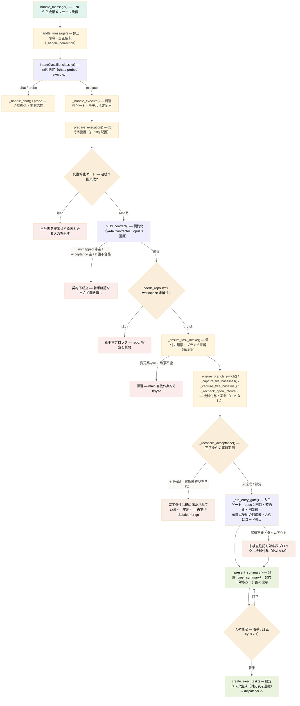

# 詳細設計: 会話ゲートウェイ（人の依頼 → 実行契約）

> **位置づけ**: [設計書本体](../design-development-system.md) の詳細。本書が扱う節: §8.3・§8.10b・§8.10e・§8.10f・§8.10g・§8.10h。
> 障害を契機とする設計改訂の経緯は [revisions/](../revisions/) を参照。

人が Slack で話した内容を、実行系が誤解なく受け取れる契約へ変換するまでの経路。会話と実行の分離、着手確認、意図のドリフト検出、受け渡し契約、決定的実行を扱う。

---

<a id="sec-8-3"></a>
## 8.3 ① u-zu → sa-ru（会話投入 → 確定要約 → タスク投入）

会話フロントエンド化に伴い、本経路は 2 フェーズに分かれる。Slack の 1 通を即タスク化せず、**(A) 会話**で意図を引き出し、**(B) 人間の着手確認**を得てから確定タスクを生成する。タスク生成の責任は「u-zu の生文」から「sa-ru の確定要約」へ移る（`command` の中身が生文 → 構造化意図に変わる）。

### (A) 会話投入（u-zu → sa-ru 会話キュー）

| 項目 | 仕様 |
| 方式 | ファイルベース会話キュー |
| ディレクトリ | `/opt/taka-ma/data/conversations/` |
| ファイル名 | `{timestamp}_{message_id}.json` |
| 監視方法 | sa-ru がポーリング（2秒間隔） |

**入力方式:**

| 入力方式 | @メンション | 説明 |
|---------|-----------|------|
| `@taka-ma ...` | 必要 | チャンネルでのメンション。会話キューへ |
| **Bot に DM** | **不要** | Bot との DM。会話キューへ |
| `/taka-ma-task "..."` | 不要 | スラッシュコマンド。会話キューへ 1 ターン投入（即実行はしない） |
| `/taka-ma-go "..."` | 不要 | **定型命令の明示エスケープ**。`force_ready=true` で投入し、LLM 判定を待たず直近会話を要約して着手確認へ進む。**Slack の slash command は thread_ts を運ばないため、対象はチャンネル面の会話のみ**（スレッド会話には下の go 記法を使う） |
| `@taka-ma go`（スレッド内） | 必要 | **スレッド会話の明示エスケープ**。メンション本文が空白除去後に逐語で `go` または `/taka-ma-go` のとき、u-zu が当該スレッド会話へ `force_ready=true` で投入する（決定的な逐語一致＝記法。語列挙の言語理解ではない。[是正 2026-08-30](../revisions/2026-08-30.md)） |

`source` で区別する（`slack_mention` / `slack_dm` / `slack_command` / `slack_go` / `slack_thread_reply` / `slack_thread_passive`）。`conversation_id` = (team_id, channel_id, thread_ts または user_id) で会話セッションを分離する（DM は人単位、スレッドはスレッド単位）。

> **アプリ ID（B-ID）メンションの受理**: メンションはボットの**ユーザー ID**（`<@U…>`。`app_mention` イベントが発火する）だけでなく、**アプリ ID**（`<@B…>`）の形で本文に載ることがある。B-ID メンションでは `app_mention` が発火せず `message` イベントしか届かないため、u-zu は `message` ハンドラで自アプリの B-ID（Bolt 認可コンテキストの `bot_id`）への言及を検知したら、通常メンションと同一の能動経路（再送の冪等化 → 認可 → 受付リアクション → `slack_mention` として会話キューへ投入。スレッド外なら自身の ts をスレッド起点にする規則も同一）で受理する。送信者がボット（`bot_id` 付き投稿）の場合は対象外（bot どうしの応答ループを作らない）。（[是正 2026-08-25](../revisions/2026-08-25.md)）

> **再送の冪等化**: Slack のイベント配信は at-least-once で、u-zu の応答が遅いと同一発話が `event_id` 付きで再送される。会話キューへの投入は `event_id` で重複排除し、同じイベントを二重に会話へ入れない（同一発話が 2 ターン分の会話として処理される事故を防ぐ）。スラッシュコマンド／ボタンは Slack が 3 秒以内の `ack` で再送を止めるため対象外。

**上り発話の正規化（原文保全）:**

搬送路（Slack）が発話本文へ混ぜ込む情報を、会話キューへ入れる**前に**落とす。sa-ru から先は「人間が言ったことだけ」が流れる状態を不変条件とし、搬送路の都合を中核へ持ち込まない（chat 抽象化と同方向の分離）。

現に落とす必要があるのは、**アプリ経由で投稿された発話の末尾に Slack が付けるアプリ帰属表記**である。ユーザー本人の認可でアプリが投稿すると、Slack は本文そのものへ `*<文言>* <アプリ名>` を追記する（複数行でも改行を挟まず最終行へ連結される。[是正 2026-07-29](../revisions/2026-07-29.md)）。これが残ると、意図解釈に常時ノイズが乗るだけでなく、**訂正の簡易記法（§10.2.1）が必ず不一致になる**（行全体をアンカーする決定的パースのため）。

| 項目 | 仕様 |
|------|------|
| 適用箇所 | u-zu の受信入口（メンション・DM の両経路）。ログ・認可・受付リアクション・キュー投入の**すべてより前**に効かせる |
| 対象の判定 | Slack イベントの `app_id` の**完全一致**。人手で打った発話に `app_id` は付かないため、本文に依存せず対象を切り分けられる（誤除去の構造的な排除） |
| 除去する文字列 | 登録済みアプリごとに列挙した**末尾完全一致**の文字列。表示言語やアプリ名で文言が変わるため、構造推定（正規表現）では過剰除去の危険があり採らない |
| 設定 | `u-zu.yaml` に `app_id` と対応する suffix 群を**1 ブロック**で保持する（suffix にアプリ名が埋まっており両者は 1 対 1。分離すると片方だけ更新する事故と、別アプリの suffix 誤適用を招く）。コード側に既定値を置かない |
| 未登録アプリ | 加工しない（他社アプリの投稿へ干渉しない） |

> **ドリフト検知**: 正常時はログを増やさない（既存の受信ログに除去後の本文が載るため、追加の 1 行は毎発話ぶんの純粋なノイズになる）。**対象 `app_id` の投稿なのに既知の suffix に一致しない**ときだけ WARNING を出す。これは Slack の文言変更・アプリ改名でしか起きず、放置すると原文汚染が静かに復活するため、その状態だけを鳴らす。

**会話メッセージ形式:**

```json
{
  "message_id": "uuid",
  "conversation_id": "T12345:C12345:1234567890.123456",
  "status": "init",
  "source": "slack_dm",
  "text": "ログイン周りを直したい",
  "force_ready": false,
  "user_id": "U12345",
  "team_id": "T12345",
  "channel_id": "C12345",
  "thread_ts": "1234567890.123456",
  "created_at": "2026-06-11T10:00:00+00:00"
}
```

sa-ru は脳モデル（`sa-ru.model`）で各発話を処理し、`ready=false` なら会話返信（Slack 直送）、`ready=true` なら構造化要約 + **計画プレビュー**（§10.2.1）+ 着手確認ボタンを提示する。`force_ready=true`（`/taka-ma-go`）は判定を待たず要約に進む。

> **確認系質問への実測応答（probe）**: リポジトリ・ブランチ・ファイル名等、**実状態の確認**を求める発話には、宣言（「実行して結果を報告します」）を返さない。脳 LLM は出力 JSON に `probe: "repo_status"` を立てて返し（`ready=false`）、sa-ru が当該会話の直近タスクの workspace（§8.13）に対して読み取り専用コマンド（`git remote -v` / `git rev-parse --abbrev-ref HEAD` / `ls -la`）を SSH 実行し、その実出力（rc 併記）を **1 メッセージ**で返信する。実行不能（workspace 不明・SSH 不達等）の場合も、その事実とエラーを同じ 1 メッセージで返す。返信本文は脳 LLM の生成テキストではなくコマンド実出力から組み立てる（§8.9「完了報告の実出力グラウンディング」と同じ規律）。直近タスクの workspace は確定タスク生成・完了還流の時点で会話セッションに記録し、セッション永続化と同様に再起動をまたいで保持する。probe の種別は `repo_status`（本項）と `task_status`（進行状況の実測応答・下記「進行状況発言のグラウンディング」）の 2 値で、コード側の許可リスト以外の値は無効（LLM 出力を任意動作へ接続しない）。

> **進行状況発言のグラウンディング**: 進行状況・作業状態を問う発話に、宣言（「作業中です」「完了次第お伝えします」）を返さない。役割分担は probe と同じ — **言語理解は LLM・事実判定は機械**（意味分類を語列挙の正規表現で行うことは禁止。[是正 2026-08-25](../revisions/2026-08-25.md)）。
> - **一次経路（probe: "task_status"）**: 進行状況を問う発話かどうかの理解は脳 LLM が担い、出力 JSON に `probe: "task_status"` を立てて返す（`ready=false`・reply は使われない）。sa-ru は当該会話の実行系タスク（タスクキュー上の `conversation_id` 一致かつ status が `init` / `accepted` / `in_progress` / `pending_approval` のレコード）と着手待ちの計画（pending の確認レコード）を実在照合し、返信本文を**実レコードだけ**から機械生成する。実行系タスクが 1 件も無ければ「タスクは走っていません」を実測（件数）で返す。着手待ちの計画は**実数の件数**で併記し、最新の計画を**着手ボタン付きでその場に再提示**する（§8.10b「ボタンを探させない」の再利用。[是正 2026-08-26](../revisions/2026-08-26.md)）
> - **安全網（返信主張の選別）**: probe が立たない通常の会話返信（`ready=false`・エラー由来を除く）は、「この返信は進行中・実行中の作業があると主張しているか」を専用プロンプト（`prompts/progress_claim.md`）への**第 2 の構造化 1 問**（`{claims_progress: bool}`）で選別する。主張ありの返信は一次経路と同じ実在照合に掛け、実行系タスクが無ければ脳の返信は使わず実測文言へ差し替え、あれば実測（task_id・status）を併記する。選別の失敗（パース不能・LLM 不達）は素通しへ縮退し warning で発生率を観測する（返信全置換の誤爆より安全側）
> - 判定の根拠は常にレコード実在のみ（LLM の言葉では判定しない・§8.9 と同じ規律）。（[是正 2026-08-25](../revisions/2026-08-25.md)）

> **会話出口の内部 JSON フィルタ**: 脳 LLM の応答契約 `{reply, ready, summary}` はパース不能な壊れ形（切断・多重 JSON・裸キー等）で返ることがある。パース失敗時のフォールバックは素の stdout を会話返信に回す（解釈できない出力で勝手に実行へ進めない安全側）が、引用符付き契約キー（`"reply"` / `"ready"` / `"summary"` ＋コロン。Python dict 風のシングルクォートも含む）の断片を含む出力は内部構造の漏出になるため人へ見せず、定型の言い直し文言へ縮退する（`_CONTRACT_KEY_RE` で検出）。縮退時も会話継続（`ready=false`）を維持してタスクは止めず、縮退文言・壊れ出力とも履歴へは残さない（エラー文言のオウム返し防止と同じ扱い）。（[是正 2026-08-10](../revisions/2026-08-10.md)）

> **ready 判定の方針（明確な単発依頼の即時発火）**: ready 判定の基準は converse.md「毎ターン行う判定」が正本。**対象**（ファイル・リポジトリ・成果物）と**動作**（要約・作成・修正・調査等）が発話から特定できる明確な依頼は、完了条件が明示されていなくても 1 発話で `ready=true` とし、確認質問を挟まず計画プレビュー＋着手確認へ進む（#taka-ma/144。[是正 2026-08-16](../revisions/2026-08-16.md)）。あわせて**宣言と判定の一致**を課す: 着手を宣言する reply（「〜しますね」等）を書けるのは `ready=true` のときだけ（[是正 2026-08-10](../revisions/2026-08-10.md)）。雑談・知識質問・相談・対象や動作が特定できない依頼は従来どおり `ready=false`（過剰発火の抑制は同判定の退行テストで担保）。

> **細部質問の再検査（ready 判定取りこぼしの検品）**: 対象と動作が特定できる依頼に、実装の細部（書く内容・文言・書式・ブランチ名・コミットメッセージ等）を聞き返して `ready=false` に落ちる取りこぼしが、上記方針の明文化後も残った（分離実測 13 シナリオ×5 回で取りこぼし 37%、プロンプト規則の強化後も 11% 残存。#taka-ma/151。[是正 2026-08-24](../revisions/2026-08-24.md)）。是正は 2 層: (1) converse.md へ追記型の細部規則と実害型の判定例を明文化（一次対策）、(2) 会話継続の返信を送信前に検品する **ready 再検査**（コード側の安全網）。役割分担は進行状況グラウンディングと同じ — **言語理解は LLM・機械は配管のみ**（質問形の判定さえ「?」等の記号や語列挙で行わない。「〜ください。」で終わる聞き返しを実測）。脳応答が `ready=false`・probe なし・エラーなしのとき、選別プロンプト（`ready_recheck.md`）への 1 問で返信を三択に選別する: 細部への質問（detail。着手・実行の**許可を伺う質問**も含む — 対象と動作が特定できているなら許可確認は着手ボタンの役目であり、`ready=false` のまま口頭で伺うのは宣言と判定の不一致）／対象・動作そのものを確かめる質問（essential）／質問でない返信（other）。detail のときだけ、細部質問の禁止を明示した再判定指示を付けて脳を 1 回だけ呼び直し、`ready=true`＋summary が返ったときのみ差し替える（依然 `ready=false` なら元の返信を使う — 二重生成のブレを持ち込まない）。essential・other・選別不能（パース不能・LLM 不達）は素通し（従来動作へ縮退し、warning で発生率を観測）。迷う場合の選別は essential 側（正当な質問を止めない）に倒す。

> **契約逸脱（`ready` キー欠落・型不正）の明示処理**: JSON としてはパースできても、契約キー `ready` 自体が欠落した応答や、boolean 以外の値（`"true"` 等の文字列・数値・null）を持つ応答が返ることがある（[是正 2026-08-16](../revisions/2026-08-16.md)）。この逸脱は暗黙のフォールバック（欠落 → None → falsy）に任せず、明示コード（`_coerce_ready`）で処理する: いずれの逸脱も**安全側の会話継続（`ready=false`）へ縮退**し（解釈できない応答で実行確認へ進めない。文字列 `"false"` を truthy と誤解釈して実行へ進む事故も同時に塞ぐ）、warning ログへ記録して**発生率を観測可能にする**（プロンプト側の契約記述強化の効果測定に使う）。逸脱応答でも `reply` は通常どおり会話返信へ回し、会話は止めない。ready 判定の基準そのものはプロンプト（converse.md）の責務であり、この処理は値の型・存在の検証のみを行う。

> **到達性の機械付与**: 各ターンの冒頭で sa-ru が実行機（MBP）への到達性を `AuthPreflight.check_ssh()`（§8.4 到達性ゲートと同じ TTL キャッシュ）で実測する。不達のあいだは、会話返信と契約不成立の返信の**先頭に固定行「⛔ MBP 到達不能（最終疎通 MM/DD HH:MM）」を機械付与**し、`ready=true` の依頼は契約化を呼ばずに「実行機（MBP）到達不能のため契約化・実行不可。復旧後に再送してください」で止まる。固定行は会話履歴（脳 LLM の文脈）には残さない（システム表示であり会話ではない）。到達性を脳 LLM に推測・創作させない（[是正 2026-09-04](../revisions/2026-09-04_mbp-unreachable-outage.md)）。最終疎通は sa-ru 起動後に ssh 検査が合格した最新時刻（起動後に合格が無ければ「起動後の疎通なし」）。probe（§8.3 確認系質問）の返信は SSH 実行の実失敗をそのまま載せるため対象外

> **計画確認中の発話の扱い（訂正経路）**: 当該 `conversation_id` に `pending` の確認レコード（§8.10b）が在るあいだ、後続の発話は会話ではなく**提示済みプランへの訂正**として先に解釈する（§10.2.1「訂正の入力経路」）。訂正として解釈できた発話は会話履歴を進めず、プランを更新して再提示する。訂正と解釈できない発話は通常の会話処理へ落とす（人間がプランを捨てて話を続けられる経路を塞がない）。

**会話セッション履歴の永続化:**

会話セッション（conversation_id → ターン列）は in-memory 保持のみとせず、ターン追記のたびに `/opt/taka-ma/data/conversations/sessions/` 配下へ conversation_id 単位の JSON として原子書込で永続化する。sa-ru 再起動・時間経過で会話の記憶を失わない。

- TTL（`session_ttl_sec`）の役割は「セッション破棄」から「**メモリからのアンロード**」に変える。アンロードされてもファイルは残り、次の発話時に遅延ロードして文脈を回復する
- 永続化ファイル側のターン列は丸めず**全履歴を保持**する（スレッド冒頭の依頼前提を時間経過で失わない）。脳 LLM のプロンプトへ投入する分だけを「冒頭 + 直近」の二窓ビュー（head+tail）に丸める（(C)「履歴の恒久保持と脳 LLM ビュー」）

### (B) 確定要約 → タスク投入（着手確認後に sa-ru が生成）

計画確認ゲート（後述 §8.10b）で人間が「着手」を押すと、sa-ru が確定タスクを生成する。確定タスクには**承認された時点のサブタスク列（凍結プラン）**が載り、dispatcher は再分解せずそのまま実行へ回す（§10.2「凍結プランの実行」）。以降の処理（dispatcher → worker 実行）は従来どおり。

| 項目 | 仕様 |
|------|------|
| 方式 | ファイルベースタスクキュー |
| ディレクトリ | `/opt/taka-ma/data/tasks/` |
| ファイル名 | `{timestamp}_{task_id}.json` |
| 監視方法 | sa-ru がポーリング（5秒間隔） |

**タスクファイル形式:**

```json
{
  "task_id": "uuid",
  "status": "init",
  "source": "conversation",
  "command": "ログインフォームのバリデーションを実装し、テストを追加する",
  "user_id": "U12345",
  "team_id": "T12345",
  "channel_id": "C12345",
  "thread_ts": "1234567890.123456",
  "conversation_id": "T12345:C12345:1234567890.123456",
  "parent_task_id": null,
  "workspace": "/Users/<user>/DevDev/projects/xxx",
  "branch": "feature/x",
  "target_paths": ["docs/01.md"],
  "directive": null,
  "constraints": [],
  "acceptance": [
    {"kind": "remote_file", "params": {"branch": "feature/x", "path": "docs/01.md"}}
  ],
  "_plan": [
    {"step": 1, "command": "…", "execution": "agent", "depth": "deep", "confidence": 0.9, "depends_on": []}
  ],
  "created_at": "2026-06-11T10:00:00+00:00",
  "updated_at": "2026-06-11T10:00:00+00:00"
}
```

`workspace` / `branch` / `target_paths` / `directive` / `constraints` / `acceptance` は会話⇄実行の受け渡し契約（§8.10f）。着手確認で人が承認した値が凍結されて載り、実行・検証はこのフィールドだけを読む（要約の散文から推測しない）。`command` の確定要約は表示・記録用であり、実行の権威ではない（§8.10f 着手確認での提示）。

`_plan` は計画確認で承認された**凍結プラン**（訂正の上書き反映済み）。会話由来のタスクにのみ載り、file_audit の Reject 由来など会話を経ないタスクには無い（その場合 dispatcher が従来どおり ya-ta 分解する）。

`source` は会話由来の `conversation`。file_audit の **Reject** ボタン経由のタスク（`slack_action`）は会話を経ず従来どおり直接 §8.3 (B) のタスクとして投入される（A1 §3「すべての操作・作業は同じ経路（§8.3）を通る」、§8.12）。**Approve は判断が人により確定済みの定型処理（監査済みマーク記録）であり LLM 実行を伴わないため §8.3 のタスクを作らない**（§8.12「押下後経路」）。`command` は生文ではなく sa-ru が固めた構造化要約。`conversation_id` / `parent_task_id` は会話→タスクの継続紐づけ（(C)）。会話を経ないタスクには無い。

**ステータス遷移:**

```
init（作成直後） → accepted → in_progress → completed | failed
```

- sa-ru が着手確認後に `status: "init"` で作成（会話由来）／ u-zu が `slack_action` で作成（file_audit の **Reject** 由来。Approve は定型処理でタスク化しない）
- sa-ru（dispatcher）が取得時に `accepted` に更新
- タスク実行開始で `in_progress`、完了で `completed`、異常で `failed`

**エラーハンドリング:**

- JSON パースエラー → `failed` に更新、Slack にエラー通知
- sa-ru 停止中 → ファイルはディスクに残存、再起動後に処理再開（会話セッション履歴もディスク永続化されており再起動・長時間放置で失われない。確定タスク・確認レコードも従来どおりディスクに残り実行は取りこぼさない）
- 会話 LLM 呼び出し失敗 → 原因種別（生成タイムアウト / 接続失敗（ollama 未起動・モデル未 pull） / 出力パース不能）を区別して扱う。タイムアウト・接続失敗は 1 回リトライし、それでも失敗すれば**原因を明示した文言**（何が・何秒で・なぜ失敗したか）で返信する。「（内部エラーが発生しました）」のような原因不明の包括表現は使わない
- 壊れた/読めない会話・タスクファイル → 当該ファイルのみ `failed/` へ隔離して走査対象から除外（ループ全体は止めない）

**書込の原子性（torn-read / クラッシュ torn ファイルの防止）:**

タスク・会話・確認レコードのファイル書込は、u-zu（生成側）・sa-ru（状態遷移側）とも、一時ファイルへ全量書込してから `os.replace` で本ファイルへ差し替える**原子書込**に統一する（承認レコード store と同一規律）。書込先を直接 truncate して書く方式は、書込の途中で別プロセスや次のポーリングが中途半端な JSON を読む torn-read を生み、また書込中にクラッシュすると壊れたファイルが本パスに残り、次回起動の再開処理を誤らせる。原子書込ではリーダーは常に「旧版全体」か「新版全体」のいずれかだけを見る。

**予約の再起動回収（reserve-then-crash からの回復）:**

dispatcher は未処理タスク（`init`）を `accepted` に予約してから `in_progress` で実行する（二重取得の防止）。予約済み（`accepted` / `in_progress`）のまま sa-ru がクラッシュすると、取得は `init` のみを拾うため、当該タスクは恒久的に滞留し「再起動後に処理再開」が成立しない。これを防ぐため、**起動時に予約済みタスクを走査し `init` へ戻す**回収スキャンを行う。回収は at-least-once（`in_progress` 途中でクラッシュしたタスクの再実行は副作用が重複しうるが、恒久ロストより回復を優先する。孤児化したワーカー側プロセスの是正は worker I/O 堅牢化で別途扱う）。

### (C) 会話とタスクの継続紐づけ（配管層）

依頼（会話）とタスクの対応を、時間経過・sa-ru 再起動・スレッドの長期化をまたいで保ち続けるための配管層。§8.10e（intent 連続捕捉 = 意味層）が「どの発話列がどのタスクへ繋がるか」を前提にできるのは本節の責務による（§8.10e「責務分界」）。（[是正 2026-08-10](../revisions/2026-08-10.md)）

**一次キー:** 会話セッションの一次キーは (A) の `conversation_id`（= team_id : channel_id : thread_ts。スレッド外の DM・スラッシュコマンドは末尾が user_id）。Slack スレッドが会話の単位であり thread_ts は日を跨いでも変わらないため、スレッドの寿命 = セッションの寿命になる（TTL はメモリアンロードのみ・(A) 永続化）。

**確定タスクへの紐づけの永続化:**

確定タスク（(B)）に以下 2 キーを持たせ、会話→タスクの対応をタスクファイル自身へ永続化する:

| キー | 内容 |
|------|------|
| `conversation_id` | 発生元会話セッションのキー（着手確認レコードから引き継ぐ） |
| `parent_task_id` | 同一会話から直前に生成された確定タスクの task_id（無ければ null）。同一スレッドの依頼列を親子チェーンとして辿れる |

- セッション永続化ファイルに `last_task_id`（同一会話の直近確定タスク）を記録し、次の確定タスク生成時に `parent_task_id` として継承する（sa-ru 再起動をまたいで保持）
- 完了結果の還流（§8.9）は task の `conversation_id` を還流先として直接使う。従来の team/channel/thread からの再導出は、キーを持たない旧タスクへのフォールバックとして残す（導出規則の二重管理の解消）
- §8.10e の intent レコード（task_id・conversation_id）はこの紐づけをそのまま用いる

**履歴の恒久保持と脳 LLM ビュー（head+tail）:**

セッション永続化ファイルのターン列は丸めない（全履歴保持・(A)）。脳 LLM のプロンプトへ投入する履歴だけを「冒頭 `history_head_turns` ターン + 直近 `history_tail_turns` ターン」の二窓に丸め、間は「（中略 n ターン）」と明示する。両値は sa-ru.yaml `conversation` 節が唯一の供給元（コード既定値なし。従来のコード定数 `MAX_HISTORY_TURNS` は廃止）。

- 冒頭窓が常に含まれるため、依頼の前提（プロジェクト概要・目的等、スレッド冒頭で提示される情報）は履歴がどれだけ伸びても**回答・確定要約（= 分解の入力）の双方**へ届く（F3 再発防止）
- 全量投入を採らない理由: 脳モデルの `num_ctx`（32K 焼込・§2.1）を超えた分は**古い側から**暗黙に切り捨てられるため、長大スレッドで冒頭プロンプトが静かに消える = F3 と同型の失敗が再発する。二窓は上限サイズが決定的で、冒頭の残存を構造的に保証する
- 中間ターンはビューから落ちるが、確定要約・タスク完了結果は還流ターン（§8.9）として直近側へ再登場し、ファイル側には全量が残る（下記グルーピング検討の材料になる）

**非メンション発話の記録（チャンネルスレッド・passive）:**

チャンネルではメンション付き発話のみが会話ターンとして処理されるが、既存セッションのスレッド内での**非メンション返信**（人どうしの補足・訂正）も文脈の一部である。u-zu はこれを `passive: true`・`source: slack_thread_passive` の会話メッセージとして投入し、sa-ru は**セッションが既に存在する場合に限り** user ターンとして履歴へ追記のみ行う（脳 LLM 呼び出し・返信・受付リアクションはしない。セッションが無ければ破棄 = 無関係スレッドの発話は収集しない）。

- 認可（§1.2）は通常発話と同一の台帳で判定するが、未認可ユーザーの passive 発話は拒否メッセージを返さず黙って捨てる（bot が呼ばれていない場で自発発言しない）
- bot 自身の投稿・メンション付き発話（app_mention 側で能動処理される）は対象外。DM は全発話が能動ターンとして届くため対象外
- 前提: Slack アプリが当該チャンネルの message イベントを購読していること（購読が無い環境では本記録が働かないだけで、他機能へ影響しない）

**返答待ちスレッドの能動昇格（awaiting_reply）:**

taka-ma 自身がユーザーへ質問・確認を出して返答を待っているスレッドでは、メンション無しのユーザー返信も **能動ターン**として受理する（質問への返答にメンションを強いると、返信が passive 記録へ落ちて黙殺される。[是正 2026-08-25](../revisions/2026-08-25.md)）。

- sa-ru はセッション永続化ファイルへ `awaiting_reply`（boolean）を保持し、会話面への送信のたびに更新する。**true にする送信**: 会話継続の返信（`ready=false`。エラー由来の定型返信を含む — 言い直しを求めている）・probe の実測応答・workspace / モデル指定の差し戻し・契約不成立や反復停止など不足入力の質問・計画の提示と訂正の再提示・「やり直す」受理。**false にする遷移**: 着手（確定タスク生成）・タスク完了結果の会話還流・中止命令の決着
- u-zu は非メンションのスレッド返信で当該 `conversation_id` のセッション永続化ファイル（(A) `sessions_dir`。パスと `conversation_id` → ファイル名の変換規則は sa-ru 側と一致させる）を参照し、`awaiting_reply=true` なら `source: slack_thread_reply` の能動ターンとして投入する（再送の冪等化・受付リアクションは通常メンションと同一。未認可ユーザーは passive と同じく黙って捨てる）。false・ファイル不在・読取不能は従来どおり passive（安全側 = bot が呼ばれていない発話へ自発応答しない）

**同一スレッド内の複数依頼（話題）の扱い（検討結果）:**

同一スレッドに複数依頼（AAA/BBB）が混在した場合の話題別グルーピングは、**「1 スレッド = 1 セッション」を維持し、配管層では親子チェーン（`parent_task_id`）と全履歴保持までを担う**方式を採る。発話がどの依頼（タスク）への続きかの切り分けは意味層（§8.10e ドリフト検出が task_id 単位で判定する構造）に置く。セッションを話題単位に分割する方式（topic_id サブセッション）は、話題分類の誤りがそのまま会話文脈の分断（= F3 と同型の文脈喪失）として現れるリスクに対し、混在頻度の実測が無い現段階では採らない。混在の実害が観測された時点で、ready 判定時に脳 LLM へ「当該依頼に関係する発話範囲」を選ばせる文脈スライス方式を再検討する。

<a id="sec-8-10b"></a>
## 8.10b 計画確認ゲート（会話 → 実行の移譲トリガー）

会話で意図が固まった後、**実行に移すかどうかの人間確認**を取る。§8.10（PTY の y/n 承認）と同じファイル + Slack ボタン方式だが、用途は「会話 → 実行トリガー」であり別物。

確認の対象は**意図の要約ではなく実行計画**である。要約を固めた時点で先に ya-ta 分解まで済ませ、分解結果（誰がどのモデルで・どの順で動くか）を提示して承認を取る（§10.2.1 計画プレビュー契約）。ゲートは 1 つで、承認前に人間が訂正を入れられる。承認されたプランは凍結され、dispatcher は再分解しない（提示した計画と実際に走る計画が一致することを不変条件とする）。

| 項目 | 仕様 |
|------|------|
| 方式 | ファイルベース |
| ディレクトリ | `/opt/taka-ma/data/exec-confirmations/` |
| ファイル名 | `{exec_request_id}.json` |
| 監視方法 | sa-ru がポーリング（2秒間隔） |

**確認レコード形式:**

```json
{
  "exec_request_id": "uuid",
  "conversation_id": "T12345:C12345:1234567890.123456",
  "summary": "ログインフォームのバリデーションを実装し、テストを追加する",
  "status": "pending",
  "workspace": "/Users/<user>/DevDev/projects/xxx",
  "branch": "feature/x",
  "target_paths": ["docs/01.md"],
  "directive": null,
  "constraints": [],
  "acceptance": [
    {"kind": "remote_file", "params": {"branch": "feature/x", "path": "docs/01.md"}}
  ],
  "plan": [
    {"step": 1, "command": "…", "execution": "agent", "depth": "deep", "confidence": 0.9, "depends_on": []}
  ],
  "user_id": "U12345",
  "team_id": "T12345",
  "channel_id": "C12345",
  "thread_ts": "1234567890.123456",
  "created_at": "2026-06-11T10:00:00+00:00",
  "decided_at": null,
  "decided_by": null
}
```

`plan` は提示中のサブタスク列（ya-ta 分解結果 + 訂正の上書き）。訂正のたびに sa-ru が同一レコードを原子書込で更新するため、承認時に読まれるのは常に**最後に提示したプラン**である。

**フロー:**

```
1. sa-ru: 意図が固まると要約を作り、契約化パス（§8.10f・worker CLI opus）で directive / constraints /
   acceptance / branch / target_paths / needs_repo を得て、ya-ta 分解でプランを得て、確認レコードを
   status=pending で作成（同一会話面の既存 pending はこの時点で superseded に失効・下記「タイムアウトと失効」）
2. sa-ru: Slack に「要約 + 契約（workspace・branch・directive・constraints・acceptance・target_paths を
   常に明示・本文は契約フィールドからコード組立 §8.10f）+ 計画プレビュー + 着手 / やり直す」ボタンを送信
   ※ needs_repo=true かつ workspace 未解決なら着手ボタンを出さず、必要な入力を質問（§8.10f fail-closed）
   ※ 同一会話で連続 2 回失敗していたら（原因コードの異同を問わない）着手確認を出さず、原因の列と必要な入力を平文報告（§8.10f）
3a. ユーザー: 訂正を発話（「2 opus」「3 は重い作業だから深くして」等）
    → sa-ru: プランへ構造化パッチを適用し、レコードを更新して**着手ボタン付きで再提示**（§10.2.1）
    → status は pending のまま。訂正は何度でも入れられる
3b. ユーザー: Slack で 着手 / やり直す をクリック
4. u-zu: ボタンイベント受信 → 確認レコードの status を confirmed / rejected に更新
5. sa-ru: ポーリングで status 変更を検知
   - confirmed → 確定タスク（status=init, source=conversation, command=要約, _plan=凍結プラン）を生成 → 既存 dispatcher へ
                 （同時に intent レコードを作成 §8.10e。初期要件 = 承認された確定要約）
   - rejected  → 実行せず会話継続を促す
```

> **再提示にもボタンを添える**: 訂正のたびに「着手 / やり直す」ボタンを付け直す。訂正を重ねると最初の提示メッセージが上へ流れ、押すべきボタンを探させることになるため。`exec_request_id` は変えないので、どのメッセージのボタンを押しても同じ確認レコードを指し、決着は排他制御により 1 回だけ通る（後続は「処理済み」）。実行に使われるのは常にレコード内の最新プランである。
>
> **返信先の追従**: 訂正を受けたら、確認レコードの送信先（`team_id` / `channel_id` / `thread_ts`）を**その訂正が届いた場所**へ更新する。訂正は提示スレッド外からも受けるため（下記「訂正の受け口」）、元の場所に固定したままだと、着手後の実行通知・完了報告だけが人の居ないスレッドへ流れる。確定タスクはこの更新後の送信先を引き継ぐ。
>
> **訂正の受け口**: 訂正は「提示スレッド内の返信」でも「同じ相手との同じ会話面（DM／チャンネル）への新規投稿」でも受ける。u-zu は DM・メンションの `thread_ts` に「スレッド起点、無ければその投稿自身の ts」を入れるため、**新規投稿は毎回別の `conversation_id`** になる（§8.3 の「DM は人単位」という記述と実装のズレ。実機で確認）。`conversation_id` 一致だけを見ると、プレビューに対してスレッド外で送られた訂正が無言で新しい会話に化ける。そこで照合は (1) `conversation_id` 一致（スレッド内）を優先し、(2) 無ければ同一 (`team_id`, `channel_id`, `user_id`) の pending 最新へ落とす。新しい依頼を訂正と誤読する危険は小さい: 簡易記法は決定的で、自然言語は訂正でなければ空パッチが返り通常会話へ落ちる（§10.2.1）。
>
> **訂正と決着の競合**: 訂正の適用は「レコードを読み直し `status` が `pending` であること」を確認してから書く。承認ボタンが先に押されていれば訂正は適用せず「既に着手済み」と返す（承認されたプランと実行されるプランの食い違いを作らない）。

**タイムアウトと失効（stale 計画の自動失効）:**

- 時間による自動 `timeout` は置かない。`pending` は人間がボタンで決着させるか、下記の失効条件に当たるまで有効（§8.10 の承認タイムアウトは worker プロセスが同期で待つため期限が必須だが、着手確認は待つプロセスが無い）。
- **新しい発話による失効**: 同一会話面（`team_id`, `channel_id`）で新しい発話の契約化が成立した（新しい着手確認を提示した）時点で、既存の `pending` レコードを `status=superseded` へ失効させる。ユーザーの関心は最新の発話にあり、過去の計画が並存したまま自動再提示されると**別話題の計画が承認面に載る**（[是正 2026-08-29](../revisions/2026-08-29.md)）。旧記述「放置レコードは並存するが実害はない」は本実測により撤回する。
- **再提示の限定**: pending 計画の再提示が許されるのは (1) 同一発話への訂正経路（§10.2.1・着手ボタン付き再提示）、(2) 状態質問への応答で**現在有効な最新 1 件**を示す場合、のみ。実測差し替え時の自動再提示（状態主張ゲートの付随動作）は廃止する。superseded になった計画の復活はユーザーの明示発話（同内容の再依頼 → 新規契約化）による。

<a id="sec-8-10e"></a>
## 8.10e intent 連続捕捉（依頼意図のドリフト検出 → 人の承認 → append）

依頼意図は着手確認（§8.10b）の時点で確定要約と凍結プランに固定される。しかし依頼の実体は Slack スレッド上の会話として続き、着手後にも変わる（追加要望・前提の訂正・範囲の縮小）。現行はこの変化を記録する場所がなく、完了報告（§8.9）や成果のレビューが「最初の要約」を基準にしたまま、実際の期待と乖離する。本機構は、会話ストリームを一次ソースとして依頼意図の変化（**ドリフト**）を AI が検出し、**人の承認を経てのみ** intent レコードへ追記（append）することで、「いま何を依頼されているか」の記録を会話に追従させる。

| 原則 | 内容 |
|------|------|
| 一次ソースは会話ストリーム | intent の根拠は常に Slack スレッド上の発話。各要件は出所発話の ts を持ち、会話へ遡って検証できる（sa-ru の解釈だけを根拠にしない） |
| 検出は AI・確定は人 | ドリフトの検出・文案化は sa-ru 脳モデルが行うが、レコードへの反映は Slack ボタンでの人の承認後のみ。**AI による無断書換は禁止** |
| append-only | 承認済み要件の削除・上書きはしない。変更・取消も「追記」で表現し、変遷の履歴を残す |
| 実行計画とは独立 | append は凍結プラン（§8.10b）を変更しない。実行中タスクへの反映は中止（§8.10d）→ 再依頼、または完了後の後続タスクで行う。本機構の責務は**意図の記録の正確さ**のみ |

### intent レコード

確定タスク生成（§8.10b の confirmed）と同時に task_id 単位で作成する。初期要件は、人が着手ボタンで承認した**確定要約そのもの 1 件**とする（AI の再解釈・分割を挟まない。人が見て承認したテキストだけが初期記録になる）。

| 項目 | 仕様 |
|------|------|
| 方式 | ファイルベース（原子書込。§8.3 と同一規律） |
| ディレクトリ | `/opt/taka-ma/data/intents/` |
| ファイル名 | `{task_id}.json` |
| 書込者 | sa-ru のみ（u-zu はドリフト承認レコード側だけを書く） |

```json
{
  "task_id": "uuid",
  "conversation_id": "T12345:C12345:1234567890.123456",
  "summary": "ログインフォームのバリデーションを実装し、テストを追加する",
  "requirements": [
    {
      "seq": 1,
      "kind": "initial",
      "text": "ログインフォームのバリデーションを実装し、テストを追加する",
      "target_seq": null,
      "source_ts": "1234567890.123456",
      "appended_at": "2026-06-11T10:00:00+00:00",
      "approved_by": "U12345"
    }
  ],
  "acceptance": [
    {"kind": "remote_file", "params": {"branch": "feature/x", "path": "docs/01.md"}}
  ],
  "goal_status": "open",
  "created_at": "2026-06-11T10:00:00+00:00",
  "updated_at": "2026-06-11T10:00:00+00:00"
}
```

`acceptance` は着手確認で承認された完了条件（§8.10f）、`goal_status` は依頼の寿命（`open` / `achieved` / `withdrawn`）。タスクが終端しても検査が PASS するまで `open` のまま — 「タスクの終端」と「依頼の達成」を分離する。同一会話でタスクが完了するたび、open の intent の acceptance を世界に対して再検査し、PASS したものだけ `achieved` に閉じる（§8.10f「依頼の寿命」）。宣言では閉じられない。人の取り下げは `withdraw` 要件の append で表現する。

**acceptance が空のレコードを `achieved` で作らない**: 完了条件の必須化（§8.10f）により空 acceptance の契約は成立しないため、この経路は本来到達しない。到達した場合は構成不備であり、`open` のまま残して顕在化させる（無検査の達成扱いは「検査が PASS するまで open」の原則そのものに反する。[是正 2026-09-07](../revisions/2026-09-07.md)）。

`kind` は 4 値: `initial`（着手承認済みの確定要約）／ `add`（要件追加）／ `supersede`（既存要件の置換。`target_seq` 必須。置換された旧要件も行として残る）／ `withdraw`(既存要件の取り下げ。`target_seq` 必須)。**有効な要件集合**は「`initial`・`add`・`supersede` のうち、後続要件の `target_seq` に指されていないもの」として機械的に導出でき、LLM を介さない。

### ドリフト検出（AI・応答後の非同期判定）

検出対象は「会話セッションに直近タスクの記録（§8.3 probe と同じく確定タスク生成・完了還流時に記録）が在る会話」への発話。会話応答（converse.md 契約）とは**別の独立判定**として、会話返信の送信後に非同期で実行する。会話出口契約 `{reply, ready, summary}` にキーを足さない理由: (1) 会話レイテンシに検出を足さない、(2) パース失敗・型逸脱の実績がある契約（§8.3 の漏出フィルタ・`_coerce_ready`）の対象面を広げない。プロンプト正本は `drift.md`、モデルは脳モデル（`sa-ru.model`）を再利用する。

- 入力: 現行 intent の有効要件列 ＋ 提案中・却下済みドリフト ＋ 当該発話（直近の会話文脈付き）
- 出力: `{"drift": {"kind": "add"|"supersede"|"withdraw", "text": "...", "target_seq": n|null}, "confidence": 0.0-1.0}` または `{"drift": null}`
- 判定不能（JSON 不正・ollama 障害）は「ドリフトなし」へ縮退する（fail-safe。会話返信は送信済みであり会話は止まらない。検出の取りこぼしは次の発話・完了報告時の突き合わせで人が拾える）

適用範囲の限定: 計画確認 `pending` 中の発話は訂正経路（§8.10b・§10.2.1）が先に消費する（着手前の意図変化は確定要約と凍結プランに反映済みのため対象外）。停止指示は §8.10d が最前段で消費する。ドリフト検出は、それらを通過して**通常会話として処理された発話**だけを見る。

### 承認フロー（§8.10b と同型・別レコード）

| 項目 | 仕様 |
|------|------|
| 方式 | ファイルベース + Slack ボタン |
| ディレクトリ | `/opt/taka-ma/data/intent-drifts/` |
| ファイル名 | `{drift_id}.json` |
| 監視方法 | sa-ru がポーリング（2秒間隔） |

```json
{
  "drift_id": "uuid",
  "task_id": "uuid",
  "conversation_id": "T12345:C12345:1234567890.123456",
  "kind": "add",
  "text": "パスワード再設定フォームも対象に含める",
  "target_seq": null,
  "source_ts": "1234567891.000200",
  "status": "pending",
  "user_id": "U12345",
  "team_id": "T12345",
  "channel_id": "C12345",
  "thread_ts": "1234567890.123456",
  "created_at": "2026-06-11T10:05:00+00:00",
  "decided_at": null,
  "decided_by": null
}
```

**フロー:**

```
1. sa-ru: ドリフト検出 → レコードを status=pending で作成
   → Slack（当該スレッド）へ「意図の変化を検出: <text>（根拠発話の引用付き）＋ 反映 / 見送る ボタン」を送信
2. u-zu: ボタンイベント受信 → status を approved / rejected に更新（§8.10 と同じ排他制御。二重押下は「処理済み」）
3. sa-ru: ポーリングで検知
   - approved → intent レコードへ append（原子書込・seq 採番）→「要件 n として記録」を 1 メッセージで返信
   - rejected → append せずレコードのみ残す
4. 提案中・却下済みドリフトは以後の drift.md 入力に含め、同一ドリフトの再提案を抑制する
```

**タイムアウト:** なし（§8.10b と同じ理由: 同期で待つプロセスが無い）。タスク完了後の承認も有効に扱う — intent は完了報告・レビューと突き合わせるための記録であり、タスクの完了で陳腐化しない。

**下流の用途:** 完了報告（§8.9）の突き合わせ先を「最初の確定要約」から「intent の有効要件列」に置き換えられる。同一会話から生成される後続タスクの要約作成時には、脳モデルへ intent を文脈投入する。

### 責務分界（会話とタスクの継続紐づけ機構との分界）

会話セッションの恒久永続化（TTL の SSOT 化）・確定タスク側への `conversation_id` / `parent_task_id` 永続化・同一スレッド内に複数依頼（話題）が混在した場合のグルーピング・スレッド全履歴の planner 参照は、**会話とタスクの継続紐づけ機構**（§8.3 (C)）の責務である — すなわち**配管層**（どの発話列がどのタスクへ繋がるかを確定し、履歴を読めるようにする）。本機構（intent 連続捕捉）はその上の**意味層**であり、与えられた紐づけの先にある intent レコードの正確さ（検出・承認・append）だけを担う。

- 紐づけは、確定タスクの `conversation_id` / `parent_task_id`（§8.3 (C)）と、会話セッションが持つ「直近タスク」記録（確定タスク生成・完了還流時に記録し、再起動をまたいで保持）を用いる
- 話題が混在するスレッドで「どの発話がどのタスクへのドリフトか」の切り分けは配管層の責務であり、本機構は切り分け済みの範囲でのみ判定する（混在の解決を検出 confidence に負わせない。§8.3 (C)「同一スレッド内の複数依頼の扱い」のとおり、切り分けの単位は task_id・混在時の文脈スライスは実害観測後に再検討）
- 会話↔タスク対応の持ち方・セッション記録の形式は §8.3 (C) に一本化した（統合検討済み。本節はその紐づけを前提とする）

<a id="sec-8-10f"></a>
## 8.10f 会話⇄実行の受け渡し契約（命令原文・拘束条件・完了条件）

会話層から実行層へ渡る情報は従来 3 つだけだった — 確定要約（`command`）・`workspace`・モデル指定（`_model`）。命令の原文・拘束条件・完了条件は要約の散文にしか存在できず、脳の要約 → ya-ta の分解 → 依存結果の前置 → worker の解釈と**変換されるたびに劣化**した（[是正 2026-08-22](../revisions/2026-08-22.md)）。本節はこの受け渡しを契約として定める。

### 依頼の一生（本節の背骨）

会話依頼は次の 5 工程を必ず通る。各工程は fail-closed の関門を持ち、関門を通れない依頼は**黙って劣化して先へ進まず**、人へ返る。本節・§8.10e・§8.10g の各機構は、この 5 工程のいずれかに仕える部品として位置づける（工程に紐づかない機構を新設しない）。

| 工程 | 内容 | 関門（fail-closed） | 主な在処 |
|------|------|--------------------|---------|
| (1) 受領 | 発話を受け取り、意図を判定する | 判定不能・低確信は chat（確認質問）へ倒す | §8.3 / §8.4「意図判定の呼び出し」 |
| (2) 約束 | 何をするか・何ができたら完了か（acceptance）を契約に固定し、人が着手確認で承認する | `unmapped` 非空・**acceptance 空**・workspace 未解決は着手確認を出さない。入口ゲート（依頼⇄契約突合・下記）の対応表を着手確認に提示し、写像漏れを人が裁く | 本節（契約化・入口ゲート・着手確認） |
| (3) 実行 | 約束した成果物**だけ**を作る | 禁止型拘束は decide の機械 deny。約束にない成果物は工程 (5) の検査で未達 | §8.5 / §8.10g（runbook）/ 本節（配布規則） |
| (4) 届け | 成果物を約束した形で依頼者へ届け、**届いたことを確かめる** | 出口ゲート（独立検証段・下記）FAIL の完了報告は届けに進まず差し戻す。送信失敗を「届いた」と扱わない（下記「届けの検証」） | 本節（完了通知・出口ゲート） |
| (5) 閉じ | acceptance の**全 PASS でのみ** `achieved`。以後の確認質問には記録の実体で答える | 検査 FAIL・未検査は `open` のまま | §8.10e intent レコード / §8.10g 実測回答 |

工程 (5) の補則 — **確認質問への回答は記録の実体**: 依頼者が後から結果を尋ねたとき（probe_task）、終端記録の status 行に加えて**完了報告と同じ内容（worker 回答の本文）**を返す。記録の 1 行目だけの要約回答はしない（[是正 2026-09-08](../revisions/2026-09-08.md)）。

### 会話受付〜着手確認の処理フロー（図）

Slack 投稿が着手確認に至るまでの経路と fail-closed 出口の全体図。着手承認後の実行側は [10-orchestration-flow.md](10-orchestration-flow.md) が担う（本図の終点が接続点）。LLM 呼び出しは 3 種 — ローカル qwen（意図判定・確定要約）、opus 1 回目（契約化）、opus 2 回目（入口ゲート・契約化と別系統）。



**原則:**

| 原則 | 内容 |
|------|------|
| 理解は転送しない | 会話層の「理解」は境界を越えられない。境界を越えるのは機械が劣化させずに運べるもの（原文・パス・検査手順）だけ |
| 権威はフィールド | 散文（要約・計画文・発話の記法抽出）はすべて契約フィールドへの**入力**。実行・検証はフィールドだけを読む |
| 確認は実出力 | 完了・遵守の判定は LLM の言葉ではなく、sa-ru が実行した検証コマンドの rc・実出力から機械導出する（§8.9 の規律の一般化） |
| fail-closed | 契約が埋まらない依頼は実行に進めない。着手前に止まり、足りない入力を人に問う |

### 命令成分の全列挙とスキーマ閉包

契約フィールドは従来、事故が起きるたびに 1 成分ずつ追加されてきた（workspace → directive/constraints/acceptance → runbook → rest_summary → branch）。散文が黙って運んでいた未列挙の成分は全て「次の事故」として残るため、命令が指定しうる成分を**固定表として全列挙**し、契約フィールドへの対応を閉じる:

| 命令成分 | 契約フィールド |
|---------|--------------|
| 場所（リポジトリ） | `workspace` |
| ref（ブランチ） | `branch` |
| 対象文書・成果物 | `target_paths` |
| 逐語操作 | `directive` |
| 定型 git 操作 | `runbook`（§8.10g） |
| 量（行数等） | `diff_limit`（acceptance 内） |
| 拘束条件 | `constraints` |
| 完了条件 | `acceptance` |
| 残作業 | `rest_summary` |
| モデル指定 | `_model`（既存記法） |

**閉包規則（fail-closed）**: 契約化脳は、上表のどのフィールドにも写像できない「実行に影響する指定」を発話に検出したら、`unmapped`（逐語引用の列）へ入れて返す。`validate_contract` は `unmapped` が非空の契約を**不成立**とし、着手確認を出さずに当該指定の扱いを人に確認する。散文に黙って運ばせる成分をゼロにする — 「フィールドで運ぶか、運べないなら止まるか」の二択であり、第三の道（散文で運ぶ）を構造的に廃する。

「実行に影響する指定」は対象・場所・手順に限らない — **成果物（名指しの文書・表・レポート）・完了条件・量・品質の指定を含む全て**である。契約化プロンプト（`contract.md`）はこの定義を狭めてはならない（2026-09-14 実測: プロンプトが「対象・場所・手順の指定」へ狭め、依頼が名指した成果物 2 件が unmapped の申告対象から外れたまま契約が成立した）。ただし**検証・レビュー・検証レポートを求める指定は unmapped の対象外** — 出口ゲート（下記）が全タスクで構造的に担うため写像漏れではなく、堰き止めると検証に触れた依頼すべてで無意味な聞き返しが増える（2026-09-16 実機 E2E で実測・是正）。担当の明示は入口ゲートの対応表が行う（「出口ゲートが担当」行・語彙は `is_verification_text` と同一）。ただし unmapped は契約化脳の**自己申告**であり、脳が指定を黙って落とすと unmapped も空になる — 落とし物の検出の正は入口ゲート（下記）の対応表とし、unmapped は「脳が自覚できた分の早期申告」（補助）に位置づける。

**完了条件の必須化（fail-closed）**: `acceptance` が空の契約は**不成立**とする。着手確認を出さず、「この依頼は何ができたら完了ですか」を人に聞き返す（`unmapped` 非空と同じ扱い）。理由: 完了条件の無い契約は、(1) 何をもって達成かが定義されないため worker が依頼と別の成果物を作っても検出できない、(2) 完了検査が走らないため達成を宣言でしか閉じられない、(3) 後から結果を問われても照合する条件が無い、の 3 つを同時に招く。2026-09-07 実測: 「設計を確認して機能一覧を教えて」の依頼で `acceptance` が空のまま成立し、worker は頼まれていない 36KB の文書をリポジトリへ作成、依頼の寿命は無検査で `achieved` に閉じられ、後の確認質問には結果の 1 行目しか返せなかった。

この規則は「回答が成果物である依頼」（教えて・確認して・調べて）と組で機能する。カタログには回答型の検査 `answered`（下記）を追加するが、**契約化脳が依頼の型を推測して自動付与することはしない** — 依頼の型を機械が推測すれば、その判定の誤りが新しい壊れ方になる（判定を足して直す形は 2026-08〜09 の反復で失敗が実証済み）。`answered` が立つのは**人の明示**からのみ: (a) 発話に完了条件の明示がある（「一覧を教えて」「回答で返せ」等、回答の受領を完了とする言明）、(b) 本規則の聞き返しへの返答に由来する、のいずれか。**完了条件は人が与えるものとし、与えられていなければ止まる。**聞き返しの 1 往復を代償として受け入れる。

聞き返しの文言は「**完了条件を含めて依頼全体を言い直す**」ことを求める（既存の契約不成立文と同型）。完了条件だけの短い補足返答（「一覧が届いたら完了」等の単文）は意図判定（§8.4）で chat に落ち、契約化へ再入しない経路があり得るため、言い直し（依頼全体の再送）を再入の入口として固定する。

### 受け渡しフィールド

経路は `workspace` と同一（着手確認レコード → 確定タスク → dispatcher → worker / 検証）で、**新しい通信路は作らない**。

| フィールド | 内容 | 権威の由来 |
|-----------|------|-----------|
| `directive` | 逐語実行すべき具体的操作命令の**原文**（例: `git push -u origin feature/x`）。無ければ null（目標型の依頼） | ユーザー発話からの逐語引用のみ。言い換え禁止 |
| `constraints` | 拘束条件の列。各要素 `{text: 発話の逐語引用, forbid: bool}`。禁止型（forbid=true）は承認判定へ機械強制として渡す | 同上 |
| `acceptance` | 完了条件の検査列。各要素は検査カタログ（下記）の `{kind, params}`。散文は不可 | 脳の提案 + 人の承認 |
| `branch` | 作業対象の git ref（ブランチ名）。無ければ null（HEAD のまま作業） | 発話のマーカー決定的抽出（`ブランチ:` / `branch:` 直後のトークン。git 安全文字のみ受理・`repo:` と同規律の fail-closed）、または契約化脳の提案（検証つき）。マーカーが在れば脳の提案より優先 |
| `target_paths` | 依頼が名指す成果物・対象文書の相対パス列（最大 5 件） | 発話からの逐語引用のみ。既定 file 検査の付与（下記「既定完了検査の自動付与」）はこのフィールドを第一入力とし、確定要約からの散文パス検出は補助へ降格 |
| `unmapped` | 契約フィールドへ写像できない「実行に影響する指定」の逐語引用列 | 契約化脳の検出。非空なら契約不成立（上記スキーマ閉包） |

**出所束縛（provenance）**: 発話由来フィールド（`directive`・`constraints[].text`・`branch`・`target_paths`・発話指定の `workspace`）には出所発話の `src_ts` を必須で付す。`validate_contract` は (1) 引用が当該 `src_ts` の発話に逐語で実在すること（既存の逐語照合を発話単位へ厳格化）、(2) **契約全体で、ready を発火させた現在ターンの発話を引用するフィールドが 1 つ以上あること**を検査する。(2) を欠く契約は過去の話題への束縛（stale 束縛）とみなし不成立（[是正 2026-08-29](../revisions/2026-08-29.md)）。`acceptance`・`runbook` は脳の提案フィールドのため `src_ts` は任意（契約全体の現在ターン束縛で担保する）。**明示エスケープ（`/taka-ma-go`・スレッド go 記法＝force_ready）由来の契約化は (2) を適用しない** — 現在ターンの発話は逐語 `go` 等の定型語のみでどのフィールドも引用できず、規則 (2) が構造的に必ず不成立になる（[是正 2026-09-03](../revisions/2026-09-03.md)）。go は「直近会話をそのまま採用せよ」の人間の明示であり、(2) の目的（stale 束縛の機械検出）は人の判断で満たされている。(1) の逐語照合（src 単位）は force_ready でも維持する。

### 契約化パス（ready 後の第 2 の構造化呼び出し）

会話出口契約 `{reply, ready, summary, probe}` にはキーを足さない（§8.10e と同じ理由: パース失敗・型逸脱の実績がある契約の対象面を広げない）。`ready=true` の後、sa-ru は契約化を **ya-ta（`Contractor`・§8.4「契約化の呼び出し」・LLM バックエンドは worker CLI の既定 opus）へ委譲**し、会話（二窓ビュー）と確定要約から `{directive, constraints, acceptance, runbook, workspace, branch, target_paths, needs_repo, rest_summary, unmapped}` を得る。契約化＝依頼理解の構造化は分解・分類と同族の ya-ta 業務だが、会話脳（sa-ru MoE）→ ローカル dense と移した旧構成はいずれも実測で不合格が続いた（経緯とバックエンド決定は §8.4）。

- `directive` / `constraints.text` / `branch` / `target_paths` は発話からの**逐語引用・逐語抽出**に限る。原文に無い命令・拘束・対象を生成してはならない（着手確認の提示で `src_ts` の出所発話と照合できる）
- **禁止型拘束の拾い上げの強化**: 「〜するな」「〜は行わない」型の指示（発話・確定要約のいずれ由来でも）は constraints（forbid=true・patterns 付き）へ**必ず**拾う旨を契約化プロンプトに明記する。散文の注意書きは worker の遵守頼みで実測により破られる（2026-08-30: 「テストや検証は行わない」の指示下で worker が検証環境構築・検証成果物 14 件の生成へ逸脱）— forbid+patterns に載れば decide の機械 deny（`_write_task_deny` 既存配線）でツール実行前に止まる
- 出力の検証は sa-ru 側コード（`validate_contract`）。逸脱（非 JSON・未知の検査 kind・引用元が `src_ts` の発話に不在・現在ターン引用の欠落）は同一バックエンドで 1 回リトライし、2 回連続の不合格で**着手確認を出さず**不足を人に確認する（解釈できない出力で実行へ進めない — fail-closed。既定バックエンドが最上位のため昇格ラダーは適用しない・§8.4）。`unmapped` 非空は脳の誤りではなくスキーマ閉包の正常な検出であり、リトライせず直ちに当該指定の扱いを人に確認する
- `rest_summary` は「runbook（§8.10g）に載る定型 git 操作を**除いた**残り作業の要約。runbook が依頼の全てなら null」。**必須キー**（null は可・キー欠落は契約不成立 — 契約化が opus 既定となり安定供給できるため、旧縮退印としてのキー欠落許容を廃止。2026-09-03 改訂）。境界を越える受け渡しフィールドではなく**計画組立（分解入力）専用**で、worker・完了検査へは渡さない（用途は §8.10g「分解の二重実行抑止」）。runbook の有無に依らず着手確認に常に提示する（null なら「残り作業: なし」— 見えていない縮約は承認されない）
- `needs_repo`（実リポジトリを要するか）は脳の判定に機械補助を重ねる: `directive` に git コマンドがある、または `acceptance` にリポジトリ系検査がある場合は強制 true

### 入口ゲート — 依頼⇄契約の独立突合（工程 (2) 約束の関門・着手確認の前）

契約化（Contractor）が成立させた契約は、着手確認を出す**前**に、契約化と別系統のエージェントによる依頼⇄契約の突合段を必ず通る。スキーマ閉包（unmapped）は「写像できない指定を検出したら申告せよ」という契約化脳自身への指示であり、**落とした本人への質問**にすぎない — 脳が成果物を黙って落とすと unmapped も空になり、閉包規則は素通りする（2026-09-14 実測: 依頼の成果物 3 件のうち 2 件（対応状況表・検証レポート）が acceptance にも target_paths にも unmapped にも載らず契約が成立。worker は依頼どおり作成し、出口のツリー閉包が「約束の外の変化」として未達に落とした — 作れば未達・作らなければ依頼未履行の板挟み）。本段は出口ゲート（下記）で実証済みの型 — **別系統の突合＋合否のコード導出＋人が裁ける形での提示** — を工程 (2) に適用する。工程 (2) は片辺が散文である唯一の関門（散文→構造の変換点）であり、変換の検証も LLM にしかできないため、その LLM を同じ型で裏取る。

**遮断（入力の限定）**: 突合エージェントへ渡す入力は次の 2 つ**のみ**。契約化脳の思考過程・unmapped の申告内容は渡さない（作った側の説明で突合側を汚染しない — 出口ゲートの遮断と同じ規律）。

| 入力 | 実体 |
|------|------|
| (a) 依頼の原文 | 契約化と同じ会話ビュー（二窓）と確定要約 |
| (b) 成立した契約 | 全フィールド（directive・constraints・acceptance・runbook・workspace・branch・target_paths・rest_summary） |

**実行手段（書き込み不能）**: 出口ゲートと同一 — worker CLI の SSH 単発呼び出し（プロンプトは stdin。stream-json・PreToolUse フック・workspace を使わない＝ツール実行能力を持たない）。モデルは sa-ru.yaml `entry_gate.model`（models レジストリ名・コード側既定値なし）。プロンプト正本は `src/orchestrator/prompts/entry_gate.md`。

**突合の内容**: 依頼の原文から「実行に影響する要求」（成果物・操作・拘束・完了条件・量・場所）を全件列挙し、各件がどの契約フィールドに載っているかを対応表 JSON で返す。各行は `{req: 逐語引用, src: 出所発話, mapped_to: [契約フィールド参照の列], note}`。

**合否のコード導出（LLM の合格宣言は採らない）**:

- `mapped_to` の各参照は、**コードが契約の実フィールドへ解決できたときのみ**「載っている」と認める（解決できない参照 = 未対応。LLM が対応を捏造しても、参照先が実在しなければ covered にならない）
- 検証・レビュー・検証レポート系の要求は、コードが決定的に「出口ゲートが担当」へ対応づける（語彙は `is_verification_text` — §10.2 の分解フィルタ・出口ゲートの自己言及処理と同一 SSOT。契約に載せる物ではなく、#169 で一本化済みの経路が担う）
- **空の対応表**（要求 0 件 — 依頼には常に確定要約があるため、列挙が空になるのは突合の不履行）・JSON 逸脱は同一バックエンドで 1 回リトライする

**倒し方（未対応でも止めない・未検査は合格に見せない）**: 未対応の行が残っても着手確認は**止めない**。対応表を着手確認に載せ、人が裁く（下記「着手確認での提示」）。理由: (1) 着手確認は現行でも毎依頼に出るため往復は増えない、(2) 依頼者は自分の依頼だから対応の欠落を一瞥で裁ける（見えない契約は承認されない — 承認の実質化）、(3) 機械停止（聞き返し）にすると突合側の誤検出が依頼のたびに往復を増やす。ただしリトライ後もなお JSON 解釈不能・タイムアウトのときは、着手確認に「⚠ 依頼⇄契約の突合を実行できませんでした（**未検査**）」の行を機械付与する — 未検査を無印（= 突合済みの顔）で通さない（語彙は「失敗報告の帰属区別」・下記）。

**着手時判断の記録**: 対応表（未対応行と人の判断を含む）は着手確認レコードへ刻み、タスクへ引き継ぐ。出口の報告（「失敗報告の帰属区別」）が参照する。

**適用条件（段階導入）**: sa-ru.yaml に `entry_gate:` ブロック（model・timeout_sec）があるとき有効（`exit_gate:` と同じ規律）。directive 型（逐語命令）にも適用する — 逐語命令の依頼でも拘束・成果物の同時指定は落ち得る。

### 着手確認での提示と fail-closed（§8.10b の拡張）

- 計画・workspace に加え、`directive`・`constraints`・`acceptance`・`branch`・`target_paths`・`rest_summary`（runbook を持つ契約）を**常に**提示する（空なら「なし」と明示。見えていない契約は承認されない）。訂正経路（§10.2.1）で修正でき、承認で計画と一緒に凍結される
- **依頼⇄契約の対応表（入口ゲート有効時）**: 各行を「依頼の要求（逐語）→ 対応先」で提示する。対応先は 3 値 — ✅ 契約フィールド（検査・パス等の実体を併記）・✅ 出口ゲートが担当（検証系の要求）・❌ **契約に無い**。❌ 行が 1 件でもあるときは冒頭にその旨を明示し、選択肢は「このまま着手」（❌ 行は契約に載らず機械検査されないことの承認）と「直す」（訂正経路 §10.2.1）。組立はコード側（対応表 JSON とコード導出の合否のみから。突合エージェントの散文は載せない — 本節「提示文はコード組立」と同じ規律）:

```
あなたの依頼 → 契約
  01/02 の是正        → ✅ file 検査 2 件
  16 件の対応状況表    → ❌ 契約に無い
  検証レポート         → ✅ 出口ゲートが担当
  [このまま着手] [直す]
```
- **提示文はコード組立**: 契約を持つ着手確認の本文は、コード側テンプレートが**契約フィールドと計画プレビュー（§10.2.1）のみ**から組み立てる。脳が生成した実行指示の散文を承認面に載せない（語検出での排除はしない — 散文を提示面から構造的に外す。[是正 2026-08-29](../revisions/2026-08-29.md)）。確定要約（summary）は**意図確認用の表示**として 1 欄で提示するが、実行系（分解入力・worker 指示・完了検査）へは契約フィールドのみが渡る（分解入力は `rest_summary`・§8.10g。`command=確定要約` を実行の権威にしない）
- `needs_repo=true` かつ `workspace` 未解決の依頼は**着手ボタンを出さない**。「リポジトリ指定が必要」と必要な入力（`repo:/絶対パス`、または使い捨て作業場でよい旨の明示）を質問する。空作業場で走ってから気づく構造を廃する
- 縮退モード行は廃止（[是正 2026-09-04](../revisions/2026-09-04_mbp-unreachable-outage.md)）。worker CLI に届かない場合は縮退契約を作らず、着手確認自体を出さない（§8.4「到達性ゲート」「不達は fail-closed」）

### 逐語命令の実行（directive 型）

- **分解しない**。ya-ta を通さず、`directive` 原文を command とする 1 件のサブタスクとして実行する（変換段数ゼロ・§10.2）
- worker への指示は定型: 「以下のコマンドを逐語実行し、実行したコマンドと実出力のみを報告せよ。別の手順への置き換えを禁ずる」
- **遵守照合**: headless アダプタは stream-json の tool_use イベントから worker が実行したコマンド列を記録する。完了報告に「命令されたコマンド ⇄ 実行されたコマンド」の照合結果を機械生成で併記し、不一致は完了にしない

### 末端（worker）への配布規則

末端にも理解を要求しない。渡すのは**自分の作業と守るべき境界だけ**。

| 情報 | 配布 | 理由 |
|------|------|------|
| 自分のサブタスク 1 件 | する | 従来どおり |
| workspace | する（cwd） | 従来どおり |
| constraints | する。禁止型は decide デーモンのタスク別 deny 規則として登録し**ツール実行前に機械ブロック**、worker プロンプトには短い定型で載せるのみ | 全 step 共通の境界 |
| 依頼全体の原文・会話文脈 | **しない** | 全体を見せると「目標を自分で達成しよう」と担当外の作業へ踏み出す |
| acceptance | **しない** | 検査は出口で sa-ru が行う。worker に渡すと検査を通すための過剰行動（force push 等）を誘発する |
| 既定裁量の定型（機械付与） | する。コード側テンプレートで全 worker step（runbook 除く）の指示文末尾へ付与する。依頼は成果物を**複数**持てる（回答・ファイル・git 操作の任意の組み合わせ）ため、文面は個々の検査 kind でなく**契約の acceptance 集合全体**から決定的に導く（LLM 判定なし）。4 分岐（ツリー閉包の適用可否と一致させる — 指示（事前）と検査（事後）の二層が同じ境界を語る）: (a) 成果物のみ（`answered` なし・従来どおり）「実装の細部（内容・文言・書式・命名等）は妥当な既定で自ら決めて成果物を作る」 (b) 回答のみ（`answered` のみ）「**成果物は回答の本文である。workspace のファイル作成・変更・コミットを行わない。**回答のみを報告する」 (c) 回答＋作る約束のみ「約束された成果物を作り、**あわせて回答を報告する**。約束にないファイルは作らない」 (d) 回答＋変える約束あり「従来の既定裁量（妥当な既定で成果物を作る）＋ **あわせて回答を報告する**」（閉包文言は付けない — 検査 (3) の適用表と同じ理由）。全分岐共通に「この実行は非対話で質問への回答は届かない」「作業を妨げる前提の欠落（対象の不在等）のみ、作業せず理由を報告する」を付す | 生成・編集依頼で worker が細部を質問だけ返して止まり、成果物ゼロで「完了」する逸脱の是正（[是正 2026-09-03](../revisions/2026-09-03.md)）。無条件の「成果物を作る」付与は、回答型依頼で頼まれていないファイル作成を worker に促した（[是正 2026-09-07](../revisions/2026-09-07.md)）。kind 単発（answered の有無だけ）での分岐は、複合依頼で「ファイルを作るな」と file 系完了条件が正面衝突する欠陥だった（[是正 2026-09-09](../revisions/2026-09-09.md)）。指示は遵守頼みで破られ得るため、`answered` 検査 (3)（約束の外に変化がないことの実測）が出口で機械検出する — 指示（事前）と検査（事後）の二層 |

### 完了条件の検査（出口）

- 検査は**固定カタログ**から選ぶ。LLM に自由な検査コマンドを書かせない（probe と同じ「LLM 出力を任意コマンド実行に接続しない」規律・§8.3）。コマンド組立はコード側

| kind | params | 検査内容 |
|------|--------|---------|
| `pushed` | branch（省略時 HEAD のブランチ） | remote 側の当該ブランチ先端がローカル HEAD と一致（§8.9 の push 検証と同一実装） |
| `remote_file` | branch, path | remote の当該ブランチ上にファイルが存在（fetch + cat-file） |
| `file` | path, branch（省略時は作業ツリー） | workspace 内にファイルが存在。branch 指定あり かつ HEAD が当該 branch でないときは `git cat-file -e <branch>:<path>` で当該 ref 上の存在を実測（[是正 2026-08-29](../revisions/2026-08-29.md)） |
| `file_changed` | path, baseline（着手確認の組立時に sa-ru が実測して契約へ刻む内容ハッシュ。ファイル不在時は `-`） | ファイルの現在の内容ハッシュが baseline と異なる（＝実際に変更された）。修正系依頼の達成検査 — 実在のみの `file` では実行前から PASS し、worker が無作業でも「完了」になる（[是正 2026-08-30](../revisions/2026-08-30.md)）。baseline の採取に LLM は関与しない |
| `file_min_bytes` | path, min_bytes | ファイルが実在し、サイズが min_bytes 以上（生成依頼の最小達成検査 — 空ファイル・スタブを「完了」にしない） |
| `head_touches` | path | HEAD コミットが当該パスを変更している |
| `branch_merged` | source, target | source ブランチが target に取り込まれている（merge-base --is-ancestor で実測・§8.10g で追加。[是正 2026-08-28](../revisions/2026-08-28.md)） |
| `diff_limit` | max_lines, path（省略時は全ファイル合計） | HEAD コミットの変更行数（追加＋削除の numstat 合計）が max_lines 以下。依頼が量を指定した（「一行だけ追記」等）のに worker が規模を膨らませる逸脱（[是正 2026-08-24](../revisions/2026-08-24.md)）を出口で「未達」に落とす。量指定の無い依頼には載せない（正当な大規模変更を誤未達にしない）。検査基盤は head_touches と同じ HEAD コミット比較 — worker が複数コミットへ分割すると単一コミットの検査をすり抜け得る既知の限界も head_touches と共通で、これは §8.10f の遵守照合（コマンド列）と多層で補う |

| `answered` | min_chars（省略時 1）, tree_baseline（workspace があるとき、着手確認の組立時に sa-ru が実測して契約へ刻む `git status --porcelain` の**行集合**（正規化テキスト）。約束の外の変化の判定にパス単位の差分が要るためハッシュでなく行を保持する。workspace 無しは `-`） | 回答型依頼（教えて・確認して・調べて）の達成検査。3 点を実測する: (1) worker の回答本文が実在し min_chars 以上、(2) 完了通知の Slack 送信が**成功として記録**されている（「届けの検証」）、(3) workspace があるとき、作業ツリーに**約束の外の変化がない**（ツリー閉包）。適用可否は契約の約束の種別で決まる。約束は 2 種に分かれる — **作る約束**（`file`＝不在パスの実在・`file_min_bytes`・`remote_file`。作るものは依頼で名指しされ尽くすため「それ以外は作らない」の線が引ける）と**変える約束**（`file_changed`・`head_touches`・`diff_limit`・`pushed`・`branch_merged`、および runbook の git 操作。検査は最低達成の確認点であって触るファイルの目録ではなく、修正は正当に他ファイルへ波及するため閉包の土台がない）。種別の判定は推測でなく実測 — 着手時の baseline 採取が「対象が実在すれば `file_changed`（変える）・不在なら `file`（作る）」と kind を確定させる既存処理の帰結であり、LLM 不関与:

| 契約の約束 | ツリー閉包 |
|---|---|
| 回答のみ | 全変化を未達（2026-09-07 型） |
| 回答＋作る約束のみ | 約束パス集合（作る約束の path）の外の差分行を未達（調査保存型） |
| 回答＋変える約束あり | **課さない**。ファイル側の規律は純開発タスクと同一（file_changed・diff_limit・遵守照合・環境改変 deny）。回答側は (1)(2) で検査（「教えて」の一言で開発作業の扱いが変わる非一貫性を持たない — 2026-09-09 検討で確定） |
| 変える約束のみ（回答なし） | 従来どおり閉包なし（answered が無く本検査は走らない） |

差分は tree_baseline（`git status --porcelain` の行集合）と現状の対称差で取り、判定は行集合の差と固定パス照合のみ。頼まれていないファイルの作成・変更を残さないための検査である（[是正 2026-09-07](../revisions/2026-09-07.md)）。**本 kind は人の明示からのみ立てる**（「完了条件の必須化」の (a)(b)。契約化脳による依頼型の推測付与は禁止） |

- 実行主体は GroundingVerifier（既存を流用・新設しない）。**全 kind PASS のときに限り**通知・会話還流に「完了」の語を使える。1 つでも FAIL なら「未達」とし、検査の rc・実出力をそのまま併記する
- **生成系モデル登録時の検査 kind 同時追加（規約）**: 動画・音声等の生成系モデルを models レジストリへ登録するタスクは、その出力の達成を測る検査 kind（形式のマジックバイト・長さ等の実測）を本カタログへ**同時に**追加する。検査語彙の無い生成能力を登録しない（「できたか」を測れない依頼を作らないための閉包 — 2026-08-30 決定）
- **測定の ref 化**: 契約に `branch` があるとき、branch パラメータを取る検査（`pushed` / `remote_file` / `file`）の省略時既定値は契約の `branch` とする。出口検査・reconcile（§8.10g）・終端記録の回答時再検査（§8.10g）も同一規則で、**全ての実測が契約の指定 ref を対象**にする（checkout 中のブランチではなく）


**サブ契約（subtask 単位の完了条件）は現時点で採らない（検討済み・2026-09-09）**: 分解に合わせて完了条件を subtask へ割り当てる構成は理論上の完全形だが、割り当ては承認後に LLM が行う新しい判定になり（契約は着手確認で凍結・分解はその後）、誤配分が「正しく働いた subtask の誤未達」という新しい壊れ方を生む。出口検査は最終状態を測るため、検査がどの subtask に紐づいても保証の強さは変わらない。よって指示は契約の約束集合から導く**境界**（約束にあるものは作る・無いものは作らない）を全 worker step へ同一に配り、subtask 割り当ては行わない。再検討条件: 分解チェーンが長くなり「終盤の検査失敗で序盤の作業が無駄になる」実害が実測されたとき（判定ログ・終端記録が材料）。採る場合は subtask×検査の対応表を着手確認の承認面に載せ、人の承認を経る形とする。

**ハーネス配布物の配置（workspace を汚さない）**: sa-ru が worker 起動のために配る制御ファイル（フック settings 等）は、依頼者の workspace の**外**（worker ホストの一時ディレクトリ）に置き、実行後に削除する。workspace 直下への配置は (1) 依頼者のリポジトリを毎実行汚す、(2) `answered` の作業ツリー検査をハーネス自身の生成物が誤検知させる（[是正 2026-09-09](../revisions/2026-09-09.md)）、の 2 つの実害を持つ。

### 出口ゲート — 完了報告前の独立検証段（工程 (3)→(4) の関門）

機械検査（完了条件の検査・遵守照合）が全 PASS のタスクは、完了報告を出す**前**に、実装担当と別系統の検証エージェントによる独立検証段を必ず通る。機械検査は約束された最低条件（ファイルの実在・push の一致・行数上限等）しか測れず、「依頼された指摘・要件が**意味的に全件**解消されたか」「作業が**新しい不整合**を持ち込んでいないか」は測定の空白だった。本段はその空白を塞ぐ第 3 層である（§8.9 の「承認された完了条件（主）／主張検出（補助）」の 2 層に続く）。

**遮断（判定根拠の限定）**: 検証エージェントへ渡す入力は次の 3 つ**のみ**とする。実装担当 worker の作業記録・自己申告・中間成果物（`results` のテキスト）は**構造的に渡さない** — 実装側の説明が検証側の判定を汚染する経路を、プロンプト規律でなく入力の組立で断つ（grounding の「worker テキストを判定根拠に使わない」規律の拡張）。

| 入力 | 実体 |
|------|------|
| (a) 依頼の根拠文書 | 契約フィールド（確定要約 `command`・`directive`・`constraints`・`acceptance`・`target_paths`・`branch`）。いずれも着手確認で人が承認した文書であり、worker の生成物ではない |
| (b) 成果物本体 | sa-ru が**固定コマンド**で採取した実測証跡 — `git status --porcelain`・`git log`・HEAD パッチ・対象パス（`target_paths` と acceptance の path 系 params）の**行番号付き**内容。回答型（acceptance に `answered`）の依頼に限り、worker の回答本文を**成果物として**含める（回答が成果物そのものであるため。作業記録の解禁ではない） |
| (c) 機械検査の証跡 | GroundingVerifier の実測出力（検査コマンドと rc・実出力） |

**実行手段（書き込み不能）**: 契約化の昇格段（§8.4「契約化の呼び出し」(e)）と同じ、worker CLI の SSH 単発呼び出し（プロンプトは stdin。stream-json・PreToolUse フック・workspace を使わない＝ツール実行能力を持たない）。モデルは sa-ru.yaml `exit_gate.model`（models レジストリ名・コード側既定値なし）。成果物採取コマンドの組立はコード側の固定カタログのみで、LLM 出力を任意コマンド実行に接続しない（probe・acceptance と同じ規律・§8.3）。

**必須 2 検査**（検証エージェントのプロンプトが要求する判定。`src/orchestrator/prompts/exit_gate.md` が正本）:

1. **要件全件突合**: 根拠文書 (a) から依頼された指摘・要件を全件列挙し、各件を証跡 (b)(c) の**行番号を根拠に** `resolved`（解消）/ `partial`（部分解消）/ `unresolved`（未解消）で判定する
2. **新規持ち込み不整合の敵対的検査**: 成果物が新しく持ち込んだ不整合（型⇄条件式⇄API の契約整合・章参照の整合・図⇄表の一致等）を、証跡の範囲で探す

**総合判定の機械導出**: エージェント出力は判定表 JSON（要件別 verdict＋根拠行番号＋新規不整合列）に限る。総合 PASS/FAIL は**コード側**が「全件 `resolved` かつ新規不整合ゼロ」から機械導出し、LLM 自身の合格宣言は採らない。JSON 逸脱・**空の判定表**（要件 0 件 — 根拠文書には常に確定要約が含まれるため、数え上げが空になるのは全件突合の不履行）は同一バックエンドで 1 回リトライし、なお解釈できなければ「独立検証を実行できなかった」（`failure_cause: exit_gate_unverified`）として完了報告を出さない（fail-closed。ただし差し戻しはしない — worker 再実行で直る失敗ではないため、未達として人へ返す）。

**検証出力の形式的完全性（昇格の第 3 の引き金）**: 総合判定の前に、判定表が根拠文書を**全件**見たかを機械検査する。期待件数は「確定要約が**自ら宣言した**件数＋ `constraints` 件数 ＋ `acceptance` 件数」で、判定表がこれを下回れば不完全とする。宣言は 2 形あり読み分ける — **個別番号**（`指摘1` `要件2` `【3】` … 異なり数を数える）と**総数**（`指摘 16 件` … その数がそのまま件数）。総数形を番号と読むと 1 件に潰れる（2026-09-14 実運用の依頼で実測）。宣言が無ければ 1。中身の正誤は判定せず件数・欠落のみを見る（空判定表の拒否と同じ規律の延長）。不完全なら昇格ラダー（`routing.escalation.ladder`）の次段モデルで 1 回だけ取り直す。**昇格の引き金はこれで 3 つ**になる — ESCALATE 自己申告・例外/タイムアウト（§2.2）に、正常終了した不完全出力が加わる（正常終了ゆえ従来の 2 つでは検出できず、素通りしていた）。勝手に上位モデルを選ばない — ラダーが唯一の源。

取り直してもなお不足するときの倒し方は、**依頼が件数を宣言しているか**で分ける:

| 依頼 | 不足時の扱い | 理由 |
|------|------------|------|
| **個別番号**の宣言あり（`指摘1` `指摘2` …） | `exit_gate_unverified` で fail-closed（差し戻しはしない） | 列挙された当の 1 件ずつを見ていない検証は、信用の根拠を欠く |
| **総数**だけの宣言（`指摘 16 件`） | 未達にしない（取り直しまで） | 検証側が関連する指摘をまとめて 1 行に畳むのは正当。総数との差で未達を出すと済んだ仕事を未達と呼ぶ |
| 宣言なし（散文依頼） | **未達にしない**。不足は注記としてレポートに残し、合否は判定表の verdict に委ねる | 期待値が構造データからの推定にすぎないため。推定で未達を返すと、済んだ仕事を未達と呼ぶ誤りが常態化する |

**箇条書き行は件数に数えない**。実運用の依頼 94 件を実測すると、箇条書きには前提（`repo:` / `docs:` 等）・決定事項・成果物が混在し、これを件数とみなすと期待値は最大 23 件へ膨らみ、約半数の依頼で判定表が「足りない」ことになる（件数を宣言していた依頼は 94 件中 0 件）。数えてよいのは依頼が自ら振った番号と、人が着手確認で承認した `constraints` / `acceptance` だけとする。

**LLM 裁量との整合（§8.10g との関係）**: 本段の LLM は完了を**与える**方向には一切働けない。「完了」の必要条件は従来どおり機械検査の全 PASS であり、本段はそれをさらに**塞ぐ**方向の関門としてだけ働く。誤 FAIL の実害は有限回の差し戻し（下記上限）に収まり、誤 PASS の実害は本段が無い従来と同じ — LLM 判定をこの位置に置いても安全側にしか壊れない。

**差し戻しループ（自己申告との食い違いは独立検証を正とする）**: 判定 FAIL（`partial` / `unresolved` が 1 件でも残る、または新規不整合あり）のとき完了報告を出さず、判定表を `exit_gate_findings` としてタスクファイルへ刻み、status=init で再投入する（凍結プラン `_plan` の全 step 再実行・`completed_steps` は破棄）。worker への指示には「前回実行は独立検証で未達と判定された。以下の指摘を解消せよ」の前置きと判定表が機械付与される。再投入は `exit_gate.max_reinject` 回まで（sa-ru.yaml が唯一の源）。上限超過は「⚠ 未達」（`failure_cause: exit_gate_failed`）として人へ返す。`directive` 型（逐語命令）は差し戻さない — 命令は言い換え不能で、同一コマンドの再実行に是正の余地がないため、FAIL は直ちに未達として返す。

**報告への添付**: 独立検証レポート（要件別判定表・新規不整合・採取コマンドと rc・実出力の証跡）は、PASS / FAIL を問わず完了・未達報告（Slack）と結果ファイル（正本）の両方へ添付する。

**本段自身を求める要件は実装担当の未達にしない**: 依頼者が成果物欄・完了条件に「独立検証レポート」と書くと、検証エージェントはそれを要件として数え、レポート実体が成果物に無いため未解消と判定する。そのまま差し戻すと worker が**自前の検証レポートを書き始める** — 本段が廃したはずの自己検証が、依頼文の書き方だけで復活する（2026-09-14 実測）。よって、この段が現に生んでいるレポートで満たされる要件は `resolved` として扱い、残りの判定だけで合否を組み直す。担保は二層 — 検証プロンプトで「この出力そのものを求める要件は resolved」と指示し（事前）、判定表に残った自己言及の未解消をコード側が決定的に畳む（事後・語彙は §10.2 のフィルタと共有）。**新規不整合と、自己言及でない未解消は一切緩めない。**

**検証の入口は本段だけ（分解との分界）**: 依頼文が成果物欄・完了条件で検証を求めていても、分解は検証サブタスクを作らない（§10.2「検証は分解しない」）。依頼者が検証を書いても書かなくても検証は本段に一本化され、検証モデルは `exit_gate.model`（固定）と上記の昇格だけで決まる。分解経由だと execution × depth の写像で軽量モデルへ落ちるため、依頼文の書き方で検証の質が変わってしまう。

**適用条件（段階導入）**: sa-ru.yaml に `exit_gate:` ブロックがあるとき有効（`contract:` と同じ規律）。機械検査 FAIL のタスクには走らせない（完了報告は既に出ない — 塞ぐものが無く LLM 呼び出しのコストだけ増える）。workspace 未解決かつ `answered` も無いタスクは測る成果物が無いため対象外。

### 届けの検証（工程 (4)）

- 完了通知の Slack 送信は**成否を戻り値で返し、タスク終端記録へ記録する**。送信失敗をログだけに残して握りつぶさない（従来の notify は例外を飲み込み、回答が届かなくても「完了」処理が進んだ — 届いたことが `answered` 検査 (2) の根拠になるため、成否の記録は検査の前提）。失敗時は 1 回だけ再送し、なお失敗なら送信失敗として記録する（`answered` は FAIL → `goal_status` は open のまま）
- 回答型依頼の完了通知は **worker 回答の本文**を届ける（長文は Slack の分割送信の既存規律に従う）。「完了しました」等の status 行だけで本文を省略しない
- 従来の主張検出（worker 出力の push / コミット語の正規表現 → 検証）は、`acceptance` を持たない旧タスク・会話を経ないタスク向けの**補助**に降格する（§8.9）

### 失敗報告の帰属区別（未達・未検査・受注処理の不備）

工程 (4)(5) の報告文言（Slack 通知・終端記録）は、**基準を契約ではなく依頼に置き**、失敗の帰属を 3 語で区別する。「未達」の一語がすべてを背負うと、システム側の失敗が worker の逸脱として依頼者に読まれる（2026-09-14 実測: 契約が依頼の成果物を載せ損ねたのに、報告は「頼まれていない成果物が作られた可能性」— worker は依頼どおり作っていた）:

| 語 | 意味 | 帰属 |
|----|------|------|
| **未達** | 測って落ちた（検査 FAIL・独立検証の未解消） | worker の作業 |
| **未検査** | 測れていない（検査が走らなかった・突合/検証を実行できなかった）。未達と呼ばない — 測れていない ≠ 測って落ちた | システム |
| **受注処理の不備** | 依頼にあった要求を契約に載せ損ねた（worker の逸脱ではない） | システム |

適用（いずれも条件はコードの決定的判定のみ。散文の照合はしない）:

- **入口側**: 突合を実行できなかった着手確認の注記は「未検査」（上記入口ゲート）。対応表の ❌ 行は「契約に無い」と述べ、依頼の不備とは言わない（不備は受注処理 = 変換の側にある）
- **出口側（answered ツリー閉包）**: 閉包 FAIL（約束の外の変化）のとき、当該タスクの対応表に人が「このまま着手」で通した ❌ 行が存在するなら、報告の冒頭に「⚠ この依頼には契約に載らなかった要求が N 件ありました（着手時に提示済み）。約束の外の変化はその作業の産物である可能性があります — worker の逸脱と断定しません」を機械付与し、❌ 行の要求（逐語）と約束の外のパス列を**並記**する（両者の対応づけは行わない — 散文⇄パスの照合は推測になるため、並べて人が見る）。載っていた分の検査結果と、載らなかった分（未検査）は分けて報告する
- **出口側（exit_gate_unverified）**: 従来どおり完了報告を出さないが、文言は「独立検証を実行できませんでした（未検査）」とし「未達」と呼ばない（#169 の失敗種別に本語彙を適用する）

### 既定完了検査の自動付与（脳の立て損ねの機械補助）

契約化パスの脳が完了条件を立て損ねても、「実測検査なしに完了と言える」契約を成立させない。判定は決定的（確定要約 + `directive` に対する語・パスの検出のみ。LLM 不要）で、**脳が立てた検査は上書きしない**:

- **push 既定**: 依頼が push 語を含み `acceptance` が空なら `pushed` 検査を付与する（push を含まない依頼には付与しない — 編集のみのタスクに pushed を課すと誤未達になる。[是正 2026-08-24](../revisions/2026-08-24.md)）
- **成果物 file 既定**: 依頼が**編集系の語**（作成・生成・追記・追加・編集・修正・更新・書く・保存・反映・直す等）を含み成果物パスが特定できるなら、当該パスの検査を契約へ**必ず**載せる。kind は着手確認の組立時に実測で確定する: **対象ファイルが既存なら `file_changed`（変更の実測）、不在なら `file`（作成の実測）、実測手段の無い縮退時は `file`**（[是正 2026-08-30](../revisions/2026-08-30.md)）。パスの第一入力は契約の `target_paths`（発話からの逐語抽出・出所束縛つき）。確定要約からの散文パス検出（英字始まりの拡張子を持つ相対パスのトークン。絶対パス・URL 埋め込み・バージョン番号は対象外）は `target_paths` が空のときの補助へ降格。既存 `acceptance` に同一パスを対象とする検査があれば重複させず、付与は上限 5 件。削除系の語は編集系に含めない（削除依頼へ file 検査を課すと誤未達になる）。（[是正 2026-08-25](../revisions/2026-08-25.md)）
- **量指定既定**: 依頼が編集系の語と**明示の行数指定**（「一行だけ追記」「3 行」等。位置参照の「N 行目」・文字の話の「改行」は除外、行数 20 超は規模の説明とみなし対象外）を含み、契約に `diff_limit` が無ければ、`diff_limit`（max_lines = 指示行数 + 2 の余白）を付与する。契約化の脳による抽出は分離実測 3/5 と不安定（2026-08-26）なため、立て損ねを決定的検出で補う。脳が立てた `diff_limit` は上書きしない

### 環境改変コマンドの既定 deny（事前予防）

worker の勝手な環境改変（push 不能に対する `git init` 等）は、作業場を書き換えて失敗原因コードをズラし、反復停止の検出を撹乱する（[是正 2026-08-24](../revisions/2026-08-24.md)）。事後検出では作業場の汚染が済んでしまうため、decide デーモンの**既定 deny 規則**でツール実行前に止める:

- 既定 deny の対象は**環境改変系 git コマンドの固定小リスト**（`git init`・`git remote add` / `set-url` / `remove`・`git config`）。コード側定数で管理し、LLM・自然文解析は使わない（判定はコマンド文字列の決定的照合 — decide の既存 deny 機構と同じ規律。過去に廃した「自然文の語列挙」とは対象が異なる）。照合は空白正規化ずみの部分一致で、`git -C <path> init` のような語順変形は検出しない既知の限界を持つ（遵守照合・完了条件検査の多層で補う）
- **許可経路（タスク別 allow）**: 契約 `directive`（着手確認で人が承認した逐語命令）に当該コマンドが逐語で含まれる場合に限り、そのタスクの task-deny 規則へ allow を刻み、既定 deny より優先する。「人間が明示して承認した環境改変だけ通す」— 承認なき環境改変は worker の裁量でも再計画の産物でも一律に止まる
- deny 発火は Tier 判定の deny と同じ経路で worker へ返り、worker は代替（環境改変なしでの遂行・不能なら失敗報告）へ進む。失敗は `failure_cause` に乗り反復停止（連続 2 回）が人へ返す — 環境を書き換えて袋小路を偽装的に「進める」ことができなくなる

### 依頼の寿命（完了条件 PASS まで閉じない）

- intent レコード（§8.10e）に `acceptance`（承認された完了条件）と `goal_status`（`open` / `achieved` / `withdrawn`）を持たせる（**新しい入れ物は作らない**）
- タスクが終端しても acceptance が PASS していなければ `goal_status` は `open` のまま。「タスクの終端」と「依頼の達成」を分離する
- 同一会話でタスクが完了するたび、open の intent の acceptance を**世界に対して再検査**し、PASS したものだけ閉じる（検査は実状態を見るため、後続タスクによる達成も機械検出できる）。宣言では閉じられない。人の取り下げは既存 `withdraw`
- open のままの依頼は完了通知・会話還流に「未達」として明示され続ける

### 失敗原因コードと自動再計画の停止

タスク終端時、失敗原因を機械可読コードで `failure_cause` に記録する。導出元は既存の機械判定のみ（LLM を使わない）:

| コード | 導出元 |
|--------|--------|
| `ssh_unreachable` / `git_remote_unreachable` / `anthropic_auth` | 起動前プリフライトの原因種別（§8.5） |
| `workspace_not_repo` / `push_unverified` / `acceptance_failed:<kind>` | 完了検査（GroundingVerifier）の判定 |
| `approval_rejected` | 人間承認の却下（§8.10） |
| `worker_timeout` / `worker_error` | 実行アダプタの終了状態 |

同一会話の依頼列（parent_task_id チェーン / 同一 intent）で**連続 2 回失敗**したら（原因コードの異同を問わない）、3 回目の計画・着手確認を提示しない。代わりに原因コードの列と「必要な入力」を平文で報告する。当初は「同一コード 2 回連続」としていたが、worker が勝手な回避（push 不能に対する git init 等）で環境を変えると原因コードがズレ、実質同じ袋小路の反復をすり抜けることを実機 E2E で確認した（[是正 2026-08-24](../revisions/2026-08-24.md)）。原因が何であれ連続 2 回失敗したら人に返す。成功（完了条件 PASS）で連続カウントはリセットされる:

| コード | 必要な入力の例 |
|--------|--------------|
| `workspace_not_repo` | `repo:/絶対パス` の指定 |
| `git_remote_unreachable` | worker ホスト側の remote 設定・鍵の確認 |
| `anthropic_auth` | worker CLI の認証更新 |
| `approval_rejected` | 依頼内容の見直し（自動再試行しない） |

### 本節の導入で降格・一本化されるもの（重複を作らない）

- 発話の記法・自然文抽出（§8.13 の `repo:` / マーカー語の正規表現、`ブランチ:` / `branch:` マーカー）→ 契約化パスへの入力の 1 つに格下げ。workspace / branch の権威は契約フィールド
- 確定要約からの散文パス検出（既定 file 検査の入力）→ `target_paths` が空のときの補助に降格（上記）
- §8.9 の主張検出正規表現 → 補助に降格（上記）
- 完了通知の「完了 / 未達」の文言導出 → acceptance 検査に一本化
- 着手確認の本文組立における脳の散文 → 廃止（契約フィールドからのコード組立に一本化。上記「着手確認での提示」）

<a id="sec-8-10g"></a>
## 8.10g 決定的実行と実測回答（LLM 裁量の構造撤去）

> **配置**: 本節および §8.10f の会話側の実装（反復停止ゲート・契約の fail-closed・着手前ブロック・branch 切替の機械付与・file baseline・open intents 再検査・再入 reconcile）は、会話の意図判定からは分離し、契約成立後〜着手確認提示前の**実行準備層**（`ConversationManager._prepare_execution`）に一括で置く。会話判定（IntentClassifier・§8.4）と実行準備を同じ関数に混在させない。

§8.10f は「理解は転送しない」を境界の契約で実現したが、境界の内側では依然として (a) git 定型操作の実行、(b) 状態質問への回答、(c) 再入時の実行要否判断が LLM の裁量に置かれていた。（[是正 2026-08-27](../revisions/2026-08-27.md)）

- worker（haiku）が指示にない `git stash` で作業ツリーを退避（reflog 09:41:56 `reset: moving to HEAD`）し、復元せず放置 → 監査が「ファイル削除」と検知
- 「マージ」担当 step が何も実行せずに成功として畳まれ（reflog 上、当該時刻に main は未更新）、別 worker が誤った基点からのブランチ作成を独断 rebase で「修復」
- 会話脳が実マージ（10:13:33）の 14 分後に「コミットやマージは行っておりません」と会話履歴の記憶から虚偽回答（probe 未選択・ログ上 git 実行なし）
- ユーザーの再指示のたびに同一計画を再提示（3 回）。過去タスクの達成状態を測る経路が存在しない

いずれも、入力が同じなら結果が一意に決まる**決定的にできる仕事**である。本節の原則は「決定的にできる仕事を LLM にさせない」。deny リストや語検出の追加（パッチ）ではなく、LLM が関与しない実行・回答経路を新設して裁量面そのものを撤去する。

| 原則 | 内容 |
|------|------|
| 決定的にできる仕事を LLM にさせない | git 定型操作の実行・repo 状態の導出・完了条件の再検査は決定的。LLM の関与は「どの決定的手段を使うか」の**選択**までとし、コマンド組立・実行・判定・文言化はコードが行う（probe / 検査カタログと同じ規律の実行系への拡張） |
| 修復しない | 決定的実行の前提が崩れていたら（dirty tree・非 FF 等）、修復（stash / rebase / reset / checkout juggling）を試みず、実測つきで失敗として人へ返す。修復の判断は人の権限 |
| 状態主張は測定からのみ | 実行状態（した/していない・済/未）に関する文は、測定結果からの機械導出のみが会話へ出られる。LLM の記憶・会話履歴からの状態主張は画面に出さない |

### (1) git ランブック実行（runbook レーン）

git の定型操作を、worker LLM を介さず sa-ru のコードが直接実行するサブタスク種別として新設する。

- **固定カタログ**（acceptance カタログと同じ規律: kind と params のみ。コマンド組立はコード側・LLM に自由なコマンドを書かせない）:

| kind | params | 実行内容（すべて `git -C <workspace>`） | 前提（実行前に実測・不成立なら失敗） | 事後測定（実行後に実測） |
|------|--------|------|------|------|
| `commit_paths` | paths, message | `add <paths>` → `commit -m <message>` | paths に実変更がある | `head_touches` 相当で paths を確認 |
| `push` | branch（省略時 HEAD） | `push origin <branch>` | 対象ブランチが存在 | `pushed` 検査と同一実装 |
| `merge_ff` | source, target | `switch <target>` → `merge --ff-only <source>` | 作業ツリーが clean・FF 可能 | target の HEAD が source と一致 |
| `branch_create` | name, base | `switch -c <name> <base>` | name 未存在・base が存在 | HEAD ブランチ = name・起点 = base |
| `switch` | branch | `switch <branch>` | 作業ツリーが clean | HEAD ブランチ = branch |

- **生成**: 契約化パス（§8.10f `contract.md`。実行主体は ya-ta・§8.4）を拡張し、契約化脳が `runbook`（kind/params の列）を提案できるようにする。検証はコード側（kind 許可リスト・params の形式検査。`validate_contract` と同じ fail-closed）。脳が runbook の kind を完了条件欄に置く取り違え（[是正 2026-08-28](../revisions/2026-08-28.md)）は、カタログ名の完全一致判定で runbook へ機械移送する（決定的・LLM 不使用。params 不正は移送後も従来どおり契約不成立）。**語列挙による agent ステップの自動変換は行わない**（自然文からの機械変換は、§8.3 の probe 規律導入時に廃した語列挙検出と同じ脆さ）。ただし決定的な**警告補助**は付す: 確定要約・directive に push / merge 系の語があるのに runbook が空なら、着手確認へ「git 操作が agent 実行になっています」の注意行を機械付与する（判断は人）
- **指定ブランチへの `switch` 機械付与**: 契約に `branch` があり、計画組立時の実測で workspace の HEAD ブランチが一致しないとき、runbook 先頭に `switch`（branch=契約の branch）step を**機械付与**する（決定的・LLM 不使用。着手確認で組み立て後コマンドを逐語提示し承認対象になる点は他 step と同一）。前提（clean tree）不成立は既存規律どおり実測つき失敗で人へ返す — **修復しない**。worker（agent step）の実行も同じ checkout 上で行われるため、指定ブランチ上での作業が構造的に保証される（[是正 2026-08-29](../revisions/2026-08-29.md)）
- **残作業の導出（計画時の step 実測）**: 計画を組む時点で各 runbook step の事後条件を実測し、**既に成立している step は計画に載せず「済（実測）」として着手確認へ明示**する。失敗で終わったタスクへの自然な続き（「もう一回やって」）に、済んだ commit / push を再提案して前提不成立で再失敗する構造を塞ぐ（[是正 2026-08-28](../revisions/2026-08-28.md)）。判定不能（SSH 不達等）は計画に載せる側へ倒し、実行時の前提実測が最終防衛となる
- **残り作業との順序と済み判定の弁別（成果系 runbook の後置）**: 残り作業（`rest_summary` 非 null＝agent step が存在）を伴う計画では、runbook を**準備系**（`switch`・`branch_create` — 作業の前提を整える操作）と**成果系**（`commit_paths`・`push`・`merge_ff` — 作業の産物を刻む操作）にカタログで二分し、**準備系 → agent step 列 → 成果系**の順で直列化する。成果系を先行させると、残り作業が生む変更より前に空コミット・空 push が走り依頼が達成されない（[是正 2026-09-03](../revisions/2026-09-03.md)）。あわせて、**残り作業が存在する場合、成果系 step には済み判定を適用しない**（計画時点の「対象パスに変更なし」「remote 先端一致」は残り作業の実行前の状態であり、済みの証拠にならない — 同 E2E 実測: クリーンな作業ツリーを「コミット済み」と誤判定し commit step が計画から欠落した）。準備系の済み判定と、残り作業なし（rest_summary=null）の従来動作（全 step 前置・済み判定全適用）は変えない
- **分解の二重実行抑止（`rest_summary` を分解入力にする）**: runbook を持つ計画で残り作業（ファイル作成・編集等）を agent サブタスクへ分解する際、分解入力を確定要約ではなく契約の `rest_summary`（§8.10f。runbook 操作を除いた残り作業の要約・無ければ null）とする。`rest_summary` が null なら agent 分解自体を省略する（計画は runbook step のみ）— git 操作を含む確定要約を丸ごと分解へ渡し「runbook の操作をサブタスクに含めるな」の注意書き（プロンプト散文）で抑止する従来方式は、LLM の遵守頼みで二重実行（runbook と agent step が同じ push/merge を持つ）を構造的に防げない。入力から git 操作を除くことで抑止を構造にする。注意書きは多層として維持する。**分解入力は runbook の有無に依らず常に `rest_summary` とし、確定要約を分解入力に使う縮退経路を廃止する**（rest_summary は必須キー化済み・§8.10f。会話脳の言い換えが実行系へ入る最後の分解経路の遮断 — 2026-09-03 改訂）。rest_summary に加え、契約 `target_paths` の対象文書の実体（行番号付き抜粋・sa-ru が固定コマンドで採取）を別ブロックとして分解入力に添える（§8.4「分解入力」— 要約の散文だけでは対象の現状を知らずに分割が組まれるため。git 操作を入力から除く本規律は不変）。確定要約の用途は表示（着手確認の意図確認欄）と intent 記録のみ。縮約の可視化は着手確認が担う: 計画と「残り作業: なし」の両方が人の承認対象になる
- **提示と承認**: runbook の各 step は着手確認で**組み立て後のコマンド逐語**を提示し、計画と一緒に凍結される。承認された逐語列以外は構造的に実行できない（LLM が居ないため追加・置換・修復コマンドが発生し得ない）。これが Tier 判定の代替となる（decide デーモン / PreToolUse フックは worker プロセス内でのみ発火するため runbook レーンを通らない — 「人間が事前に逐語承認した固定列のみ」がそれと等価以上の統制であることを設計上の根拠とする）。qu-e file_audit は独立に効き続ける（多層維持）
- **実行**: dispatcher は `execution=runbook` の step を `RemoteProcessManager.run_ssh_command`（既存・書込可）で直接実行する。実行したコマンドは遵守照合の記録（`_executed`）へ worker と同様に積む
- **失敗**: 前提・事後測定の不成立は `failure_cause` に `runbook_precondition:<kind>` / `runbook_failed:<kind>` を記録し、検査の rc・実出力を添えて人へ返す。**修復しない**（dirty tree での merge は stash せず「未コミット変更 N 件」の実測を返す）
- **住み分け**: runbook が置き換えるのは**純粋な repo 管理操作**（コミット・push・マージ・ブランチ作成/切替）。ファイルの作成・編集とその内容判断は従来どおり worker（LLM）の仕事であり、worker が自分の成果物をコミットする行為は禁じない（出口の acceptance / 遵守照合で統制）

### (2) repo 状態の実測回答（測定の拡張と機械判定行）

- `repo_status` probe の固定コマンドセットを拡張する（すべて読み取り専用・workspace のみパラメータ化）: HEAD ブランチ / `status --porcelain` / `for-each-ref refs/heads --format='%(refname:short) %(objectname:short) %(upstream:track)'`（全ブランチの ahead/behind） / `branch --no-merged main`・`branch --merged main` / `log -5 --oneline` / `stash list`
- 応答の先頭に**機械判定行**を付す: 「main へ未マージ: <ブランチ列>」「origin と差: main (ahead 2)」「未コミット変更: N 件」「stash: N 件」。導出は porcelain / for-each-ref の**機械形式出力のパースのみ**（LLM 不使用 — 従来の「raw ダンプ規律」は raw 併記で維持しつつ、質問に答えられる判定文を機械側が持つ）
- **状態主張ゲート**: `progress_claim` の選別を実行状態の主張（実行した/していない・完了/未完・マージ/push 済み/未済）へ拡張する。LLM の役割は「reply が状態主張を含むか」の 1 問選別のみ（probe の型）。主張ありの reply は capture せず、`repo_status` + `task_status` の実測ブロックで**全置換**する（既存 `_claims_progress` の全置換パターンの拡張）。脳が probe を選ばずに状態を語る経路を塞ぐ
- workspace 解決の欠陥是正: probe の workspace 参照に `session_workspace`（`repo:` 指定で即設定される値）を加える（現状は `_last_workspace` のみでタスク未実行の会話では常に「workspace が見つかりません」に落ちる）
- **直近タスクの帰結の実測回答（終端記録＋回答時再検査）**: 「済んだのか」型の実行の事実確認への応答は、この会話の**直近タスクの終端記録**（done アーカイブ。完了/失敗と、記録時に実測された完了検査の結果を含む）を第一の実測源として読む。実行中タスクの有無だけでは帰結の質問に答えられない（[是正 2026-08-28](../revisions/2026-08-28.md)）。記録は過去のある時点の測定にすぎないため鵜呑みにしない: 記録に残る完了条件（kind/params）を**回答時点で再実測**（GroundingVerifier — 出口検査・reconcile と同一部品。契約に `branch` があれば当該 ref を対象・§8.10f 測定の ref 化）して併記し、食い違いは現在の実測を優先して明示する。担保は 2 段 — 書く時（成功は事後測定・完了検査の PASS でしか記録されない・(1)）と読む時（この再検査）。repo を使わない依頼（純生成等）は終端記録の実在と結果が実測の上限で、それ以上は断言しない

### (3) 再入 reconcile（完了条件の事前実測）

計画・着手確認を出す**前に**、世界の実状態を測って「もう済んでいる仕事」を実行系に入れない。

- 挿入位置は ready 直後・反復停止ゲート（§8.10f）と同一ブロック（契約化の直後・着手確認提示の前）。ハートビート（§10.8）配下で実行する。契約に `branch` があれば検査は当該 ref を対象にする（§8.10f 測定の ref 化）
- **新契約の事前実測**: 契約の `acceptance` を `GroundingVerifier.verify_acceptance`（既存・単独呼出可）で即時検査する。**全 kind PASS** なら着手確認を出さず、「完了条件は既に満たされています（実測）」と証跡を返し、再実行には明示指示を要求する。明示指示の実体は既存の明示エスケープ `/taka-ma-go`（force_ready）で、このときだけ reconcile を通過して計画提示へ進む（反復停止ゲートと同じ規律。エスケープ無しでは達成済み依頼を再実行できない）。**部分 PASS** なら着手確認に「済（実測): <検査列>」行を機械付与する（計画 step 自体の縮約はしない — step と acceptance の対応は機械的に取れないため。既知の限界として明記）
- **弁別力規則（事前 PASS の存在型検査は達成の証拠にしない）**: 着手前から PASS している存在型検査（`file` / `remote_file`）は、これから行う作業の達成を弁別できない（既存ファイルの修正依頼では実行前から必ず PASS する）。「完了条件は既に満たされています」での**全 PASS 停止は、acceptance に状態遷移型検査（`pushed` / `head_touches` / `branch_merged` / `diff_limit`）を 1 つ以上含むか、契約の runbook 全 step が済（実測 = 状態遷移の証跡）で、全検査が PASS の場合に限る**。存在型のみで構成された契約は停止せず、「済（実測）」注記つきで着手確認へ進む（実行は行いません」と実行を拒否した — の是正。[是正 2026-08-29](../revisions/2026-08-29.md)）
- **open intent の再検査**: `_finalize_goal` の open intent 再検査ループ（§8.10f「依頼の寿命」）の発火点に「会話の ready 時」を追加する。後続の実行を経ずに達成されていた依頼も、ユーザーの次の発話時点で機械検出して閉じる
- これにより「同一計画の再提示ループ」は構造的に停止する: 達成済みなら実測報告で止まり、未達成なら反復停止ゲート（連続 2 回失敗）が効く

### (4) 同因の実装欠陥の是正（本インシデントで実測）

- **file_audit Reject の revert タスクへの workspace 継承**: Reject（§8.12）が投入する revert タスクは、従来 workspace を持たず既定の捨て作業場で実行されていた（[是正 2026-08-27](../revisions/2026-08-27.md)）。qu-e は変更の帰属タスクの workspace を task context（§8.13）で既に知っているため、file_audit アラートに `workspace` を同梱し、u-zu が revert タスクの `workspace` として引き継ぐ。workspace を持たない旧アラートは従来動作へ縮退する

### E2E 検証の観点（本節の受け入れ）

2026-08-27 の 3 失敗類型と 2026-08-29 の束縛破綻をそのまま再現シナリオとする:

1. dirty tree を持つリポジトリへ「コミット → push → main マージ」を依頼 → runbook 化され、stash が発生せず、前提不成立時は実測つき失敗で止まる
2. マージ実施後に「マージは終わったか」を質問 → 機械判定行（実測）で正答し、LLM 記憶による状態主張が画面に出ない
3. 達成済みの依頼を再度指示 → 計画を再提示せず「完了条件は既に満たされています（実測）」で止まる
4. 発話でブランチを明示し、workspace の checkout は別ブランチの状態で当該ブランチ上のファイル修正を依頼 → 契約に `branch` が入り、runbook 先頭に `switch` が機械付与され、完了検査が指定 ref 上で行われる
5. 既存ファイルに対する不具合報告（修正依頼） → 存在型検査の事前 PASS を理由に実行拒否せず、着手確認が提示される（「済（実測）」注記のみ）
6. 着手確認 pending の状態で別話題の新しい依頼を発話 → 旧 pending は superseded に失効し、自動再提示されない
7. 現在ターンの発話を引用しない契約（過去話題への束縛）を意図的に生成 → `validate_contract` が不成立とし、リトライ・fail-closed が働く
8. 契約化が worker CLI（opus）で走り、着手確認の本文が契約フィールドのみから組み立てられ、脳の散文が承認面に出ない

<a id="sec-8-10h"></a>
## 8.10h タスク受付の意図起票とブランチ束縛（レビュー系に載せる前段）

### 何が漏れていたか

設計適合レビュー（review-verify）の step0 は、依頼の意図を **(1) ブランチ名 `task-<id>`** と **(2) 外部の意図記録 `projects/<project>/intents/<id>-<uuid8>.json`** の 2 点から引く。この 2 点を持たない依頼はレビュー系に載らず、検証されないまま完了まで進む。従来、2 点の用意は**依頼文への記載**（「起票して `task-<id>` で作業しろ」）に委ねられており、依頼者が書き忘れるとそのまま `main` 直接作業になった（2026-09-11 の依頼で実際に発生）。依頼者の記憶に依存する関門は、いずれ必ず抜ける。

本節は、その 2 点を**依頼者への追加要求なしに**受付（契約成立後・着手確認提示前）で機械的に用意する。用意できない変更系の依頼は着手させない（fail-closed）。

### 適用範囲（「作る・変える」型に限る）

| 契約の完了条件 | 受付の扱い | 理由 |
|----|----|----|
| `file` / `file_changed` / `file_min_bytes` / `head_touches` / `diff_limit` | **対象**（起票＋ブランチ束縛） | 作業ツリーを変える約束。レビュー系に載せる必要がある |
| `answered` のみ | 対象外（素通り） | 回答型は**作業ツリー不変**が完了条件そのもの（§8.10f 工程 (2)）。ブランチを切れば完了条件と矛盾する |
| `pushed` / `remote_file` / `branch_merged` のみ | 対象外（素通り） | ref 操作のみの約束。「`main` へ取り込め」型の依頼に新ブランチを切ると依頼そのものを壊す |

判定材料は**人が承認する契約フィールドの kind 集合のみ**（散文の語検出・LLM 判定を使わない）。読み取り・探索の依頼（会話・probe・回答型）は受付で止めない。

### 決定と関門（すべて実測・LLM 不関与）

受付は次の順で決める。判定は `orchestrator.intake`（実行手段 `run(command, timeout) -> (rc, output)` を注入。runbook・GroundingVerifier と同じ形）。

1. 契約に `branch` が在る → **何もしない**（依頼者の明示が最優先。束縛は §8.10g の switch 機械付与が従来どおり担う）
2. 「作る・変える」型でない → **何もしない**（上表）
3. runbook が既にブランチを決めている（`switch` / `branch_create` を含む） → **何もしない**（ブランチの決定点を二重に持たせない。受付が別ブランチを起票すると、作業先＝ switch 先と完了検査の対象 ref ＝契約 `branch` が食い違う）
4. workspace 未解決 / git リポジトリでない → **何もしない**（束縛対象の git が無い。実リポジトリを要する依頼は先行する着手前ブロック（§8.10f `needs_repo`）が既に止めている）
5. HEAD が既にタスクブランチ（`task-<id>`・スラッグ付きを含む） → **現 HEAD へ束縛**（重複起票しない。起票済み作業の続き）
6. それ以外 → 台帳 CLI **`ledger.py start`** を workspace で実行して起票し、返ったブランチ名を契約の `branch` に刻む
7. HEAD が測れない / 起票が失敗する / 出力からブランチ名を引けない → **拒否**（着手確認を出さず、原因コードと実測の証跡を添えて人へ返す）

台帳の採番と意図記録の書き出しは **`ledger.py start` が唯一の入口**とし、`ledger.json` / intents をコード側で直接書かない（台帳の不変条件「writer は台帳 CLI のみ」を侵さない）。台帳 title は人が承認する確定要約、意図記録の要件列は契約の `directive` と `constraints` の逐語（承認面と記録を一致させる）。

### ブランチ作成の時点（受付では切らない）

受付が行うのは**起票と束縛まで**で、ブランチ作成そのものは runbook の準備系 step（`branch_create`。台帳が返したブランチが既に在る場合は `switch`）として計画の先頭へ置き、**人が着手確認で承認した列の実行時**＝最初の書き込み操作の直前に行う。基点は受付時に実測した HEAD。世界を変えるのは承認された列だけ、という §8.10g の規律をそのまま守る。

受付が束縛したブランチはこの実行まで存在しないため、`file_changed` の baseline は当該 ref ではなく**作業ツリーの `hash-object`**（= 基点 HEAD の内容）で採る。測れないことを理由に `file`（実在検査）へ縮退させない — 修正依頼が無作業でも PASS する穴（[是正 2026-08-30](../revisions/2026-08-30.md)）の復活を防ぐ。

### 運用ルールの明示（承認面）

着手確認の契約テンプレート（§8.10f 提示文はコード組立）のブランチ欄に束縛の出所を併記し、「『作る・変える』型は台帳へ起票し `task-<id>` 上で作業する」という運用ルールを承認面そのものに明記する（受付で起票／HEAD のタスクブランチを継承）。依頼者が契約に書いたかどうかに依らず、人は承認の瞬間にどのブランチで作業されるかを見る。

### 段階導入と設定

`sa-ru.yaml` の `task_intake:` ブロック（台帳 CLI の絶対パス・実行バイナリ・応答上限）の有無で有効化する。未構成なら従来動作（`contract:` と同じ規律）。必須キーを欠く部分構成は無効化して起動ログへ出す（コード側に既定値を置かず、供給元を二重にしない）。

### E2E 検証の観点（本節の受け入れ）

1. ブランチ指定も起票指示も無い「ファイルを直せ」型の依頼 → 着手確認のブランチ欄が `task-<id>`（受付で起票）になり、計画の先頭に `branch_create` が載る。実行後、当該ブランチと意図記録から review-verify の step0 が意図を引ける
2. 「一覧を教えて」型（回答型）の依頼 → 起票もブランチ作成も行われず、受付で止まらない
3. `main` へのマージ・push のみの依頼 → 新ブランチが切られず、従来どおり実行される
4. 既に `task-<id>` ブランチ上での追加依頼 → 重複起票されず、現 HEAD へ束縛される
5. 台帳 CLI が失敗する状態（パス不正等）で変更系の依頼 → 着手確認が出ず、原因と証跡が人へ返る
