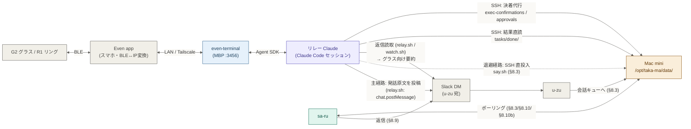

# 詳細設計: Slack インターフェース（u-zu）と制御コマンド

> **位置づけ**: [設計書本体](../design-development-system.md) の詳細。本書が扱う節: §8.9・§8.10・§8.10c・§8.10d・§8.16・§8.17。
> 障害を契機とする設計改訂の経緯は [revisions/](../revisions/) を参照。

Slack を唯一の人間インターフェースとする通知・承認・制御コマンドの経路、Socket Mode と sa-ru の死活監視、G2（AR グラス）チャネルを扱う。

---

<a id="sec-8-9"></a>
## 8.9 ⑦ sa-ru → Slack（通知・承認リクエスト）

| 項目 | 仕様 |
|------|------|
| 方式 | slack-sdk 直接利用 |
| トークン | `/opt/taka-ma/config/.env` の `SLACK_BOT_TOKEN` を共用 |
| 送信先 | **タスクファイルの `channel_id`**（送信元に返す） |
| フォールバック | `SLACK_CHANNEL_ID`（`#taka-ma`）※ `channel_id` がない場合のみ |

**送信先の決定ルール:**

- DM で送信 → 結果は DM に返る
- `#taka-ma` チャンネルで送信 → 結果は `#taka-ma` に返る
- システムアラート（ヘルスチェック異常等） → デフォルトチャンネル `#taka-ma`

**役割分担:**

| プロセス | Slack との関係 |
|---------|--------------|
| u-zu | Socket Mode でイベント受信（コマンド、ボタンクリック、DM） |
| sa-ru | slack-sdk でメッセージ送信のみ（タスク進捗、承認リクエスト） |

**通知タイミング:**

| イベント | 通知内容 | 送信先 |
|---------|---------|--------|
| タスク受付 | 「タスクを受け付けました: {command}」 | 送信元 |
| タスク分類完了 | 「{execution}/{depth} タスクとして {target}（モデル）にルーティングします」 | 送信元 |
| Tier 3 承認リクエスト | Block Kit ボタン付き承認フォーム | 送信元 |
| タスク完了 | 結果全文（切り詰めない）＋結果ファイルパス併記 | 送信元 |
| タスク失敗 | 「タスク失敗: {error}」＋結果ファイルパス併記 | 送信元 |
| 承認待ちで保留 | 「承認待ちのため保留しました。期限はありません。承認いただければ未了分から再開します」 | 送信元 |
| 保留からの再投入 | 「承認を確認しました。未了分から再開します」 | 送信元 |
| 承認却下 | 「却下された操作を禁止して続行します」（当該操作のみ deny・タスクは継続。§8.10 却下の粒度） | 送信元 |
| システムアラート | ヘルスチェック異常等 | デフォルト（#taka-ma） |

**完了通知の内容規律（切り詰めの禁止）:**

- 結果本文は固定長で切り詰めない。Slack の 1 メッセージ上限を超える場合は**分割送信**する。分割数の上限（連投スパム防止）を超える極端な長文のみ、打ち切りを明示して結果ファイル（正本）へ誘導する
- 完了・失敗いずれも、**結果の正本ファイルパス**（`/opt/taka-ma/data/tasks/done/{日付}/` の task JSON）を必ず併記する。Slack 上の表示がどうであれ、人間が全文へ到達できる経路を常に残す
- **会話への還流**: タスク完了時、当該タスクの発生元会話セッション（conversation_id は task の team_id / channel_id / thread_ts から復元）へ「結果要約＋結果パス」を assistant ターンとして追記する（§8.3 の永続化セッション）。完了後の後続質問（「さっきの回答はどこ」等）に会話脳が文脈として答えられるようにする

**完了報告の実出力グラウンディング（虚偽完了報告の禁止）:**

worker の最終出力は LLM の自己申告テキストであり、完了・成功の判定根拠にしない。完了通知の文言は、worker プロセスの exit code と、sa-ru 自身が実行した検証コマンドの実出力から機械的に導出する。検証の実行主体は orchestrator の GroundingVerifier で、判定材料は検証コマンドの rc・実出力に限る。

- **検証の起点は承認された完了条件（主）**: 会話由来のタスクは、着手確認で承認された `acceptance`（§8.10f）の全 kind PASS を「完了」の語の必要条件とする。1 つでも FAIL なら「未達」とし、検査の rc・実出力を併記する
- **主張検出は補助**: 以下の「worker 出力から主張を検出して検証する」方式は、`acceptance` を持たない旧タスク・会話を経ないタスク（file_audit Reject 由来等）向けの補助に降格する
- **独立検証段は第 3 層（出口ゲート）**: 機械検査（上記 2 層＋遵守照合）が全 PASS のタスクは、完了通知の送信**前**に、実装担当と別系統の検証エージェントによる独立検証段（出口ゲート・§8.10f「出口ゲート」）を通る。FAIL のタスクは完了通知を送らず差し戻す。独立検証レポート（要件別判定表・採取コマンドと実出力）は完了・未達いずれの通知にも結果ファイル（正本）にも添付する

- **push の主張**: worker 出力が push 完了を主張する場合、sa-ru は当該タスクの workspace（§8.13）に対し `git ls-remote`（remote 側の当該ブランチ先端とローカル HEAD の一致）を SSH で実行し、その実出力を通知に併記する。一致を確認できない場合（remote 未設定・ハッシュ不一致・コマンド非 0 終了・SSH 不達）は「push は未完了」と報告する。完了と未完了の中間表現（「おそらく完了」等）は使わない
- **コミットの主張**: `git log` 実出力の実ハッシュを併記する。取得できなければ「コミットを確認できない」と報告する
- **ファイル生成の報告**: workspace の実パスと `ls` 実出力を併記する
- **worker の exit code**: headless worker の終了コードが非 0 の場合、result イベントの有無に依らず成功として扱わず、失敗経路（retry / 昇格）へ回す
- 検証コマンドの実行結果（rc・実出力）は完了通知だけでなく結果ファイル（正本）にも記録する。タスクファイルの status はサブタスク連鎖の実行状態を表し、グラウンディング判定は通知・結果本文側で表現する
- **会話への還流にも同じ判定を先頭に併記する**。worker の自己申告（「完了しました」）を会話脳が事実として引き継がない

<a id="sec-8-10"></a>
## 8.10 ⑧ u-zu → sa-ru（承認結果通知）

| 項目 | 仕様 |
|------|------|
| 方式 | ファイルベース |
| ディレクトリ | `/opt/taka-ma/data/approvals/` |
| ファイル名 | `{request_id}.json` |
| 監視方法 | sa-ru がポーリング（1秒間隔、承認待ち中のみ）。決着待ちの中断レコードは常駐ループが同間隔で走査 |

**承認ファイル形式:**

```json
{
  "request_id": "uuid",
  "task_id": "uuid",
  "instance_id": "claude-1",
  "command": "deploy.sh --production",
  "tool_name": "Bash",
  "tool_input": {"command": "deploy.sh --production"},
  "tier": 3,
  "risk_reason": "本番環境へのデプロイ",
  "status": "approved",
  "created_at": "2026-04-08T10:00:00+09:00",
  "decided_at": "2026-04-08T10:02:30+09:00",
  "decided_by": "U12345"
}
```

**フロー:**

```
1. 承認パイプライン: 承認ファイルを status=pending で作成
2. 承認パイプライン: Slack に Block Kit 承認リクエストを送信
3. ユーザー: Slack で Approve/Reject ボタンをクリック
4. u-zu: ボタンイベント受信 → 承認ファイルの status を更新
5. 承認パイプライン: ポーリングで status 変更を検知 → 実行アダプタが Decision を伝達
        （headless=フックが approved→permissionDecision:allow(exit0)/rejected→exit2、interactive=y/n 送信）

> 承認パイプラインの実行プロセスは、headless=decide デーモン（§8.5・Mac mini 常駐）、interactive=sa-ru 内（in-process）。
```

> Tier3 のポーリング（§8.10 のファイルベース cross-process、1秒間隔）は温存。ただし待ち上限は承認の期限ではなく `hold_grace_sec`（worker を待たせる上限）であり、超過時は下記「承認 pending の保留と再投入」に従う。headless アダプタではフックが同期 shell としてこの猶予の間だけ待つため、タイムアウト鎖は `hold_grace_sec` ＋ 前段（分類・qu-e 審査）＜ デーモン ＜ クライアント ＜ フック の包含関係を保つ（既定値では猶予 60 秒・qu-e 120 秒に対しデーモン 305 ＜ クライアント 308 ＜ フック 310 秒で余裕を持って成立する）。

> **決定の一意性（排他制御）**: status の `pending` → `approved`/`rejected` 遷移は、承認ファイル単位の排他ロック下で read-modify-write する。同一ボタンの多重押下、Approve と Reject の同時押下、u-zu の決定と sa-ru の timeout 確定が競合しても、`pending` を終端へ移せるのは 1 回だけで、後続は「処理済み」を返す（双方が成功報告する事故を防ぐ）。sa-ru 側の timeout 確定も同じロックを取る（フロー 4 と 5 の相互排他）。
>
> **request_id の検証**: `/taka-ma-approve <request_id>` はユーザー入力の request_id をそのままファイル名に用いるため、受理する形式を uuid 相当（英数・ハイフンのみ）に限定し、パス区切り・`..` を含むものは拒否する（`{request_id}.json` を経由した承認ディレクトリ外へのパストラバーサルを防ぐ）。

**承認 pending の保留と再投入（自動 deny は行わない）:**

人間の承認は**期限を持たない**。承認待ちの上限は「承認の期限」ではなく「**worker を待たせておく上限**」として扱い、超えたら worker だけを畳んで承認は生かしたままにする（§3.3 (4)）。

| 段 | 挙動 |
|---|---|
| 猶予 | `approval.hold_grace_sec`（sa-ru.yaml が唯一の源）。この間だけフックが同期的に待つ |
| 猶予超過 = **保留** | 承認レコードを `status=pending` のまま**存置**（`done/` へ退避しない）し `held_at` を追記。中核は `Decision{allow:false, hold:true}` を返す。ツールはブロックされ、worker は畳まれる。タスクは `completed` でも `failed` でもなく **`pending_approval`** |
| 決着（Approve） | 未了サブタスクから**再投入**（新規 worker 実行）。文脈は workspace の成果物とタスクファイルの済み結果 |
| 決着（Reject） | タスクを中止（`failed`）して Slack 通知 |

- **`status=timeout` は新規に書かない**（自動 deny の廃止）。過去レコードとの互換で読み取り側は `timeout` を終端として受理する。
- **保留の検知は worker の終了状態を根拠にしない**。ブロックされた worker は「指示どおり終わっただけ」＝正常終了として返るため、異常終了を期待した判定は成立しない。sa-ru は「当該タスクに `status=pending` かつ `held_at` を持つ承認レコードがあるか」で保留を判定する。
- **保留は冪等**。worker が別のツールで迂回を試みても、同一タスクに未決着の保留レコードがある間は、**新規レコードの作成も Slack 再投稿も行わず、猶予を待たずに即座に hold を返す**。これにより「迂回 N 回 × 猶予」の待ち時間累積が起きない。

**保留時に追記するフィールド（承認ファイル）:**

```json
{
  "status": "pending",
  "held_at": "2026-04-08T10:01:00+09:00"
}
```

**保留時に追記するフィールド（タスクファイル）— 再投入の文脈:**

```json
{
  "status": "pending_approval",
  "held_approval_id": "{request_id}",
  "completed_steps": {
    "1": "step 1 の出力（全文は結果ファイルが正本）",
    "2": "step 2 の出力"
  }
}
```

> `completed_steps` が本設計の要。従来、済んだサブタスクの出力は `_execute_chain` のメモリ上（`results` dict）にしか無く、sa-ru を再起動すると失われた。ここへ永続化することで、保留状態はディスク上で自己完結し、プロセスの生死と独立する。元の指示・計画・`workspace`・Slack 宛先（`team_id` / `channel_id` / `thread_ts`）・モデル指定は既にタスクファイルが保持しているため、追加はこの 2 キーのみ。

**再投入（Approve 後）:**

```
1. sa-ru: 承認レコードの決着を検知（poll・approval.poll_interval_sec）
2. sa-ru: 承認レコードを done/ へ退避（保留の解消。以後は新しい承認要求を立てられる）
3. sa-ru: タスクを status=init へ戻し、completed_steps を残したまま再投入
4. dispatcher: 凍結プラン（_plan）のうち completed_steps に無い step だけを実行
5. worker: 同じ workspace（前回の成果物が残っている）で未了分を実行
```

- **既に済んだサブタスクを再実行しない**。`completed_steps` にある step はその値を結果として扱い、依存する後続へ引き渡す（§10.5 の結果受け渡しと同じ経路）。
- **同一操作の再承認は求めない**（下記「承認の引き継ぎ」）。再投入後に**別の**高リスク操作へ到達した場合は新たに Tier3 が立つ。それでも承認と再投入が収束しない場合に備え、同一タスクの再投入回数に上限を残す（`approval.max_reinject`。超過時は `failed` とし、収束しなかったことを Slack へ明示する）。
- **昇格ラダーを回さない**。保留は worker の障害ではないため、モデル障害や `ESCALATE` 申告と同一視して次段モデルへ昇格させてはならない（承認を迂回した実行になりうる）。実装上は保留を**例外として流さない**ことで担保する（§10.3）。

**承認の引き継ぎ（再投入後の同一操作は再承認を要しない）:**

再投入された worker は凍結プランの未了 step を最初から実行するため、承認済みの高リスク操作に**再び到達する**。ここで新規の承認依頼を発行すると、人間の応答が猶予より遅い環境（G2 グラス等。依頼発行→決着の実測約 2 分）では「承認 → 保留 → 再投入 → 同一操作で再依頼」が循環し、**何度承認しても実行に反映されない**（2026-08-17 の G2 実機検証 T09-B8 で確認。3 連続で保留に落ち `max_reinject` を消費した）。当初は「同じ操作を二度聞くのは承認を握り越さない安全側の挙動」と位置付けていたが、実際には人間の決定が実行へ永遠に反映されない状態を生む。本節冒頭の原則（人間の承認は期限を持たない）に従い、**一度下した決定は同一タスク内の同一操作に対して有効であり続ける**とする。

| 項目 | 仕様 |
|---|---|
| 照合キー | **同一 `task_id`** かつ **同一 `tool_name`** かつ **同一 `tool_input`（完全一致）** の approved レコード（`approvals/done/` 内）が存在すること |
| 判定順の位置 | 静的安全チェック `always_deny` の**後**、`always_escalate` の**前**。deny は引き継ぎでも覆せない（決定論の最終防壁が常に勝つ） |
| 挙動 | 一致があれば Tier 判定・承認依頼の発行をせず allow。監査ログに `handler=approval_carryover` と**元の `request_id`** を記録し、どの人間決定に由来する許可かへ常に遡れるようにする |
| 不一致 | `tool_input` が一致しない操作は通常どおり判定する。正規化・類似一致は行わない（内容が変わった操作は別の操作。緩い一致は承認の意図を越えて許可が広がる） |
| スコープ | 同一 `task_id` に限定し、別タスク・別会話へは越境しない。時効は設けない（タスクの寿命が実質の上限） |
| 却下 | Reject も引き継ぎの対象。同一 `task_id`・同一操作（tool_name + tool_input 完全一致）の rejected レコードがあれば再判定せず deny（同じ操作を二度聞かない） |

**却下の粒度（操作単位 deny・タスクは継続）:**

従来は Reject＝タスク全体の中止だった。人間の却下の意図は「その操作はするな」であって「依頼全体をやめろ」ではない — 依頼全体の中止には専用の中止命令（§8.10d）が既に存在する。よって却下の意味を次へ改める:（[是正 2026-08-30](../revisions/2026-08-30.md)）

- **Reject は当該操作のみを deny として worker へ返す**（既定 deny・decide の deny と同一経路: フックの exit 2）。worker は代替手段 or 当該操作なしでの遂行へ進み、不能なら失敗として報告する（§8.10f 環境改変の既定 deny と同じ帰結規律）
- 保留からの再開条件は「全 pending の決着」（approved / rejected を問わない）。rejected は承認の引き継ぎ表と同様に記録され、同一タスク内の同一操作は再依頼せず deny する
- `failure_cause=approval_rejected` は「却下の結果 worker が遂行不能で終わった場合」の終端コードへ降格する（却下そのものはタスクを終端させない）
- タスク全体の中止は従来どおり中止命令（§8.10d）のみが行う

**Slack 表示**: 保留時「承認待ちのため保留しました。期限はありません。承認いただければ未了分から再開します」／再投入時「承認を確認しました。未了分から再開します」／却下時「却下された操作を禁止して続行します」。

<a id="sec-8-10c"></a>
## 8.10c u-zu → sa-ru（制御コマンド：手動 ollama 停止）

Slack から MBP の稼働 ollama モデルを手動 unload する経路。停止本体は sa-ru の
`RemoteProcessManager.stop_ollama()`SSOT：`ollama ps` で稼働モデル列挙 → 各々を
`ollama stop <model>`、§7.1）に在り、別プロセスの u-zu からは直接呼べない。そこで §8.10 承認ファイルと
同じ共有 FS ファイル方式で命令を渡す（向きは逆＝u-zu 起点で発行、sa-ru が実行）。危険操作（推論中
モデルの GPU/メモリ解放）のため RBAC の **Owner** ゲート（`/taka-ma-stop` と同格）に置く。
`/taka-ma-stop` の launchctl 停止とは別物で、ollama サービス自体は残し稼働モデルだけ落とす。
停止後の再起動は不要で、次の推論リクエストで ollama が自動再ロードする（§7.1 前提）。

| 項目 | 仕様 |
|------|------|
| 方式 | ファイルベース |
| ディレクトリ | `/opt/taka-ma/data/controls/` |
| ファイル名 | `{control_id}.json` |
| 監視方法 | sa-ru がポーリング（2秒間隔、`_control_loop`） |
| RBAC | Owner（`/taka-ma-ollama-stop`） |

**制御ファイル形式:**

```json
{
  "control_id": "uuid",
  "command": "stop_ollama",
  "status": "pending",
  "user_id": "U12345",
  "team_id": "T12345",
  "channel_id": "C12345",
  "thread_ts": null,
  "created_at": "2026-06-20T10:00:00+09:00"
}
```

**フロー:**

```
1. ユーザー: Slack で /taka-ma-ollama-stop を実行
2. u-zu: owner 認可 → 制御ファイルを status=pending で作成（control_store.enqueue_control）
3. sa-ru: 制御ループ（_control_loop）が pending をポーリング検知（status は書き換えない）
4. sa-ru: process_mgr.stop_ollama()（SSOT）へ委譲 → 稼働モデルを unload。返り値で成否判別
5. sa-ru: 結果を発行元 channel/thread へ通知（停止成功＝モデル名 / 該当なし / 失敗を区別）→ 制御ファイルを done/ へ退避
```

> **クラッシュ耐性**: status を processing に書き換えず pending のまま実行する。実行と done/ 退避の
> 間で sa-ru が落ちてもファイルは pending で残り、次回起動で再実行される（取りこぼし防止）。
> stop_ollama は冪等（既に停止済なら「稼働モデル無し」になるだけ）なので再実行は安全。

<a id="sec-8-10d"></a>
## 8.10d 中止・取消命令の即時実行（承認ゲートを通さない制御コマンド分類）

「中止します」「キャンセル」「stop」等の**停止指示**は実行依頼ではなく制御コマンドである。
これを通常発話と同じ会話ゲートに流すと、脳 LLM が「実行意図が固まった」と誤読して
「この内容で着手します（着手/やり直す）」ボタンを提示する — 中止の命令に承認を求める —
という転倒が起きる（Slack 実運用で発生・再発防止）。停止指示は計画確認ゲート（§8.10b）にも
訂正解釈（§10.2.1）にも掛けず、**検知した時点で即時実行**する。

**判定（ya-ta: `TaskClassifier.classify_control`）** — 2 段構成:

1. **キーワード前置ゲート（決定的・LLM なし）**: 発話に停止語彙
   （中止/中断/停止/取り消し/取消/取りやめ/やめ/止め/ストップ/キャンセル、stop/cancel/abort）が
   含まれない場合は即座に「制御ではない」。通常会話にレイテンシを一切足さない。
2. **LLM 弁別（ya-ta モデル、`prompts/classify_control.md`）**: キーワードを含む発話のみ、
   「既存作業への停止命令」か「停止語彙を含むだけの開発依頼・質問」（例:「キャンセル機能を実装して」
   「中断処理のバグを直して」）かを弁別する。出力は `{"control": "cancel"|"none", "reason", "confidence"}`。

判定不能（JSON 不正・ollama 障害）は「制御ではない」＝会話側へ縮退する（fail-safe）。
このとき会話脳も同一 ollama で応答不能のため着手ボタンは提示され得ず、
「LLM 障害時に承認ゲートへ落ちて転倒が再発する」穴にはならない。
制御判定は execution × depth 分類（§8.4）とは独立の前段判定である
（あちらは「実行するタスク」の性質判定であり、制御命令はタスクではないため軸を混ぜない）。

**介入点（sa-ru: `ConversationManager.handle_message` 最前段）**: 訂正解釈
（`_handle_correction`）・脳 LLM 呼び出しより**前**に判定する。提示中の計画がある状態での
「中止」は計画への訂正ではなく破棄命令だからである。`/taka-ma-go`（force_ready）は
明示の実行エスケープなので制御判定に掛けない。

**停止対象の特定（決定的規則）**: 発話と同一会話面（`team_id` + `channel_id` 一致）の
以下 4 区分を全て止める。規則が決定的なため対象の曖昧さは生じず、確認往復は行わない。
対象ゼロのときは「停止対象なし」を 1 メッセージで返す（承認ゲート形式の確認は用いない）。

| 区分 | 状態 | 停止アクション |
|------|------|----------------|
| 提示中の計画 | exec-confirm レコード status=pending | status=cancelled に書換えて done/ へ退避。以後の着手ボタン押下はレコード不在として安全に無視される（`resolve_exec_confirm` は pending 以外/不在で False） |
| 未着手タスク | status=init / accepted | status=failed（result に中止命令による停止と明記） |
| 実行中タスク | status=in_progress | 実行台帳の asyncio タスク群を cancel（下記）→ status=failed（同上） |
| 承認保留タスク | status=pending_approval | 保留承認レコードを done/ へ退避（§8.10 の退避と同じ）→ status=failed（同上） |

終端 status は **failed を再利用**し、result に中止命令による停止であることを刻む
（終端の理由は result 本文で表現し status を増やさない規律）。専用の終端 status を新設しない理由:
アーカイブ（done/ 移動）・qu-e への終了通知（workspace 掃除・監視解除）・起動時予約回収の
非対象、という終端の契約がすべて failed の既存経路で満たされ、新 status は 3 コンポーネント
（sa-ru / u-zu / qu-e）への契約追加になるため。

**実行中タスクの停止の実体（実行台帳）**: dispatcher は連鎖実行を起動する際に
`task_id → {チェーン asyncio.Task, worker asyncio.Task 群}` を実行台帳に登録し、完了時に
自動削除する。中止はこの台帳を引いて cancel する:

- チェーン cancel で以降のサブタスク投入・昇格が止まる。
- worker cancel の遠隔プロセス回収は実行アダプタごとの既存資源回収経路に乗せる:
  headless は CancelledError でローカル ssh を kill（`-tt` により SIGHUP がリモートの
  `claude -p` へ伝播・§8.5 資源回収と同経路）、interactive(pty) は finally の
  `wrapper.close`（tmux kill-session）。
- subprocess（ollama 単発）は別スレッド同期実行のため途中打ち切りできない（既知の限界）。
  実行は走り切るが結果は破棄され、後続ステップは走らない。
- キューに滞留中（worker 未取得）のサブタスクは、中止済み task_id 集合により worker 取得時に
  スキップする（cancel の隙間からの遅延実行を防ぐ）。

**報告（1 メッセージ）**: 対象の特定結果と停止したものの一覧**のみ**を返す。作業手順の説明・
次アクションの提案は返さない。発話と報告は会話セッション履歴へ追記する（後続会話の文脈維持）。

<a id="sec-8-16"></a>
## 8.16 Slack → u-zu（Socket Mode 受信の死活監視）

u-zu の Slack 受信（Socket Mode WebSocket）は、ネットワーク瞬断を契機に受信だけが死んだまま復帰しないことがある。実機で確認した死に方は 2 形態:

- **half-open**: 確立済み接続で送信は成功し続け、受信（pong）だけが止まる。slack_sdk の死活チェックはソケットへの書込みで判定するため検出できない
- **再接続ストーム**: クライアント内部状態が壊れ、新セッション生成→即切断を繰り返し、ネットワーク回復後も自力復帰しない

受信が死ぬと、会話・承認・制御のすべての人間起点 IPC（§8.3／§8.10／§8.10b／§8.10c）が**無音で**停止するため、u-zu 自身が受信死を検出して自動復旧する。

| 項目 | 仕様 |
|------|------|
| 検出信号 | pong 受信時刻（slack_sdk `Connection.last_ping_pong_time`）の**前進**。セッション入替は前進と見なさない（ストーム対策） |
| 判定 | 前進の途絶が閾値を超えたら受信死（`SocketWatchdog.is_stale()`。Slack とは数十秒間隔で ping/pong を交わすため、正常時に分単位の途絶は起きない） |
| 監視主体 | u-zu プロセス内の daemon スレッド（`_run_watchdog()`）。外部プロセスからの監視は採らない（依存が増えるだけで、プロセス内で受信時刻を見る方が確実） |
| 回復 | CRITICAL ログ後に異常終了 → launchd `KeepAlive` が再起動し、まっさらな接続を張り直す。**プロセス内再接続は行わない**（「再接続したつもりで受信死のまま」を根本排除） |
| 運用値 | u-zu.yaml `watchdog.check_interval_sec`／`stale_threshold_sec` が唯一の源（コード側既定値なし。キー欠落は起動失敗） |
| 検出遅延 | 最悪 `stale_threshold_sec + check_interval_sec` |
| 誤検出耐性 | 起動直後は初回チェック時刻を起点に閾値分の猶予。ネットワーク長時間断では再起動を繰り返すが、回復と同時に自然復旧する（許容） |

> **用語注意**: §8.15 の「watchdog」は FSEvents によるファイル監視ライブラリを指す。本節の死活監視（実装名 `socket_watchdog`）は受信 liveness の監視であり別物。

<a id="sec-8-16-1"></a>
### 8.16.1 sa-ru の死活監視（心拍 2 探針・自己終了復帰）

> 本節の導入経緯は[是正 2026-09-04](../revisions/2026-09-04_mbp-unreachable-outage.md)を参照。

sa-ru は「落ちれば launchd `KeepAlive` が再起動し、ループが例外で死ねば `_supervise` が再起動する」設計だったが、**プロセスが生きたままループが止まる沈黙**には何も反応しなかった（2026-09-04 18:46:59 に全 8 ループが例外なく沈黙し、翌朝の手動 kickstart まで復帰せず。推定機序: 到達不能な MBP への timeout 無し `ssh` が `to_thread` の共有スレッドプールを詰まらせた）。§8.16 と同じ型で、沈黙を心拍の途絶として検出し自己終了で復帰する。

| 項目 | 仕様 |
|------|------|
| 心拍（発生源） | イベントループ上の専用コルーチン `Heartbeat.beat_loop`（`orchestrator/liveness.py`）が `probe_interval_sec` ごとに 2 探針を打つ。(a) 心拍ファイル `heartbeat_path` へ時刻を**上書き**（イベントループ閉塞の検知。ファイルは常に最新 1 行で増えない）。(b) `to_thread` へ空関数を投げ `probe_timeout_sec` で戻らなければ**スレッドプール枯渇**（9/4 の推定機序）として健全な心拍を止める。各ループの周回は数えない（`queue.get()` で待機中の暇なループを誤検出するため） |
| 判定 | 「健全な心拍（プール探針が応答した）」の前進が `stale_threshold_sec` を超えて途絶したら沈黙（`Heartbeat.is_stale()`）。起動直後は起動時刻を起点に閾値分の猶予 |
| 監視主体 | sa-ru プロセス内の daemon スレッド（`run_watchdog`）。イベントループにもスレッドプールにも依存しないため、両方が死んでいても動く。外部 launchd ジョブは追加しない（§8.16 と同じ理由） |
| 回復 | CRITICAL ログ後に `os._exit(1)` → launchd `KeepAlive` が再起動。プロセス内で「復旧したつもり」を作らない |
| 再起動の抑制 | 自己終了の時刻を `restart_count_path` へ永続化し、直近 1 時間の回数が `restart_limit_per_hour` に達していたら自己終了せず CRITICAL と Slack 通知に切り替える（長時間の到達不能中に原因側の修正が不十分で再ハングしたときの往復を止める）。到達不能そのものは心拍を止めない（§8.5 SSH 上限が前提） |
| 通知 | Slack（既定チャンネル）へ**初回の自己終了と打ち切り時のみ**。MBP 到達性（プリフライトの直近実測・最終疎通時刻）を併記する |
| ログ規律 | 心拍は**ファイル上書きのみでログ 0 行**。ログはプール枯渇の検知・回復・自己終了・打ち切りの各遷移時のみ。あわせて `ResourceMonitor` の検知失敗と qu-e のヘルスチェックも**状態遷移時のみ 1 行**に改める（9/4 は同一 traceback 756 回×20 行超、qu-e は平常報告 1 日 2,880 行で、肝心の沈黙が埋もれた） |
| 運用値 | sa-ru.yaml `liveness.probe_interval_sec` / `probe_timeout_sec` / `stale_threshold_sec` / `check_interval_sec` / `heartbeat_path` / `restart_count_path` / `restart_limit_per_hour` が唯一の源（コード側既定値なし。キー欠落は起動失敗）。既存の `heartbeat` ブロックは §10.8 の LLM 処理待ち進捗通知であり別物 |
| 検出遅延 | 最悪 `stale_threshold_sec + check_interval_sec`（既定 360 秒） |
| 診断との接続 | 自己終了の前にスタックを採る仕組みは持たない（沈黙中の自己診断は信用できない）。原因の確定は §8.5「ハング診断の常設」（SIGUSR1 / py-spy）を人が runbook に従って行う |

<a id="sec-8-17"></a>
## 8.17 G2（Even Realities AR グラス）チャネル — Claude リレー方式

スマホの Slack アプリを開かずに、G2 グラス＋R1 リングだけで「会話開始 → 要約確認 → 着手 → 進捗/完了受領」を完結させる入出力チャネル。Slack（u-zu）に次ぐ第 2 の人間インターフェースだが、**sa-ru から見えるのは従来どおり Slack の会話**であり、既存の会話・承認の契約（§8.3／§8.10／§8.10b）は変えない。

### 前提事実（一次確認結果）

| 確認項目 | 結果 |
|---------|------|
| even-terminal の実体 | `@evenrealities/even-terminal`（npm、MBP に導入）。ローカル HTTP サーバ（既定 :3456）が AI エージェントを子として駆動し、出力を G2 の 576×288 キャンバスへ描画、R1 リング操作をキー入力へ変換する**レンダラー＋入力ブリッジ**。汎用のシェル端末ミラーではない |
| 対応プロバイダ | `claude` / `codex` の 2 種のみ。**素のシェル（zsh 等）を G2 から直接操作する経路は存在しない** |
| claude プロバイダの駆動方式 | Claude Agent SDK の `query()` で Claude Code セッションを起動（`dist/claude/session.js`）。`settingSources: ["user","project"]` のため、**起動 cwd のプロジェクト定義（CLAUDE.md・スキル・MCP 設定）とユーザー設定を読み込む** |
| 権限モデル | `permissionMode: "acceptEdits"`。Bash 等の許可リスト外ツールは都度リング操作で承認するか、ユーザー設定の `permissions.allow` で事前許可する |
| セッションの cwd | **Even app が送る `cwd` が最優先**（`session.js` の `requestedCwd = cwd ?? process.cwd()`）。アプリは過去セッションの場所を憶えて送るため、**cd しても `--cwd` を付けても上書きできない**（2026-07-29 実機で確認。無関係なディレクトリでセッションが立ち、リレー契約を読まない素の Claude が動いた）。制御手段は `PROJECT_DIR` 環境変数で、セッション一覧の絞り込みに効く（`routes/core.js`）。リレー用ディレクトリに `cd` し、かつ `PROJECT_DIR` を同じ値で与えて起動する |
| **選択 UI（`AskUserQuestion`）** | **G2 で使える**。`question` / `header` / `options`（`label` / `description` / `preview`）がグラスへ送られ、リング操作で選び `POST /question-response` で返る（`dist/claude/session.js` の `handleAskUserQuestion`、`dist/routes/core.js`）。**待受は 120 秒で打ち切られ、既定回答は `"skip"`**（`waitForUser(..., 120000, "skip")`） |
| ツール実行の見え方 | 実行中のツールは**1 行ラベル**に要約されて表示される（`Bash <description 50 字>` / `Read api.ts (lines 200-250)` / `Grep "…25 字"` 等。`dist/summary-format.js`・`dist/claude/summarize.js`）。ツールの生出力はグラスに出ない |
| 応答本文の見え方 | `text_delta` としてストリーム送出され、even-terminal 側では切り詰めない（`session.js`）。描画・改ページ・遡読は Even app と G2 側の責務であり、**even-terminal にスクロール処理は無い** |
| 公式 Slack MCP の能力 | サーバ（`https://mcp.slack.com/mcp`）は投稿系を含む 19 ツールを提供する（`slack_send_message` は `channel_id` / `message` 必須・`thread_ts` 任意。ほかに `slack_read_channel` / `slack_read_thread` / `slack_search_channels` / `slack_search_public` / `slack_add_reaction` 等）。**セッションに露出するツールは認可スコープに依存**し、読取スコープのみだと読取 2 種しか現れない。投稿には user token の `chat:write` が要る（[是正 2026-07-25](../revisions/2026-07-25.md)） |
| 認可方式 | Slack MCP は **Dynamic Client Registration 非対応**（`.well-known/oauth-authorization-server` に `registration_endpoint` が無い）。MCP クライアント側の自動 OAuth では接続できず、Slack アプリの user token を `Authorization: Bearer` ヘッダで登録する |
| **アプリ経由投稿の本文汚染** | ユーザー本人の認可でアプリが投稿すると、Slack は**本文そのものの末尾**へ `*<文言>* <アプリ名>` を追記する（複数行でも改行を挟まず最終行へ連結。[是正 2026-07-29](../revisions/2026-07-29.md)）。抑止する設定は無い。イベント側には `app_id` が付き、**人手投稿には付かない**ため、対象の切り分けは本文に依らず可能。除去は §8.3「上り発話の正規化」で u-zu の受信入口が担う |
| ネットワーク | Even app（スマホ）↔ MBP 間は LAN または Tailscale（`--tailscale`）。公開トンネル（`--expose pinggy/bore/ngrok`）は使わない（§8.1 ポート開放禁止の趣旨に反する） |

> **未検証（実機確認事項）**: 576×288 のキャンバスで**リング操作により長文を遡って読めるか**（スクロール／改ページの有無）。even-terminal 側に該当処理が無いため、Even app と G2 ファームウェアの挙動でしか確定できない。本節はこれを**「遡読できない」前提**で設計する（読めると判明すれば表示を簡略化できるが、逆は破綻するため）。

以上から、G2 で操作できる対話主体は **even-terminal 上の Claude セッションそのもの**であり、この Claude を taka-ma への中継者として使う（＝Claude リレー方式）。リレーの振る舞いは、リレー専用プロジェクトディレクトリ（MBP）に置く CLAUDE.md／スキルで定義する。

### 段階構成

| 段階 | 方針 | u-zu / sa-ru の改修 |
|------|------|-------------------|
| 第 1 段（リレー） | even-terminal 上のリレー Claude がシェルスクリプト（Slack Web API を curl で直叩き）と SSH で既存経路に相乗りする | **u-zu は受信入口のみ**（§8.3 上り発話の正規化）。**sa-ru は無し**。会話・承認のファイル契約は変えない |
| 第 2 段（正式） | g2-adapter CLI＋sa-ru 返信のチャネルルーター抽象化で G2 を正式チャネル化 | 小改修（会話還流の再設計と整合させて実施） |

### 第 1 段: リレー Claude（sa-ru 無改修）



**上り（発話 → taka-ma）**: G2 への発話（テキスト入力）を、リレー Claude が**原文のまま** Slack へ投稿する（`relay.sh`＝`chat.postMessage`）。投稿先は「その会話面」＝ u-zu との DM、またはユーザーが選んだスレッド（後述「会話面の選択」）。投稿はオーナー本人の認可で行われるため、u-zu からは**通常の人間の発話と区別が付かず**、既存の受信ハンドラ（DM は `channel_type == "im"`、チャンネルは `app_mention`）がそのまま `enqueue_conversation_message` へ流す。会話レコードの生成契約（`conversation_id` 導出・原子書込・再送の冪等化）は既存実装のままである。

ただし Slack はアプリ経由投稿の**本文末尾へアプリ帰属表記を追記する**（前提事実）。したがって「原文のまま」は搬送路を通っただけでは成立せず、u-zu の受信入口で除去して回復させる（§8.3「上り発話の正規化」）。**守るべき不変条件は「sa-ru へ原文だけを渡す」ことであり、u-zu を無改修に保つことではない**。当初は無改修を制約に置いていたが、実機でこの汚染が判明したため制約を外した（sa-ru は無改修のまま）。

リレー側での要約・言い換え・補完は禁止する。意図の解釈は sa-ru の会話脳の責務であり（§8.3）、リレーが先に解釈すると二重解釈で意図が歪むため。

**Slack との往復は全てシェルスクリプトに閉じ込め、リレーは Slack MCP のツールを一切使わない**。MCP のツールを 1 個ずつ呼ぶと、**呼び出しごとに LLM の推論が挟まり**、1 ターンに 45 秒（5 往復）を要して会話にならない（実機で計測）。また一覧作成に MCP を使うと、`channel_id` を知らないままチャンネル探索（`slack_search_users` 等）へ迷い込み、同様に 1 ターンが数十秒に伸びた（実機で発生）。役割ごとに 1 コマンドで完結させれば LLM の思考は 1 回で済む。実装は Slack Web API（`chat.postMessage` / `conversations.history` / `conversations.replies`）を `curl` で直接叩く 4 本のスクリプトである: 中継＋返信取得 `relay.sh`・会話一覧 `list.sh`・未決着提示の検出 `pending.sh`・決着後の追跡 `watch.sh`。

Slack トークンは **macOS Keychain**（サービス名 `taka-ma-g2-relay`）に置き、平文ファイルへ書かない。コミット・rsync・OSS 公開のいずれの経路でも漏れない。`relay.env` にはサービス名のみを記す。登録は人手操作として構築手順書 09 に記載する。

> **チャンネルへ投稿する場合はメンションが要る**: u-zu はチャンネルの通常発話を会話キューへ流さない（`app_mention` のみ拾う）。チャンネル内スレッドを会話面に選んだときは、リレーは投稿本文の先頭に u-zu への @メンションを付ける。DM では不要。

> **退避経路（`say.sh`）**: `relay.sh` が `NG` を返すとき（Keychain のトークン未登録・投稿失敗・Slack API / u-zu の受信不通）に限り、u-zu と同一のモジュール（`slack_bot/services/conversation_queue.py` の `enqueue_conversation_message`）を SSH 実行して §8.3 会話キューへ直投入する。`thread_ts` を引数で受け、`conversation_id` を主経路と一致させる。**この経路を通した発話は Slack に残らない**（会話の片側が欠ける）ため、常用しない。

**下り（返信 → グラス表示）**: sa-ru の返信は `relay.sh` が投稿と同一実行内で取得し（`conversations.replies`）、リレーは G2 の表示制約に合わせて**表示用にのみ**要約して提示する。短文はそのまま表示する。返信の判定は次の 2 条件で行う: (1) **新旧**は「自分の投稿の `ts` より新しいこと」を基準にする（返信は数秒で届くことがあり、基準なしでは過去メッセージと識別できない）。(2) **発言者**は「オーナー本人（`relay.env` の `OWNER_USER_ID`）でないこと」で絞る（これが無いと、リレー自身の中継や Slack から人が直接打った割込み発話を taka-ma の返信として G2 へ出してしまう。実機で発生）。本文は blocks（header / section）を優先して組み立てる — 計画確認・Tier 3 承認の提示は本文が blocks 側にあり、top-level の text には短い代替文しか入らないため、text だけを読むと計画の要点（wave 段組み・サブタスク数・重さ・モデル）がリレーに届かない（実機で発生・確認済み）。

**会話面の選択（どのスレッドで話すか）**: リレーは 1 セッションにつき 1 つの会話面（`channel_id` ＋ `thread_ts`）を保持し、上りの投稿先・下りの読取先の両方に使う。既定のチャンネルは u-zu との DM。

**会話面は最初の入力時に選ばせる**。リレーはそのセッションで最初の発話を受けたとき、中継の前に会話一覧を選択 UI で提示し、選ばれた会話へその発話を送る。2 通目以降は一覧を出さない。ユーザーは話したい内容を打つだけでよく、「続きを話したい」等のキーワードを要さない（毎回言わせるのは G2 の入力コストに見合わず、既定の会話面へ黙って投稿すると意図しない会話へ発話が混ざる）。

セッション開始直後に出せないのは、Claude Code のセッションが**入力を受けて初めて動く**ためである（New Session を作っただけでは何も実行されない。実機で確認）。

最初の入力が「会話の続きをする」のように**会話面を選ぶこと自体が目的**の場合は、選択後にその文を中継せず次の発話を待つ。用件ではないため taka-ma へ渡す意味がなく、送れば Slack に無意味な発話が残り sa-ru も応答してしまう。用件かどうかの判定はリレー自身が行う（リレーは Claude セッションであり、この程度の区別に外部の仕組みを要さない）。判定は完全ではないが、誤って中継しても会話が 1 ターン進むだけで実害は小さい。

一覧は**既定で直近 1 日**とし、選択肢に「新しい会話を始める」と「もっと前（3 日 / 1 週間）」を含めて段階的に広げられるようにする。G2 は一度に数件しか表示できないため、最初から全期間を並べると選べなくなる。

**選択肢のラベルには `ts` を埋め込む**（`M/D HH:MM 要点 | <ts>`）。`AskUserQuestion` が返すのは**ラベル文字列だけ**で、選択肢に付随データを持たせられない。ラベルの文言から `ts` を引き直させると、似た文言の別スレッドを拾って取り違える（実機で発生）。選択後は `|` 以降をそのまま `thread_ts` に採用する。ラベル末尾は画面上で切れることがあるが、リレーが受け取る文字列は完全なので支障はない。

一覧は `list.sh` **1 回**（`conversations.history`・指定日数内・新しい順に最大 5 件）で作り、出力行（`M/D HH:MM 要点 | <ts>`）をそのまま選択肢のラベルにする。候補ごとにスレッドを開いて要約を生成しない（1 ターンに数十秒〜100 秒を要して会話にならない。実機で 40〜115 秒を計測）。要点は本文先頭 20 字で足りる。基準時刻の epoch 計算もスクリプト側で行う（リレーに暗算させると誤った値を渡して 0 件になり、「直近は空でした」と誤報告する。実機で発生）。

`thread_ts` の確定は、話し始めが**新規**か**既存スレッドの継続**かで異なる。

| 状況 | `thread_ts` の決め方 |
|------|--------------------|
| 新規に話し始める | 1 通目を `thread_ts` なしで投稿し、返った `ts` を保持する |
| **既存スレッドを選ぶ**（Slack で始めた会話の継続など） | **選んだ親メッセージの `ts` をそのまま `thread_ts` とする**。新規投稿を要しない |

Slack ではスレッドの親メッセージの `ts` がそのまま当該スレッドの `thread_ts` であり、返信の有無は `reply_count` で判る。**「親投稿に `thread_ts` フィールドが無い＝スレッドが無い」ではない**（実機でこの誤判定により、既存スレッドを選んだのに継続できない事象が発生）。候補を提示する際は、各候補に親メッセージの `ts` を紐付けて保持する。

いずれの場合も 2 通目以降は必ず保持した `thread_ts` を指定する。u-zu は `thread_ts` の無い投稿に対して**その投稿自身の `ts`** を会話キーに使うため（§8.3 の `conversation_id` 導出）、毎回スレッド外へ投稿すると**発話ごとに別会話になり文脈が切れる**（実機で発生・確認）。ユーザーが別のスレッドを指したときは、リレーが候補（DM ＋ 直近のスレッド）を読み取って `AskUserQuestion` の選択肢として提示し、選ばれたものを以後の会話面とする。`conversation_id` は `team:channel:(thread_ts or user_id)` で決まる（§8.3）ため、会話面を選ぶことがそのまま「どの会話の続きを話すか」の選択になる。

**進捗・完了の受領（着手後のターン内追跡)**: リレーから G2 へ push する経路は無い（グラスはセッション出力の描画のみ）ため、着手決着後はリレーが**ターンを保持したまま** `watch.sh <thread_ts> <after_ts> [rounds]` で会話面を追い、sa-ru の進捗通知（実行開始・サブタスク完了・ハートビート §8.9）と完了/失敗通知を届き次第 G2 へ表示する。待受ループはシェル側に閉じる（3 秒間隔・回数上限、完了/失敗の通知文言を検出したら即返す）。完了通知の結果が切り詰め・パス併記の場合は結果ファイルを SSH 直読して要約する。真の push 化（G2 outbox）は第 2 段の課題。

> **待受はシェルへ閉じ込め、回数で打ち切る**: リレーは Claude セッションであり、リレー自身に読取を繰り返させると 1 回ごとに「何をすべきか考える → ツールを呼ぶ → 結果を見て判断する」という推論が挟まり、1 ターンが 115〜188 秒に達して会話にならない（実機で計測。決着後の追跡でも読取 7 回・39 秒を要した）。したがって待受ループは `relay.sh`（返信待ち 10 回）と `watch.sh`（既定 35 回・3 秒間隔）のスクリプト内に置き、リレーの推論は結果を受けた 1 回だけにする。得られなければ打ち切ってユーザーへ返し、取りこぼしは次の発話（「結果を見せて」等）で回収する。

**長文・添付の直読**: 完了通知が分割・ファイル参照になる場合、リレー Claude は Mac mini の結果ファイル（`/opt/taka-ma/data/tasks/done/` の該当タスク JSON）を SSH（`ssh mac-mini`、02 の既存トンネル）で直読して要約する。Slack 側の表示制約に依存せず全文を参照できる。

**計画確認の決着（選択 UI による代行）**: 着手確認（§8.10b）・Tier 3 承認（§8.10）の決着は、u-zu のボタン押下と**同一のファイル契約**で、リレーが SSH 経由で status を書き換えて代行する。G2 では Slack の Block Kit ボタンを押せないため、`AskUserQuestion`（前提事実）を**ボタンの等価物**として用いる。

決着は次の全条件を満たすときに限り行う:

1. **発話ではなく選択でのみ発火する**。リレーは計画確認／承認依頼の提示を検出したときに `AskUserQuestion` を出し、ユーザーがリングで選んだ結果**だけ**を決着の根拠にする。自由発話を決着と解釈してはならない（「着手します」等の言い回しで意図せず決着する余地を構造的に無くす。定型句の完全一致判定は本方式で置き換えられ、廃止する）
2. 選択肢は **着手 / やり直す / Slack で確認する** の 3 つとする（Tier 3 承認は **承認 / 却下 / Slack で確認する**）。「Slack で確認する」は決着せずに終える出口であり、全量確認や訂正が必要なときの正規の逃げ道である（後述「G2 の承認は限定承認」）
3. **無選択は決着しない**。`AskUserQuestion` は 120 秒で `"skip"` を返す（前提事実）。`"skip"` を受けたら書き換えを行わず「未決着のまま」と表示する。放置が承認に化けないことを不変条件とする（§8.10b はタイムアウトを持たないため、pending のまま待ち続けるのが正しい状態）
4. 対象レコードの特定: Slack の計画確認メッセージ本文には `exec_request_id` が含まれない（ボタンの内部値のみ）ため、着手確認は「**当該会話（`team:channel` 一致）の最新 pending レコード**」を Mac mini 上で特定して決着する。pending は期限なしで残置し得る（§8.10b）ため一意性は要求せず `created_at` 最新を採る。ただし提示（このセッションの表示、または会話面の直近メッセージ）が確認できない場合は書き換えない。会話面側の確認は `pending.sh`（ボタン付きメッセージ＝`actions` ブロックを持つメッセージが会話面の末尾に残っているか）で行う。Tier 3 承認は `request_id` が特定できる場合のみ
5. 書き換えは Mac mini 上の **u-zu と同一のモジュールを SSH で実行**して行うこと（`slack_bot/services/exec_confirm.py` の `resolve_exec_confirm` / `services/approval_store.py` の `resolve_approval`）。pending 検査・原子書込・決定の一意性（§8.10）を既存実装のまま流用し、リレー側に status 遷移ロジックを二重実装しない
6. `decided_by` には G2 経由と判別できる値（`g2:` 接頭辞＋オーナーの Slack user_id）を渡し、監査ログ上でボタン押下と区別できるようにすること

**G2 の承認は限定承認（表示帯域の制約と §10.2.1 の関係）**: §10.2.1 は「承認対象は見えていなければならない」ことを不変条件とし、Slack 側は計画プレビューを切り詰めず分割して全量提示する。G2 は 576×288 で遡読可否も未確定（前提事実の未検証項目）であり、**同じ意味での全量提示は成立しない**。したがって次のように分界する。

| 面 | 役割 |
|----|------|
| **Slack** | 計画の**全量提示・訂正・確定の正**。プレビュー全文、簡易記法／自然言語による訂正、差分エコー再確認はすべてここで行う（§8.10b／§10.2.1 のまま） |
| **G2** | 提示された計画の**要点提示と可否の応答**のみ。wave 数・サブタスク数・重さと使用モデルの並びといった**規模と性質が判る要約**を示し、着手 / やり直す を選ばせる |

> **要点は選択 UI の中に入れる**: 選択 UI は前面に描画され直前の表示を覆う（実機で確認）。要約を本文として先に出しても、選択の瞬間には読めず「見たことにして承認させる」だけの形骸化した確認になる。要約は `AskUserQuestion` の `question` に載せ、判断材料と選択肢を同一画面に置く。

- G2 での訂正はサポートしない。訂正が要るときはユーザーが「Slack で確認する」を選び、Slack 側で行う（運用・操作手順の問題として扱う）。リレーは訂正の中継を試みず、選択肢としても提示しない。
- この限定は**設計上の妥協ではなく分界**である。G2 は「計画を作らせ、走らせ、結果を受け取る」ための面であり、計画の精査は全量が見える面で行う。

**制約**: sa-ru のコードは変更しない。u-zu の改修は受信入口の正規化（§8.3）に限り、会話・承認のファイル契約と既存の受信判定（`subtype` / `channel_type` / `event_id` 冪等化）は変えない。使う経路は Slack Web API（オーナー本人の user token・Keychain 保管）と Tailscale SSH のみで、ポート開放・REST API 追加はしない（even-terminal の :3456 は MBP↔Even app 間のペアリング用ローカルバインドであり、マシン間通信には用いない）。上りに `chat.postMessage` を使うため、**user token のスコープに投稿権限（`chat:write`）が含まれている必要がある**。トークンの発行と Keychain 登録は人手操作であり、構築手順書 09 の前提条件として扱う。

**この段で解消していない制約**:

| 制約 | 内容 | 扱い |
|------|------|------|
| push 経路が無い | グラスは自セッションの出力描画のみで、サーバから割り込み表示できない | ターン保持ポーリングで代替（目安 10 分）。真の push 化は第 2 段 |
| セッション寿命 | セッション切断・グラス未装着の間は受け口が無く、その間の完了通知は G2 に出ない | Slack 側に残るため、再開後に pull で取得する |
| 表示帯域 | 計画プレビューの全量提示ができない | 上記「G2 の承認は限定承認」で分界 |
| 音声・リング入力の取り違え | モデル名等の聞き違い（`sonnet` ↔ `opus`） | G2 で訂正を扱わないため、この段では発生しない（訂正は Slack で行い、差分エコー再確認 §10.2.1 が働く） |

### 第 2 段: 正式チャネル化（小改修）

> **方式変更の決定（2026-08-19）**: 第 1 段の実機実証（2026-07〜08。E2E 仕様 T09 の記録参照）で、リレー Claude＝**自由裁量の LLM を契約プロンプトで躾けて決定的な中継器に使う方式は不成立**と確定した。契約逸脱（探索への迷い込み・未許可コマンド実行・表示の捏造・余計な往復）が実機で 10 件超観測され、潰しても別の逸脱が現れた。信頼性・速度の改善はすべて「リレーから仕事を剥がしてシェルへ移す」ことでしか得られておらず、その論理的終点として第 2 段では G2 側の Claude セッションを**固定プロトコルの端末**へ縮退させる — 判断はすべてスクリプト側の状態機械が持ち、セッションは (1) 発話を 1 本のコマンドへ渡す (2) 返ったテキストを表示する (3) 返った選択肢を `AskUserQuestion` へ転写し結果を返す、の 3 動作だけを行う。下表の構成（g2-adapter・チャネルルーター・テキスト決着）はこの前提で後継タスクが再設計する。第 1 段の記述は実証記録として保持する。

第 1 段が残す暫定要素は「決着の SSH 代行」と「push 不在をポーリングで凌ぐこと」の 2 つ。第 2 段で G2 を正式な入出力チャネルに昇格させる。会話還流（実行結果を会話文脈へ戻す再設計）と整合させて実装する。

| 構成要素 | 仕様 |
|---------|------|
| g2-adapter CLI（MBP） | リレー Claude（または even-terminal 側）からの発話を、Slack を経由せず §8.3 会話キューへ SSH で直書きする。`source: "g2"` を新設（§8.3 の source 一覧へ追加）。`conversation_id` は G2 セッション単位 |
| チャネルルーター（sa-ru） | sa-ru の返信送信を宛先抽象（ChannelRouter）に切り出し、会話レコードの `source` で振り分ける: `slack_*` → Slack（従来どおり）、`g2` → G2 用 outbox `/opt/taka-ma/data/g2/outbox/` へファイル書込。リレー/アダプタが SSH ポーリングで読み取り G2 へ表示する。将来の chat 抽象化（ChatPort）と同方向の分離 |
| 着手確認のテキスト決着 | 選択 UI の結果をボタンと等価な正式決着手段として sa-ru 側でサポートし、第 1 段の SSH 代行を置き換える |
| 通信原則 | SSH＋ファイルキューのみ（§8.1 のまま）。ポート開放・REST 追加は引き続き禁止 |

> 第 2 段で `source: "g2"` を導入すると、G2 発話は Slack に載らなくなる（第 1 段の主経路は Slack を通るため両側が揃う）。outbox 方式に移す際は、Slack 側の会話が片側だけになる点をどう扱うか（ミラー投稿するか、G2 会話は Slack と分離するか）を併せて決める。

### 実機検証の観点

- G2 実機で「会話開始 → 計画確認 → 着手 → 進捗/完了受領」が**スマホの Slack アプリを開かずに**完結すること
- 上りの投稿が u-zu の既存受信ハンドラに人間の発話として受理され、**ループ（u-zu が自分の関与した投稿を再投入する）が起きない**こと
- 完了通知の形式変更（分割送信・ファイル添付・結果ファイルパス併記）に、リレーの読取側（`relay.sh` / `watch.sh` の読取＋SSH 直読）が追随すること
- 自由発話（「着手します」「承認お願い」等）で決着が**発火しない**こと、および選択 UI を 120 秒放置したとき（`"skip"`）に**決着しない**こと
- 遡読可否（未検証項目）の実地確認 — リングで前の表示へ戻れるか

---

